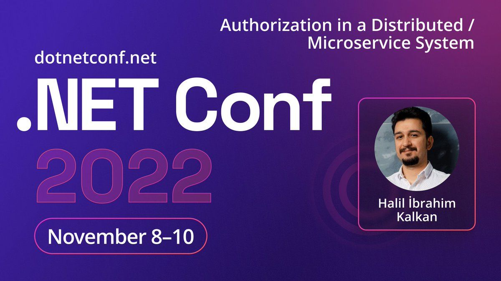

# ABP.IO Platform 7.0 RC Has Been Released

Today, we are happy to release the [ABP Framework](https://abp.io/) and  [ABP Commercial](https://commercial.abp.io/) version **7.0 RC** (release candidate). This blog post introduces the new features and important changes in this new version.

> **The planned release date for the [7.0.0 Stable](https://github.com/abpframework/abp/milestone/76) version is December 13, 2022**.

Try this version and provide feedback for the stable ABP v7.0! Thank you to all.

## Get Started with the 7.0 RC

Follow the steps below to try version 7.0.0 RC today:

1) **Upgrade** the ABP CLI to version `7.0.0-rc.1` using a command line terminal:

````bash
dotnet tool update Volo.Abp.Cli -g --version 7.0.0-rc.1
````

**or install** it if you haven't before:

````bash
dotnet tool install Volo.Abp.Cli -g --version 7.0.0-rc.1
````

2) Create a **new application** with the `--preview` option:

````bash
abp new BookStore --preview
````

See the [ABP CLI documentation](https://docs.abp.io/en/abp/latest/CLI) for all the available options.

> You can also use the [Get Started](https://abp.io/get-started) page to generate CLI command for creating an application.

You can use any IDE that supports .NET 7.x, like **[Visual Studio 2022](https://visualstudio.microsoft.com/downloads/)**.

## Migration Guides

There are breaking changes in this version that may affect your application. 
Please see the following migration documents, if you are upgrading from v6.0:

* [ABP Framework 6.0 to 7.0 Migration Guide](https://docs.abp.io/en/abp/7.0/Migration-Guides/Abp-7_0)
* [ABP Commercial 6.0 to 7.0 Migration Guide](https://docs.abp.io/en/commercial/7.0/migration-guides/v7_0)

## What's New with ABP Framework 7.0?

//TODO:

## What's New with ABP Commercial 7.0?

//TODO:

## Community News

### New ABP Community Posts

* [gdlcf88](https://github.com/gdlcf88) has created a new community article. You can read it 👉 [here](https://community.abp.io/posts/use-stepping-to-perform-atomic-multistep-operations-4kqu8ewp).
* [GDUnit](https://community.abp.io/members/GDUnit) has created her/his first ABP community article that shows multi-tenant subdomain resolution in blazor applications. You can read it 👉 [here](https://community.abp.io/posts/abp-blazor-multitenant-subdomain-resolution-c1x4un8x).
* [EngincanV](https://twitter.com/EngincanVeske) has created a new community article to introduces ABP's testing infrastructure. You can read it 👉 [here](https://community.abp.io/posts/testing-in-abp-framework-with-examples-3w29v6ce).
* [Alper Ebicoglu](https://twitter.com/alperebicoglu) has created a new community article to show "How to upgrade an existing project to .NET7". You can read it 👉 [here](https://community.abp.io/posts/upgrade-your-existing-projects-to-.net7-nmx6vm9m).
* [Kirti Kulkarni](https://community.abp.io/members/kirtik) has created a new community article to show "How to integrate and enable the Chat Module in an ABP Commercial application". You can read it 👉 [here](https://community.abp.io/posts/integrating-and-enabling-the-chat-module-in-abp-commercial-vsci3ov2).

### Volosoft Has Attended the .NET Conf 2022



Halil İbrahim Kalkan, the lead developer of ABP Framework attended to [.NET Conf 2022](https://www.dotnetconf.net/) on November 10, 2022. His topic was "Authorization in a Distributed / Microservice System". In this talk, he talked about the permisson-based authorization systems and its challenges. Then, gave solutions that are implemented in open source ABP Framework. 

You can watch his speech from 👉 [here](https://www.youtube.com/watch?v=DVqvRZ0w-7g).

### Community Talks 2022.9: .NET 7.0 & ABP 7.0


In this episode of ABP Community Talks, 2022.9; we'll talk about .NET 7.0 and ABP 7.0 with ABP Core Team. We will dive into the features that came with .NET 7.0, how they are implemented in ABP 7.0, what were the highlights in the .NET Conf 2022 with [Halil İbrahim Kalkan](https://github.com/hikalkan), [Alper Ebicoglu](https://github.com/ebicoglu), [Engincan Veske](https://github.com/EngincanV), [Hamza Albreem](https://github.com/braim23) and [Bige Besikci Yaman](https://github.com/bigebesikci). 

> Register to listen and ask your questions now 👉 https://kommunity.com/volosoft/events/abp-community-20229-net-70-abp-70-f9e8fb72 .

## Conclusion 

This version comes with some features and enhancements to the existing features. You can see the [Road Map](https://docs.abp.io/en/abp/7.0/Road-Map) documentation to learn about the release schedule and planned features for the next releases. The planned release date for the [7.0.0 Stable](https://github.com/abpframework/abp/milestone/76) version is December 13, 2022. Please try the ABP v7.0 RC and provide feedback to us. 

Thanks for being a part of this community!