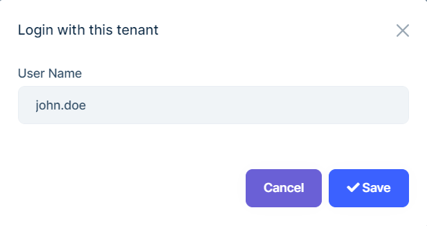

# ABP.IO Platform 7.1 RC Has Been Released

Today, we are happy to release the [ABP Framework](https://abp.io/) and [ABP Commercial](https://commercial.abp.io/) version **7.1 RC** (Release Candidate). This blog post introduces the new features and important changes in this new version.

Try this version and provide feedback for a more stable version of ABP v7.1! Thanks to all of you.

## Get Started with the 7.1 RC

Follow the steps below to try version 7.1.0 RC today:

1) **Upgrade** the ABP CLI to version `7.1.0-rc.1` using a command line terminal:

````bash
dotnet tool update Volo.Abp.Cli -g --version 7.1.0-rc.1
````

**or install** it if you haven't before:

````bash
dotnet tool install Volo.Abp.Cli -g --version 7.1.0-rc.1
````

2) Create a **new application** with the `--preview` option:

````bash
abp new BookStore --preview
````

See the [ABP CLI documentation](https://docs.abp.io/en/abp/latest/CLI) for all the available options.

> You can also use the [Get Started](https://abp.io/get-started) page to generate a CLI command to create a new application.

You can use any IDE that supports .NET 7.x, like [Visual Studio 2022](https://visualstudio.microsoft.com/downloads/).

## Migrating to 7.1

This version doesn't introduce any breaking changes. However, Entity Framework developers may need to add a new code-first database migration to their projects since we made some improvements to the existing entities of some application modules.

## What's New with ABP Framework 7.1?

In this section, I will introduce some major features released in this version. In addition to these features, so many enhancements have been made in this version too. 

Here is a brief list of the titles explained in the next sections:

* Blazor WASM option added to Application Single Layer Startup Template
* Introducing the `IHasEntityVersion` interface and `EntitySynchronizer` base class
* Introducing the `DeleteDirectAsync` method for the `IRepository` interface
* Introducing the `IAbpHostEnvironment` interface
* Improvements on the eShopOnAbp project
* Others

### Blazor WASM option added to Application Single Layer Startup Template

We've created the [Application (Single Layer) Startup Template](https://docs.abp.io/en/abp/7.1/Startup-Templates/Application-Single-Layer) in v5.2 with three UI types: Angular, Blazor Server and MVC. At the moment, we didn't provide UI option for Blazor, because it required 3 projects at least (server-side, client-side and shared library between these two projects). 

In this version, we've added the Blazor WASM option to the **Application (Single Layer) Startup Template**. It still contains three projects (`blazor`, `host`, and `contracts`) but hosted by a single `host` project.

You can use the following CLI command to create an `app-nolayers` template with the Blazor UI as the UI option:

```bash
abp new TodoApp -t app-nolayers -u blazor --version 7.1.0-rc.1
```

> You can check the [Quick Start documentation](https://docs.abp.io/en/abp/7.1/Tutorials/Todo/Single-Layer/Index?UI=Blazor&DB=EF) for a quick start with this template.

### Introducing the `IHasEntityVersion` interface and `EntitySynchronizer` base class

Entity synchronization is an important concept, especially in distributed applications and module development. If we have an entity that is related to other modules, we need to align/sync their data once the entity changes and versioning entity changes can also be good, so we can know whether they're synced or not.

In this version, [@gdlcf88](https://github.com/gdlcf88) made a great contribution to the ABP Framework and introduced the `IHasEntityVersion` interface which adds **auto-versioning** to entity classes and `EntitySynchronizer` base class to **automatically sync an entity's properties from a source entity**.

You can check the issue and documentation from the following links for more info:

- [Issue: Entity synchronizers and a new EntityVersion audit property](https://github.com/abpframework/abp/issues/14196)
- [Versioning Entities](https://docs.abp.io/en/abp/7.1/Entities#versioning-entities)
- [Distributed Event Bus - Entity Synchronizer](https://docs.abp.io/en/abp/7.1/Distributed-Event-Bus#entity-synchronizer)

> Note: The entities of some modules from the ABP Framework have implemented the `IHasEntityVersion` interface. Therefore, if you are upgrading your application from an earlier version, you need to create a new migration and apply it to your database.

### Introducing the `DeleteDirectAsync` method for the `IRepository` interface

EF 7 introduced a new [`ExecuteDeleteAsync`](https://learn.microsoft.com/en-us/ef/core/what-is-new/ef-core-7.0/whatsnew#executeupdate-and-executedelete-bulk-updates) method that deletes entities without involving the change tracker into the process. Therefore, it's much faster.

We've added the `DeleteDirectAsync` method to the `IRepository<>` interface to take the full power of EF 7. It deletes all entities that fit the given predicate. It directly deletes entities from the database, without fetching them. Therefore, some features (like **soft-delete**, **multi-tenancy**, and **audit logging)** won't work, so use this method carefully when you need it. And use the `DeleteAsync` method if you need those features.

### Introducing the `IAbpHostEnvironment` interface

Sometimes, while creating an application, we need to get the current hosting environment and take actions according to that. In such cases, we can use some services such as [IWebHostEnvironment](https://learn.microsoft.com/en-us/dotnet/api/microsoft.aspnetcore.hosting.iwebhostenvironment?view=aspnetcore-7.0) or [IWebAssemblyHostEnvironment](https://learn.microsoft.com/en-us/dotnet/api/microsoft.aspnetcore.components.webassembly.hosting.iwebassemblyhostenvironment) provided by .NET, in the final application. 

However, we can not use these services in a class library, which is used by the final application. ABP Framework provides the `IAbpHostEnvironment` service, which allows you to get the current environment name whenever you want. `IAbpHostEnvironment` is used by the ABP Framework in several places to perform specific actions by the environment. For example, ABP Framework reduces the cache duration on the **Development** environment for some services.

**Usage:**

```csharp
public class MyService
{
    private readonly IAbpHostEnvironment _abpHostEnvironment;
    
    public MyService(IAbpHostEnvironment abpHostEnvironment)
    {
        _abpHostEnvironment = abpHostEnvironment;
    }

    public void MyMethod()
    {
        //getting the current environment name
        var environmentName = _abpHostEnvironment.EnvironmentName;

        //check for the current environment
        if (_abpHostEnvironment.IsDevelopment()) { /* ... */ } 
    }
}
```

You can inject the `IAbpHostEnvironment` into your service and get the current environment by using its `EnvironmentName` property. You can also check the current environment by using its extension methods such as `IsDevelopment()`.

> Check the [ABP Application Startup](https://docs.abp.io/en/abp/7.1/Application-Startup) documentation for more information.

### Improvements on the eShopOnAbp project

K8s and Docker configurations have been made within this version (Dockerfiles and helm-charts have been added and image build scripts have been updated). See [#14083](https://github.com/abpframework/abp/issues/14083) for more information.

### Others

* Referral Links have been added to the CMS Kit Comment Feature (optional). You can specify common referral links (such as "nofollow" and "noreferrer") for links in the comments. See [#15458](https://github.com/abpframework/abp/issues/15458) for more information.
* ReCaptcha verification has been added to the CMS Kit Comment Feature (optional). You can enable ReCaptcha support to enable protection against bots. See the [documentation](https://docs.abp.io/en/abp/7.1/Modules/Cms-Kit/Comments) for more information.
* In the development environment, it is a must to reduce cache durations for some points. We typically don't have to invalidate the cache manually or wait on it for a certain time to be invalidated. For that purpose, we have reduced the cache durations for some points on the development environment. See [#14842](https://github.com/abpframework/abp/pull/14842) for more information.

## What's New with ABP Commercial 7.1?

We've also worked on [ABP Commercial](https://commercial.abp.io/) to align the new features and changes made in the ABP Framework. The following sections introduce a few new features coming with ABP Commercial 7.1.

### Blazor WASM option added to Application Single Layer Pro Startup Template

The [**Application (Single Layer) Startup Template**](https://docs.abp.io/en/commercial/latest/startup-templates/application-single-layer/index) with Blazor UI is also available for ABP Commercial customers with this version as explained above.

You can use the following CLI command to create an `app-nolayers-pro` template with Blazor UI as the UI option:

```bash
abp new TodoApp -t app-nolayers-pro -u blazor --version 7.1.0-rc.1
```

You can also create an `app-nolayers-pro` template with Blazor UI via ABP Suite:


### Suite - MAUI Blazor Code Generation

We provided a new UI option "MAUI Blazor" for the `app-pro` template in the previous version and it's possible to create a `maui-blazor` application with both ABP CLI and ABP Suite.

You can create an `app-pro` template with the MAUI Blazor as the UI option with the following ABP CLI command:

```bash
abp new Acme.BookStore -t app-pro -u maui-blazor
```

In this version, we implemented the code generation for MAUI Blazor. You can create and generate CRUD pages for this new UI option as you do in other UI types.

> Note: MAUI Blazor is currently only available with the `app-pro` template.

### SaaS Module - Allowing entering a username while impersonating the tenant

In the previous versions, we were able to impersonate a tenant from the [SaaS Module's Tenant Management UI](https://docs.abp.io/en/commercial/7.1/modules/saas#tenant-management). There was a constraint in this approach, which forced us to only impersonate the "admin" user. However, the tenant might change the admin user's username, or we may want to impersonate another user of the tenant.

Thus, with this version, we decided to allow the impersonation of the tenant by the specified username.

*You can click on the "Login with this tenant" action button:*


*Then, Specify the admin name of the tenant:*



## Community News

### New ABP Community Posts

* [Sergei Gorlovetsky](https://community.abp.io/members/Sergei.Gorlovetsky) has created two new community articles:
  * [Why ABP Framework is one of the best tools for migration from legacy MS Access systems to latest Web app](https://community.abp.io/posts/why-abp-framework-is-one-of-the-best-tools-for-migration-from-legacy-ms-access-systems-to-latest-web-app-7l39eof0)
  * [ABP Framework — 5 steps Go No Go Decision Tree](https://community.abp.io/posts/abp-framework-5-steps-go-no-go-decision-tree-2sy6r2st)
* [Onur Pıçakcı](https://github.com/onurpicakci) has created his first ABP community article that explains how to contribute to ABP Framework. You can read it 👉 [here](https://community.abp.io/posts/how-to-contribute-to-abp-framework-46dvzzvj).
* [Maliming](https://github.com/maliming) has created a new community article to show how to convert create/edit modals to a page. You can read it 👉 [here](https://community.abp.io/posts/converting-createedit-modal-to-page-4ps5v60m).

We thank you all. We thank all the authors for contributing to the [ABP Community platform](https://community.abp.io/).

### Volosoft Attended NDC London 2023


Core team members of the ABP Framework, [Halil Ibrahim Kalkan](https://twitter.com/hibrahimkalkan) and [Alper Ebicoglu](https://twitter.com/alperebicoglu) attended [NDC London 2023](https://ndclondon.com/) from the 23rd to the 27th of January.  

### Community Talks 2023.1: LeptonX Customization


In this episode of ABP Community Talks, 2023.1; we'll talk about **LeptonX Customization**. We will dive into the details and show you how to customize the [LeptonX Theme](https://leptontheme.com/) with examples. 

The event will be live on Thursday, February 16, 2023 (20:00 - 21:00 UTC).

> Register to listen and ask your questions now 👉 https://kommunity.com/volosoft/events/abp-community-talks-20231-leptonx-customization-03f9fd8c.

## Conclusion

This version comes with some new features and a lot of enhancements to the existing features. You can see the [Road Map](https://docs.abp.io/en/abp/7.1/Road-Map) documentation to learn about the release schedule and planned features for the next releases. Please try the ABP v7.1 RC and provide feedback to help us release a more stable version.

Thanks for being a part of this community!
