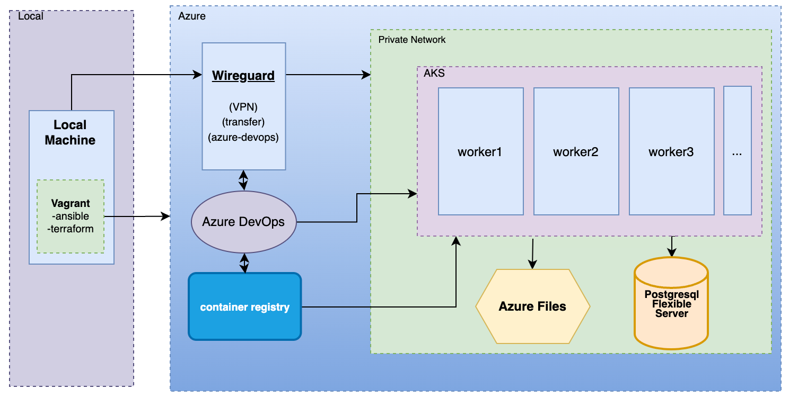
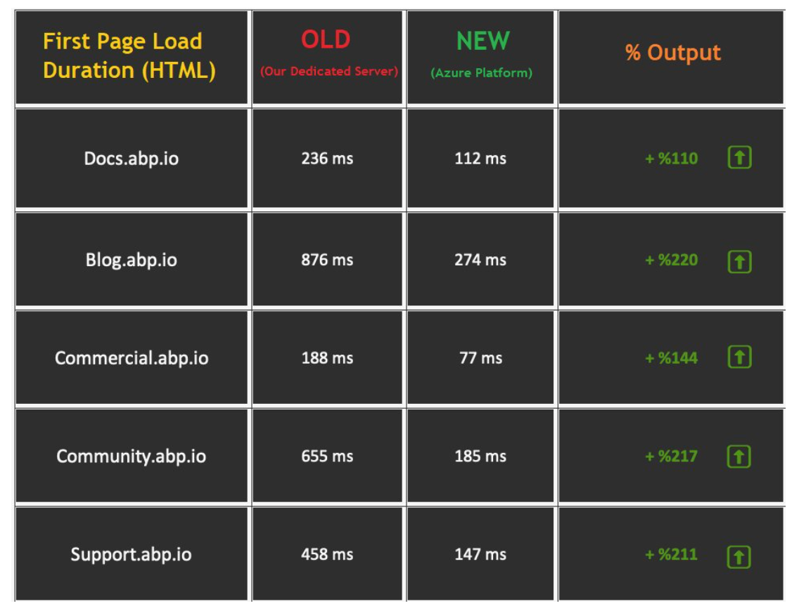

# On-Prem to Azure: Migration of abp.io Platform to Azure

Migrating a Kubernetes platform with a database from our own dedicated servers to Azure can be a compelling task, but it can be a necessary one to take advantage of the benefits that the cloud service offers. In this post, we will discuss the reasons for migrating from a on-premise platform to Azure, the steps taken to create and configure the [abp.io platform](https://abp.io) on Azure, and the benefits gained from the migration.

### On-Premise Server: The old platform

There were several reasons for migrating from the old on-premise platform to Azure. First, the Kubernetes cluster and the database were on the same Windows server. Additionally, the Linux virtual machines in Kubernetes were on the Windows server and had limited resources. Furthermore, the Kubernetes maintenance was quite challenging, which was another reason for the migration.

### Reasons for Moving to Azure: The new platform

The decision to move to the cloud was made to eliminate the disadvantages of the old platform. The migration to Azure meant that the resources would be independent of each other but faster in terms of communicating with each other. The platform would also take advantage of cloud security and availability. The managed Kubernetes service that Azure offers comes with autoscaling and loadbalancing, which makes the platform more reliable. Finally, the migration to Azure would provide a better quality service to global customers and the community.

### Before Moving to Azure

Before migrating to Azure, we decided to switch our database from MS-SQL to PostgreSQL on-premise first. This gave us the opportunity to test and fine-tune the migration process before making the final switch to Azure.You can check the details of database migration from this article [Migrating from MS-SQL to Postgresql](https://community.abp.io/posts/migrating-from-mssql-to-postgresql-lbi5anlv).

The platform was tested in a staging environment created on Azure with the same resources as the production environment. The staging environment was used to test and optimize the migration process, including the migration of data from the old platform to Azure, which was tested multiple times to ensure success.

### Creating and Configuring the abp.io Platform on Azure

Several steps were taken to create and configure the abp.io platform on Azure. [Terraform](https://www.terraform.io/) was used to create the infrastructure (VM, Private Network, AKS, Postgresql Flexible Server...), while [Ansible](https://www.ansible.com/) was used to configure the Azure resources like Terraform, Helm, Kubectl, Docker, VPN, Redis, Prometheus, Grafana, ElasticSearch, Kibana and so on.... Azure DevOps pipelines and release were used for AKS deployment. The most time-consuming part in this process was to prepare, test and optimize the terraform and ansible settings files.

To access our platform, which is configured on a private network in Azure, we require a VPN connection. To enable this, we have installed [Wireguard](https://www.wireguard.com/) - an open source VPN service - by creating a virtual machine using Terraform and configuring it with Ansible in Azure. This approach has made the process efficient and streamlined.

The most important step was to transfer the data in both the database and Kubernetes of the volumes. rsync (remote sync commands) were used to transfer the data from Kubernetes volumes to Azure NFS through the VPN machine. Additionally, `pg_dump` and `pg_restore` were used to transfer the PostgreSQL database through the machine with VPN. 

Before the production environment, the data migration was tested many times for the staging environment. We estimated this migration to take max 1.5 hours. The ABP community was informed that there may be interruptions during the hours designated for the transition to Azure. To inform our customers and community, we created a status page before this migration. The new status page is [status.abp.io](https://status.abp.io). From now on we wil make all the infrastructural announcements on [status.abp.io](https://status.abp.io). We used [Upptime](https://upptime.js.org) which is an open-source uptime monitor and status page provider. During the migration of the production environment, the websites and databases were still up and running. After the data transfer, the only remaining step was to direct the traffic of the already standing abp.io sites to the Azure Kubernetes service via Cloudflare. 

We would like to happily state that **we were offline for only 4 minutes** during this transition.

### Benefits of Moving to Azure

The migration to Azure resulted in several benefits. The platform is now more reliable, scalable, secure, solid with built-in one-click backup and recovery capabilities for abp.io. Additionally, the critical resources are in a private network, making them more secure than the old environment. When we initially compared the speed of our abp.io sites before and after migrating to Azure, we were pleasantly surprised by the significant improvement in performance. To be honest, we did not expect such a speed increase.

In conclusion, migrating a Kubernetes platform with a database from on-premise to Azure is a complex process that requires careful planning and execution. However, the benefits gained from the migration make the process worthwhile. By moving to Azure, the abp.io platform now has a more reliable and available infrastructure that is more secure than the old environment. The migration also resulted in significant improvements in connection speeds, which ultimately provides a better service to global customers and the community.

