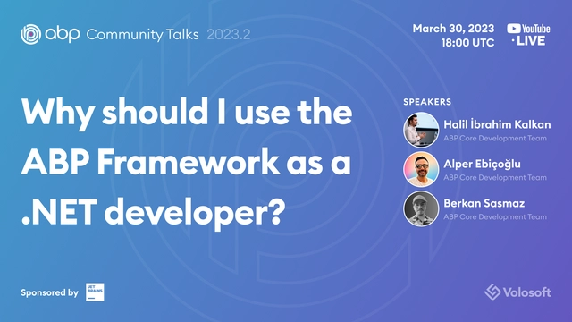
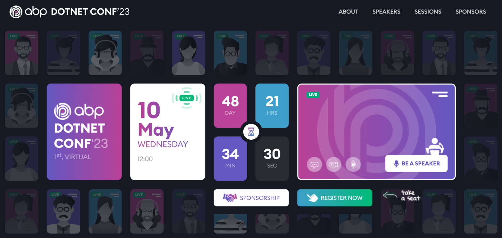

# ABP.IO Platform 7.1 Final Has Been Released!

[ABP Framework](https://abp.io/) and [ABP Commercial](https://commercial.abp.io/) 7.1 versions have been released today.

## What's New With Version 7.1?

All the new features were already explained in detail in the [7.1 RC Announcement Post](https://blog.abp.io/abp/ABP.IO-Platform-7.1-RC-Has-Been-Published), so no need to go over them again. Check it out for more details. 

## Getting Started with 7.1

### Creating New Solutions

You can create a new solution with the ABP Framework version 7.1 by either using the `abp new` command or generating the CLI command on the [get started page](https://abp.io/get-started).

> See the [getting started document](https://docs.abp.io/en/abp/latest/Getting-Started) for more.

### How to Upgrade an Existing Solution

#### Install/Update the ABP CLI

First of all, install the ABP CLI or upgrade it to the latest version.

If you haven't installed it yet:

```bash
dotnet tool install -g Volo.Abp.Cli
```

To update the existing CLI:

```bash
dotnet tool update -g Volo.Abp.Cli
```

#### Upgrading Existing Solutions with the ABP Update Command

[ABP CLI](https://docs.abp.io/en/abp/latest/CLI) provides a handy command to update all the ABP related NuGet and NPM packages in your solution with a single command:

```bash
abp update
```

Run this command in the root folder of your solution.

## Migration Guides

This version includes a very minor breaking change and it doesn't affect most of the applications. Check [the migration guide](https://docs.abp.io/en/abp/7.1/Migration-Guides/Abp-7_1) for the details.

## Community News

## ABP Community Talks 2023.2

The next ABP Community Talks will take place on March 30, at 18:00 (UTC).



In this episode, core ABP Framework developers will discuss the benefits of using the ABP Framework as a .NET developer instead of creating your own solution from scratch. They will answer most of the common doubts about using ABP and application frameworks in general. You will better understand how ABP makes a developer’s life easier and more enjoyable while cutting production costs. We will also have a question - answer session after the talk, as always. I think this talk will be useful for every .NET developer whether they use ABP or not.

**[CLICK HERE to register for the event and join us](https://kommunity.com/volosoft/events/abp-community-talks-20232-why-use-abp-framework-as-a-net-developer-e3254183)**.

## Introducing the first ABP .NET Conference!

As the ABP team, we've executed more than 10 [online events](https://community.abp.io/events) and gained a good experience of software talks. In May, we are organizing a full-featured software conference, named **ABP Dotnet Conference 2023**!



We are still organizing the speakers, talks and schedule. There will be 12 sessions about software development and .NET. These will also include a few ABP-related talks. You can **follow https://abp.io/conference website** and buy early bird tickets from now.

### New ABP Community Posts

There are exciting articles contributed by the ABP community as always. I will highlight some of them here:

* [Creating Dockerfile for ABP Applications](https://community.abp.io/posts/creating-dockerfile-for-abp-applications-caj4fkxa) by [Anto Subash](https://community.abp.io/members/antosubash)
* [IdentityUser Relationship and Extending it](https://community.abp.io/posts/identityuser-relationship-and-extending-it-xtv79mpx) by [Onur Pıçakçı](https://community.abp.io/members/onurpicakci)
* [Streamline Localization in Your ABP Project](https://community.abp.io/posts/streamline-localization-in-your-abp-project-1t12rmjc) by [Salih Özkara](https://community.abp.io/members/salih)
* [.Net Microservice template with ABP](https://community.abp.io/posts/.net-microservice-template-with-abp-53r52ryy) by [Anto Subash](https://community.abp.io/members/antosubash)

Thanks to the ABP Community for all the content they have published. You can also [post your ABP related (text or video) content](https://community.abp.io/articles/submit) to the ABP Community.

## About the Next Version

The next feature version will be 7.2. You can follow the [release planning here](https://github.com/abpframework/abp/milestones). Please [submit an issue](https://github.com/abpframework/abp/issues/new) if you have any problems with this version.
