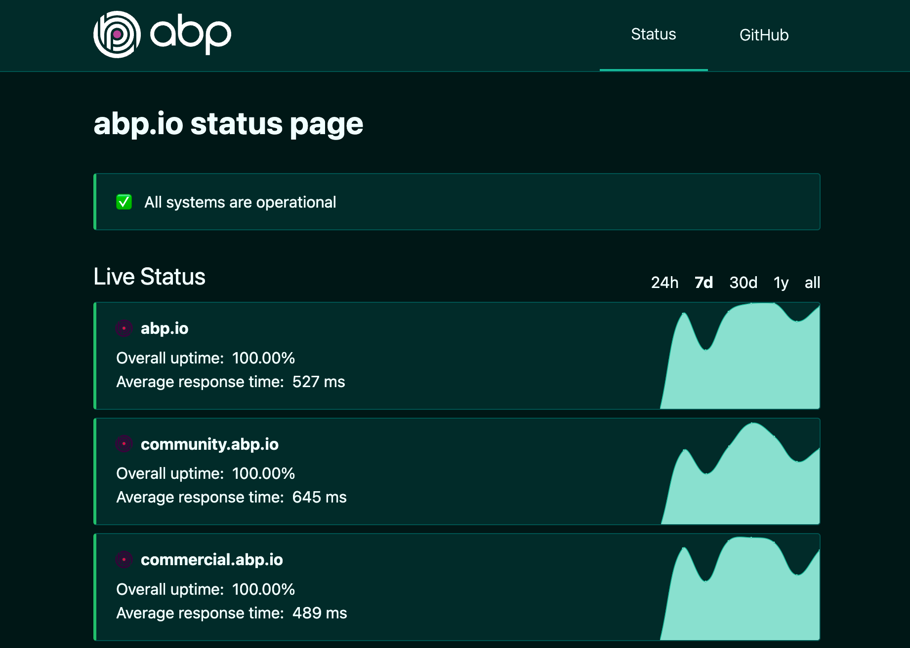
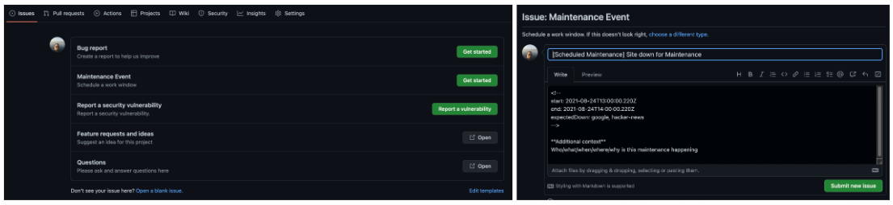
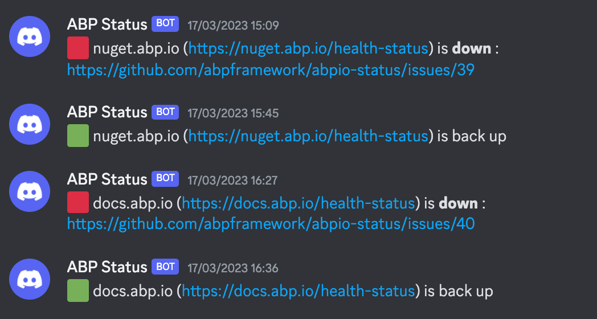

# Creating a Custom Status Page for abp.io with Upptime

## Introduction
In today's digital world, providing reliable and transparent information about your platform's availability is essential to maintaining trust among your community and customers. With the growing number of abp.io users, we needed a dedicated status page [status.abp.io](https://status.abp.io/) to keep everyone informed about our platform's health. To achieve this, we utilized the open-source project [Upptime](https://upptime.js.org/) and built a custom status page on [GitHub Pages](https://pages.github.com/). In this article, we'll guide you through the process of creating our own status page and customizing it to suit our needs.



## Why we chose Upptime
[Upptime](https://github.com/upptime/upptime) is an open-source, easy-to-use, and cost-effective solution for monitoring websites and APIs. It offers essential features, such as downtime alerts, response time monitoring, and status history. We decided to use Upptime because of its compatibility with GitHub Pages, ease of customization, comprehensive [documentation ](https://upptime.js.org/docs/) and discord notifications.


#### Advantages of Upptime
* Open-source: Allows easy customization and community support.

* GitHub Pages compatibility: Seamless integration with GitHub Pages for hosting.

* Cost-effective: Utilizes GitHub Actions, which provides free monitoring within the GitHub Actions usage limits.

* Comprehensive documentation: Easy-to-follow instructions for setting up and customizing the status page.

#### Disadvantages of Upptime
* Limited monitoring capabilities: Upptime offers basic monitoring features but lacks advanced capabilities found in dedicated monitoring tools.

* Dependence on GitHub Actions: Upptime relies on GitHub Actions, which may pose limitations for users unfamiliar with GitHub's ecosystem or those with large-scale projects.

* No built-in alerting system: Users must rely on third-party integrations or custom solutions for notifications, requiring additional configuration.

* Limited customization options: Upptime allows for some customization, but options are limited compared to comprehensive monitoring platforms.

* Self-hosted limitations: As a self-hosted solution, users are responsible for maintaining and managing their own infrastructure, which may not be ideal for those who prefer a fully managed monitoring solution.


## How to set up the status page on GitHub Pages
To get started with our custom status page, we followed the instructions in the [Upptime documentation](https://upptime.js.org/docs/). Here's a summary of the steps we took:

* Fork the Upptime [template repository](https://github.com/upptime/upptime) to our own GitHub account as [abpio-status](https://github.com/abpframework/abpio-status).

* Configure the GitHub Actions workflow. We configured the GitHub Actions workflow by adding the following lines to the [`.github/workflows/uptime.yml`](https://github.com/abpframework/abpio-status/blob/master/.github/workflows/uptime.yml)

* Add the monitored endpoints. We added the monitored endpoints (our abp.io websites) to the [.upptimerc.yml](https://github.com/abpframework/abpio-status/blob/master/.upptimerc.yml) file. This file is located in the root of the repository and contains a list of URLs that Upptime monitors.

```yaml
sites:
  - name: abp.io
    url: https://abp.io/health-status
  - name: community.abp.io
    url: https://community.abp.io/health-status
  - name: commercial.abp.io
    url: https://commercial.abp.io/health-status
  - name: nuget.abp.io
    url: https://nuget.abp.io/health-status
  - name: docs.abp.io
    url: https://docs.abp.io/health-status
  - name: support.abp.io
    url: https://support.abp.io/health-status
  - name: blog.abp.io
    url: https://blog.abp.io/health-status
  - name: commercial-demo.abp.io
    url: https://commercial-demo.abp.io/health-status
```
* Enable GitHub Pages. Finally, we enabled GitHub Pages for our forked repository by going to the repository's settings and selecting the gh-pages branch as the source. This made our status page accessible at [status.abp.io](https://status.abp.io/).

## Customizing the status page

After setting up the default Upptime status page, we focused on customizing it to align with our brand and provide a consistent experience for our community and customers. We made the following changes:

* Updating the logo and favicon. We replaced the default logo and favicon with our own abp.io branded assets. This involved adding the new image files to the repository and updating the references in the `.upptimerc.yml` file:

* Customizing the color scheme and typography. We customized the color scheme and typography to match our corporate identity by editing the `.upptimerc.yml` file:

```yaml
status-website:
  theme: dark
  # Add your custom domain name, or remove the `cname` line if you don't have a domain
  # Uncomment the `baseUrl` line if you don't have a custom domain and add your repo name there
  cname: status.abp.io
  # baseUrl: /abpio-status
  logoUrl: https://commercial.abp.io/assets/svg/abp-logo-light.svg
  favicon: https://raw.githubusercontent.com/abpframework/abpio-status/master/assets/abp-logo-without-text.svg
  faviconSvg: https://raw.githubusercontent.com/abpframework/abpio-status/master/assets/abp-logo-without-text.svg
```
## Creating GitHub Issues for Maintenance Information on status.abp.io 

To provide maintenance information for your status page, you can create GitHub issues in your repository. This allows you to inform your users about planned downtime or ongoing maintenance work.



## Discord Notifications 

### Create a Discord Webhook

To set up Discord notifications for your status.abp.io status page using [Upptime documentation](https://upptime.js.org/docs/notifications#discord), follow these steps:

* In Discord, go to "Server Settings" > "Integrations" > "Create Webhook."
* Customize the Webhook name, choose a channel, and copy the Webhook URL.

### Configure GitHub Actions
* In your Upptime repository, go to the "Settings" tab.
* Click on "Secrets" and then "New repository secret."
* Add secret: Name it DISCORD_WEBHOOK_URL and paste the Webhook URL as the value.
* Add environment variables NOTIFICATION_DISCORD_WEBHOOK and NOTIFICATION_DISCORD set it to true.

Your status page will now send notifications to your Discord channel whenever there's a change in your platform's status.




## Conclusion
If your primary goal is to create a simple, cost-effective status page with basic monitoring features, Upptime is an excellent choice. Its open-source nature, seamless integration with GitHub Pages, and comprehensive documentation make it a user-friendly option.

If you require advanced monitoring capabilities or prefer a fully managed monitoring solution, you may want to explore dedicated monitoring tools, such as Pingdom, Uptime Robot, or Datadog. These tools typically offer more robust monitoring features, built-in alerting systems, and customizable dashboards.

Creating a custom status page for abp.io using Upptime and GitHub Pages proved to be an efficient and cost-effective solution. By following the documentation and customizing the template, we were able to provide our community and customers with a reliable source of information about our platform's availability. With this new status page [status.abp.io](https://status.abp.io/), we can continue to build trust and transparency as our platform grows and evolves.
