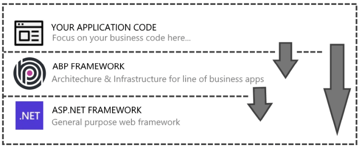
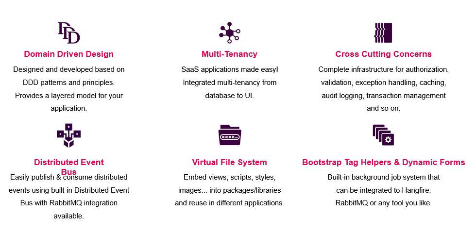
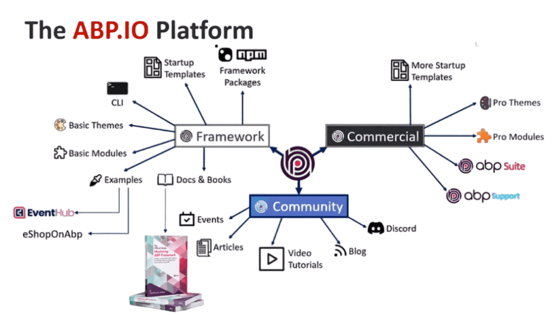
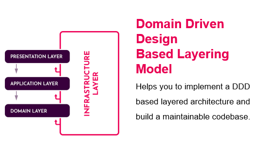
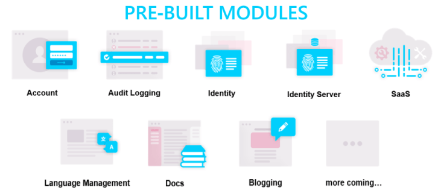
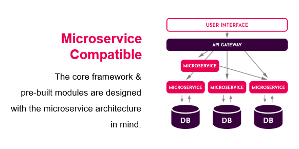
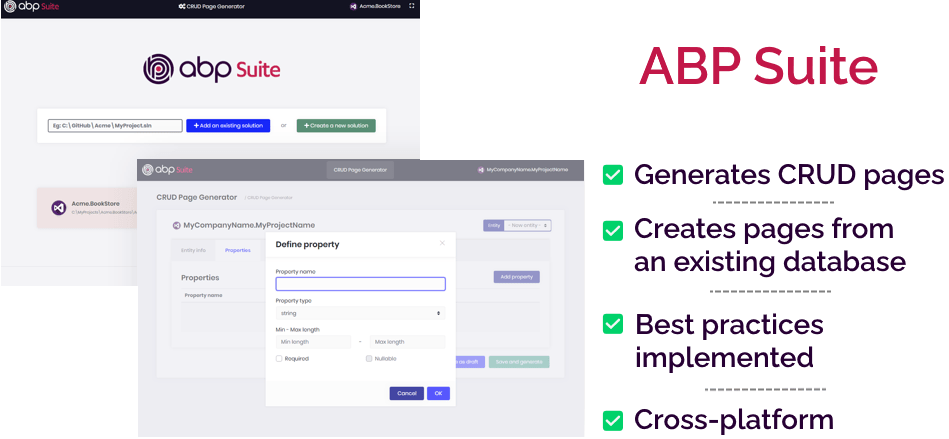
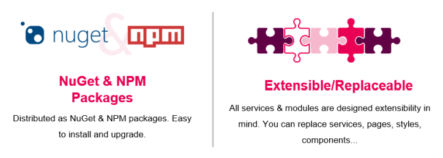

# ABP Framework: An Open Source Web Application Development Framework

## What is ABP Framework?

ABP Framework is an open-source web application development framework that provides developers with a set of tools to build modern, scalable, and maintainable web applications. ABP Framework is also a C# web framework that is based on the ASP.NET web framework. It is one of the [most popular repository](https://github.com/abpframework/abp) for open source application framework. 

ABP Framework is a modular and extensible framework that uses the clean architecture principles and is built on top of the latest .NET technologies. The framework comes with a set of pre-built modules, including user management, role management, permission management, content management system (CMS) modules, which makes it easier for developers to create line of business applications.

## Clean Architecture

When you want to start a new scratch project, you first google for Dotnet Framework Architecture. There are some boilerplate dotnet startup templates but these are only an orchestration of some popular tools. ABP is not a template but it's a full stack open source application development framework.

When you say "Clean Architecture ASP.NET Core", the first web development framework that comes to mind is undoubtedly the ABP Framework. It is built using clean architecture principles, which help developers build scalable and maintainable applications. Clean architecture separates the application into distinct layers, each with a clear responsibility. The dotnet architecture layers include the presentation layer, application layer, domain layer, and infrastructure layer. Each layer has a clear responsibility, which helps in separating concerns and keeping the code organized. This makes ABP Framework one of the best asp net frameworks.

## C# Web Framework for Web Development

ABP Framework is built using C#, which is a modern programming language that is widely used in the development of web applications. C# provides developers with a set of features that make it easy to write clean and maintainable code. ABP Framework is a web framework that is designed to work with C# and provides developers with a set of tools that makes it easy to build modern web applications. If you are looking for an ASP NET Core shared framework download, then go to https://abp.io/get-started and create your project.

## Yet another ASP.NET Web Framework

There are a few full stack AspNet Core frameworks around. Many of them are one developer projects which can be risky for you to start a long running project.  ABP Framework is built on top of the latest ASP NET Core Framework, which provides developers with a set of features that makes it easy to build modern web applications. And most important part is, ABP is backed with a large group of developers and it has almost 10K stars on GitHub. ASP.NET provides developers with a set of tools that makes it easy to build web applications using a model-view-controller (MVC) architecture.

## Implementing Domain Driven Design with C#

ABP Framework provides developers with a set of tools that make it easy to implement domain-driven design principles. The framework comes with a set of pre-built modules, including user management, role management, permission management, and content management system (CMS) modules, which makes it easier for developers to create complex applications.

## Open Source Web Application

ABP Framework is an open-source web application development framework that is free to use and distribute. The framework is licensed under the MIT license, which means that developers can use it for commercial and non-commercial purposes without any restrictions.

## .NET Application Framework with Pre-Built Modules

ABP Framework is built using the latest .NET technologies and provides developers with a set of tools that makes it easy to build modern web applications. ABP contains several important modules of a line of business applications.

## C# Microservice Framework

ABP Framework is a C# microservices framework that is designed to help developers build scalable and maintainable microservices. The framework is also known as .NET .net microservices framework. It provides developers with a set of tools that makes it easy to build microservices using clean architecture principles.

## CRUD Tool Dotnet

ABP Framework has a commercial version as well. The paid version comes with a premium support, rich themes and there's a very handy tool called [ABP Suite](https://commercial.abp.io/tools/suite) for "CRUD page generation ASP.NET". While ABP is not a low-code or no-code platform, ABP Suite provides ASP NET rapid application development. There are many ASP.NET rapid development tools but these are only tools without a framework support. If you are looking for web based rapid application development tools (also open-source), ABP is the way to go!

## Modular Development

One of the best sides of the ABP Framework is the modular development side. It's born as a modular system. There are several open source web frameworks around but many of them lack of modularity. 

Let's see the key features of the ABP Framework: 

- Multi-tenancy support
- Cross-cutting concerns implemented
- Full-stack microservice solution
- SaaS framework
- ASP.NET modular monolith
- Has an ASP.NET user management module
- Distributed events
- Layered architecture
- Free framework for website
- Several framework templates

## The Essential Features of ABP

ABP Framework is an open source SaaS framework. This crucial feature distinguishes it from other open source web development frameworks. 

The following essential ASP.NET features are available in the ABP Framework:

ASP.NET modularity, ASP.NET modular development, ASP.NET localization, ASP.NET multi-tenancy, ASP.NET SaaS, ASP.NET SaaS framework, ASP.NET distributed events, ASP.NET distributed event bus,  ASP.NET cross-cutting concerns, ASP.NET blob storing, ASP.NET audit logging, ASP.NET microservice, ASP.NET microservice solution, ASP.NET microservice example, ASP.NET API gateway, ASP.NET domain driven design, ASP.NET layered architecture, ASP.NET layering, ASP.NET clean architecture, ASP.NET authentication, ASP.NET authorization, ASP.NET identity, ASP.NET identity server, ASP.NET IdentityServer,  ASP.NET payment module, ASP.NET best practices, ASP.NET design patterns, ASP.NET background jobs, ASP.NET exception handling, ASP.NET background workers, ASP.NET repository, ASP.NET repository pattern, ASP.NET unit of work, ASP.NET domain services, ASP.NET swagger, ASP.NET content management system, ASP.NET user management, ASP.NET role management, ASP.NET permission management

## Microservice Example: eShopOnAbp

[eShopOnAbp](https://www.eshoponabp.com/) is a microservice example built on top ABP. It is a sample net application, similar to the Microsoft's [eShopOnContainer](https://github.com/dotnet-architecture/eShopOnContainers) project. It is a reference microservice solution built with the ABP Framework and .NET,  runs on Kubernetes with Helm configuration, includes API Gateways,  Angular and ASP.NET Core MVC applications with PostgreSQL and MongoDB  databases. For more information, check out https://github.com/abpframework/eShopOnAbp.

## Conclusion

In conclusion, ABP Framework is an open-source web development framework that offers many features and benefits for building modern and scalable web applications. Its modular and extensible architecture, implementation of Domain-Driven Design, and compatibility with various platforms make it a popular choice for developers. Whether you're building a web application, microservices, or modular monoliths, ABP Framework has everything you need to get started.

Whether you're building a dot net website, a web app infrastructure, or a webpage framework, open source web application frameworks are a cost-effective and flexible option for web development. If you are looking for an open source web application builder which contains project framework template with web application development tools (open source), [ABP Framework](https://abp.io/) is the right choice.