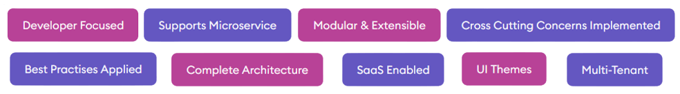
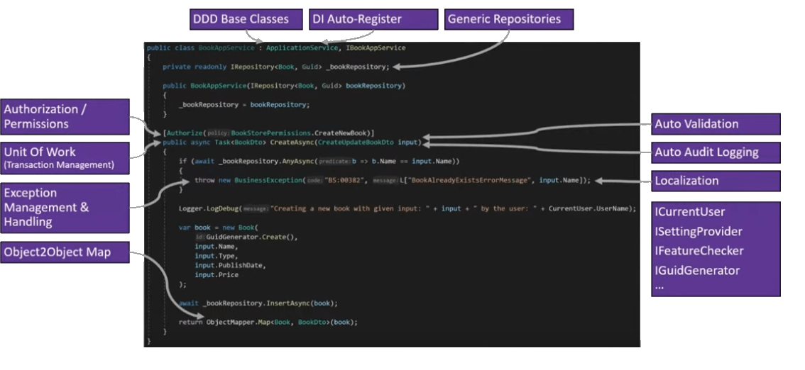

Building robust web applications has become more important than ever as the world is becoming more web-focused. With the rise of new tools and frameworks, choosing the right web development framework can be challenging. Especially if you are a .NET developer, there not so many popular ASPNET Framework around. However, the ABP Framework has become popular for many developers due to its flexibility, scalability, feature set and performance. Let's mention what's ABP Framework and what it promises to .NET developers.

## ASP.NET Core Architecture Best Practices

ABP Framework is an application design framework that provides developers with a powerful set of tools to build web applications quickly and efficiently. It is an open-source, cross-platform framework supporting monolithic and microservices architectures. ABP Framework is built on top of the ASP.NET Core architecture and incorporates best practices for developing web applications.

## ASP.NET Platform

The framework includes a wide range of features, such as an angular code generator with the help of [ABP Suite](https://commercial.abp.io/tools/suite), project templates, and web application themes. These features enable developers to create web applications that are both functional and visually appealing without spending much time on coding. Moreover, ABP Framework provides a common application framework that can be used for different applications, including SAAS, e-commerce, and social media platforms.

ABP Framework also supports the domain-driven design, which means that the framework is designed to be flexible and adaptable to different business requirements. This approach allows developers to build applications aligned with business needs, ensuring that they are efficient and effective.

## Open Source Dot Net Framework

One of the major advantages of ABP Framework is its open-source nature. Many developers continuously improve and update the framework, making it more reliable and secure. Moreover, the ABP Framework is compatible with multiple .NET frameworks, including ASP.NET and .NET Core. When starting your project on top of a solid Microsoft web framework, the ABP Framework is one of the best choices. 

Another advantage of ABP Framework is that it provides rapid web application development tools that are easy to use. The framework includes project templates that developers can use as a starting point for their web applications, which can significantly reduce the development time. ABP Framework also provides a web app builder that developers can use to create web applications quickly and efficiently.

## ASPNET Core Architecture

ABP Framework is also compatible with Microsoft's Clean Architecture, a software design pattern that promotes separation of concerns and maintainability. This integration ensures that the applications developed using ABP Framework are well-structured, easy to maintain, and scalable. Many application marketplace reviewers commented about ABP as the best web application framework. While ABP supports multiple UI choices like MVC, Angular, Blazor Web Assembly and Blazor Server, the most downloaded one is MVC microservice architecture. If you are here to find a NET application framework for your next NET Core application, you are in the right place!

Clean Architecture is a design pattern that emphasizes the separation of concerns, ensuring that the code is organized in independent layers. This helps developers to write code that is easy to maintain, test and refactor. ABP Framework uses this pattern to structure its application code and ensure that it is easy to manage.

## Open Source Web Framework

ABP Framework is an open-source web framework that is free to use and distribute. The framework is licensed under the MIT license, meaning developers can use it for commercial and non-commercial purposes without any restrictions.

ABP Framework provides different templates, which are ASPNET Core web app compatible with various platforms, including Windows, Linux, and macOS. 

## Domain Driven Design DotNet

The ABP Framework also implements Domain-Driven Design (DDD), a software design methodology that emphasizes the importance of the domain model. The framework provides a guide for implementing DDD through an implementing domain-driven design. It helps developers to create a domain model that is easy to understand, test, and maintain. As ABP is a C# framework, it supports most of the common application framework features for a core framework.

There is also a free PDF e-book for Dotnet developers that explains the Domain Driven Design principle with real-world examples. You can download this e-book at https://abp.io/books/implementing-domain-driven-design

## It's a Dotnet Web Framework

ABP Framework is a dotnet web framework that is designed with C# and provides developers with a set of tools that makes it easy to build modern web applications. Whether you want to start a new dotnet monolithic solution or dotnet microservice solution, you can start with ABP. Creating your own dotnet framework architecture may be hard if you don't have many years of experience. The brain team of the ABP Framework specializes in ASP.NET framework architecture and ASP.NET application frameworks. 

## Essential Features of the ABP Framework:

ASP.NET Core modularity, ASP.NET Core modular development, ASP.NET Core localization, ASP.NET Core SaaS framework, ASP.NET Core distributed, event, bus, ASP.NET Core cross-cutting concerns, ASP.NET Core blob storing, ASP.NET Core audit logging, ASP.NET Core microservice, ASP.NET Core microservice solution, ASP.NET Core microservice example, ASP.NET Core API gateway, ASP.NET Core domain, driven, design, ASP.NET Core layered architecture, ASP.NET Core layering, ASP.NET Core clean architecture, ASP.NET Core authentication, ASP.NET Core authorization, ASP.NET Core UI theme, ASP.NET Core tag helpers, ASP.NET Core identity, ASP.NET Core, identity, server, ASP.NET Core IdentityServer, ASP.NET Core payment module, ASP.NET Core best practices, ASP.NET Core design patterns, ASP.NET Core background jobs, ASP.NET Core exception handling, ASP.NET Core, background, workers, ASP.NET Core repository, ASP.NET Core repository pattern, ASP.NET Core unit of work, ASP.NET Core domain services, ASP.NET Core Swagger, ASP.NET Core content management system, ASP.NET Core CMS module, ASP.NET Core user management, ASP.NET Core Role management, ASP.NET Core permission management

## Open Source Web Application Framework

ABP Framework is an open-source web application development framework that is free to use and distribute. The framework is licensed under the MIT license, meaning developers can use it for commercial and non-commercial purposes without any restrictions.

## C# Web Application Framework

ABP Framework is built using C#, which is a modern programming language that is widely used in the development of web applications. C# provides developers with features that make it easy to write clean and maintainable code. ABP Framework is a web framework designed to work with C# and provides developers with tools that make it easy to build modern web applications.

## Key Features

The following .NET features are available in the ABP Framework:

.NET modular development, .NET localization, .NET multi-tenancy, .NET SaaS framework, .NET distributed event bus, .NET cross-cutting concerns, .NET,microservice, .NET microservice solution, .NET microservice example, .NET domain driven design, .NET clean architecture, .NET authentication, .NET authorization, .NET best practices, .NET design,patterns, .NET exception handling, .NET background workers, .NET unit of work, .NET domain services, .NET user management, .NET role management, .NET permission management

The following keywords best describe the ABP Framework; 

Open source backend framework, open source development framework, open source web app builder, open source web applications, open source web development, web application development framework, web application framework, web application framework software, web application infrastructure, web application open source, asp net framework, asp net open source, ASP.NET application, ASP.NET software, ASP.NET web app, ASP.NET web development, web app builder open source, web app framework, Dotnet framework, Dotnet UI framework, Dotnet web application themes.

## Conclusion

ABP Framework is a powerful and flexible web application framework that provides developers with the tools to build high-quality web applications quickly and efficiently. It is an open-source, cross-platform framework that supports multiple .NET frameworks, including ASP.NET and .NET Core. ABP Framework provides rapid web application development tools, project templates, and web application themes that enable developers to create visually appealing and functional applications in no time.

