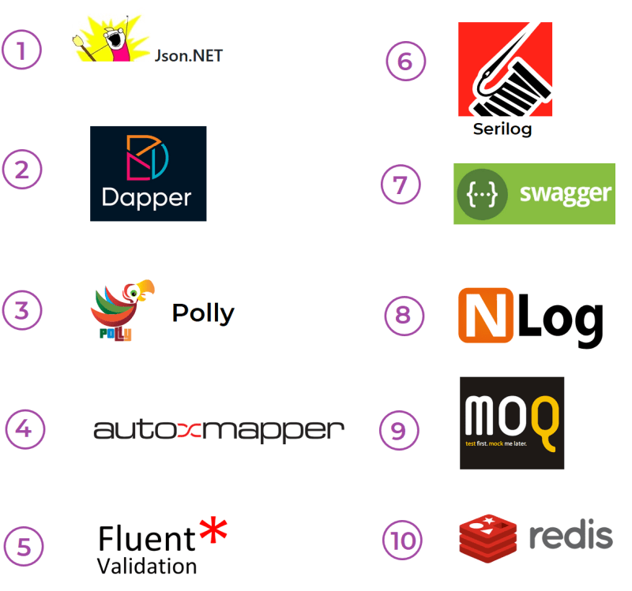

# Top 10 .NET Core Libraries Every Developer Should Know

> *Brief Summary*:
>
> This article is intended for .NET Core developers who wish to create a robust and useful.NET core application. It is a list of the most popular and widely used .NET Core libraries that have been carefully vetted. Go up the GitHub reference link for the DotNet libraries and see how many stars the .NET community has rewarded.

## Best .NET libraries — Top useful libraries every .NET developers use

.NET Core has become one of the most popular frameworks for developing modern applications. One of the reasons for its popularity is the wide range of libraries available to developers.  .NET Core got new updates in its features with lesser coding, deploying  high-accomplishment, and extremely scalable applications.  Making the underlying architecture functions more effective and efficient without having to reinvent the wheel will free up your time to focus on more crucial tasks, including making your application stand out from the competition.

In this article, we'll take a closer look at **The Most Popular .NET Libraries Every Developer Should Know**.  As a software developer, you're likely familiar with the .NET framework and the many libraries it offers. With so many options available, it can be overwhelming to know which ones to choose for your project. This is the main reason I have compiled a list of the **Top 10 .NET Libraries That Developers Should Use** to make their development process more efficient and effective. A list of Top 10 .NET Core Libraries will let developers understand these so that they can pick appropriate libraries for their projects.

If you're a .NET Core developer, there are **10 important .NET Core libraries** that you should be familiar with.  While creating these **Essential 10 .NET Libraries Every Developer Must Know**, I used NuGet and GitHub.com popular repositories. And all the libraries listed here are also open-source. The list is filtered with only to .NET Core related libraries. Also I excluded the Microsoft .NET Core Framework libraries from this **Top 10 Unique .NET Core Libraries Developers Must Utilize**.  So, without further ado, let’s get right into it:

------

## Top 10 best libraries for .NET developers

1. **Newtonsoft.Json:** This library is widely used for working with JSON data in .NET applications. It provides high performance and ease of use, making it a go-to solution for serialization and deserialization of JSON data.
2. **Dapper:** It is a simple and efficient ORM that offers high performance and flexibility when working with relational databases. It is easy to use and offers a fast and efficient way to interact with databases.
3. **Polly:** Polly is a library that helps handle transient errors and faults in .NET applications. It offers an easy-to-use policy-based approach to handling retries, timeouts, and circuit breakers, making it a valuable tool for building reliable applications.
4. **AutoMapper**: This .NET Core library simplifies object-to-object mapping by automatically mapping properties from one object to another. This library is especially useful in larger projects where mapping can become time-consuming and tedious.
5. **FluentValidation:** It is a library that provides a fluent API for building validation rules. It makes it easy to create complex validation logic and supports a wide range of validation scenarios, making it a valuable tool for ensuring data integrity in your applications.
6. **Serilog**: This library is a structured logging library that makes it easy to collect and analyze logs from your application. It offers flexibility and extensibility, and supports a variety of sinks for storing logs, including Elasticsearch, SQL Server, and more.
7. **Swashbuckle.AspNetCore.Swagger:** This library generates OpenAPI documentation for your ASP.NET Core Web API. It makes it easy to understand the functionality of your API and allows you to easily generate client code for your API.
8. **NLog**: It is is a free logging platform for .NET with rich log routing and management capabilities. It makes it easy to produce and manage high-quality logs for your application regardless of its size or complexity.
9. **Moq4**: It is is a popular mocking framework for .NET applications. It makes it easy to create mock objects for unit testing, reducing the need for expensive and time-consuming integration testing.
10. **StackExchange.Redis**: This is a library for working with Redis databases in .NET applications. It provides a simple and efficient way to interact with Redis, and offers high performance and scalability.

------

## Top 10 .NET Core Libraries List That Every Developer Must Know

Here you can see them in table with the GitHub stars, GitHub release counts, recent release frequency, NuGet download counts and per day NuGet download counts:

| GitHub URL                                                   | NuGet URL                                                    | Stars | Releases | Last release | Downloads | Download Per Day |
| ------------------------------------------------------------ | ------------------------------------------------------------ | ----- | -------- | ------------ | --------- | ---------------- |
| [Newtonsoft.Json](https://github.com/JamesNK/Newtonsoft.Json) | [Newtonsoft.Json](https://www.nuget.org/packages/Newtonsoft.Json) | 10K   | 65       | 1 month ago  | 3B        | 680K             |
| [Dapper](https://github.com/DapperLib/Dapper)                | [Dapper](https://www.nuget.org/packages/Dapper)              | 16K   | 70       | 2 years ago  | 216M      | 50K              |
| [Polly](https://github.com/App-vNext/Polly)                  | [Polly](https://www.nuget.org/packages/polly)                | 12K   | 26       | 1 year ago   | 335M      | 92K              |
| [AutoMapper](https://github.com/AutoMapper/AutoMapper)       | [AutoMapper](https://www.nuget.org/packages/AutoMapper)      | 9K    | 41       | 6 months ago | 400M      | 90K              |
| [FluentValidation](https://github.com/FluentValidation/FluentValidation) | [FluentValidation](https://www.nuget.org/packages/FluentValidation) | 8K    | 68       | 3 days ago   | 250M      | 56K              |
| [Serilog](https://github.com/serilog/serilog)                | [Serilog](https://www.nuget.org/packages/Serilog)            | 6K    | 15       | 1 month ago  | 722M      | 197K             |
| [Swashbuckle.AspNetCore.Swagger](https://github.com/domaindrivendev/Swashbuckle.AspNetCore) | [Swashbuckle.AspNetCore.Swagger](https://www.nuget.org/packages/Swashbuckle.AspNetCore.Swagger) | 5K    | 28       | 4 months ago | 386M      | 168K             |
| [NLog](https://github.com/NLog/NLog)                         | [NLog](https://www.nuget.org/packages/Nlog)                  | 6K    | 125      | 1 week ago   | 217M      | 48K              |
| [Moq](https://github.com/moq/moq4)                           | [Moq](https://www.nuget.org/packages/Moq)                    | 5K    | 33       | 4 months ago | 418M      | 93K              |
| [StackExchange.Redis](https://github.com/StackExchange/StackExchange.Redis) | [StackExchange.Redis](https://www.nuget.org/packages/StackExchange.Redis) | 5K    | 34       | 11 days ago  | 244M      | 74K              |

In conclusion, these 10 .NET Core libraries are essential tools for any .NET Core developer. They offer a wide range of functionality, from handling errors to mocking for unit testing and simplifying object mapping. Whether you're working on a large-scale enterprise application or a small project, these libraries can help you build more reliable, efficient, and effective applications.

---

### What is ABP Framework?
ABP Framework offers an opinionated architecture to build enterprise software solutions with best practices on top of the .NET and the ASP.NET Core platforms. It provides the fundamental infrastructure, production-ready startup templates, modules, themes, tooling, guides and documentation to implement that architecture properly and automate the details and repetitive work as much as possible. 

If you are starting a new ASP.NET Core project, try [abp.io](https://abp.io) now...

 **IT IS FREE AND OPEN-SOURCE!**

---

> Alper Ebicoglu 🧑🏽‍💻 ABP Framework Core Team Member\
> Follow me for the latest news about .NET and software development:\
> 📌 [twitter.com/alperebicoglu](https://twitter.com/alperebicoglu)\
> 📌 [github.com/ebicoglu](https://github.com/ebicoglu)\
> 📌 [linkedin.com/in/ebicoglu](https://www.linkedin.com/in/ebicoglu)\
> 📌 [medium.com/@alperonline](https://medium.com/@alperonline)
