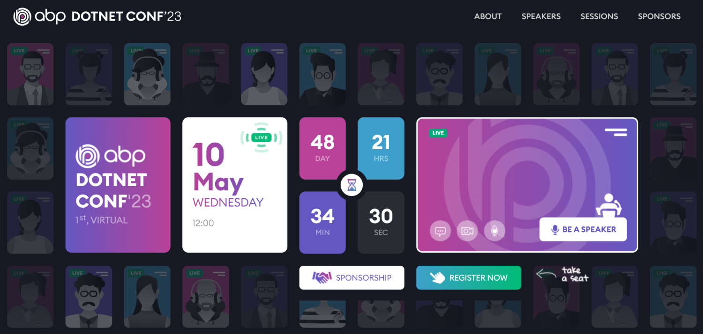

# ABP.IO Platform 7.2 Final Has Been Released!

[ABP Framework](https://abp.io/) and [ABP Commercial](https://commercial.abp.io/) 7.2 versions have been released today.

## What's New With Version 7.2?

All the new features were already explained in detail in the [7.2 RC Announcement Post](https://blog.abp.io/abp/ABP.IO-Platform-7.2-RC-Has-Been-Published), so no need to go over them again. Check it out for more details. 

## Getting Started with 7.2

### Creating New Solutions

You can create a new solution with the ABP Framework version 7.2 by either using the `abp new` command or generating the CLI command on the [get started page](https://abp.io/get-started).

> See the [getting started document](https://docs.abp.io/en/abp/latest/Getting-Started) for more.

### How to Upgrade an Existing Solution

#### Install/Update the ABP CLI

First of all, install the ABP CLI or upgrade it to the latest version.

If you haven't installed it yet:

```bash
dotnet tool install -g Volo.Abp.Cli
```

To update the existing CLI:

```bash
dotnet tool update -g Volo.Abp.Cli
```

#### Upgrading Existing Solutions with the ABP Update Command

[ABP CLI](https://docs.abp.io/en/abp/latest/CLI) provides a handy command to update all the ABP related NuGet and NPM packages in your solution with a single command:

```bash
abp update
```

Run this command in the root folder of your solution.

## Migration Guides

There are breaking changes in this version that may affect your application. 
Please see the following migration documents, if you are upgrading from v7.1:

* [ABP Framework 7.1 to 7.2 Migration Guide](https://docs.abp.io/en/abp/7.2/Migration-Guides/Abp-7_2)
* [ABP Commercial 7.1 to 7.2 Migration Guide](https://docs.abp.io/en/commercial/7.2/migration-guides/v7_2)

## Community News

### ABP - DOTNET CONF'23



As the ABP team, we've organized 10+ [online events](https://community.abp.io/events) and gained a good experience with software talks. We are organizing ABP Dotnet Conference 2023, a full-featured software conference, on May 10. You can visit [https://abp.io/conference](https://abp.io/conference) to see the speakers, talks, schedules, and other details.

Don't forget to take your seat and buy a ticket from [https://kommunity.com/volosoft/events/1st-abp-conference-96db1a54](https://kommunity.com/volosoft/events/1st-abp-conference-96db1a54)!

### New ABP Community Posts

There are exciting articles contributed by the ABP community as always. I will highlight some of them here:

* [Converting Create/Edit Modal to Page AngularUI](https://community.abp.io/posts/converting-createedit-modal-to-page-angularui-doadhgil) by [Masum Ulu](https://twitter.com/masumulu)
* [How to Export Data to Excel Files with ASP.NET Core Minimal API](https://community.abp.io/posts/how-to-export-data-to-excel-files-with-asp.net-core-minimal-api-79o45u3s) by [Berkan Sasmaz](https://twitter.com/berkansasmazz)
* [ABP React Template](https://community.abp.io/posts/abp-react-template-33pjmran) by [Anto Subash](https://twitter.com/antosubash)
* [Using Dapper with the ABP Framework](https://community.abp.io/posts/using-dapper-with-the-abp-framework-shp74p2l) by [Halil Ibrahim Kalkan](https://twitter.com/hibrahimkalkan)
* [Converting Create/Edit Modal to Page - Blazor](https://community.abp.io/posts/converting-createedit-modal-to-page-blazor-eexdex8y) by [Enis Necipoglu](https://twitter.com/EnisNecipoglu)
* [What’s New in .NET 8 🧐 ? Discover ALL .NET 8 Features](https://community.abp.io/posts/whats-new-in-.net-8-discover-all-.net-8-features-llcmrdre) by [Alper Ebicoglu](https://twitter.com/alperebicoglu)

Thanks to the ABP Community for all the content they have published. You can also [post your ABP-related (text or video) content](https://community.abp.io/articles/submit) to the ABP Community.

### New ABP Blog Posts

There are also some exciting blog posts written by the ABP team. You can see the following list for some of those articles:

* [You Are Invited to ABP .NET Conf’23! 📣](https://blog.abp.io/abp/You-Are-Invited-to-ABP-dotNET-Conf23) by [Bige Beşikçi](https://twitter.com/bigedediki)
* [💻 Speed Up Your ASP.NET Application 🚀](https://blog.abp.io/abp/Speed-Up-Your-ASP.NET-Application) by [Salih Özkara](https://twitter.com/salihozkara_)
* [C# 12 🔍 Discover the Exciting New Features & Improvements 🆕🚀](https://blog.abp.io/abp/CSharp-12-Discover-the-Exciting-New-Features-and-Improvements) by [Alper Ebiçoğlu](https://twitter.com/alperebicoglu)

## About the Next Version

The next feature version will be 7.3. You can follow the [release planning here](https://github.com/abpframework/abp/milestones). Please [submit an issue](https://github.com/abpframework/abp/issues/new) if you have any problems with this version.
