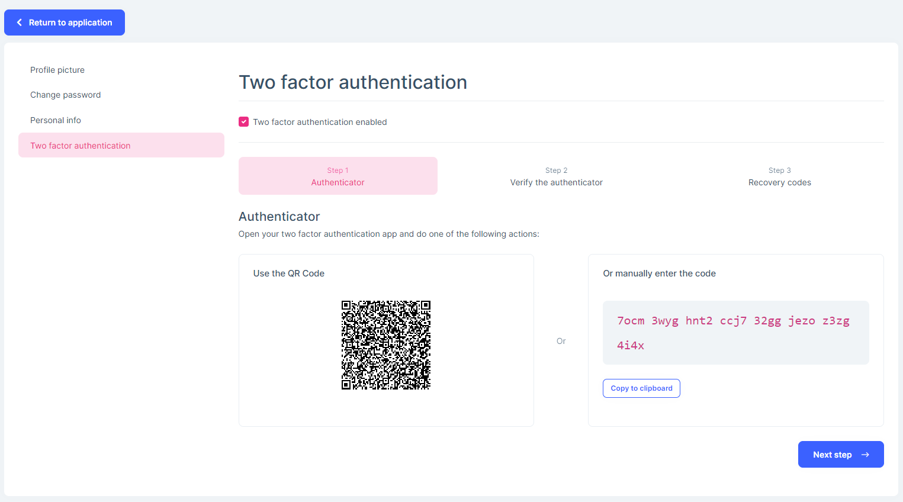
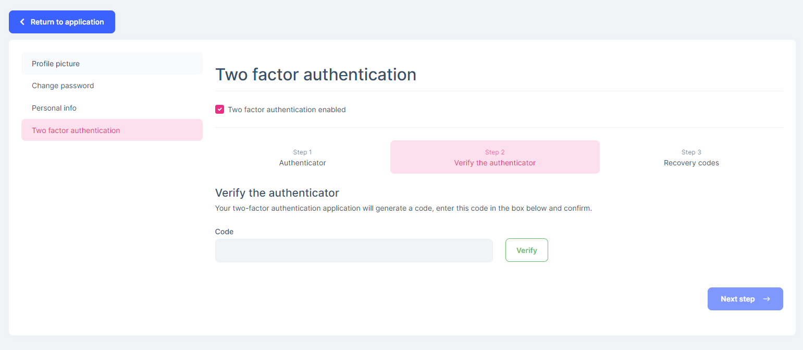
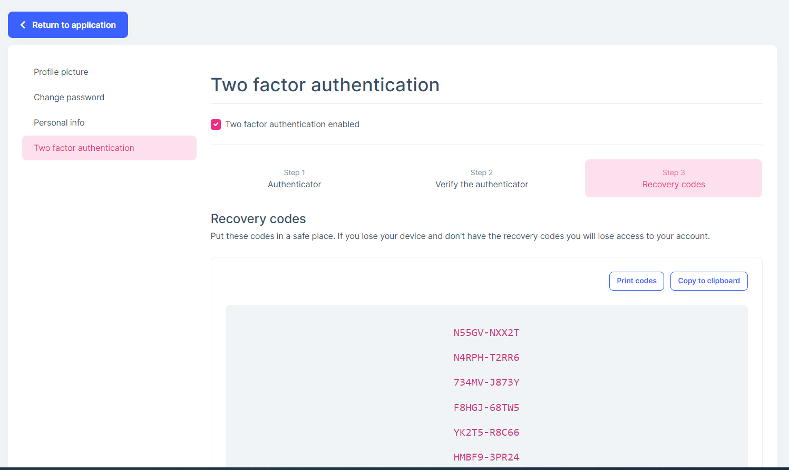
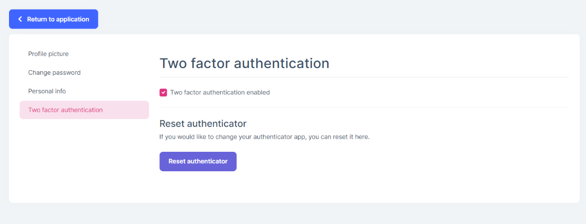
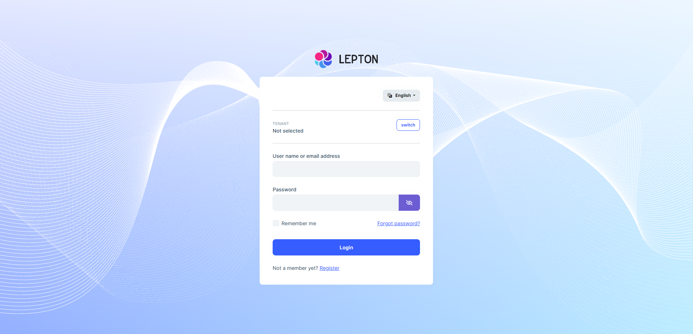
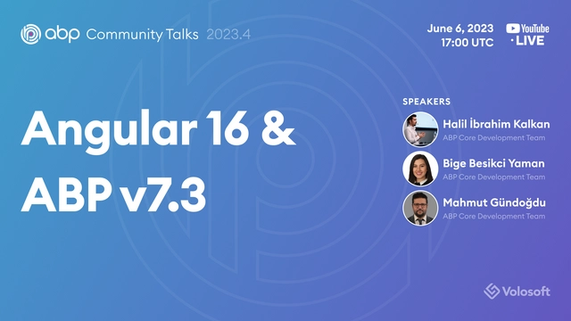
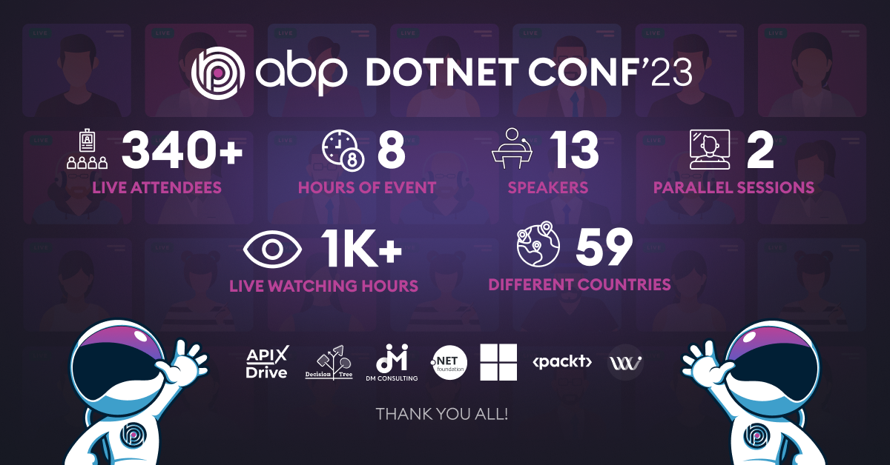
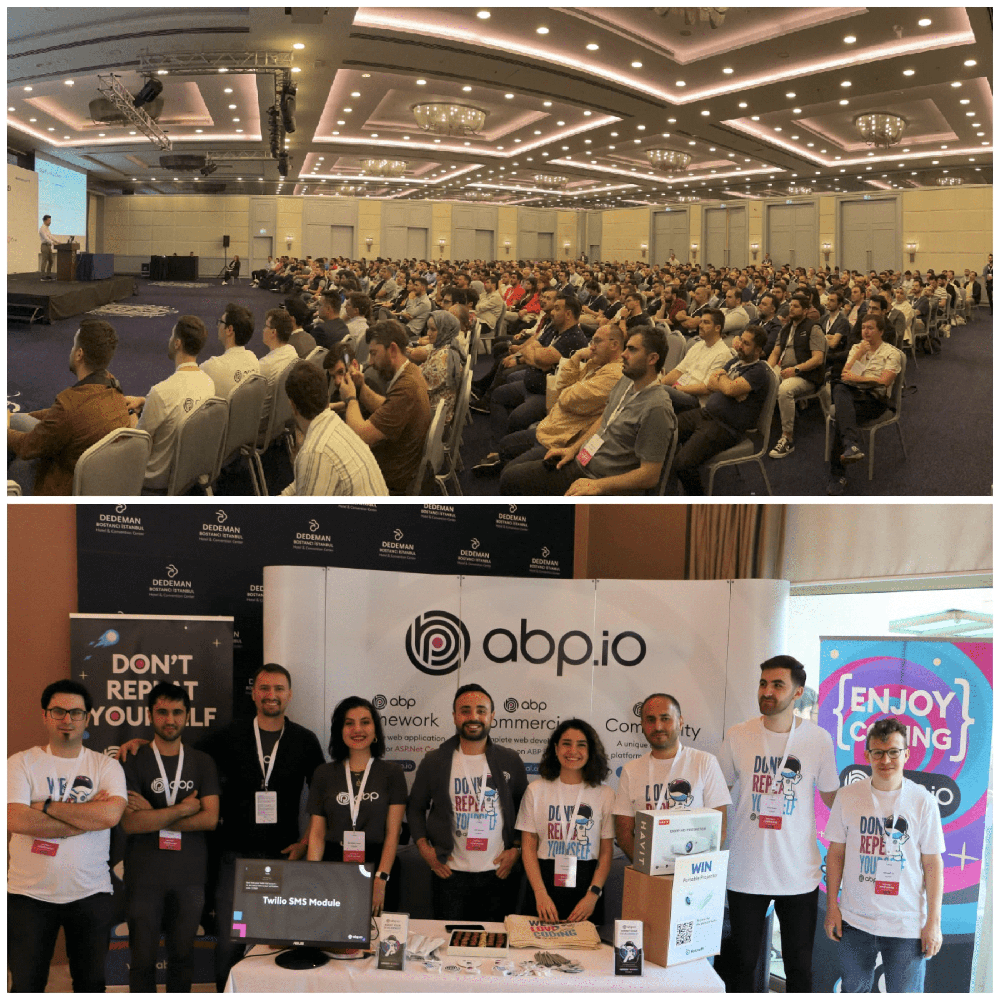
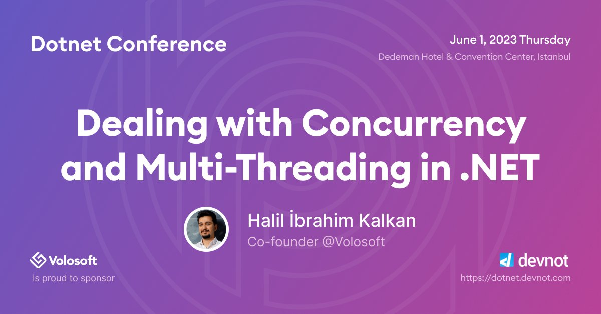

# ABP.IO Platform 7.3 RC Has Been Released

Today, we are happy to release the [ABP Framework](https://abp.io/) and [ABP Commercial](https://commercial.abp.io/) version **7.3 RC** (Release Candidate). This blog post introduces the new features and important changes in this new version.

Try this version and provide feedback for a more stable version of ABP v7.3! Thanks to all of you.

## Get Started with the 7.3 RC

Follow the steps below to try version 7.3.0 RC today:

1) **Upgrade** the ABP CLI to version `7.3.0-rc.1` using a command line terminal:

````bash
dotnet tool update Volo.Abp.Cli -g --version 7.3.0-rc.1
````

**or install** it if you haven't before:

````bash
dotnet tool install Volo.Abp.Cli -g --version 7.3.0-rc.1
````

2) Create a **new application** with the `--preview` option:

````bash
abp new BookStore --preview
````

See the [ABP CLI documentation](https://docs.abp.io/en/abp/latest/CLI) for all the available options.

> You can also use the [Get Started](https://abp.io/get-started) page to generate a CLI command to create a new application.

You can use any IDE that supports .NET 7.x, like [Visual Studio 2022](https://visualstudio.microsoft.com/downloads/).

## Migration Guides

There are a few breaking changes in this version that may affect your application.
Please see the following migration documents, if you are upgrading from v7.2:

* [ABP Framework 7.2 to 7.3 Migration Guide](https://docs.abp.io/en/abp/7.3/Migration-Guides/Abp-7_3)

> If you are using the CMS Kit or CMS Kit Pro module, please don't forget to  create a new migration and apply it to your database.

## What's New with ABP Framework 7.3?

In this section, I will introduce some major features released in this version. Here is a brief list of the titles that will be explained in the next sections:

* Introducing the Volo.Abp.Imaging packages
* ABP CLI: switch-to-local command
* Monitoring Distributed Events
* Ordering of the Local Event Handlers
* Nonce attribute support for Content Security Policy (CSP)
* Other News

### Introducing the Volo.Abp.Imaging packages

ABP Framework provides some packages to compress and resize images. Currently, there are four official packages:

* `Volo.Abp.Imaging.Abstractions`: Provides common services for compression and resizing purposes. 
* `Volo.Abp.Imaging.AspNetCore`: Provides some attributes for controller actions that can automatically compress and/or resize uploaded files.
* `Volo.Abp.Imaging.ImageSharp`: Implements the image compression & resize operations using the [ImageSharp](https://github.com/SixLabors/ImageSharp) library. 
* `Volo.Abp.Imaging.MagickNet`: Implements the image compression & resize operations using the [Magick.NET](https://github.com/dlemstra/Magick.NET) library.

You can use one of these official providers (`ImageSharp` or `Magick.NET`) or implement your own image resizer/compressor contributor and use it in your application.

> See the [Image Manipulation](https://docs.abp.io/en/abp/7.3/Image-Manipulation) documentation to learn more and see the required configurations.

### ABP CLI: switch-to-local command

In this version, ABP CLI introduces a new CLI command: **"switch-to-local"**. The `switch-to-local` command changes all NuGet package references on a solution to local project references for all the `.csproj` files in the specified folder (and all its subfolders with any depth).

**Usage:**

```bash
abp switch-to-local --paths "C:\Github\abp"
```

### Monitoring Distributed Events

ABP Framework allows you to stay informed when your application **receives** or **sends** a distributed event. This enables you to track the event flow within your application and take appropriate actions based on the received or sent distributed events.

You just need to subscribe to one of the `DistributedEventReceived` or `DistributedEventSent` events and take additional actions according to your cases.

**Example: Get informed when your application sends an event to the distributed event bus**

```csharp
public class DistributedEventSentHandler : ILocalEventHandler<DistributedEventSent>, ITransientDependency
{
    public async Task HandleEventAsync(DistributedEventSent eventData)
    {
        // TODO: IMPLEMENT YOUR LOGIC...
    }
}
```

> See the documentation to learn more: [https://docs.abp.io/en/abp/7.3/Distributed-Event-Bus](https://docs.abp.io/en/abp/7.3/Distributed-Event-Bus)

### Ordering of the Local Event Handlers

In this version, ABP Framework introduces the `LocalEventHandlerOrder` attribute, which can be used to set the execution order for the event handlers. This can be helpful if you want to handle your local event handlers in a specific order.

**Example:**

```csharp
[LocalEventHandlerOrder(-1)]
public class MyHandler
    : ILocalEventHandler<StockCountChangedEvent>,
      ITransientDependency
{
    public async Task HandleEventAsync(StockCountChangedEvent eventData)
    {
        //TODO: your implementation
    }
}
```

By default, all event handlers have an order value of 0. Thus, if you want to take certain event handlers to be executed before other event handlers, you can set the order value as a negative value.

> See the documentation to learn more: [https://docs.abp.io/en/abp/7.3/Local-Event-Bus](https://docs.abp.io/en/abp/7.3/Local-Event-Bus)

### Nonce attribute support for Content Security Policy (CSP)

ABP Framework supports adding unique value to nonce attribute for script tags which can be used by Content Security Policy to determine whether or not a given fetch will be allowed to proceed for a given element. In other words, it provides a mechanism to execute only correct script tags with the correct nonce value.

This feature is disabled by default. You can enable it by setting the *UseContentSecurityPolicyScriptNonce* property of the `AbpSecurityHeadersOptions` class to **true**:

```csharp
Configure<AbpSecurityHeadersOptions>(options => 
{
    //adding script-src nonce
    options.UseContentSecurityPolicyScriptNonce = true; //false by default
});
```

> See the [Security Headers](https://docs.abp.io/en/abp/7.3/UI/AspNetCore/Security-Headers) documentation for more information.

### Other News

* Upgraded the [Blazorise](https://blazorise.com/) library to v1.2.3 for Blazor UI. After the upgrade, ensure that all Blazorise-related packages are using v1.2.3 in your application.
* Module Entity Extension support has been added for the CMS Kit module. See [#16572](https://github.com/abpframework/abp/issues/16572) for more information.

If you want to see more details, you can check [the release on GitHub](https://github.com/abpframework/abp/releases/tag/5.3.0-rc.1), which contains a list of all the issues and pull requests were closed with this version.

## What's New with ABP Commercial 7.3?

We've also worked on [ABP Commercial](https://commercial.abp.io/) to align the features and changes made in the ABP Framework. The following sections introduce a few new features coming with ABP Commercial 7.3.

### Account Module - Using Authenticator App for Two-Factor Authentication

In this version, ABP Commercial provides a new **Two-Factor Authentication (2FA) provider** that allows you to log in to an application by scanning a QR Code with an Authenticator App, such as Microsoft Authenticator or Google Authenticator. 

You need to apply the following actions to configure an Authenticator and then you are free to log in by using the Authenticator App:

**Step 1 - Enable Two Factor Authentication and Scan the QR Code:**



**Step 2 - Verify the QR Code with an authenticator app:**



**Step 3 - Save the recovery codes for later use in case of not being able to login by verifying the QR code:**



You can disable the two-factor authentication and reset the Authenticator App anytime you want, just by disabling the two-factor authentication or resetting the authenticator:



### Upgrade Blazorise to v1.2.3

Upgraded the [Blazorise](https://blazorise.com/) library to v1.2.3 for Blazor UI. If you are upgrading your project to v7.3.0, please ensure that all the Blazorise-related packages are using v1.2.3 in your application. Otherwise, you might get errors due to incompatible versions.

### CMS Kit: Module Entity Extensions

Module entity extension system is a high-level extension system that allows you to define new properties for existing entities of the dependent modules. ABP Framework and ABP Commercial use this system to allow developers to extend entities in different modules.

In this version, Module Entity Extension support has been added for the CMS Kit Pro module. 

You can open the `YourProjectNameModuleExtensionConfigurator` class inside the `Domain.Shared` project of your solution and change the `ConfigureExtraProperties` method as shown below to add a new property to the `Poll` entity of the [CMS Kit Pro module](https://docs.abp.io/en/commercial/latest/modules/cms-kit/index):

```csharp
public static void ConfigureExtraProperties()
{
    OneTimeRunner.Run(() =>
    {
        ObjectExtensionManager.Instance.Modules()
            .ConfigureCmsKitPro(cmsKitPro =>
            {
                cmsKitPro.ConfigurePoll(poll => 
                {
                    poll.AddOrUpdateProperty<string>(
                        "<property-name>",
                        property => 
                        {
                            //configuration for this property
                        }
                    )
                });
            });
    });
}

```

> See the [Module Entity Extensions documentation](https://docs.abp.io/en/abp/latest/Module-Entity-Extensions) to learn more.

### LeptonX Account Layout

In this version, Account Layout has been re-designed for LeptonX Theme. You can see the new account layout in the following figure:



> To use this new account layout, ensure that your LeptonX Theme package versions are v2.3+.

## Community News

### ABP Community Talks 2023.4: Angular 16 and ABP v7.3



In this episode, the core ABP team talked about what's new with ABP v7.3 and Angular 16. You can watch the event from [here](https://www.youtube.com/watch?v=lq6u4vQURcI).

### ABP .NET Conference 2023



We organized ABP .NET Conference 2023 on May 2023 and we are happy to share the success of the conference, which captivated overwhelmingly interested live viewers from all over the world. 13 great line up of speakers which includes .NET experts and Microsoft MVPs delivered captivating talks that resonated with the audiences. Each of the talks attracted a great amount of interest and a lot of questions, sparking curiosity in the attendees.

Thanks to all speakers and attendees for joining our event.

> We shared our takeaways in a blog post, which you can read at [https://blog.abp.io/abp/ABP-.NET-Conference-2023-Wrap-Up](https://blog.abp.io/abp/ABP-.NET-Conference-2023-Wrap-Up).

### Volosoft Attendeed & Sponsored Devnot .NET Conference 2023



We are thrilled to announce that the Volosoft Company proudly attended as one of the Gold Sponsors at the Devnot .NET Conference 2023! We are happy to join and be a sponsor of events and contribute to the software society, empowering developers and driving innovation with the .NET community.



Co-Founder of [Volosoft](https://volosoft.com/) and Lead Developer of the ABP Framework, [Halil Ibrahim Kalkan](https://twitter.com/hibrahimkalkan) gave a word about "Dealing with Concurrency and Multi Threading in .NET" at this event.

> You can check [this blog post](https://volosoft.com/blog/Reflecting-on-Devnot-Dotnet-Conference-2023) if you want to learn more about the Devnot .NET Conference 2023.

### New ABP Community Posts

There are exciting articles contributed by the ABP community as always. I will highlight some of them here:

* [Authority Delegation in ABP Commercial](https://community.abp.io/posts/authority-delegation-in-abp-commercial-3wtljpp0) by [Liang Shiwei](https://github.com/realLiangshiwei)
* [What's new in Angular 16? New Features and Updates](https://community.abp.io/posts/whats-new-in-angular-16-new-features-and-updates-s1izi9br) by [Masum Ulu](https://twitter.com/masumulu)
* [Kubernetes Integrated Microservice Development with ABP Studio](https://community.abp.io/videos/kubernetes-integrated-microservice-development-with-abp-studio-oix9zkp8) by [Halil Ibrahim Kalkan](https://twitter.com/hibrahimkalkan)

Thanks to the ABP Community for all the content they have published. You can also [post your ABP-related (text or video) content](https://community.abp.io/articles/submit) to the ABP Community.  

### New ABP Blog Posts

There are also some exciting blog posts written by the ABP team. You can see the following list for some of those articles:

* [ABP .NET Conference 2023 Wrap Up](https://blog.abp.io/abp/ABP-.NET-Conference-2023-Wrap-Up) by [Bige Beşikçi](https://twitter.com/bigedediki)
* [Meet Volosoft at the Devnot .NET Conference 2023!](https://volosoft.com/blog/Meet-Volosoft-at-the-Devnot-.NET-Conference-2023) by [Roo Xu](https://github.com/Roo1227)

## Conclusion

This version comes with some new features and a lot of enhancements to the existing features. You can see the [Road Map](https://docs.abp.io/en/abp/7.3/Road-Map) documentation to learn about the release schedule and planned features for the next releases. Please try ABP v7.3 RC and provide feedback to help us release a more stable version.

Thanks for being a part of this community!
