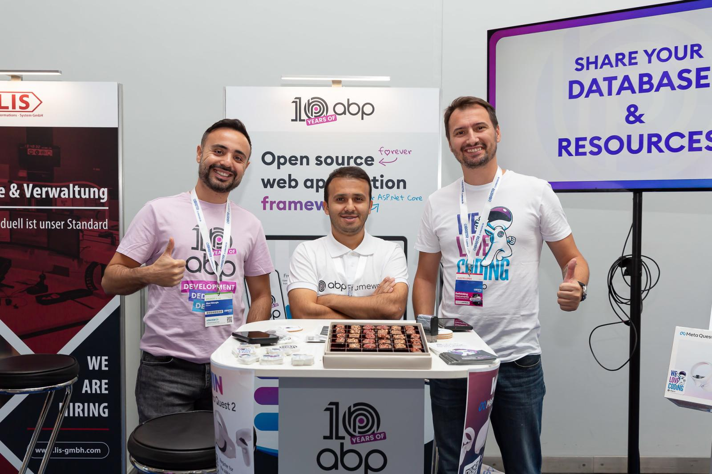

# ABP.IO Platform 7.4 Final Has Been Released!

[ABP Framework](https://abp.io/) and [ABP Commercial](https://commercial.abp.io/) 7.4 versions have been released today.

## What's New With Version 7.4?

All the new features were already explained in detail in the [7.4 RC Announcement Post](https://blog.abp.io/abp/ABP.IO-Platform-7-4-RC-Has-Been-Published), so no need to go over them again. Check it out for more details. 

## Getting Started with 7.4

### Creating New Solutions

You can create a new solution with the ABP Framework version 7.4 by either using the `abp new` command or generating the CLI command on the [get started page](https://abp.io/get-started).

> See the [getting started document](https://docs.abp.io/en/abp/latest/Getting-Started) for more.

### How to Upgrade an Existing Solution

#### Install/Update the ABP CLI

First of all, install the ABP CLI or upgrade it to the latest version.

If you haven't installed it yet:

```bash
dotnet tool install -g Volo.Abp.Cli
```

To update the existing CLI:

```bash
dotnet tool update -g Volo.Abp.Cli
```

#### Upgrading Existing Solutions with the ABP Update Command

[ABP CLI](https://docs.abp.io/en/abp/latest/CLI) provides a handy command to update all the ABP related NuGet and NPM packages in your solution with a single command:

```bash
abp update
```

Run this command in the root folder of your solution.

## Migration Guides

There are breaking changes in this version that may affect your application. 
Please see the following migration documents, if you are upgrading from v7.3:

* [ABP Framework 7.3 to 7.4 Migration Guide](https://docs.abp.io/en/abp/7.4/Migration-Guides/Abp-7_4)

## Community News

### ABP Community Talks 2023.7: Build Your Content Management System with .NET

We as the ABP team organized the [**ABP Community Talks 2023.7: Build Your Content Management System with .NET**](https://community.abp.io/events/build-your-own-cms-with-.net-a-first-look-at-abps-content-management-system-kit-3nfvm9ix) event to explore the depths of the CMS Kit Module and its real-world applications. The talk delved into the intricacies of the CMS Kit Module, providing valuable insights into its features and functionalities. Attendees had the opportunity to witness the module in action through live demonstrations and interactive Q&A sessions. 

For those who missed the live session, you can catch up on all the enriching discussions and demonstrations by watching the record below 👇:

<iframe width="560" height="315" src="https://www.youtube.com/embed/S9__Hnu29tI?si=vrLWLI3NQX2eaSMD" title="YouTube video player" frameborder="0" allow="accelerometer; autoplay; clipboard-write; encrypted-media; gyroscope; picture-in-picture; web-share" allowfullscreen></iframe> 

### BASTA! Mainz 2023



BASTA! Mainz 2023 has wrapped up, and what an extraordinary journey it has been! We have shared our impressions, highlights, and the incredible impact it had on the tech community in Germany and beyond in a blog post, which you can find at [https://blog.abp.io/abp/BASTA-Mainz-2023-What-a-Blast-in-Germany](https://blog.abp.io/abp/BASTA-Mainz-2023-What-a-Blast-in-Germany).

### New ABP Community Posts

There are exciting articles contributed by the ABP community as always. I will highlight some of them here:

* [Moving Background Job Execution To A Separate Application](https://community.abp.io/posts/moving-background-job-execution-to-a-separate-application-my9cgo9a) by [liangshiwei](https://github.com/RealLowis).
* [Cascading Option Loading with Extensions System in ABP Angular](https://community.abp.io/posts/cascading-option-loading-with-extensions-system-in-abp-angular-gcxgp0v9) by [Masum Ulu](https://twitter.com/masumulu).
* [How to use domain-based tenant resolver in ABP with Angular and OpenIddict](https://community.abp.io/posts/how-to-use-domainbased-tenant-resolver-in-abp-with-angular-and-openiddict-v9y8da7v) by [Mahmut Gündoğdu](https://twitter.com/MahmutGundogdu).

Thanks to the ABP Community for all the content they have published. You can also [post your ABP-related (text or video) content](https://community.abp.io/articles/submit) to the ABP Community.

## About the Next Version

The next feature version will be 8.0. You can follow the [release planning here](https://github.com/abpframework/abp/milestones). Please [submit an issue](https://github.com/abpframework/abp/issues/new) if you have any problems with this version.
