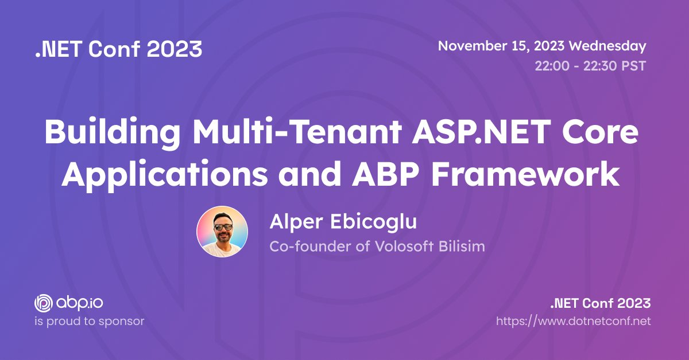
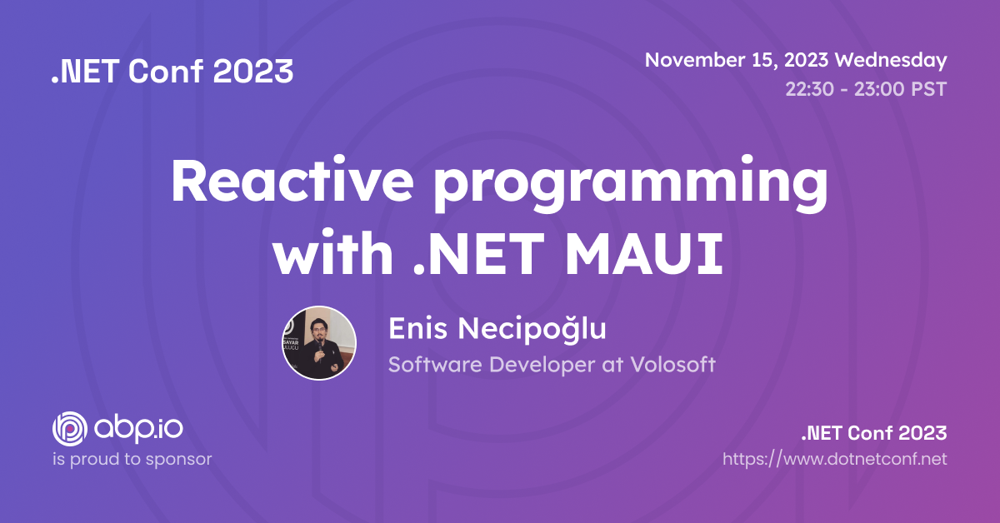

# ABP.IO Platform 8.0 RC Has Been Released

Today, we are happy to release the [ABP Framework](https://abp.io/) and [ABP Commercial](https://commercial.abp.io/) version **8.0 RC** (Release Candidate). This blog post introduces the new features and important changes in this new version.

Try this version and provide feedback for a more stable version of ABP v8.0! Thanks to all of you.

## Get Started with the 8.0 RC

Follow the steps below to try version 8.0.0 RC today:

1) **Upgrade** the ABP CLI to version `8.0.0-rc.1` using a command line terminal:

````bash
dotnet tool update Volo.Abp.Cli -g --version 8.0.0-rc.1
````

**or install** it if you haven't before:

````bash
dotnet tool install Volo.Abp.Cli -g --version 8.0.0-rc.1
````

2) Create a **new application** with the `--preview` option:

````bash
abp new BookStore --preview
````

See the [ABP CLI documentation](https://docs.abp.io/en/abp/latest/CLI) for all the available options.

> You can also use the [Get Started](https://abp.io/get-started) page to generate a CLI command to create a new application.

You can use any IDE that supports .NET 7.x, like [Visual Studio 2022](https://visualstudio.microsoft.com/downloads/).

## Migration Guides

There are a few breaking changes in this version that may affect your application.
Please see the following migration documents, if you are upgrading from v7.x or earlier:

* [ABP Framework 7.x to 8.0 Migration Guide](https://docs.abp.io/en/abp/8.0/Migration-Guides/Abp-8_0)
* [ABP Commercial 7.x to 8.0 Migration Guide](https://docs.abp.io/en/commercial/8.0/migration-guides/v8_0)

## What's New with ABP Framework 8.0?

//TODO: write the section!!!

## What's New with ABP Commercial 8.0?

//TODO: write the section!!!

## Community News

### Highlights from .NET 8.0

Our team has closely followed the ASP.NET Core and Entity Framework Core 8.0 releases, read Microsoft's guides and documentation, and adapted the changes to our ABP.IO Platform. We are proud to say that we've shipped the ABP 8.0 RC.1 based on .NET 8.0 just after Microsoft's .NET 8.0 release.

In addition to the ABP's .NET 8.0 upgrade, our team has created 13 great articles to highlight the important features coming with ASP.NET Core 8.0 and Entity Framework Core 8.0.

> You can read [this post](https://volosoft.com/blog/Highlights-for-ASP-NET-Entity-Framework-Core-NET-8-0) to see the list of all articles.

### New ABP Community Articles

In addition to [the 13 articles to highlight .NET 8.0 features written by our team](https://volosoft.com/blog/Highlights-for-ASP-NET-Entity-Framework-Core-NET-8-0), here are some of the recent posts added to the [ABP Community](https://community.abp.io/):

* [How to Upload and Download Files in the ABP Framework using Angular](https://community.abp.io/posts/how-to-upload-and-download-files-in-the-abp-framework-using-angular-que8cdr8) by [Mahmut Gündoğdu](https://github.com/mahmut-gundogdu)
* New **ABP Framework Essentials** Videos by [Hamza Albreem](https://github.com/braim23):
   *  [ABP Essentials - Interception](https://community.abp.io/videos/abp-essentials-interception-ath78xhw)
   * [ABP Essentials - Virtual File System](https://community.abp.io/videos/abp-essentials-virtual-file-system-hpgr2j72)
   * [ABP Framework Essentials - Localization](https://community.abp.io/videos/abp-framework-essentials-localization-7taieh68)
   * [ABP Framework Essentials - Dependency Injection](https://community.abp.io/videos/abp-framework-essentials-dependency-injection-q241mfrf)
   * See the playlist for other videos of this series: https://www.youtube.com/playlist?list=PLsNclT2aHJcNupH2wz83y7htugpLoUZ_B

Thanks to the ABP Community for all the content they have published. You can also [post your ABP related (text or video) content](https://community.abp.io/articles/submit) to the ABP Community.

### We were in the .NET Conf 2023

Microsoft has released .NET 8.0 and celebrated it with a 3-day international online conference. The core team members of ABP Framework, [Alper Ebiçoğlu](https://twitter.com/alperebicoglu) and [Enis Necipoğlu](https://twitter.com/EnisNecipoglu) gave speeches at the .NET Conf 2023.

[Alper Ebiçoğlu](https://twitter.com/alperebicoglu)'s topic was "Building Multi-Tenant ASP.NET Core Applications and ABP Framework" and in this talk, he talked about what's saas development, what are its pros and challenges and multi-tenant development with the open-source ABP Framework:



On the other hand, [Enis Necipoğlu](https://twitter.com/EnisNecipoglu)'s topic was "Reactive programming with .NET MAUI" and he talked about applying reactive programming in .NET MAUI with MVVM and ReactiveUI:



### ABP Community Talks 2023.8: What’s coming with .NET 8.0 & ABP v8.0


In this episode of ABP Community Talks, 2023.8; we'll talk about .NET 8.0 and ABP 8.0 with the ABP Core Team. We will dive into the features that came with .NET 8.0, how they are implemented in ABP 8.0, and the highlights in the .NET Conf 2023 with [Halil İbrahim Kalkan](https://github.com/hikalkan), [Alper Ebicoglu](https://github.com/ebicoglu), [Engincan Veske](https://github.com/EngincanV), [Berkan Sasmaz](https://github.com/berkansasmaz) and [Bige Besikci Yaman](https://github.com/bigebesikci).

## Conclusion

This version comes with some new features and a lot of enhancements to the existing features. You can see the [Road Map](https://docs.abp.io/en/abp/8.0/Road-Map) documentation to learn about the release schedule and planned features for the next releases. Please try ABP v8.0 RC and provide feedback to help us release a more stable version.

Thanks for being a part of this community!