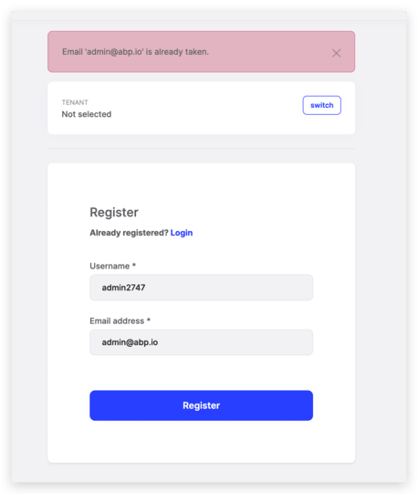
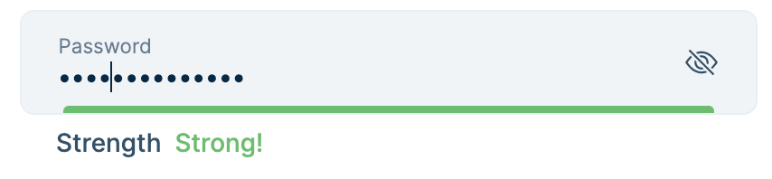
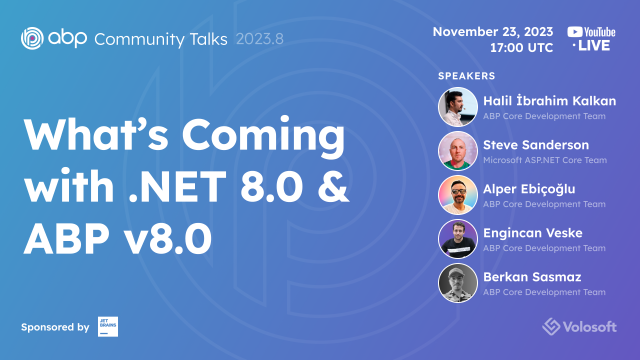

# ABP.IO Platform 8.0 RC Has Been Released

Today, we are happy to release the [ABP Framework](https://abp.io/) and [ABP Commercial](https://commercial.abp.io/) version **8.0 RC** (Release Candidate). This blog post introduces the new features and important changes in this new version.

Try this version and provide feedback for a more stable version of ABP v8.0! Thanks to all of you.

## Get Started with the 8.0 RC

Follow the steps below to try version 8.0.0 RC today:

1) **Upgrade** the ABP CLI to version `8.0.0-rc.1` using a command line terminal:

````bash
dotnet tool update Volo.Abp.Cli -g --version 8.0.0-rc.1
````

**or install** it if you haven't before:

````bash
dotnet tool install Volo.Abp.Cli -g --version 8.0.0-rc.1
````

2) Create a **new application** with the `--preview` option:

````bash
abp new BookStore --preview
````

See the [ABP CLI documentation](https://docs.abp.io/en/abp/latest/CLI) for all the available options.

> You can also use the [Get Started](https://abp.io/get-started) page to generate a CLI command to create a new application.

You can use any IDE that supports .NET 8.x, like [Visual Studio 2022](https://visualstudio.microsoft.com/downloads/).

## Migration Guides

There are a few breaking changes in this version that may affect your application.
Please see the following migration documents, if you are upgrading from v7.x or earlier:

* [ABP Framework 7.x to 8.0 Migration Guide](https://docs.abp.io/en/abp/8.0/Migration-Guides/Abp-8_0)
* [ABP Commercial 7.x to 8.0 Migration Guide](https://docs.abp.io/en/commercial/8.0/migration-guides/v8_0)

## What's New with ABP Framework 8.0?

In this section, I will introduce some major features released in this version.
Here is a brief list of titles explained in the next sections:

* Upgraded to .NET 8.0
* Upgraded to Angular 17
* Dynamic Claims
* CDN Support for Bundling & Minification System
* Read-Only Repositories
* Account Module: Set Username After Social/External Login
* Other News...

### Upgraded to .NET 8.0

We've upgraded the ABP Framework to .NET 8.0, so you need to move your solutions to .NET 8.0 if you want to use ABP 8.0. You can check [Microsoft’s Migrate from ASP.NET Core 7.0 to 8.0 documentation](https://learn.microsoft.com/en-us/aspnet/core/migration/70-80), to see how to update an existing ASP.NET Core 7.0 project to ASP.NET Core 8.0.

### Upgraded to Angular 17

Angular 17 [was released on November 8](https://blog.angular.io/introducing-angular-v17-4d7033312e4b) and ABP Framework & ABP Commercial startup templates were immediately migrated to **Angular 17**! 

So, when you create a new solution with the Angular UI, you will take advantage of the new Angular with the new cutting-edge features and enhancements right from the start!

### Dynamic Claims

The **Dynamic Claims** feature is used to dynamically generate claims for the user in each request. It's used to automatically and dynamically override the configured claim values in the client's authentication token/cookie by the latest user claims.

In the prior versions, whenever a user changed their email address or confirmed their own email address, or any other information related to the user (and if it's in the claims), he/she would need to logout and then login to refresh its claims. The new **Dynamic Claims** feature overcomes this problem and allows to **always get the latest user claims**.

This feature is disabled by default and you can enable it easily for your existing MVC applications by following the [Dynamic Claims documentation](https://docs.abp.io/en/abp/8.0/Dynamic-Claims). For the other UI options (Angular & Blazor UIs), you don't need to enable this feature, since they obtain claims ftom a configuration endpoint.

> **Note**: Beginning from the v8.0, all the startup templates are pre-configured and the **Dynamic Claims** feature is enabled by default.

### CDN Support for Bundling & Minification System

In this version, ABP Framework's [Bundling & Minification System](https://docs.abp.io/en/abp/latest/UI/AspNetCore/Bundling-Minification) provides CDN support for MVC / Razor Pages UI. The bundling system automatically recognizes the external/CDN files and places them as link/script tags on the page along with the bundled CSS/JSS files.

> Read the documentation for more info: https://docs.abp.io/en/abp/8.0/UI/AspNetCore/Bundling-Minification

### Read-Only Repositories

ABP Framework provides read-only repository interfaces (`IReadOnlyRepository<>` or `IReadOnlyBasicRepository<>`) to explicitly indicate that your purpose is to query data, but not change it. It uses [EF Core's No-Tracking Feature](https://learn.microsoft.com/en-us/ef/core/querying/tracking#no-tracking-queries) behind the scenes, which means the entities returned from the repository will not be tracked by the EF Core's [change tracker](https://learn.microsoft.com/en-us/ef/core/change-tracking/) and thanks to that you get significant performance gains.

```csharp
public class MyService
{
   private readonly IReadOnlyRepository<Book, Guid> _bookRepository;

   public async Task MyMethod()
   {
      var books = await _bookRepository.GetListAsync(); //change tracking not involved

      //...
   }
}
```

> In addition to the read-only repository interfaces, ABP Framework introduces the `IRepository.DisableTracking()` and `IRepository.EnableTracking()` extension methods to allow developers to disable/enable entity tracking by these methods manually. If you don't want to use the read-only repositories, you can use these methods to enable or disable the change tracker controlled. Read the documentation to learn more: [https://docs.abp.io/en/abp/8.0/Repositories#enabling-disabling-the-change-tracking](https://docs.abp.io/en/abp/8.0/Repositories#enabling-disabling-the-change-tracking)

### Account Module: Set Username After Social/External Login

Prior to this version, when you registered with your social accounts for the first time, your email address was becoming your username and it was shown everywhere in the application. Therefore, you would need to update your username later on and this is not a good user experience.

Thus, in this version, we have enhanced this flow, and now, when you register as an external user for the first time, a username and email address are shown you in a form for you to revise and update if you want, before logging into the application. Thanks to that, after the social registration you would not need to update your username and email address. This is also good at the point of GDPR regulations because your email address will not be shown as a username and will not exposed.



### Other News

* LDAP over SSL (LDAPS) setting has been added and recommended to establish a secure connection. See [#17865](https://github.com/abpframework/abp/pull/17865) for more information.
* Object Mapping Enhancements (supports mapping collection of objects for custom object mappers). 
* Email Sending Improvements (sending attachments with `IEmailSender.QueueAsync()` method).

## What's New with ABP Commercial 8.0?

We've also worked on ABP Commercial to align the features and changes made in the ABP Framework. The following sections introduce a few new features coming with ABP Commercial 8.0.

### Suite: Generating Master/Detail Relationship

In this version, we have introduced the **Master/Detail Relationship** support in Suite. The Master-Detail (or Master-Child) relationship refers to a hierarchical connection between two entities, where one entity (the master or parent entity) influences or controls the behavior or properties of another element (the child entity) relationship. The relationship between **Order - Order Lines**  can be considered as an example of a master-detail relationship.


ABP Suite allows you to create a master-detail relationship with a few clicks. It generates the necessary code for the master and detail tables, including the foreign key relationship between the two tables.

To establish a master-detail relationship, you need to apply the following two steps:

1-) Create the master entity,
2-) Create a child entity and associate it with a master entity.

That's it! ABP Suite will be generating the entities, making the related configurations, establishing database relations (including the foreign key relationship), generating the UI for the master entity (with child-grids for child entities), and so on...

It’s already documented and you can read the documentation at [https://docs.abp.io/en/commercial/8.0/abp-suite/creating-master-detail-relationship](https://docs.abp.io/en/commercial/8.0/abp-suite/creating-master-detail-relationship).

#### Known Issues

* After you generate CRUD pages via Suite for the Angular UI, you should start the backend project and run the `abp generate-proxy -t ng` command in the root directory of the Angular application manually. It will be automatically done with the next version, so you will not need to run the command manually in further versions.

### Get Profile Picture From Social/External Logins

A user's profile picture would be blank when they first register for an application using a social account through an external authentication provider like Google or Facebook because it hasn't been configured yet. The user must update their profile photo after logging into the application.


In order to save the user from having to change their profile picture after logging in for the first time, we have improved this behavior in this version and are now attempting to retrieve the user's profile picture from external authentication providers (like Google) and set it as their profile picture. Later on, if desired, he or she might modify the profile image.

### Switch Ocelot to YARP for the API Gateway

Until this version, ABP Commercial was using the [Ocelot](https://github.com/ThreeMammals/Ocelot) for the API Gateway, in the [Microservice Startup Template](https://docs.abp.io/en/commercial/latest/startup-templates/microservice/index). Since the **Ocelot** library is not actively maintained, we have searched for an alternative and decided to switch from Ocelot to [YARP](https://github.com/microsoft/reverse-proxy) for the API Gateway. YARP is maintained by Microsoft and is actively being developed and seems a better alternative than Ocelot and provides the same feature stack and even more.

You can read the [Migrating to YARP](https://docs.abp.io/en/commercial/8.0/migration-guides/migrating-to-yarp) documentation for migrating your existing microservice application's API Gateway from [Ocelot](https://github.com/ThreeMammals/Ocelot) to [YARP](https://github.com/microsoft/reverse-proxy).

> We have made the all related changes in the Microservice Startup Template, and also updated the documentation, which you can read [here](https://docs.abp.io/en/commercial/8.0/startup-templates/microservice/gateways).

### Password Complexity Indicators (MVC & Blazor UIs)

In v7.4, we have introduced the [Password Complexity Indicators for Angular UI](https://docs.abp.io/en/commercial/7.4/ui/angular/password-complexity-indicator-component) and with this version, we have implemented it for the MVC & Blazor UIs as well. You can use this feature to dynamically evaluate and rate the strength of user-generated passwords, providing real-time feedback to users as they create or update their passwords.



### Read-Only View for Users Page

In your application, you may want to grant permission to a specific group or people to read-only view the users of your application to be able to do some actions. For example, you may want to marketing team to see the users to organize campaigns for the customers, or make controls. In this case, you can grant default permissions for these groups, however, they could not see the details of a user, because in the current design, if the edit permission is not granted you can't see the detailed info for a user.


In this version, we have added the read-only view action to the user's page. This allows you to only grant the default view permission to the specific users and allow them to view user information as read-only and not allow them to change or modify it.

### Export & Import Users as Excel / CSV

With v8.0, now it's possible to import and export user records in Excel and CSV formats. You can import external users, or import users from Excel or CSV files and also you can export users to Excel or CSV files:


## Community News

### Highlights from .NET 8.0

Our team has closely followed the ASP.NET Core and Entity Framework Core 8.0 releases, read Microsoft's guides and documentation, and adapted the changes to our ABP.IO Platform. We are proud to say that we've shipped the ABP 8.0 RC.1 based on .NET 8.0 just after Microsoft's .NET 8.0 release.

In addition to the ABP's .NET 8.0 upgrade, our team has created 13 great articles to highlight the important features coming with ASP.NET Core 8.0 and Entity Framework Core 8.0.

> You can read [this post](https://volosoft.com/blog/Highlights-for-ASP-NET-Entity-Framework-Core-NET-8-0) to see the list of all articles.

### New ABP Community Articles

In addition to [the 13 articles to highlight .NET 8.0 features written by our team](https://volosoft.com/blog/Highlights-for-ASP-NET-Entity-Framework-Core-NET-8-0), here are some of the recent posts added to the [ABP Community](https://community.abp.io/):

* [Upgrade Your Existing Projects to .NET 8 & ABP 8.0](https://community.abp.io/posts/upgrade-your-existing-projects-to-.net-8-abp-8.0-x0n7hiqr) by [Engincan Veske](https://github.com/EngincanV)
* [How to Upload and Download Files in the ABP Framework using Angular](https://community.abp.io/posts/how-to-upload-and-download-files-in-the-abp-framework-using-angular-que8cdr8) by [Mahmut Gündoğdu](https://github.com/mahmut-gundogdu)
* New **ABP Framework Essentials** Videos by [Hamza Albreem](https://github.com/braim23):
   *  [ABP Essentials - Interception](https://community.abp.io/videos/abp-essentials-interception-ath78xhw)
   * [ABP Essentials - Virtual File System](https://community.abp.io/videos/abp-essentials-virtual-file-system-hpgr2j72)
   * [ABP Framework Essentials - Localization](https://community.abp.io/videos/abp-framework-essentials-localization-7taieh68)
   * [ABP Framework Essentials - Dependency Injection](https://community.abp.io/videos/abp-framework-essentials-dependency-injection-q241mfrf)
   * See the playlist for other videos of this series: https://www.youtube.com/playlist?list=PLsNclT2aHJcNupH2wz83y7htugpLoUZ_B

Thanks to the ABP Community for all the content they have published. You can also [post your ABP related (text or video) content](https://community.abp.io/articles/submit) to the ABP Community.

### We were in the .NET Conf 2023

Microsoft has released .NET 8.0 and celebrated it with a 3-day international online conference. The core team members of ABP Framework, [Alper Ebiçoğlu](https://twitter.com/alperebicoglu) and [Enis Necipoğlu](https://twitter.com/EnisNecipoglu) gave speeches at the .NET Conf 2023.

[Alper Ebiçoğlu](https://twitter.com/alperebicoglu)'s topic was "Building Multi-Tenant ASP.NET Core Applications and ABP Framework" and in this talk, he talked about what's SaaS development, what are its pros and challenges and multi-tenant development with the open-source ABP Framework:

<iframe width="560" height="315" src="https://www.youtube.com/embed/3uWeyEbV4c4?si=XuU8-QJs2w5j6Inp" title="YouTube video player" frameborder="0" allow="accelerometer; autoplay; clipboard-write; encrypted-media; gyroscope; picture-in-picture; web-share" allowfullscreen></iframe>

On the other hand, [Enis Necipoğlu](https://twitter.com/EnisNecipoglu)'s topic was "Reactive programming with .NET MAUI" and he talked about applying reactive programming in .NET MAUI with MVVM and ReactiveUI:

<iframe width="560" height="315" src="https://www.youtube.com/embed/i0EFuRF2u-w?si=wPTSDxtbfkzMF5CN" title="YouTube video player" frameborder="0" allow="accelerometer; autoplay; clipboard-write; encrypted-media; gyroscope; picture-in-picture; web-share" allowfullscreen></iframe>

### ABP Community Talks 2023.8: What’s coming with .NET 8.0 & ABP v8.0



In this episode of ABP Community Talks, 2023.8; [Steve Sanderson](https://twitter.com/stevensanderson) will be our guest speaker and we'll talk about .NET 8.0 and ABP 8.0 with the ABP Core Team. We will dive into the features that came with .NET 8.0, how they are implemented in ABP 8.0, and the highlights in the .NET Conf 2023 with [Halil İbrahim Kalkan](https://github.com/hikalkan), [Alper Ebicoglu](https://github.com/ebicoglu), [Engincan Veske](https://github.com/EngincanV), [Berkan Sasmaz](https://github.com/berkansasmaz) and [Bige Besikci Yaman](https://github.com/bigebesikci).

## Conclusion

This version comes with some new features and a lot of enhancements to the existing features. You can see the [Road Map](https://docs.abp.io/en/abp/8.0/Road-Map) documentation to learn about the release schedule and planned features for the next releases. Please try ABP v8.0 RC and provide feedback to help us release a more stable version.

Thanks for being a part of this community!
