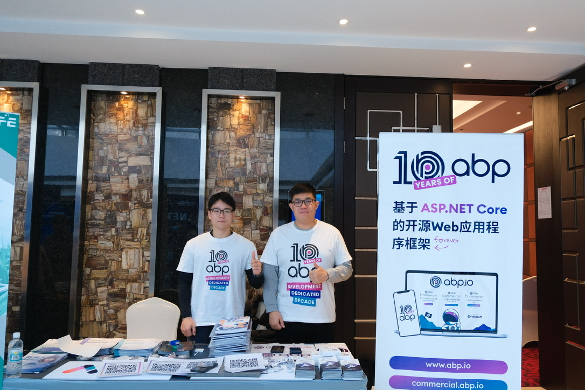
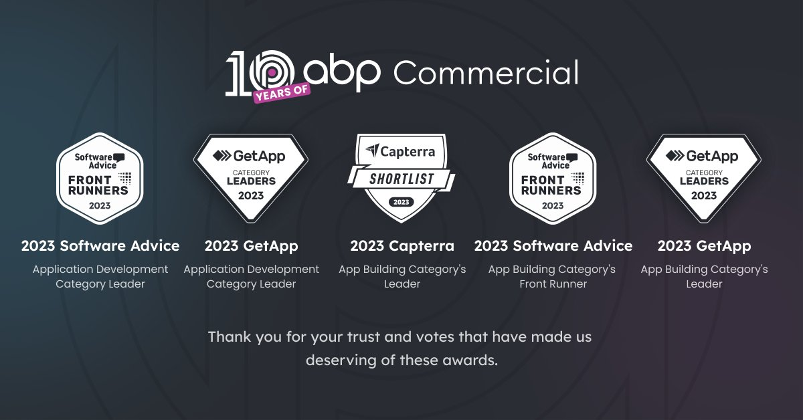

# ABP.IO Platform 8.0 Has Been Released Based on .NET 8.0

Today, [ABP Framework](https://abp.io/) and [ABP Commercial](https://commercial.abp.io/) 8.0 versions have been released based on [.NET 8.0](https://dotnet.microsoft.com/en-us/download/dotnet/8.0).

## What's New With Version 8.0?

All the new features were explained in detail in the [8.0 RC Announcement Post](https://blog.abp.io/abp/announcing-abp-8-0-release-candidate), so there is no need to review them again. You can check it out for more details. 

## Getting Started with 8.0

### Creating New Solutions

You can create a new solution with the ABP Framework version 8.0 by either using the `abp new` command or generating the CLI command on the [get started page](https://abp.io/get-started).

> See the [getting started document](https://docs.abp.io/en/abp/latest/Getting-Started) for more.

### How to Upgrade an Existing Solution

#### Install/Update the ABP CLI

First, install the ABP CLI or upgrade it to the latest version.

If you haven't installed it yet:

```bash
dotnet tool install -g Volo.Abp.Cli
```

To update the existing CLI:

```bash
dotnet tool update -g Volo.Abp.Cli
```

#### Upgrading Existing Solutions with the ABP Update Command

[ABP CLI](https://docs.abp.io/en/abp/latest/CLI) provides a handy command to update all the ABP related NuGet and NPM packages in your solution with a single command:

```bash
abp update
```

Run this command in the root folder of your solution.

## Migration Guides

There are breaking changes in this version that may affect your application. 
Please see the following migration documents if you are upgrading from v7.x or earlier:

* [ABP Framework 7.x to 8.0 Migration Guide](https://docs.abp.io/en/abp/8.0/Migration-Guides/Abp-8_0)
* [ABP Commercial 7.x to 8.0 Migration Guide](https://docs.abp.io/en/commercial/8.0/migration-guides/v8_0)

## Community News

### We were at China .NET Conf 2023

China's most influential .NET event officially kicked off on December 16, 2023. The conference has invited 30+ technical experts from various fields to share the new features of .NET 8, full-stack Blazor, AI, .NET MAUI, and more...



As one of the community partners of .NET Conf China 2023, our ABP.IO China team was at the event. At the event, we showed developers the latest news and related updates on ABP.IO. 

Through this event, we gained a lot and felt the enthusiasm and support of the developers community for ABP.IO. If you want to learn more, we have shared our impressions and takeaways in a blog post, which you can find at [https://blog.abp.io/abp/ABP-at-China-NET-Conf-2023](https://blog.abp.io/abp/ABP-at-China-NET-Conf-2023).

### ABP Commercial Won 5 Recognitions from Gartner



2023 was the year for ABP.IO to strive with the community. On top of last year's [Software Advice's Front Runner of Application Development in 2022](https://blog.abp.io/abp/abpcommercial-2022-front-runner-in-app-development-category) and [GetApp's Application Development Category Leader in 2022](https://blog.abp.io/abp/abpcommercial-2022-category-leader-in-app-development-category), we won **5 awards** this year from **Gartner**!

> If you are interested in these awards and want to learn more, you can check out our [blog post](https://blog.abp.io/abp/ABP-Commercial-Won-5-Recognitions-from-Gartner-in-2023)!

### New ABP Community Posts

There are exciting articles contributed by the ABP community, as always. I will highlight some of them here:

* [Performance Optimization of .NET-based application](https://community.abp.io/posts/performance-optimization-of-.netbased-and-also-abpbased-application-pmdwhwxc) by [Leon Košak](https://github.com/leonkosak)
* [Video: ABP Framework Consuming HTTP APIs from a .NET Client](https://community.abp.io/videos/abp-framework-consuming-http-apis-from-a-.net-client-uzul9og4) by [Hamza Albreem](https://github.com/braim23)

Thanks to the ABP Community for all the content they have published. You can also [post your ABP-related (text or video) content](https://community.abp.io/articles/submit) to the ABP Community.

## About the Next Version

The next feature version will be 8.1. You can follow the [release planning here](https://github.com/abpframework/abp/milestones). Please [submit an issue](https://github.com/abpframework/abp/issues/new) if you have any problems with this version.
