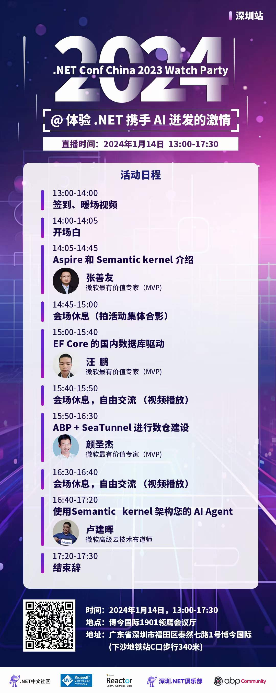
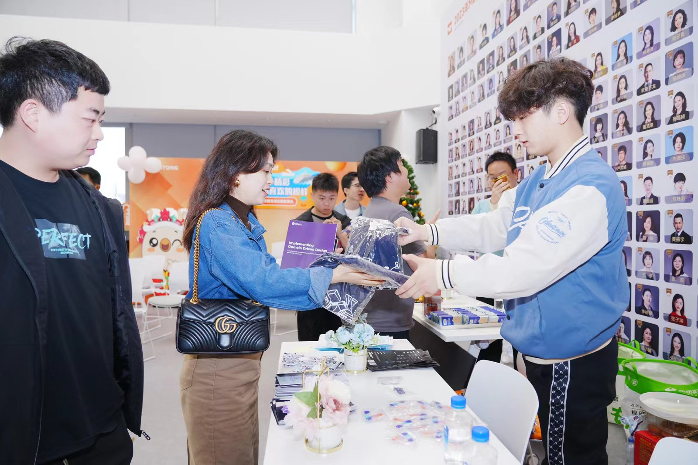
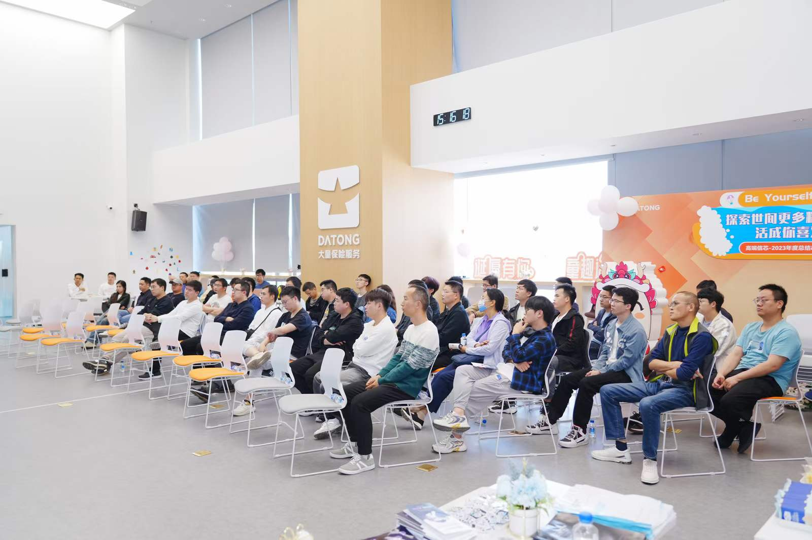
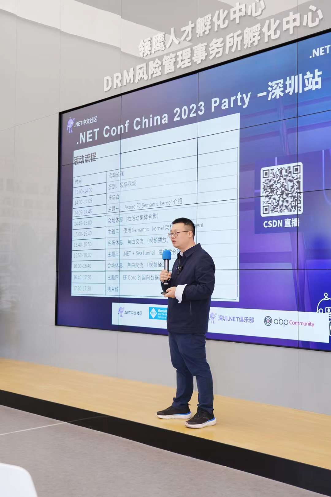
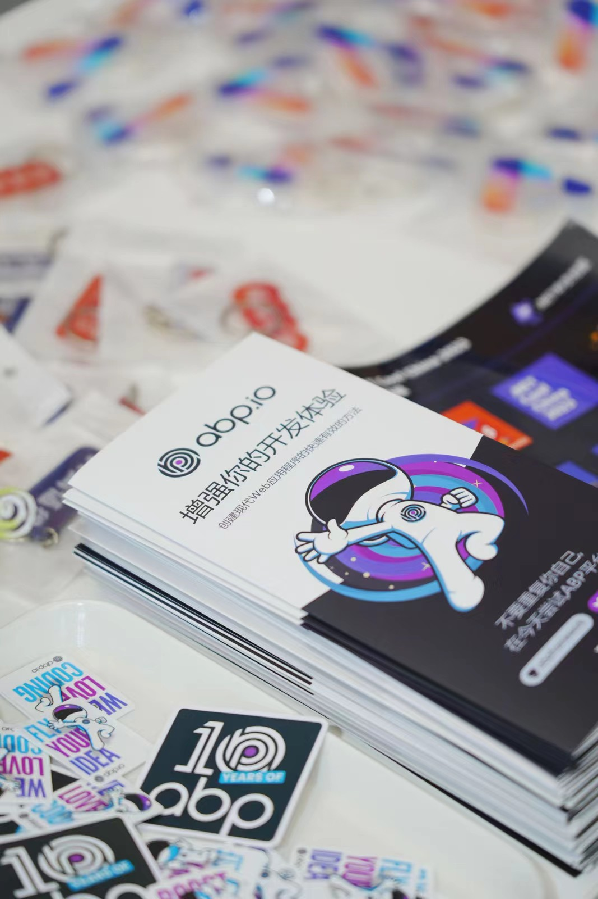
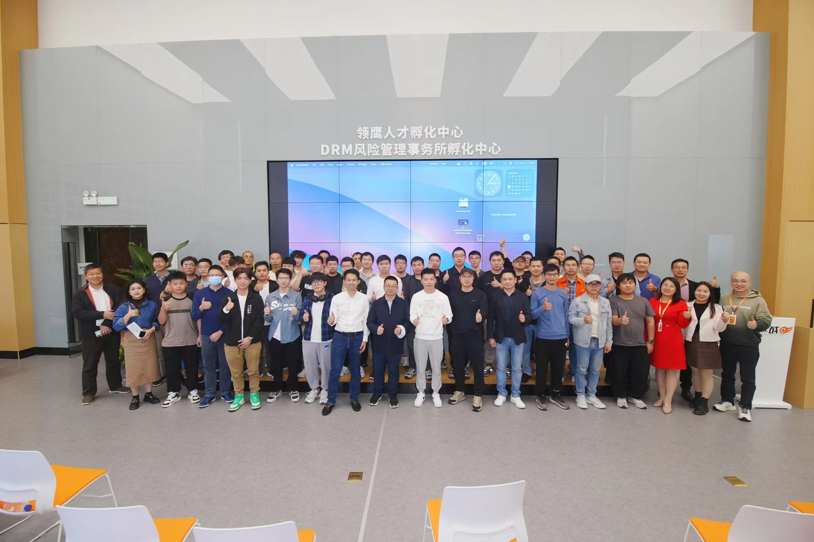

# 2024 First Community Event.

The first .NET community event in 2024 was successfully held in Shenzhen on January 14, 2024.

This event is co-organized by **Microsoft MVP China Team**, **Microsoft Reactor**, **China .NET Community** and **Shenzhen .NET Club**.

**ABP.IO** continues to strongly support the community, and we have prepared exquisite gifts for participants.

The event includes four wonderful technical lectures to reveal big data and AI's potential opportunities and innovations. It is a transfer of knowledge and a platform for communication and cooperation among technology enthusiasts.

**See you at the next community event!**
