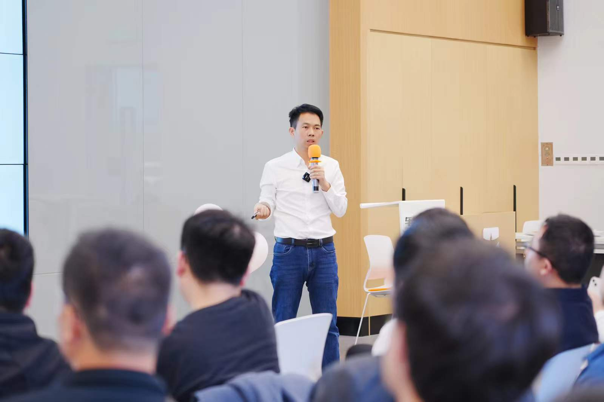
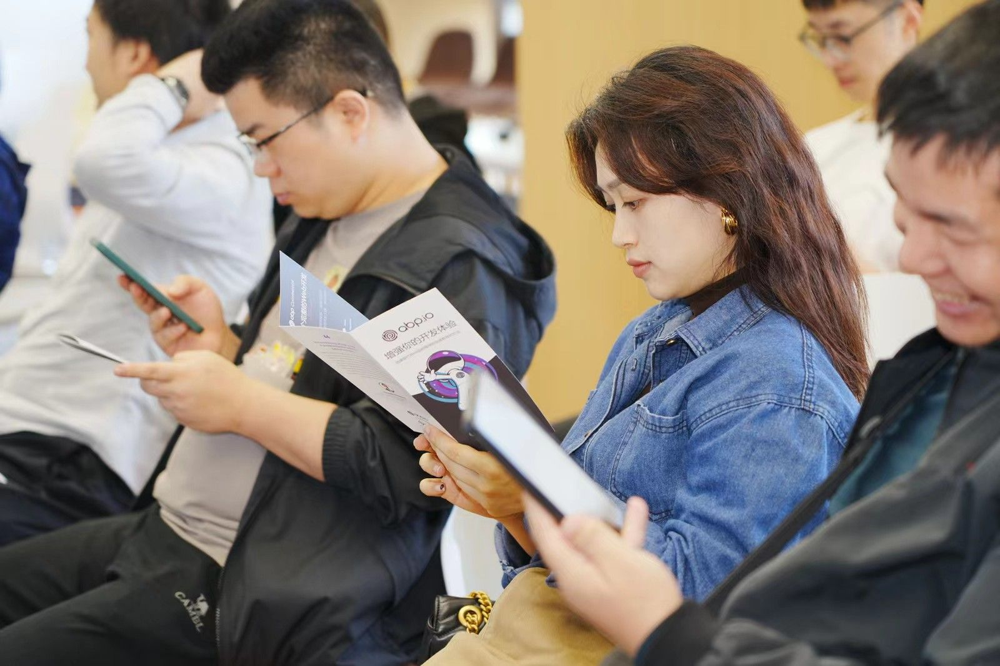
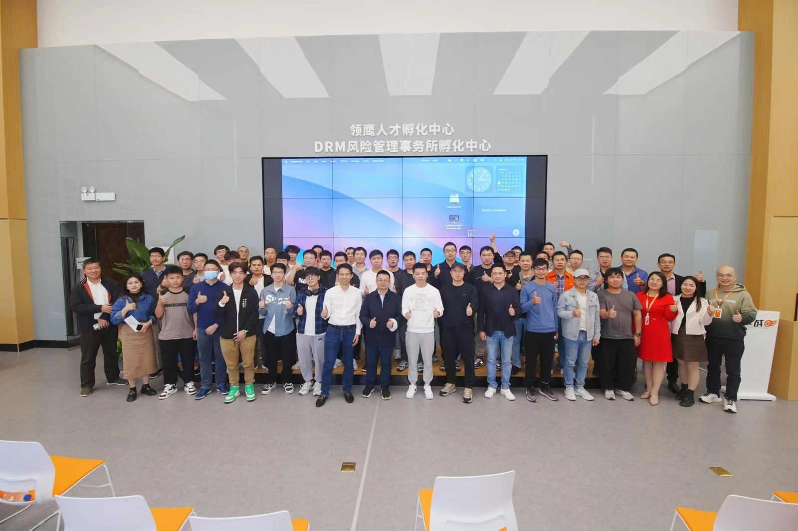

# 2024 First Community Event.

The first .NET community event in 2024 was successfully held in Shenzhen on January 14, 2024.

This event is co-organized by **Microsoft MVP China Team**, **Microsoft Reactor**, **China .NET Community** and **Shenzhen .NET Club**.

**ABP.IO** continues to be a strong supporter of the community, and we have prepared exquisite gifts for participants.

The event includes four wonderful technical lectures to reveal the potential opportunities and innovations of big data and AI. It is not only a transfer of knowledge, but also a platform for communication and cooperation among technology enthusiasts.

**See you next community event!**