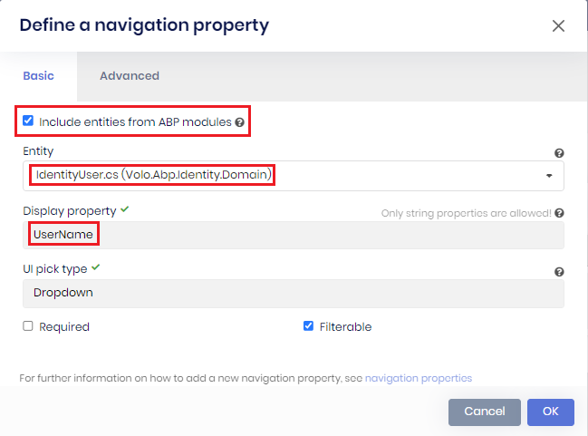
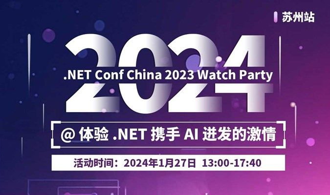

# ABP.IO Platform 8.1 RC Has Been Released

Today, we are happy to release the [ABP Framework](https://abp.io/) and [ABP Commercial](https://commercial.abp.io/) version **8.1 RC** (Release Candidate). This blog post introduces the new features and important changes in this new version.

Try this version and provide feedback for a more stable version of ABP v8.1! Thanks to all of you.

## Get Started with the 8.1 RC

Follow the steps below to try version 8.1.0 RC today:

1) **Upgrade** the ABP CLI to version `8.1.0-rc.1` using a command line terminal:

````bash
dotnet tool update Volo.Abp.Cli -g --version 8.1.0-rc.1
````

**or install** it if you haven't before:

````bash
dotnet tool install Volo.Abp.Cli -g --version 8.1.0-rc.1
````

2) Create a **new application** with the `--preview` option:

````bash
abp new BookStore --preview
````

See the [ABP CLI documentation](https://docs.abp.io/en/abp/latest/CLI) for all the available options.

> You can also use the [Get Started](https://abp.io/get-started) page to generate a CLI command to create a new application.

You can use any IDE that supports .NET 8.x, like [Visual Studio 2022](https://visualstudio.microsoft.com/downloads/).

## Migration Guides

There are a few breaking changes in this version that may affect your application.
Please see the following migration documents, if you are upgrading from v8.x or earlier:

* [ABP Framework 8.0 to 8.1 Migration Guide](https://docs.abp.io/en/abp/8.1/Migration-Guides/Abp-8_1)
* [ABP Commercial 8.0 to 8.1 Migration Guide](https://docs.abp.io/en/commercial/8.1/migration-guides/v8_1)

## What's New with ABP Framework 8.1?

In this section, I will introduce some major features released in this version.
Here is a brief list of titles explained in the next sections:

* Introducing the `ExposeKeyedServiceAttribute`
* Custom Menu Component Support for MVC UI
* Introducing the `DisableAbpFeaturesAttribute`

### Introducing the `ExposeKeyedServiceAttribute`

[Keyed dependency injection (DI) services](https://learn.microsoft.com/en-us/aspnet/core/fundamentals/dependency-injection?view=aspnetcore-8.0#keyed-services) were added to the built-in DI container as a new feature with .NET 8.0. This is an important feature, which allows for registering and retrieving DI services using keys/names.

In this version, we have introduced the `ExposeKeyedServiceAttribute` to allow you to automatically register keyed services by conventions:

```csharp
[ExposeKeyedService<ITaxCalculator>("taxCalculator")]
[ExposeKeyedService<ICalculator>("calculator")]
public class TaxCalculator: ICalculator, ITaxCalculator, ICanCalculate, ITransientDependency
{
}
```

In the example above, the `TaxCalculator` class exposes the `ITaxCalculator` interface with the key `taxCalculator` and the `ICalculator` interface with the key `calculator`. 

Thanks to that, then you can use the [`FromKeyedServicesAttribute`](https://learn.microsoft.com/en-us/dotnet/api/microsoft.extensions.dependencyinjection.fromkeyedservicesattribute?view=dotnet-plat-ext-8.0) to resolve a certain keyed service in the constructor:

```csharp
public class MyClass
{
    //...
    public MyClass([FromKeyedServices("taxCalculator")] ITaxCalculator taxCalculator)
    {
        TaxCalculator = taxCalculator;
    }
}
```

> Notice that the `ExposeKeyedServiceAttribute` only exposes the keyed services. So, you can not inject the `ITaxCalculator` or `ICalculator` interfaces in your application without using the `FromKeyedServicesAttribute` as shown in the example above.

> If you want to learn more about the keyed dependency injection services, please refer to [Microsoft's documentation](https://learn.microsoft.com/en-us/aspnet/core/fundamentals/dependency-injection?view=aspnetcore-8.0#keyed-services) and [ABP Framework's Dependency Injection document](https://docs.abp.io/en/abp/8.1/Dependency-Injection#exposekeyedservice-attribute).

### Custom Menu Component Support for MVC UI

In this version, we have introduced the **custom menu component support**, which allows you to use a custom component for a certain menu item.

You can use the `UseComponent` extension method while defining menu items to use your custom component for the related menu item:

```csharp
context.Menu.Items.Add(
  new ApplicationMenuItem("Custom.1", "My Custom Menu", "#")
    .UseComponent(typeof(MyMenuComponent)));
```

Then, for the related menu item, your custom component will be rendered on the UI.

### Introducing the `DisableAbpFeaturesAttribute`

In this version, we have introduced the `DisableAbpFeaturesAttribute` to allow you to disable interceptors, middlewares, and MVC filters for a specific controller.

For example, you may want to disable interceptors for a certain controller, but you may also don't want to disable middlewares and mvc filters, in that case, you can use the `DisableAbpFeaturesAttribute` as follows:

```csharp
[Route("api/my-endpoint")]
[DisableAbpFeatures(DisableInterceptors = true, DisableMiddleware = false, DisableMvcFilters = false)]
public class MyController : AbpController
{

}
```

This can be useful if you have some APIs that are used frequently but you don't need all the features of ABP Framework.

> **Note:** If you want to disable all interceptors, middlewares, and filters for a certain controller, then you can use the `[DisableAbpFeatures]` without the need to specify the parameters, they are disabled by default.

## What's New with ABP Commercial 8.1?

We've also worked on ABP Commercial to align the features and changes made in the ABP Framework. The following sections introduce a few new features coming with ABP Commercial 8.1.

### Suite: New Features

In this version, we mostly worked on ABP Suite and implemented some wanted features, such as *bulk delete*, *filterable properties*, *customizable page title*, *allowing establishing relationships with installed ABP modules' entities* and *supporting the `BasicAggregateRoot` as the base class*.

#### Bulk Delete

From this version on, ABP Suite allows you to perform bulk deletion of records based on specified criteria.


To enable *bulk delete support*, you should enable the *Bulk delete* option in the CRUD page generation page, along with the *Create user interface* option (they are enabled by default). When you enable the *bulk delete support*, you will see the checkboxes for each line in the datatable:


By selecting these checkboxes, you can delete all records in the current datatable (10 records by default), or delete all records in the database (by selecting *select all xx items* selection), or delete any records you want by selecting them one by one.

> **Note:** This feature has already been implemented for MVC & Blazor UIs, but not implemented for Angular UI yet. We aim to implement it for Angular UI with *v8.1.0-rc.2*.

#### Filterable Properties

ABP Suite has been generating advanced filters for entities for a while and before this version, if you enabled the *create user interface* option, then all of the properties that you specified were included in the advanced filter section automatically.

In this version, we have introduced the **filterable properties** feature to allow you to select which properties should be filterable and which are not:


Now, you have full control to select which properties should be included as filter inputs and shown on the advanced filters section on your generated pages. 

In other words, once, you select a property as *not filterable*, then the property will not be included in the filter inputs and in the advanced filter section. Also, if there are not any filterable properties for an entity, then the advanced filters section will not be generated.

#### Customizable Page Title

In this version on, ABP Suite allows you to specify the page title for the current entity. 


You just need to specify the *page title* on the CRUD page generation page for a specific entity and then it will be used as a localization key in the application (and also will be localized - for example, if you specify it as 'MyPageTitle', then it will be localized in English as 'My Page Title'), so you can localize it for different languages later on.

#### Allowing Establishing Relationships with Installed ABP Modules' Entities

In this version, ABP Suite allows you to establish one-to-many relationship with pre-installed ABP Modules. You can add any entity from pre-installed ABP modules as a navigation property, by checking the **Include entities from ABP modules** checkbox in the navigation property model and choosing the related module entity as in the following figure:



In the example above, the `IdentityUser` entity is selected as the navigation property but you can also choose any entity from the installed ABP modules in the navigation property model.

> **Note:** Ensure that your solution is built properly before establishing relationship between your own entity and a module entity because ABP Suite scans assemblies and finds which ABP modules you are using and lists their entities in the navigation property model if you have checked the **Include entities from ABP modules** checkbox.

#### Support `BasicAggregateRoot` Base Class

In this version on, ABP Suite allows you to choose the `BasicAggregateRoot` as the base class while generating an entity:


> You can choose the [BasicAggregateRoot](https://github.com/abpframework/abp/blob/dev/framework/src/Volo.Abp.Ddd.Domain/Volo/Abp/Domain/Entities/BasicAggregateRoot.cs) if you want to create an aggregate root without the `IHasExtraProperties` and `IHasConcurrencyStamp` interfaces implemented (extra properties & concurrency check).

### ABP Studio v0.6.5 Has Been Released!

We have just released v0.6.5 for ABP Studio and with this version, we fixed many minor bugs reported by you, started supporting running multiple ABP Studio instances, and added important features, such as adding a public website to the new microservice template, and so on...

In addition to all of this, we continue to enrich ABP Studio's documentation as always and you can read them at [https://docs.abp.io/en/commercial/latest/studio/overview](https://docs.abp.io/en/commercial/latest/studio/overview).

Please try ABP Studio v0.6.5 and [provide feedback](https://support.abp.io/QA/Questions/6416/ABP-Studio-Bugs--Issues) to help us release more stable versions. Thanks in advance!

## Community News

### .NET Conf China 2023 Watch Party 



ABP.IO was thrilled to sponsor the first .NET Community event in 2024 held in Shenzen on January 14, 2024.

The event included four wonderful technical lectures to reveal big data and AI's potential opportunities and innovations. It was a transfer of knowledge and a platform for communication and cooperation among technology enthusiasts and we are happy to be attended.

> If you want to learn more about the .NET Conf China 2023 Watch Party event, please check [the blog post](https://blog.abp.io/abp/2024-First-Community-Event).

### Volosoft Attended NDC London 2024


Core team members of the ABP Framework, [Halil Ibrahim Kalkan](https://twitter.com/hibrahimkalkan), [Alper Ebicoglu](https://twitter.com/alperebicoglu), [Engincan Veske](https://twitter.com/EngincanVeske), and [Bige Beşikci Yaman](https://twitter.com/bigedediki) attended [NDC London 2024](https://ndclondon.com/) from the 31st of January to the 2nd of February.  

It was the 5th time in a row we were a proud sponsor of NDC London. It, now, basically feels like home spending 3 days in Queen Elizabeth Centre II with NDC London for the [ABP.IO](https://abp.io/) team to be there.

These 3 days with the team were all about chatting and having fun with amazing attendees and speakers. We met with talented and passionate software developers and introduced the [open source ABP Framework](https://github.com/abpframework/abp) - web application framework built on ASP.NET Core and [ABP Commercial](https://commercial.abp.io/) - the complete web application development platform built on open source ABP Framework - to them.

> We shared our insights and key highlights from the NDC London 2024 event, which you can find at [https://blog.abp.io/abp/NDC-London-2024-ABP.IO-Key-Highlights](https://blog.abp.io/abp/NDC-London-2024-ABP.IO-Key-Highlights).

### New ABP Community Articles

There are exciting articles contributed by the ABP community as always. I will highlight some of them here:

* [Every Programmer Should Know #2: Optimistic Concurrency Control](https://community.abp.io/posts/every-programmer-should-know-2-optimistic-concurrency-control-sms9xs9n) by [Berkan Sasmaz](https://github.com/berkansasmaz)
* [Global Error Handling in Angular](https://community.abp.io/posts/global-error-handling-in-angular-gjcb2f1e) by [Sinan Öztürk](https://github.com/Sinan997)
* [ABP Framework goes Azure](https://community.abp.io/posts/abp-framework-goes-azure-ub4u5ax5) by [Bart Van Hoey](https://github.com/bartvanhoey)
* [ABP Supports .NET8](https://community.abp.io/posts/abp-supports-.net8-e4gve6ih) by [Alper Ebicoglu](https://community.abp.io/members/alper)
* [Engincan Veske](https://github.com/EngincanV) has created **three** new community articles:
  * [ABP Now Supports Keyed Services!](https://community.abp.io/posts/abp-now-supports-keyed-services-6k92wz7h)
  * [Mutation Testing in C# with Stryker](https://community.abp.io/posts/mutation-testing-in-c-with-stryker-tp6u599h)
  * [ABP Suite: Best CRUD Page Generation Tool for .NET](https://community.abp.io/posts/abp-suite-best-crud-page-generation-tool-for-.net-cmm9xs3n)
* [Ahmed Tarek](https://github.com/AhmedTarekHasan) has created **nine** new community articles:
   * [📑 Cover IO Based Apps With Unit Tests in .NET C# 🧪](https://community.abp.io/posts/-cover-io-based-apps-with-unit-tests-in-.net-c--zp6kip2r)
   * [Better Enhanced Repository Pattern Implementation in .NET C#](https://community.abp.io/posts/better-enhanced-repository-pattern-implementation-in-.net-c-hpkbxr3l)
   * [When Not To Use DI, IoC, and IoC Containers in .NET C#](https://community.abp.io/posts/when-not-to-use-di-ioc-and-ioc-containers-in-.net-c-n769hq8u)
   * [⏰ Best Practice for Using Timers in .NET C# ⏳](https://community.abp.io/posts/-best-practice-for-using-timers-in-.net-c--3cqvew5o)
   * [How to Fully Cover .NET C# Console Application With Unit Tests](https://community.abp.io/posts/how-to-fully-cover-.net-c-console-application-with-unit-tests-3h248yhe)
   * [Web Scraping in .NET C#](https://community.abp.io/posts/web-scraping-in-.net-c-6pkp1abi)
   * [Step by step guide to develop a Fluent API from scratch in .NET C# using the Builder Design Pattern](https://community.abp.io/posts/step-by-step-guide-to-develop-a-fluent-api-from-scratch-in-.net-c-using-the-builder-design-pattern-sbww0vky)
   * [A Best Practice for Designing Interfaces in .NET C#](https://community.abp.io/posts/a-best-practice-for-designing-interfaces-in-.net-c-9xqc4h8d)
   * [Invariance, Covariance, and Contravariance in .NET C#](https://community.abp.io/posts/invariance-covariance-and-contravariance-in-.net-c-9blmuhme)

Thanks to the ABP Community for all the content they have published. You can also [post your ABP-related (text or video) content](https://community.abp.io/posts/submit) to the ABP Community.

## Conclusion

This version comes with some new features and a lot of enhancements to the existing features. You can see the [Road Map](https://docs.abp.io/en/abp/8.1/Road-Map) documentation to learn about the release schedule and planned features for the next releases. Please try ABP v8.1 RC and provide feedback to help us release a more stable version.

Thanks for being a part of this community!