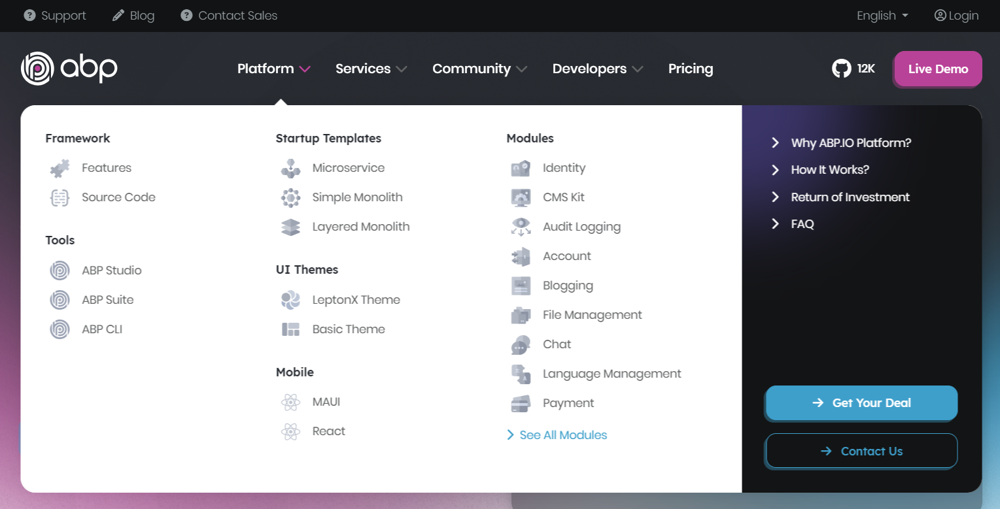
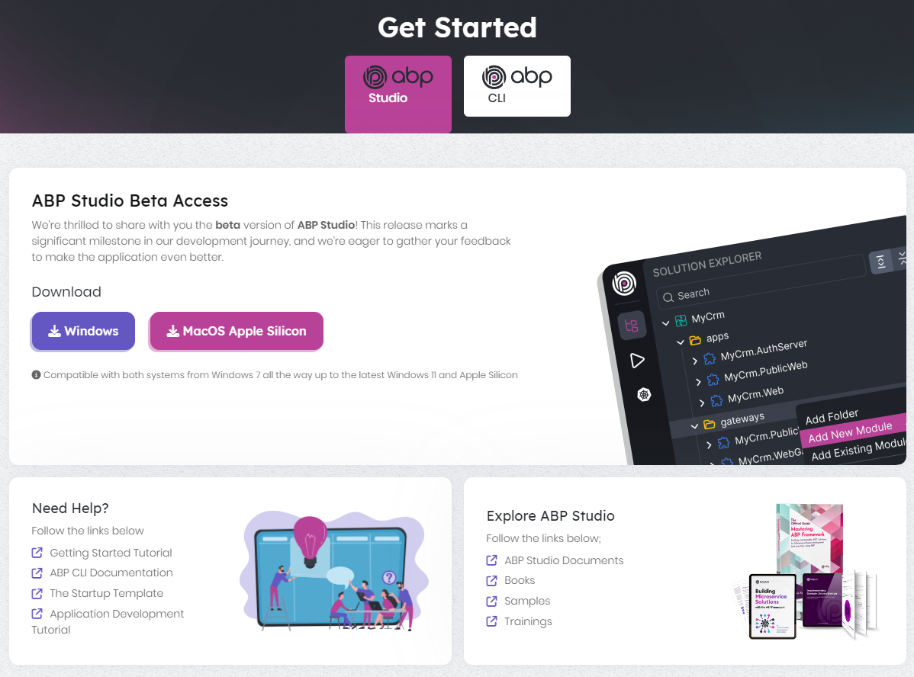
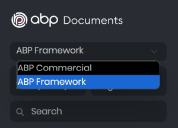
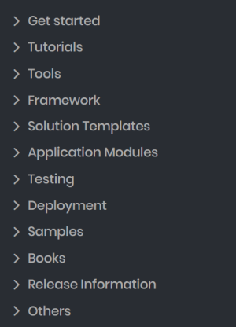

# Unifying the ABP.IO Platform

I am very excited to announce that some big changes and improvements are coming to the ABP.IO Platform soon. In this post, I will explain the changes we are currently working on. Here, a brief list of these changes:

* We are merging the subdomains of the ABP.IO Platform websites: Community.abp.io, commercial.abp.io, blog.abp.io, docs.abp.io websites and their contents are being merged into the main domain, abp.io.
* ABP (open source) and ABP Commercial documents are being merged into a single documentation.
* Introducing ABP Studio Community Edition.

These changes won't effect the license conditions. The open source part will remain the same and the commercial license contents will also be the same. The aim of the changes is to make the platform more consistent, holistic, understandable and easy to start.

Let's dive deep...

## Merging the ABP.IO Websites

ABP.IO website has many subdomains currently:

* **abp.io**: Home page of the open source ABP Framework project.
* **community.abp.io**: A website that community can share contents and we organize events.
* **commercial.abp.io**: A website to promote and sell commercial ABP licenses which have pre-built modules, themes, tooling and support on top of the ABP Framework.
* **docs.abp.io**: The technical documentation of the ABP Framework and ABP Commercial.
* **blog.abp.io**: A blog website to announce the news on the platform.
* **support.abp.io**: Premium support for the ABP Commercial customers.

All these subdomains (except the support website for now) are being merged to the abp.io domain. All their contents and UI designs are being revised and enriched.

Some fundamental purposes of that change are;

* Making content more coherent and holistic,
* Making the design more harmonious,
* Making the contents of the old subdomains more visible and reachable,
* Allow you to navigate through the web pages much easier,
* Reducing duplications between different websites,

I will highlight a few important changes in the next sections.

### The New Mega Menu

As I said above, the abp.io UI design is also being revised. One of the big revisions is the main menu. We are replacing the current main navigation by a mega menu as shown in the following figure:

We believe that new mega menu will allow you to navigate through the web pages much easier.

### The New Get Started Page

We are constantly working to improve ABP's onboarding experience. With the new platform changes, we now offer ABP Studio as the starting point for the ABP Platform. You can still use the [ABP CLI](https://docs.abp.io/en/abp/latest/CLI) to created new ABP solutions, but the new ABP Studio makes it much easier and understandable. It also provides features to easily run and monitor your applications, even in the Community edition.

You can easily download and install ABP Studio, login with your abp.io account and create your first ABP solution.

### The New Pricing Page

Since the [ABP Commercial website](https://commercial.abp.io/) has merged with the main website, you will see the *Pricing* page located on the main menu of the abp.io website. We have completely revised the design and content of this page to better reflect which features are open source and free, and what is included in the paid licenses.

As mentioned above, all the free & open source features are still free & open source. In addition, we included the ABP Studio Community edition (will be explained below) to the free license.

## Merging the ABP Platform Documentation

Currently, ABP Framework (open source) and ABP Commercial [documents](https://docs.abp.io/) are completely separated. You can switch between them on the left side:

Based on our and customers' experiences, there are some problems with that approach:

* Getting started, development tutorials, release notes, road map and some other documents are duplicated (or very similar) among ABP Framework and ABP Commercial documents.
* For ABP Commercial users, it is not clear if they also need to read the ABP Framework (open source) documentation or not. Also, when they read the framework document, some parts are different for ABP Commercial users, and it is also not clear in some cases.

We are currently working to completely merge the ABP Framework (open source) and ABP Commercial documentation, remove duplications and revisit the contents. We will clearly indicate if a part of a document requires a paid license.

The left navigation panel tree is also completely revisited and simplified:

## The ABP Studio Community Edition

[ABP Studio](https://docs.abp.io/en/commercial/latest/studio/index) is a cross-platform desktop application designed for ABP and .NET developers. It aims to provide a comfortable development environment by automating tasks, providing insights about your solution, and simplifying the processes of creation, development, execution, browsing, monitoring, tracing, and deploying your solutions.

Here, a screenshot from the *Solution Runner* screen of ABP Studio:

ABP Studio has been started as a commercial product, as a part of [ABP Commercial](https://commercial.abp.io/). We are very excited to announce that the *Community Edition* will be available soon for free. It will have some missing features and limitations compared to the full edition, but will be enough to create, explore and run ABP solutions easily.

We will be offering ABP Studio as a starting point to the ABP platform. The [Getting Started](https://docs.abp.io/en/abp/latest/Getting-Started-Overall) and other documents will use ABP Studio to create new solutions and perform ABP-related operations.

## Other News

We are also working on some other topics related to these changes. Some of them are;

* Completely renewing the [startup templates](https://docs.abp.io/en/abp/latest/Startup-Templates/Index) (with ABP Studio), so they will be more flexible and will provide more options.
* Providing a tool to automatically convert ABP solutions created with open source startup templates into ABP commercial.

## Questions

I tried to explain all the important changes in this post. However, you may have some questions in your mind.

### What should open source users expect?

Since the [ABP Commercial](https://commercial.abp.io/) website content is merged with the main [abp.io](https://abp.io/) website, you will see paid features being introduced on the main website. The pricing page will also be available on the same website. This may lead you to wonder whether the ABP Platform is a fully paid product. The simple answer to this question is "No". Actually, nothing has changed on the open source side. Everything will be the same. Additionally, open source users will now have ABP Studio Community Edition for free. So open source has more for its users than before.

### What should ABP Commercial customers expect?

ABP Commercial license holders may wonder if any license change happens. The answer is "No". All the license types, rules, restrictions and features are the same. With the changes explained in this post, you will follow the documentation easier (since you won't need to go to another website for the framework documentation) and you will better understand what special features are available to you.

## Last Words

With this post, we wanted to announce the changes to be made on the ABP platform to the ABP community, so don't be surprised or curious about what happened. If you have any questions or suggestions, feel free to write a comment for this blog post or send an email to info@abp.io.