# ABP.IO Platform 8.2 RC Has Been Released

Today, we are happy to release the [ABP Framework](https://abp.io/) and [ABP Commercial](https://commercial.abp.io/) version **8.2 RC** (Release Candidate). This blog post introduces the new features and important changes in this new version.

Try this version and provide feedback for a more stable version of ABP v8.2! Thanks to all of you.

## Get Started with the 8.2 RC

Follow the steps below to try version 8.2.0 RC today:

1) **Upgrade** the ABP CLI to version `8.2.0-rc.3` using a command line terminal:

````bash
dotnet tool update Volo.Abp.Cli -g --version 8.2.0-rc.3
````

**or install** it if you haven't before:

````bash
dotnet tool install Volo.Abp.Cli -g --version 8.2.0-rc.3
````

2) Create a **new application** with the `--preview` option:

````bash
abp new BookStore --preview
````

See the [ABP CLI documentation](https://docs.abp.io/en/abp/latest/CLI) for all the available options.

> You can also use the [Get Started](https://abp.io/get-started) page to generate a CLI command to create a new application.

You can use any IDE that supports .NET 8.x, like [Visual Studio 2022](https://visualstudio.microsoft.com/downloads/).

## Migration Guides

There are a few breaking changes in this version that may affect your application.
Please see the following migration documents, if you are upgrading from v8.x or earlier:

* [ABP Framework 8.x to 8.2 Migration Guide](https://docs.abp.io/en/abp/8.2/Migration-Guides/Abp-8_2)
* [ABP Commercial 8.x to 8.2 Migration Guide](https://docs.abp.io/en/commercial/8.2/migration-guides/v8_2)

## What's New with ABP Framework 8.2?

In this section, I will introduce some major features released in this version.
Here is a brief list of titles explained in the next sections:

* Blazor Full-Stack Web App UI
* Introducing the `IBlockUiService` for Blazor UI
* Allowing Case-Insensitive Indexes for MongoDB
* Other News...

### Blazor Full-Stack Web App UI

ASP.NET Blazor in .NET 8 allows you to use a single powerful component model to handle all of your web UI needs, including server-side rendering, client-side rendering, streaming rendering, progressive enhancement, and much more!

ABP v8.2.x supports the new Blazor Web App template, which you can directly create with the following command:

```bash
abp new BookStore -t app -u blazor-webapp
```

When you create the project, you will typically see two main projects for Blazor UI, besides other projects:

* **MyCompanyName.MyProjectName.Blazor.WebApp** (startup project of your application, and contains `App.razor` component, which is the root component of your application)
* **MyCompanyName.MyProjectName.Blazor.WebApp.Client**

This new template overcomes the disadvantages of both Blazor WASM and Blazor Server applications and allows you to decide which approaches to use for a specific page or component. Therefore, you can imagine this new web UI as a combination of both Blazor Server and Blazor WASM. 

> This approach mainly overcomes the **large binary downloads of Blazor WASM**, and it resolves the Blazor Server's problem, which **always needs to be connected to the server via SignalR**.

> If you are considering migrating your existing Blazor project to Blazor WebApp or want to learn more about this new template, please read the [Migrating to Blazor Web App](https://docs.abp.io/en/abp/8.2/Migration-Guides/Abp-8-2-Blazor-Web-App) guide.

### Introducing the `IBlockUiService` for Blazor UI

In this version, ABP Framework introduces the [`IBlockUiService`](https://docs.abp.io/en/abp/8.2/UI/Blazor/Block-Busy) for Blazor UI. This service uses UI Block API to disable/block the page or a part of the page. 

You just need to simply inject the `IBlockUiService` to your page or component and call the `Block` or `UnBlock` method to block/unblock the specified element:

```csharp
namespace MyProject.Blazor.Pages
{
    public partial class Index
    {
        private readonly IBlockUiService _blockUiService;

        public Index(IBlockUiService _blockUiService)
        {
            _blockUiService = blockUiService;
        }

        public async Task BlockForm()
        {
            /*
              Parameters of Block method:
                selectors: A string containing one or more selectors to match. https://developer.mozilla.org/en-US/docs/Web/API/Document/querySelector#selectors
                busy : Set to true to show a progress indicator on the blocked area.
            */
            await _blockUiService.Block(selectors: "#MySelectors", busy: true);

            //Unblocking the element
            await _blockUiService.UnBlock(selectors: "#MySelectors");
        }
    }
}

```

Here is the resulting UI with all possible options (**block**, **block busy**, and **unblock**):

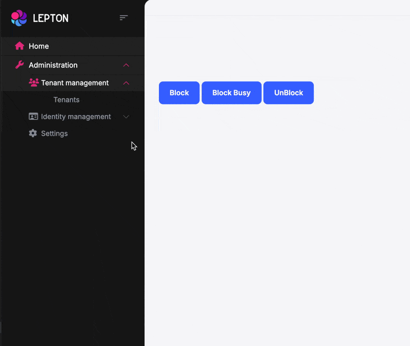

### Allowing Case-Insensitive Indexes for MongoDB

MongoDB allows case-insensitive string comparisons by using case-insensitive indexes. You can create a case-insensitive index by specifying a **collation**. 

To do that, you should override the `CreateModal` method, configure the `CreateCollectionOptions`, and specify the **collation** as below:

```csharp
protected override void CreateModel(IMongoModelBuilder modelBuilder)
{
    base.CreateModel(modelBuilder);

    modelBuilder.Entity<Question>(b =>
    {
        b.CreateCollectionOptions.Collation = new Collation(locale:"en_US", strength: CollationStrength.Secondary);

        b.ConfigureIndexes(indexes =>
            {
                indexes.CreateOne(
                    new CreateIndexModel<BsonDocument>(
                        Builders<BsonDocument>.IndexKeys.Ascending("MyProperty"),
                        new CreateIndexOptions { Unique = true }
                    )
                );
            }
        );
    });
}
```

After this configuration, a unique index will be created for the `MyProperty` property and then you can perform case-insensitive string comparisons without the need to worry. See [#19073](https://github.com/abpframework/abp/pull/19073) for more information.

### Other News

* Angular package version has been updated to v17.3.0. See [#19915](https://github.com/abpframework/abp/pull/19915) for more info.
* OpenIddict [5.4.0 has been released on March 26](https://github.com/openiddict/openiddict-core/releases/tag/5.4.0). Therefore, we decided to upgrade the OpenIddict packages to v5.4.0. See [#19427](https://github.com/abpframework/abp/issues/19427).
* AutoMapper [13.0.1 was released on February 8](https://github.com/AutoMapper/AutoMapper/releases/tag/v13.0.1) and in this version, we upgraded AutoMapper packages to v13.0.1. See [#19564](https://github.com/abpframework/abp/pull/19564/).
* See other completed tasks in this version: [https://github.com/abpframework/abp/releases?q=8.2.0-rc](https://github.com/abpframework/abp/releases?q=8.2.0-rc&expanded=true)

## What's New with ABP Commercial 8.2?

We've also worked on ABP Commercial to align the features and changes made in the ABP Framework. The following sections introduce a few new features coming with ABP Commercial 8.2.

### Session Management

The [Session Management](https://docs.abp.io/en/commercial/8.2/modules/identity/session-management) feature allows you to prevent concurrent login and manage user sessions. You can allow concurrent login, allow only one session of the same device type, or logout from all other devices when a new session is created, by specifying in the settings page:

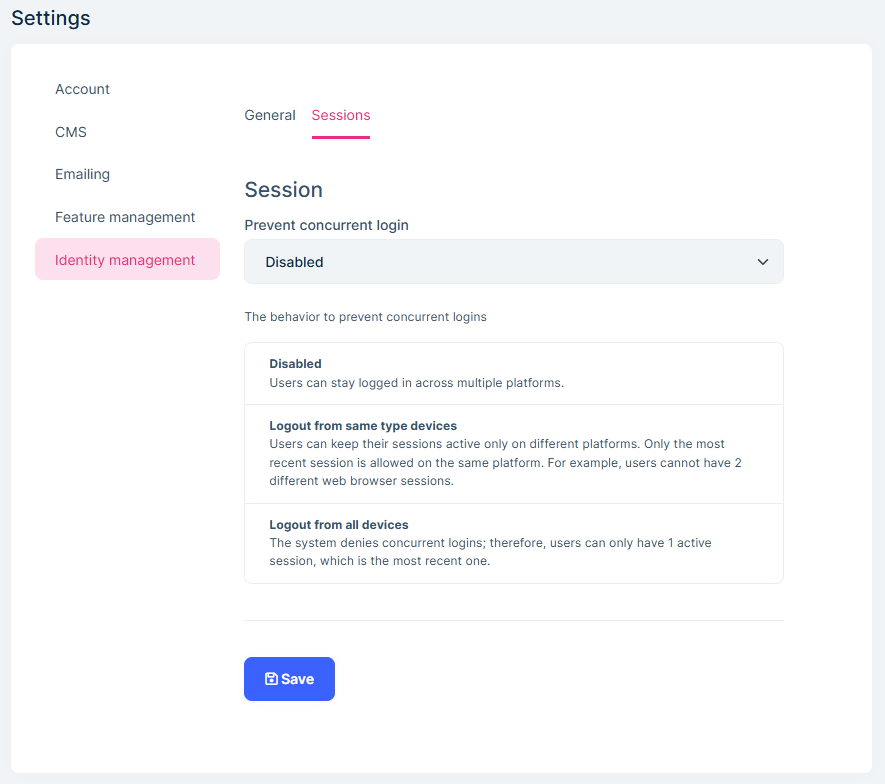

Also, you can view and manage users sessions on the `Users` page of the [Identity Module](https://docs.abp.io/en/commercial/8.2/modules/identity):


### Suite: File/Image Property

In this version, ABP Suite allows you to add a file/image property for an entity. You can select "File" as the property type for your properties as in the following figure:

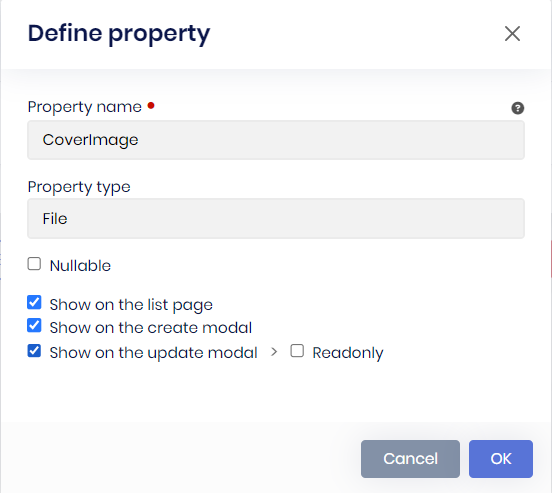

Then, when you generate your entity and try to insert a record, you will see the file upload component on the create/update models:

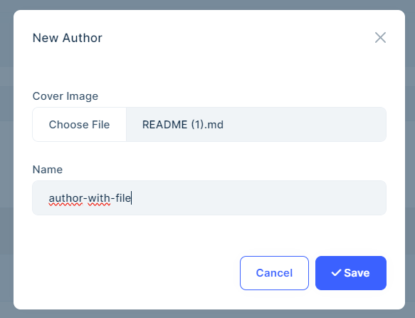

You can upload a file with any supported extensions and under 10MB (this can be increased in the generated code, if you wish) and after that, you can download, delete and update the existing file any time you want:

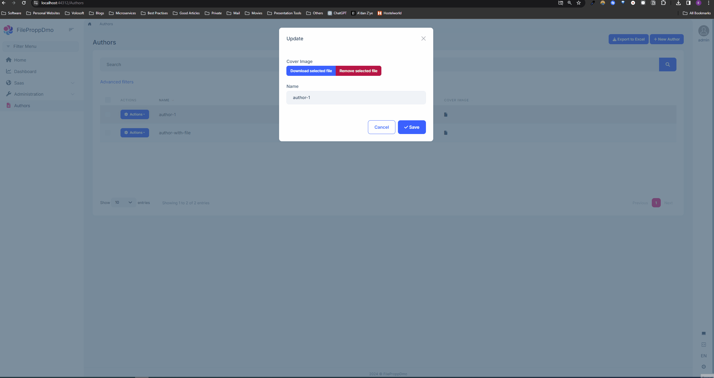

> **Note:** This feature has already been implemented for MVC & Blazor UIs, but not implemented for Angular UI yet. We aim to implement it for Angular UI with v8.2.0.

### Suite: DateOnly & TimeOnly Types

In this version on, ABP Suite provides `DateOnly` and `TimeOnly` types as property types. You can select these types when you create an entity:

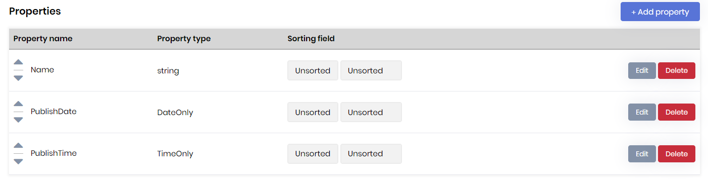

Then, all related configurations (including db configurations) will be made by ABP Suite, and you will be able to see the fields in the UI:

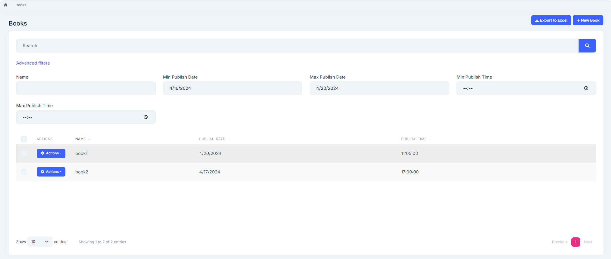

> **Note**: The `DateOnly` and `TimeOnly` types were introduced with .NET 6. Therefore, please make sure that all of your projects' target frameworks are .NET8+. With ABP v8.2, all startup templates target a single target framework, which is .NET8, so if you created your project with version 8.2+, you don't need to make any changes.

### Periodic Log Deletion for Audit Logs

In this version, the [Audit Logging Module](https://docs.abp.io/en/commercial/8.2/modules/audit-logging) provides a built-in periodic log deletion system. You can enable/disable the clean-up service system wide, in this way, you can turn off the clean up service for all tenants and their hosts:

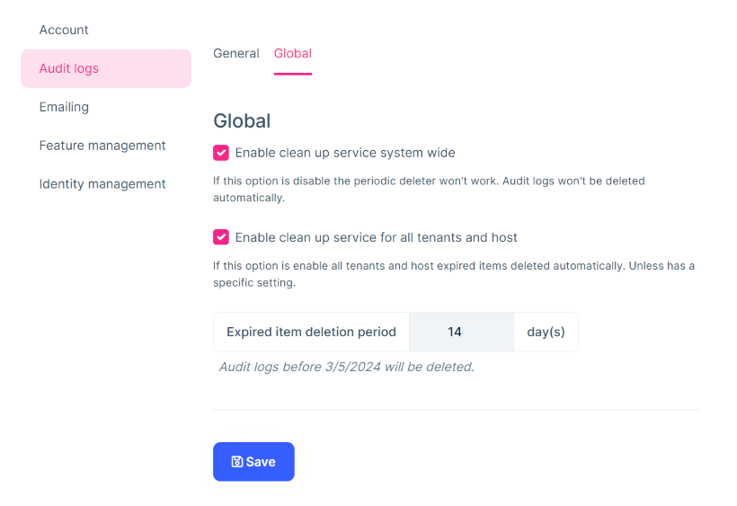

> If the system wide clean up service is enabled, you can configure the global *Expired Item Deletion Period* for all tenants and hosts.

When configuring the global settings for the audit log module from the host side in this manner, ensure that each tenant and host uses the global values. If you want to set tenant/host-specific values, you can do so under *Settings* -> *Audit Log* -> *General*. This way, you can disable the clean up service for specific tenants or host. It overrides the global settings:


> **Note**: To view the audit log settings, you need to enable the feature. For the host side, navigate to *Settings* -> *Feature Management* -> *Manage Host Features* -> *Audit Logging* -> *Enable audit log setting management*.

## Community News

### ABP Dotnet Conf 2024 Wrap Up

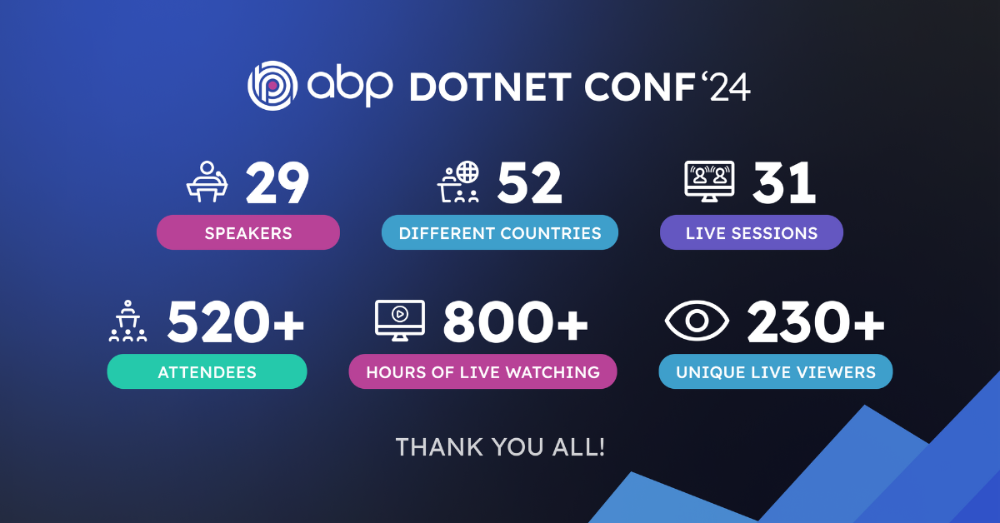

We organized [ABP Dotnet Conference 2024](https://abp.io/conference/2024) on May 2024 and we are happy to share the success of the conference, which captivated overwhelmingly interested live viewers from all over the world. 29 great line up of speakers which includes .NET experts and Microsoft MVPs delivered captivating talks that resonated with the audiences. Each of the talks attracted a great amount of interest and a lot of questions, sparking curiosity in the attendees.

Thanks to all speakers and attendees for joining our event. 🙏

> We shared our takeaways in a blog post, which you can read at [https://blog.abp.io/abp/ABP-Dotnet-Conference-2024-Wrap-Up](https://blog.abp.io/abp/ABP-Dotnet-Conference-2024-Wrap-Up).

### DevDays Europe 2024


Co-founder of [Volosoft](https://volosoft.com/), [Alper Ebiçoğlu](https://twitter.com/alperebicoglu) gave a speech about "How to Build a Multi-Tenant ASP.NET Core Application" at the [DevDays Europe 2024](https://devdays.lt/) on the 20th of May.

### DevOps Pro Europe 2024

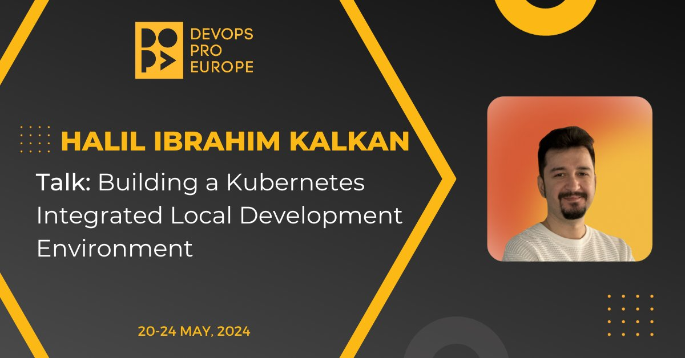

We are thrilled to announce that the co-founder of [Volosoft](https://volosoft.com/) and Lead Developer of the [ABP Framework](https://abp.io/), [Halil Ibrahim Kalkan](https://x.com/hibrahimkalkan) gave a speech about "Building a Kubernetes Integrated Local Development Environment" in the [DevOps Pro Europe](https://devopspro.lt/) on the 24th of May.

### Devnot Dotnet Conference 2024

We are happy to announce that core team members of the [ABP Framework](https://abp.io/), [Alper Ebiçoğlu](https://twitter.com/alperebicoglu) and [Enis Necipoğlu](https://twitter.com/EnisNecipoglu) will give speeches at the [Devnot Dotnet Conference 2024](https://dotnet.devnot.com/) on 25th of May.

[Alper Ebiçoğlu](https://twitter.com/alperebicoglu) will talk about **"AspNet Core & Multitenancy"**:

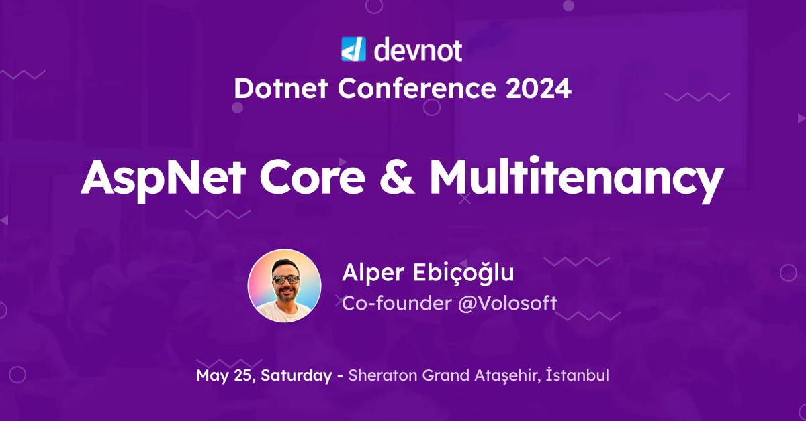

On the other hand, [Enis Necipoğlu](https://twitter.com/EnisNecipoglu) will talk about **"Reactive Programming with .NET MAUI"**:

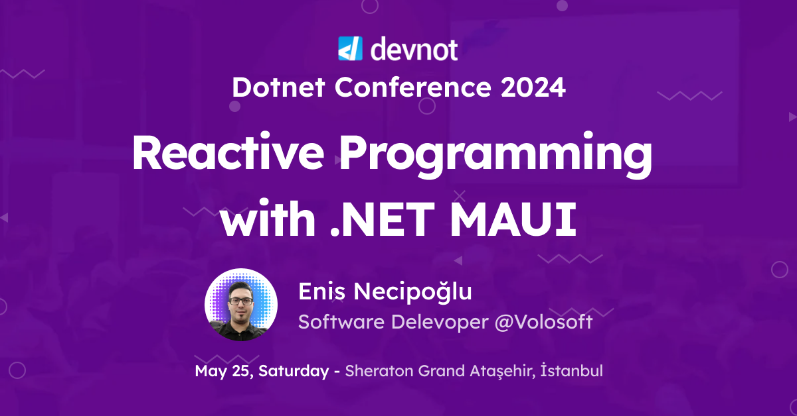

### New ABP Community Articles

There are exciting articles contributed by the ABP community as always. I will highlight some of them here:

* [Ahmed Tarek](https://twitter.com/AhmedTarekHasa1) has created **four** new community articles:
  *  [🤔 When Implementations Affect Abstractions ⁉️](https://community.abp.io/posts/-when-implementations-affect-abstractions--ekx1o5xn)
  *  [👍 Design Best Practices In .NET C# 👀](https://community.abp.io/posts/design-best-practices-in-.net-c--eg8q8xh0)
  *  [👍 Chain of Responsibility Design Pattern In .NET C# 👀](https://community.abp.io/posts/chain-of-responsibility-design-pattern-in-.net-c--djmvkug1)
  *  [Flagged Enumerations: How To Represent Features Combinations Into One Field](https://community.abp.io/posts/flagged-enumerations-how-to-represent-features-combinations-into-one-field-9gj4l670)
*  [Engincan Veske](https://github.com/EngincanV) has created **three** new community articles:
   *  [Performing Case-Insensitive Search in ABP Based-PostgreSQL Application: Using citext and Collation](https://community.abp.io/posts/caseinsensitive-search-in-abp-basedpostgresql-application-c9kb05dc)
   *  [Sentiment Analysis Within ABP-Based Application](https://community.abp.io/posts/sentiment-analysis-within-abpbased-application-lbsfkoxq)
   *  [Reusing and Optimizing Machine Learning Models in .NET](https://community.abp.io/posts/reusing-and-optimizing-machine-learning-models-in-.net-qj4ycnwu)
* [Unlocking Modularity in ABP.io A Closer Look at the Contributor Pattern](https://community.abp.io/posts/unlocking-modularity-in-abp.io-a-closer-look-at-the-contributor-pattern-ixf6wgbw) by [Qais Al khateeb](https://community.abp.io/members/qais.alkhateeb@devnas-jo.com)
* [Deploy Your ABP Framework MVC Project to Azure Container Apps](https://community.abp.io/posts/deploy-your-abp-framework-mvc-project-to-azure-container-apps-r93u9c6d) by [Selman Koç](https://community.abp.io/members/selmankoc)
* [How claim type works in ASP NET Core and ABP Framework](https://community.abp.io/posts/how-claim-type-works-in-asp-net-core-and-abp-framework-km5dw6g1) by [Liming Ma](https://github.com/maliming)
* [Using FluentValidation with ABP Framework](https://community.abp.io/posts/using-fluentvalidation-with-abp-framework-2cxuwl70) by [Enes Döner](https://community.abp.io/members/Enes)
* [Using Blob Storage with ABP](https://community.abp.io/posts/using-blob-storage-with-abp-framework-jygtmhn4) by [Emre Kendirli](https://community.abp.io/members/emrekenderli)

Thanks to the ABP Community for all the content they have published. You can also [post your ABP-related (text or video) content](https://community.abp.io/posts/submit) to the ABP Community.

## Conclusion

This version comes with some new features and a lot of enhancements to the existing features. You can see the [Road Map](https://docs.abp.io/en/abp/8.2/Road-Map) documentation to learn about the release schedule and planned features for the next releases. Please try ABP v8.2 RC and provide feedback to help us release a more stable version.

Thanks for being a part of this community!