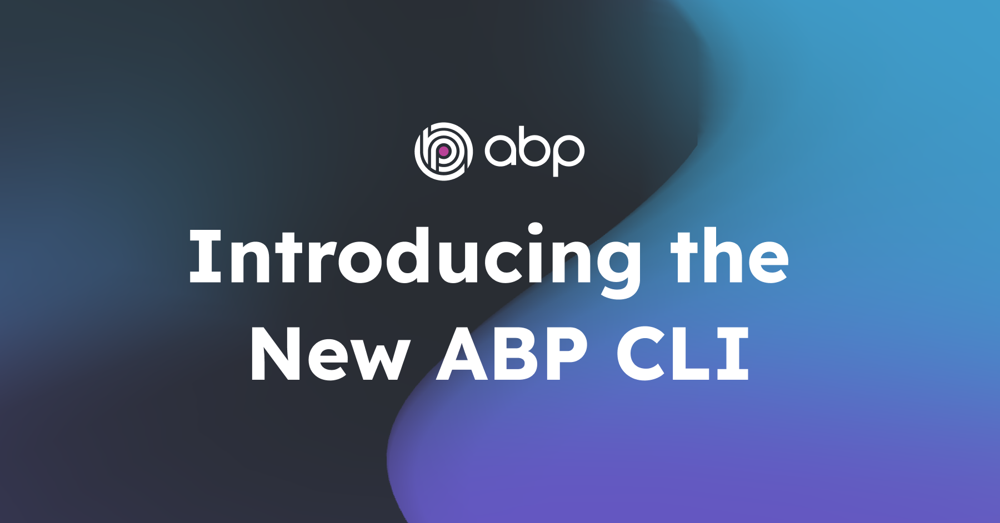

# Introducing the New ABP CLI



📢 We're excited to introduce the [new ABP CLI](https://abp.io/docs/latest/cli/index) after the announcement of [the new unified ABP Platform](https://abp.io/blog/new-abp-platform-is-live). 

As you know, we recently unified the ABP platform in a single domain ([abp.io](https://abp.io/)) and made some changes in our templating system to simplify your development. Also, we released more stable ABP Studio versions, which can dramatically improve and speed up your development time. Besides all of these changes, we have also introduced a new ABP CLI to bring you a more streamlined and efficient experience, which also extends the current commands.

Here is a brief overview of what's new, what's changed, and why this change is happening...

## The New ABP CLI

ABP CLI is a command line tool to perform some common operations for ABP based solutions or [ABP Studio](https://abp.io/docs/latest/studio) features. With v8.2+, the old/legacy ABP CLI has been replaced with a new CLI system to align with the new templating system and ABP Studio. 

The new ABP CLI extends the old ABP CLI, adds more features that are used by ABP Studio behind the scenes, and is also fully compatible with the new templating system. Also, it allows you to use the old ABP CLI if you need, it by passing a single parameter.

To be able to use the new ABP CLI, you should first delete the existing/old CLI with the following command if you installed it before:

```bash
dotnet tool uninstall -g Volo.Abp.Cli
```

Then, to install the new ABP CLI, you can just simply execute the following command in your terminal:

```bash
dotnet tool install -g Volo.Abp.Studio.Cli
```

> Both old and new ABP CLI binary names use the same `abp` command as the executing command. Therefore, you should uninstall the old CLI first, if you installed it before. 

> **Note**: Since the new ABP CLI uses the same `abp` command, you can use the same commands as you did before.

## Reason for the Change

ABP introduces a new templating system, which is fully compatible with the ABP Studio from v8.2+. Since, ABP Studio offers more and better features (such as tracking, monitoring, and deploying your applications from a single point), and the new templating system has a different versioning structure, we wanted to introduce a new ABP CLI by extending the current features and adding even more features that are compatible with the new templating system and ABP Studio.

This change allows you to create your application with the new templating system either by running the cross-platform ABP Studio application or ABP CLI and allows you to create automated pipelines with the power of the new ABP CLI.

## Using the Old ABP CLI

If you have an older version of ABP solutions and need to use the old ABP CLI for any reason, you can do it easily with the new ABP CLI.

You just need to put the `--old` command at the end of your command and execute the related CLI command as you would before. This allows you to use the old CLI commands with the new CLI without the need to uninstall the new CLI.

For example, if you want to create a new ABP v8.2.0 solution, you can execute the following command:

```bash
abp new Acme.BookStore --version 8.2.0 --old
```

When you run this command, the new ABP CLI installs the old CLI with `abp-old` name as the executing command within the latest version of ABP under the **%UserProfile%\\.abp\studio\cli\old** directory and allows you to use the old commands.

If you want to use a specific version of the old ABP CLI, it's also possible with the new ABP CLI. You can use the `install-old-cli` command of the new CLI to either install or update an old CLI, then you can directly execute any old ABP CLI command by simply passing the `--old` parameter to the end of your command:

```bash
# installing the old ABP CLI with v8.0
abp install-old-cli --version 8.0.0

abp new Acme.BookStore --version 8.0 --old # alternatively, you can use the `abp-old` command without need to pass the "--old" parameter
```

## New Commands

New ABP CLI extends the existing features of old ABP CLI and introduces new commands. Here are some of the new commands:

* `kube-connect`: Connects to Kubernetes environment. (Available for **Business or higher licenses**)
* `kube-intercept`: Intercepts a service running in Kubernetes environment. (Available for **Business or higher licenses**)
* `list-module-sources`: Lists the remote module sources.
* and more...

You can check the CLI documentation for all available commands and their usage.

## Conclusion

In this blog post, we briefly explained the new ABP CLI, what's the reason for this change, and how to use the old ABP CLI with the new ABP CLI.

If you have any further questions related to the new ABP CLI, you can always refer to the [CLI](https://abp.io/docs/latest/cli/index) and [Old ABP CLI vs New ABP CLI](https://abp.io/docs/latest/cli/differences-between-old-and-new-cli) documentation. Also, we listed some of the questions that you may have, which you can [check from here](https://abp.io/docs/latest/cli/differences-between-old-and-new-cli#common-questions).

Please try out the new ABP CLI, and provide feedback to help us release more stable versions, with additional features.

Thanks for being a part of the ABP Community!