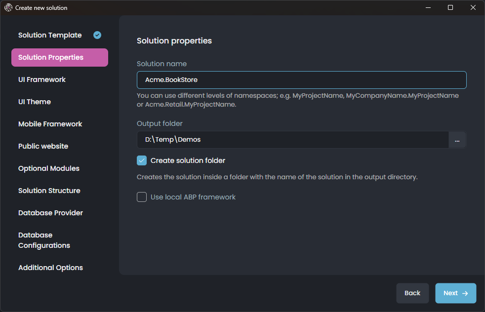
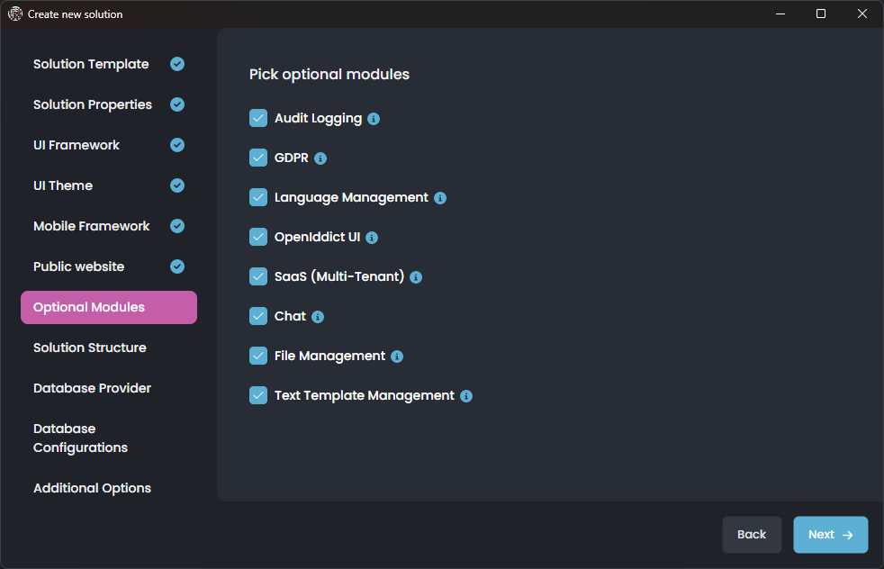
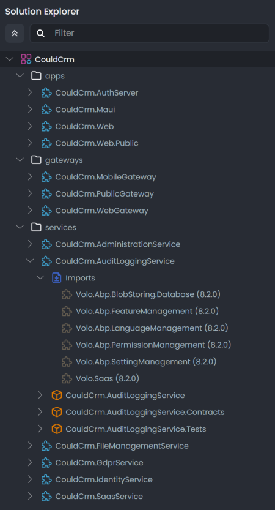
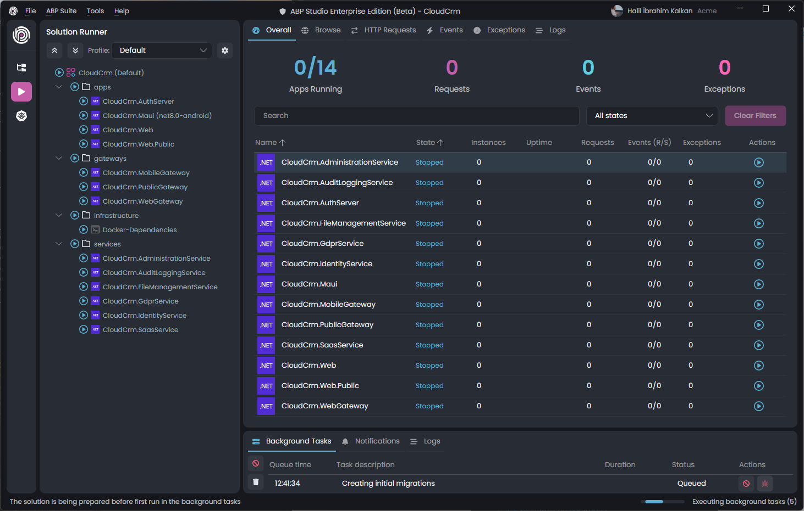
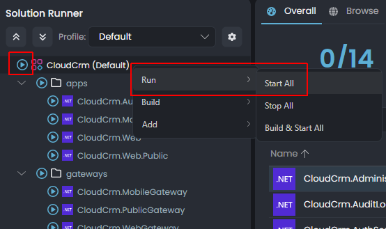
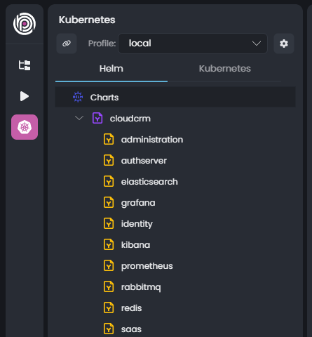
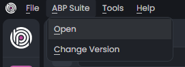
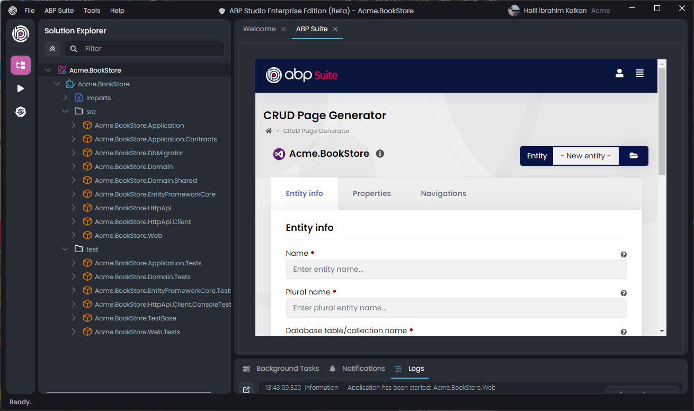
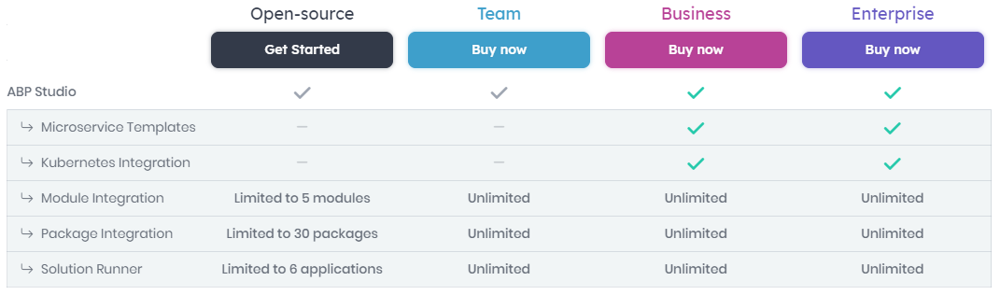

# Announcing ABP Studio (beta) General Availability

ABP Framework makes your daily coding activities much easier, more convenient, and even more enjoyable. However, building a software product is not just about coding. We know that you need to build, run, test, debug and deploy your software, and trace errors on a failure. You also should to design architecture of your overall solution and perform many common operations on your solutions in addition to the coding activity.

We'd already provided tools like [ABP CLI](https://abp.io/cli) and [ABP Suite](https://abp.io/suite) for these kind of purposes before. [ABP Studio](https://abp.io/studio) takes this one long step further and offers a tool that you can use continuously throughout your coding activities, help you for non-coding activities to make you focus on your software development.

I am very excited to announce that the ABP Studio (beta) is generally available to everyone. It is now downloadable on the [get started page](https://abp.io/get-started) of the [new ABP Platform website](https://abp.io/blog/new-abp-platform-is-live).

## What is ABP Studio?

[ABP Studio](https://abp.io/docs/latest/studio) is a cross-platform desktop application for ABP and .NET developers. It aims to provide a comfortable development environment for you by automating things, providing insights about your solution, making develop, run, browse, monitor, trace and deploy your solutions much easier.

**From now on, ABP Studio is the default way to start with the ABP Platform**;

* The [get started page](https://abp.io/get-started) has updated so it offers to download ABP Studio to create a new ABP based solution.
* The ABP CLI ([Volo.Abp.Cli](https://nuget.org/packages/Volo.Abp.Cli)) is replaced by the ABP Studio CLI ([Volo.Abp.Studio.Cli](https://www.nuget.org/packages/Volo.Abp.Studio.Cli)). [The new ABP Studio CLI](https://abp.io/docs/latest/cli) is compatible with the old one, and extends it by introducing new commands.
* [Startup solution templates](https://abp.io/docs/latest/solution-templates) are completely renewed. The solution structures are similar to the old ones, but they are totally new templates built with the new templating engine.
* All the documentation and tutorials now uses ABP Studio and ABP Studio CLI.

> **ABP Studio is in beta stage now.** It is also in rapid development and release cycle. We frequently release new feature and patch versions. Please [file an issue](https://github.com/abpframework/abp/issues/new/choose) if you have any problem.
>
> If you want to continue to use the old CLI and old startup templates, please [refer that document](https://abp.io/docs/latest/cli/differences-between-old-and-new-cli).

## The Easiest Way to Start with the ABP Framework

As mentioned before, the [startup solution templates](https://abp.io/docs/latest/solution-templates) are completely renewed with ABP Studio. They provide much more options compared to the old startup templates. The following screenshot is taken from the New Solution wizard of ABP Studio, which provides an comfortable and easy way to create new solutions:

For example, you can now select most of the non-fundamental modules as optional while creating a new solution:

### Developing Microservices Solutions is Now Much Easier

The most important change is made on the [microservice startup template](https://abp.io/docs/latest/solution-templates/microservice) (which is available only for Business or higher license holders). We've designed the solution structure, integrations, Kubernetes/Helm configuration, database migrations and all others from scratch and well documented all the decisions we've applied. Developing microservice solutions with ABP Framework is now easier and more understandable than ever.

## Architecting Your Complex Solutions

One of the main purposes to build ABP Studio was to simplify to create multi-modular and distributed systems. Either you create a modular monolith application or a microservice solution, [ABP Studio's solution explorer](https://abp.io/docs/latest/studio/solution-explorer) provides a convenient way to design your high-level solution structure.

You see a microservice solution in the following screenshot:

That ABP Studio solution contains multiple separate .NET solutions (`.sln`) each has multiple .NET projects (`.csproj`). ABP Studio allows you to easily manage such a multi-solution system on a single view. You can create new packages and modules, import existing packages and modules, manage their dependencies and so on.

## Run and Test Your Multi-Application Solutions with a Single Click

One of the biggest shortcomings we face when developing distributed or complex solutions is being able to easily run all components of the solutions so that we can test and debug a single service or application without caring about all the runtime dependencies.

Here a screenshot from the ABP Studio's [Solution Runner](https://abp.io/docs/latest/studio/running-applications) view:

When you use ABP Studio, it is dramatically easier to run, monitor, test, debug and develop your applications and services. You can browse your web UI applications, monitor all the HTTP requests, distributed events, exceptions and logs in real time on a single screen. In this way, you can easily run all the systems and trace the problems when you have.

All you need to click the *Play* button or right-click and select the *Run* -> *Start All* command:

The nice thing is that you can create multiple profiles for each of your teams so that they can run only the applications they need to develop the application they are working on.

## Seamlessly Develop Your Service as Integrated to Kubernetes

Kubernetes is the de-facto tool to deploy, run and scale complex systems. However, it can also be a great tool to develop such solutions in a local environment.

With ABP Studio's [Kubernetes Integration](https://abp.io/docs/latest/studio/kubernetes) system, it is now possible to deploy and run a complex system in a Kubernetes cluster. Then you can establish a bridge between your local development environment and the Kubernetes cluster. In this way, you can develop, run, test and debug an application or service in your local development environment as it is running in the Kubernetes cluster. All incoming and outgoing traffic is properly routed and managed by ABP Studio. You just focus on the service you are responsible to develop and let the Kubernetes run rest of the system for you.

You can see all the Helm charts in a solution in the Kubernetes panel of ABP Studio:

Here, you can easily build, install and uninstall the Helm charts to your Kubernetes cluster. In the Kubernetes tab, you can connect to the Kubernetes cluster and intercept a service to develop it locally. See [the documentation](https://abp.io/docs/latest/studio/kubernetes) for more information.

The good news is that all the monitoring data (HTTP Requests, Events, Exceptions, Logs,...) is still visible in real time with the Kubernetes integration too.

## Use the ABP Suite as Integrated to ABP Studio

[ABP Suite](https://abp.io/suite) is a tool that is basically used to generate code for ABP Solutions. It has started by creating simple CRUD pages, and now it does much more. It can establish relations with existing entities, create complex user interfaces like parent/child tables and so on...

ABP Suite can be used directly inside ABP Studio by clicking the *ABP Suite* -> *Open* command:

This will open ABP Suite  in a new tab for the current solution and focus on the CRUD page generation:

The new ABP Studio solution templates and ABP Suite code generation are compatible with each other. Here a screenshot from the generated CRUD UI for a very simple Book entity:

## The Community Edition vs Commercial Licenses

ABP Studio has a Community Edition which is completely free and available to everyone. As you can guess, there are come differences between the community edition and commercial editions. ABP Platform has 4 fundamental license types;

* Open source (free)
* Team
* Business
* Enterprise

Here, the comparison table for ABP Studio features for these license types:

Microservice startup template and Kubernetes integration features are available only for commercial licenses since these are considered more enterprise requirements. Also, the solution size is limited with the ABP Community edition. If you are building a large or distributed solution, consider to [purchase a commercial license](https://abp.io/pricing).

## Conclusion

I've introduced the ABP Studio General Availability with this post. It is still in the beta stage. You can expect frequent releases during the beta phase. We will add new features and fix issues quickly. Please [download](https://abp.io/studio) and use it now. If you find any problem, do not hesitate to open an [issue on GitHub](https://github.com/abpframework/abp/issues/new/choose).