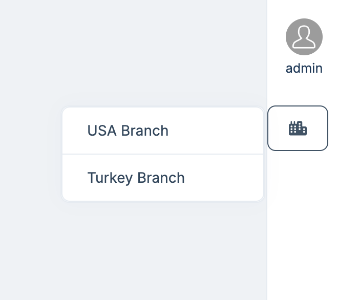
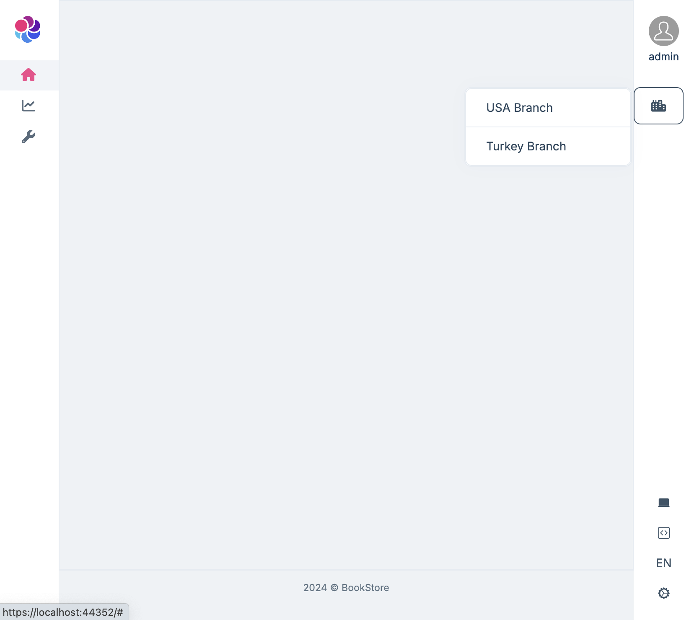
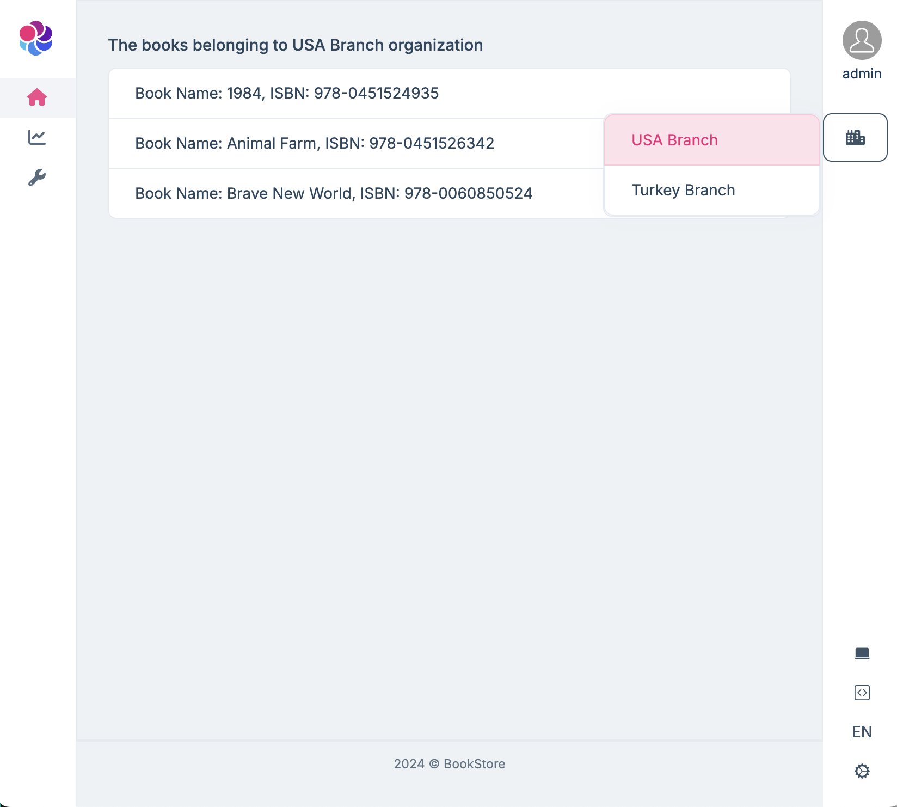
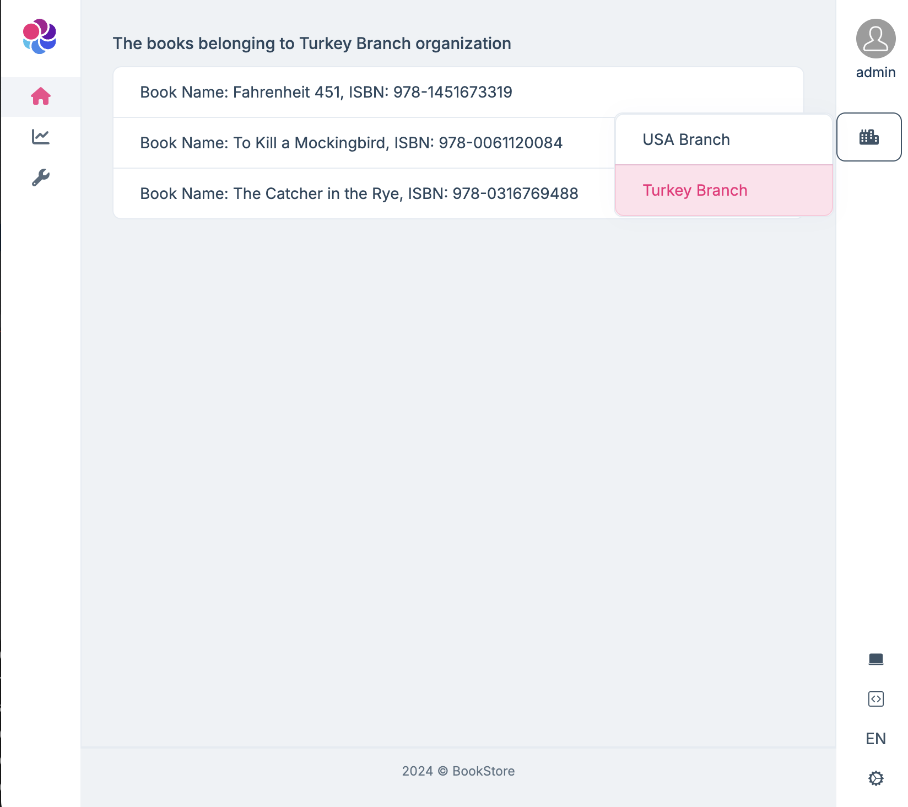

# Switching Between Organization Units

In most companies, a user belongs to more than one organization. Also, in some applications, we need to filter the data shown depending on the logged-in user's organization. For such scenarios, allowing users to select one of the organizations they belong to is a good practice.



## Creating a Data Filter with Organization Units

### IHasOrganization

First, we need to create a data filter that filters data based on the organization unit. 

The `IHasOrganization` interface is used to define the organization unit property in the entity classes, and used to filter the data based on the organization unit.

```csharp
public interface IHasOrganization
{
    public Guid? OrganizationId { get; set; }
}
```

```csharp
public class Book : AggregateRoot<Guid>, IHasOrganization
{
    public string Name { get; set; }

    public string Isbn { get; set; }

    public Guid? OrganizationId { get; set; }
}
```

### Entity Framework Core DbContext Implementation

We will override the `ShouldFilterEntity` and `CreateFilterExpression` methods in the `BookStoreDbContext` class to configure the data filter for the entity that implements the `IHasOrganization` interface.

```csharp
public class BookStoreDbContext : AbpDbContext<BookStoreDbContext>
{
	// Your others DbSet properties...

    public DbSet<Book> Books { get; set; }

    protected override void OnModelCreating(ModelBuilder builder)
    {
        base.OnModelCreating(builder);

        // Your configure code...

        builder.Entity<Book>(b =>
        {
            b.ToTable(BookStoreConsts.DbTablePrefix + "Book", BookStoreConsts.DbSchema);
            b.ConfigureByConvention();
        });
    }

    public CurrentOrganizationIdProvider CurrentOrganizationIdProvider => LazyServiceProvider.LazyGetRequiredService<CurrentOrganizationIdProvider>();

    protected override bool ShouldFilterEntity<TEntity>(IMutableEntityType entityType)
    {
        if (typeof(IHasOrganization).IsAssignableFrom(typeof(TEntity)))
        {
            return true;
        }

        return base.ShouldFilterEntity<TEntity>(entityType);
    }

    protected override Expression<Func<TEntity, bool>> CreateFilterExpression<TEntity>(ModelBuilder modelBuilder)
    {
        var expression = base.CreateFilterExpression<TEntity>(modelBuilder);

        if (typeof(IHasOrganization).IsAssignableFrom(typeof(TEntity)))
        {
            Expression<Func<TEntity, bool>> hasOrganizationIdFilter = e => EF.Property<Guid>(e, "OrganizationId") == CurrentOrganizationIdProvider.CurrentOrganizationId;
            expression = expression == null ? hasOrganizationIdFilter : QueryFilterExpressionHelper.CombineExpressions(expression, hasOrganizationIdFilter);
        }

        return expression;
    }
}
```

### The CurrentOrganizationIdProvider

This class is used to get the current `organization id`, We will use the `AsyncLocal` class to store the current `organization id`, The `Change` method is used to change the current `organization id`. This service is registered as a singleton service.

```csharp
public class CurrentOrganizationIdProvider : ISingletonDependency
{
    private readonly AsyncLocal<Guid?> _currentOrganizationId = new AsyncLocal<Guid?>();

    public Guid? CurrentOrganizationId  => _currentOrganizationId.Value;

    public virtual IDisposable Change(Guid? organizationId)
    {
        var parent = CurrentOrganizationId;
        _currentOrganizationId.Value = organizationId;
        return new DisposeAction(() =>
        {
            _currentOrganizationId.Value = parent;
        });
    }
}
```

## Domain Service Implementation

We will store the current `organization id` in the cache for the logged-in user. at the same time, we want to store it per browser. So we also add the different browser info for every logged-in user.

In the `BrowserInfoClaimsPrincipalContributor` class, We add a random `BrowserInfo` claim to the logged-in user. And we will use `user id` and `browser info `as a cache key. 

```csharp
public static class CurrentUserExtensions
{
    public static Guid? GetBrowserInfo(this ICurrentUser currentUser)
    {
        var claimValue = currentUser.FindClaimValue("BrowserInfo");
        if (claimValue != null && Guid.TryParse(claimValue, out var result))
        {
            return result;
        }
        return null;
    }
}

public class BrowserInfoClaimsPrincipalContributor : IAbpClaimsPrincipalContributor, ITransientDependency
{
    public Task ContributeAsync(AbpClaimsPrincipalContributorContext context)
    {
        var identity = context.ClaimsPrincipal.Identities.FirstOrDefault();
        identity?.AddClaim(new Claim("BrowserInfo", Guid.NewGuid().ToString()));
        return Task.CompletedTask;
    }
}
```

## Application Service Implementation

The `CurrentOrganizationAppService` to get/change the current organization for the logged-in user. `BookAppService` to get the books based on the current `organization id`.

```csharp
[Authorize]
public class CurrentOrganizationAppService : BookStoreAppService, ICurrentOrganizationAppService
{
    private readonly IdentityUserManager _identityUserManager;
    private readonly IDistributedCache<CurrentOrganizationIdCacheItem> _cache;

    public CurrentOrganizationAppService(IdentityUserManager identityUserManager, IDistributedCache<CurrentOrganizationIdCacheItem> cache)
    {
        _identityUserManager = identityUserManager;
        _cache = cache;
    }

    public virtual async Task<List<OrganizationDto>> GetOrganizationListAsync()
    {
        var user = await _identityUserManager.FindByIdAsync(CurrentUser.GetId().ToString());
        var organizationUnits = await _identityUserManager.GetOrganizationUnitsAsync(user);
        return organizationUnits.Select(ou => new OrganizationDto
        {
            Id = ou.Id,
            DisplayName = ou.DisplayName
        }).ToList();
    }

    public virtual async Task<Guid?> GetCurrentOrganizationIdAsync()
    {
        var cacheKey = CurrentUser.Id.ToString() + ":" + CurrentUser.GetBrowserInfo();
        return (await _cache.GetAsync(cacheKey))?.OrganizationId;
    }

    public virtual async Task ChangeAsync(Guid? organizationId)
    {
        var cacheKey = CurrentUser.Id.ToString() + ":" + CurrentUser.GetBrowserInfo();
        await _cache.SetAsync(cacheKey, new CurrentOrganizationIdCacheItem
        {
            OrganizationId = organizationId
        });
    }
}
```

```csharp
[Authorize]
public class BookAppService : BookStoreAppService, IBookAppService
{
    private readonly IBasicRepository<Book, Guid> _bookRepository;

    public BookAppService(IBasicRepository<Book, Guid> bookRepository)
    {
        _bookRepository = bookRepository;
    }

    public virtual async Task<List<BookDto>> GetListAsync()
    {
        var books = await _bookRepository.GetListAsync();
        return books.Select(book => new BookDto
        {
            Id = book.Id,
            Name = book.Name,
            Isbn = book.Isbn,
            OrganizationId = book.OrganizationId
        }).ToList();
    }
}
```

## Seed Sample Data

Let's seed some sample data for the `Book` and `Organization` entities.

We added two organization units, `USA Branch` and `Turkey Branch`, and some books to each organization unit. Also, we added the `admin` user to both organization units.

```csharp
public class BooksDataSeedContributor : IDataSeedContributor, ITransientDependency
{
    public Guid UsaBranchId = Guid.Parse("00000000-0000-0000-0000-000000000001");
    public Guid TurkeyBranchId = Guid.Parse("00000000-0000-0000-0000-000000000002");

    private readonly IBasicRepository<Book, Guid>  _bookRepository;
    private readonly OrganizationUnitManager _organizationUnitManager;
    private readonly IOrganizationUnitRepository _organizationUnitRepository;
    private readonly IdentityUserManager _identityUserManager;
    private readonly IUnitOfWorkManager _unitOfWorkManager;

    public BooksDataSeedContributor(
        IBasicRepository<Book, Guid> bookRepository,
        OrganizationUnitManager organizationUnitManager,
        IOrganizationUnitRepository organizationUnitRepository,
        IdentityUserManager identityUserManager,
        IUnitOfWorkManager unitOfWorkManager)
    {
        _bookRepository = bookRepository;
        _organizationUnitManager = organizationUnitManager;
        _organizationUnitRepository = organizationUnitRepository;
        _identityUserManager = identityUserManager;
        _unitOfWorkManager = unitOfWorkManager;
    }

    public virtual async Task SeedAsync(DataSeedContext context)
    {
        using (var uow = _unitOfWorkManager.Begin())
        {
            var usa = await _organizationUnitRepository.FindAsync(UsaBranchId);
            if (usa == null)
            {
                await _organizationUnitManager.CreateAsync(new OrganizationUnit(UsaBranchId, "USA Branch"));
            }

            var turkey = await _organizationUnitRepository.FindAsync(TurkeyBranchId);
            if (turkey == null)
            {
                await _organizationUnitManager.CreateAsync(new OrganizationUnit(TurkeyBranchId, "Turkey Branch"));
            }

            await uow.SaveChangesAsync();

            var admin = await _identityUserManager.FindByNameAsync("admin");
            Check.NotNull(admin, "admin");

            await _identityUserManager.AddToOrganizationUnitAsync(admin.Id, UsaBranchId);
            await _identityUserManager.AddToOrganizationUnitAsync(admin.Id, TurkeyBranchId);

            if (await _bookRepository.GetCountAsync() <= 0)
            {
                await _bookRepository.InsertAsync(new Book
                {
                    Name = "1984",
                    Isbn = "978-0451524935",
                    OrganizationId = UsaBranchId
                });

                await _bookRepository.InsertAsync(new Book
                {
                    Name = "Animal Farm",
                    Isbn = "978-0451526342",
                    OrganizationId = UsaBranchId
                });

                await _bookRepository.InsertAsync(new Book
                {
                    Name = "Brave New World",
                    Isbn = "978-0060850524",
                    OrganizationId = UsaBranchId
                });

                await _bookRepository.InsertAsync(new Book
                {
                    Name = "Fahrenheit 451",
                    Isbn = "978-1451673319",
                    OrganizationId = TurkeyBranchId
                });

                await _bookRepository.InsertAsync(new Book
                {
                    Name = "The Catcher in the Rye",
                    Isbn = "978-0316769488",
                    OrganizationId = TurkeyBranchId
                });

                await _bookRepository.InsertAsync(new Book
                {
                    Name = "To Kill a Mockingbird",
                    Isbn = "978-0061120084",
                    OrganizationId = TurkeyBranchId
                });
            }

            await uow.CompleteAsync();
        }
    }
}
```

## Web Page Implementation

We will add a dropdown list to the top right corner of the page to allow users to select the organization they belong to. When the dropdown list changes, we will call the application service api to change the current `organization id`.

```csharp
public class OrganizationUnitComponent : AbpViewComponent
{
    public async Task<IViewComponentResult> InvokeAsync()
    {
        var currentOrganizationAppService = LazyServiceProvider.GetRequiredService<ICurrentOrganizationAppService>();
        var organizationDtos = await currentOrganizationAppService.GetOrganizationListAsync();
        var currentOrganizationId = await currentOrganizationAppService.GetCurrentOrganizationIdAsync();
        return View("/Components/OrganizationUnits/Default.cshtml", new OrganizationUnitComponentModel
        {
            CurrentOrganizationId = currentOrganizationId,
            OrganizationDtos = organizationDtos
        });
    }
}

public class OrganizationUnitComponentModel
{
    public Guid? CurrentOrganizationId { get; set; }

    public List<OrganizationDto> OrganizationDtos { get; set; }
}
```

```html
@using Microsoft.AspNetCore.Mvc.TagHelpers
@using Volo.Abp.AspNetCore.Mvc.UI.Bundling.TagHelpers
@model BookStore.Web.Components.OrganizationUnits.OrganizationUnitComponentModel

<div class="dropstart">
    <a href="#" class="btn mt-2" data-bs-toggle="dropdown" type="button">
        <i class="fa fa-city m-auto"></i>
    </a>
    <ul class="dropdown-menu p-0" style="width: 200px">
        <div class="list-group">
            @foreach (var ou in Model.OrganizationDtos)
            {
                <button type="button" onclick="setOrganizationUnitId('@ou.Id')" class="list-group-item list-group-item-action @(ou.Id == Model.CurrentOrganizationId ? "active" : "")">@ou.DisplayName</button>
            }
        </div>
    </ul>
</div>

<script>
    function setOrganizationUnitId(id) {
        bookStore.currentOrganization.currentOrganization.change(id).then(function () {
			location.reload();
        });
    }
</script>
```

Add the `OrganizationUnitComponent` to the toolbar.

```csharp
public class BookStoreToolbarContributor : IToolbarContributor
{
    public virtual Task ConfigureToolbarAsync(IToolbarConfigurationContext context)
    {
		// ...
    
        if (context.Toolbar.Name == StandardToolbars.Main)
        {
            context.Toolbar.Items.Add(new ToolbarItem(typeof(OrganizationUnitComponent)).RequireAuthenticated());
        }

        return Task.CompletedTask;
    }
}
```

In addition, we also need to add a middleware after `UseAuthorization` to change the current `organization id`.

```csharp
app.UseAuthorization();
app.Use(async (httpContext, next) =>
{
	var currentUser = httpContext.RequestServices.GetRequiredService<ICurrentUser>();
	var cacheKey = currentUser.Id.ToString() + ":" + currentUser.GetBrowserInfo();
	var cache = httpContext.RequestServices.GetRequiredService<IDistributedCache<CurrentOrganizationIdCacheItem>>();
	var cacheItem = await cache.GetAsync(cacheKey);
	if (cacheItem != null)
	{
		var currentOrganizationIdProvider = httpContext.RequestServices.GetRequiredService<CurrentOrganizationIdProvider>();
		currentOrganizationIdProvider.Change(cacheItem.OrganizationId);
	}
	await next(httpContext);
});
// ...
```

The `Index` page will show the books based on the current `organization id`.

```cshtml
public class IndexModel : BookStorePageModel
{
    public List<BookDto> Books { get; set; } = new List<BookDto>();
    public string? OrganizationName { get; set; }

    protected readonly IBookAppService BookAppService;
    protected readonly ICurrentOrganizationAppService CurrentOrganizationAppService;
    protected readonly IOrganizationUnitRepository OrganizationUnitRepository;

    public IndexModel(
        IBookAppService bookAppService,
        ICurrentOrganizationAppService currentOrganizationAppService,
        IOrganizationUnitRepository organizationUnitRepository)
    {
        BookAppService = bookAppService;
        CurrentOrganizationAppService = currentOrganizationAppService;
        OrganizationUnitRepository = organizationUnitRepository;
    }

    public async Task OnGetAsync()
    {
        if (CurrentUser.IsAuthenticated)
        {
            var currentOrganizationId = await CurrentOrganizationAppService.GetCurrentOrganizationIdAsync();
            if (currentOrganizationId.HasValue)
            {
                OrganizationName = (await OrganizationUnitRepository.GetAsync(currentOrganizationId.Value)).DisplayName;
            }

            Books = await BookAppService.GetListAsync();
        }
    }
}
```

```html
@page
@model BookStore.Web.Pages.IndexModel
@using Microsoft.AspNetCore.Mvc.Localization
@using BookStore.Localization
@inject IHtmlLocalizer<BookStoreResource> L

@if (!Model.OrganizationName.IsNullOrEmpty())
{
    <h5>The books belonging to @Model.OrganizationName organization</h5>
}

<ul class="list-group">
    @foreach(var book in Model.Books)
    {
    <li class="list-group-item">Book Name: @book.Name, ISBN: @book.Isbn</li>
    }
</ul>
```

### Final UI

The final UI will look like this:

The index page will show empty if the current organization id is not set.
After selecting the organization unit, the index page will show the books based on the selected organization unit.







## Summary

In this blog post. We showd simple implementation of switching between organization units. You can extend this implementation to meet your requirements.

After [ABP 8.3](https://github.com/abpframework/abp/pull/20065) we introduced [User-defined function mapping](https://learn.microsoft.com/en-us/ef/core/querying/user-defined-function-mapping) feature for global filters which will gain performance improvements.

## References

- [Data Filtering](https://abp.io/docs/latest/framework/infrastructure/data-filtering)
- [Claims Principal Factory](https://abp.io/docs/latest/framework/fundamentals/authorization#claims-principal-factory)
