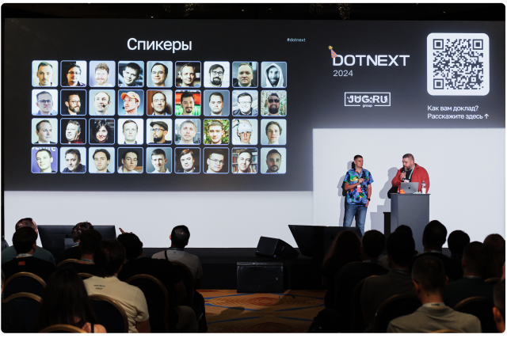
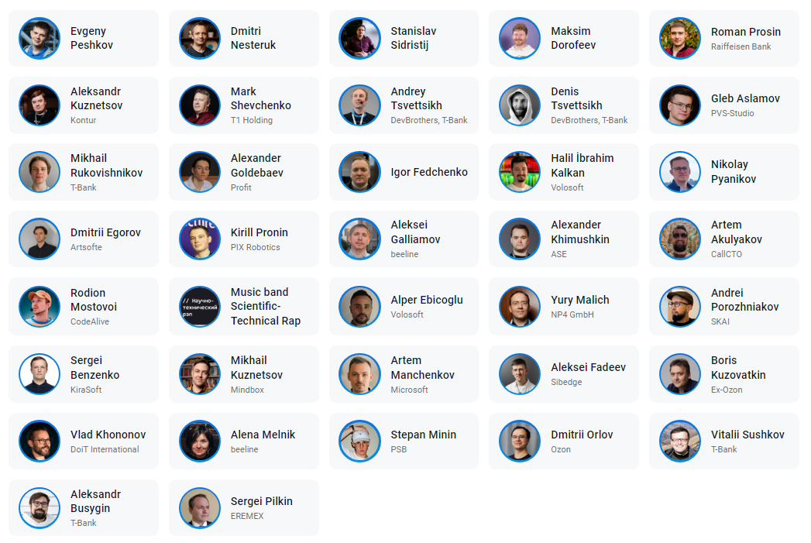
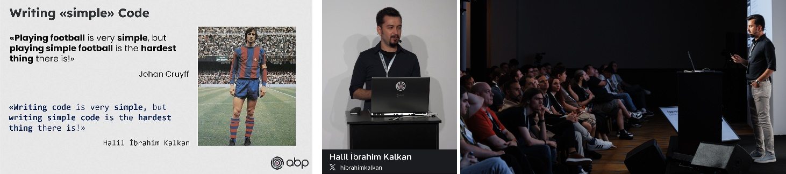
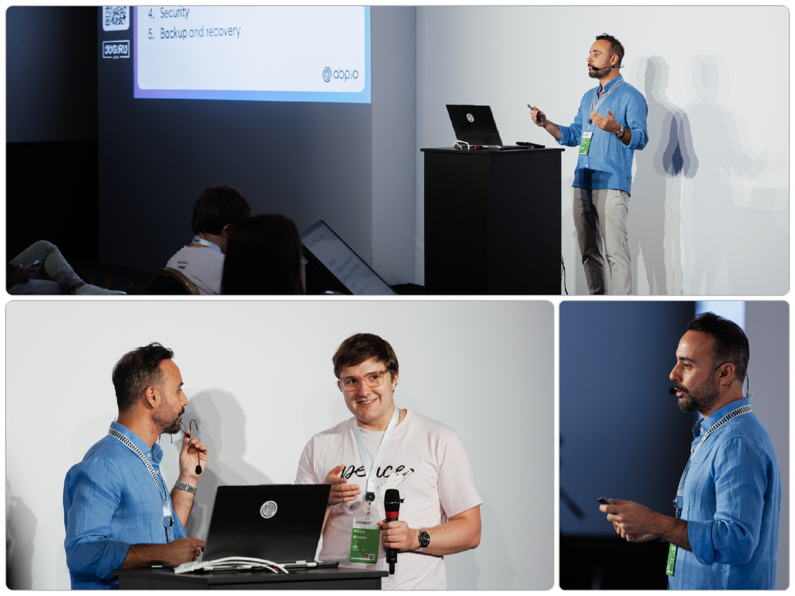
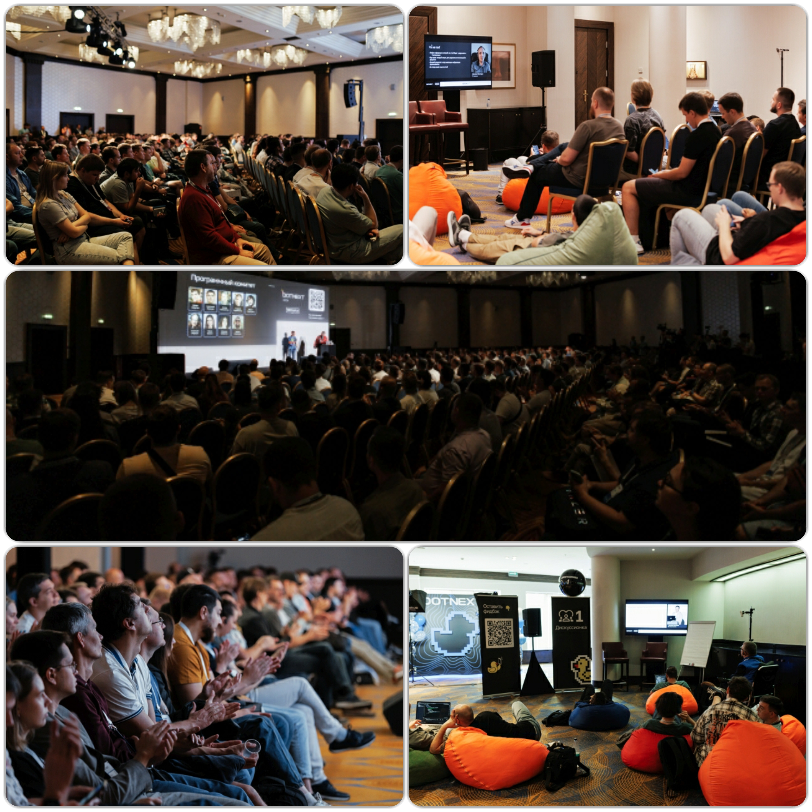
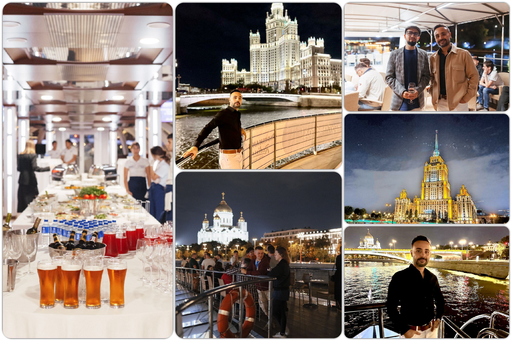
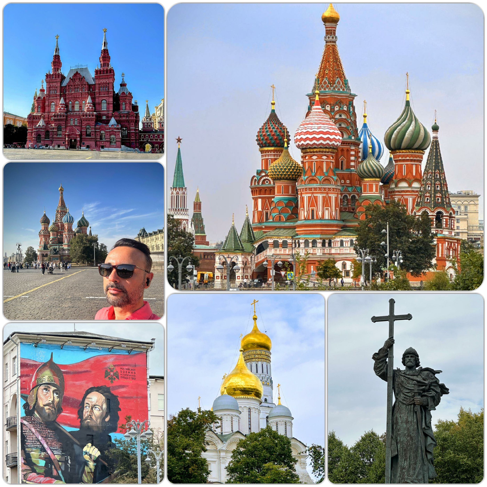

# DotNext 2024 Conference: A Speaker’s Impressions

Last week, I had the chance of being a speaker at **DotNext 2024** in Moscow. [JUG Ru Group](https://jugru.org/en/) is arranging the DotNext Conferences since [2014](https://dotnext.ru/archive/). It's a specific conference for .NET developers held at the [MonArch Moscow Hotel](https://www.moscowmonarch.com/) on 10, 11 September 2024. This event brought together over **600 developers on-site, 200 developers online**, with around **35 speakers** delivering more than **30 talks**, making it one of the largest gatherings of the .NET community in Russia. 

---

## Key Highlights & Popular Sessions

One of the standout aspects of the conference was its strong technical focus, particularly on deep-dive .NET topics. Talks covered subjects like **low-level optimizations**, architecture, performance, and platform internals. 

The conference started with Sergei Benzenko's talk "What's New in .NET 9". There are important topics like ".NET Aspire in Action", "AI-Driven Software Development", "DDD and Strategic Design" and "OAuth 2.0 User-Managed Access in ASP.NET Core with Keycloak". 

There were two international speakers: me and Halil Ibrahim Kalkan from ABP Core Team.  Halil's topic was **Implementing Domain-Driven Design as a Pragmatic Developer**. In his session, he gave practical real world examples of bad and best practices of DDD development. 

---

## My Talk

My presentation topic was **Building Multi-Tenant ASP.NET Core Applications** was part of this technical deep dive, and I was thrilled to see so much interest in scalable multi-tenant solutions.  I generally talked about meta data in SaaS development and explained how to identify the active tenant, how to isolate the data in the same database, how to set `TenantId` automatically for new entities, how to select DB connection for the active tenant, how to change the active tenant when needed, how to disable multi-tenancy temporarily, how to handle database migrations and lastly feature system. These features are major multi-tenancy features, and you'll learn how they are implemented in an open-source web app framework.

- My presentation 🌐https://github.com/ebicoglu/presentations/tree/main.

- My conf profile🌐 https://dotnext.ru/en/persons/cbe6e4b2cc214a47bfc3752cdb0b1f88/

---

## Venue and Atmosphere

The MonArch Moscow Hotel provided a great venue, combining spacious halls for sessions with cozy areas for networking. There were also afterparty events, which added a fun, informal touch to the otherwise highly technical environment. The setup allowed plenty of opportunities for spontaneous discussions with attendees and experts, both during and after the sessions.

---

## Boat Tour on Moscow River

After the conference ended, the organizing team took all the speakers on a boat tour on the Moscow River. It was a great open buffet dinner in a nice boat. We had a chance to chat with other speakers. 

---

## Networking and Community

DotNext 2024 provided an excellent platform for connecting with fellow developers and industry leaders. In addition to presentations, there were plenty of opportunities to interact with other participants, including representatives from Microsoft, Volosoft, and local Russian tech giants like Ozon and beeline. The exhibition hall was filled with partner stands, including those from PVS-Studio, Kontur, Eremex and OzonTech which offered interactive displays and demos.

---

## Conclusion

Overall, DotNext 2024 lived up to its reputation as a key event for .NET developers. From highly technical talks to networking opportunities, it was a fantastic experience, and I came away with new insights into both the technical and community aspects of the .NET ecosystem. If you’re a .NET developer looking to stay ahead in your field, DotNext is definitely a conference worth attending!

Looking forward to come again!

Lastly, I took some beautiful photos of Moscow, here are a few...

