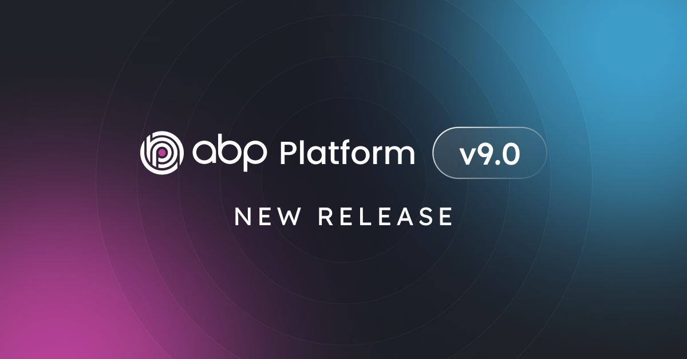
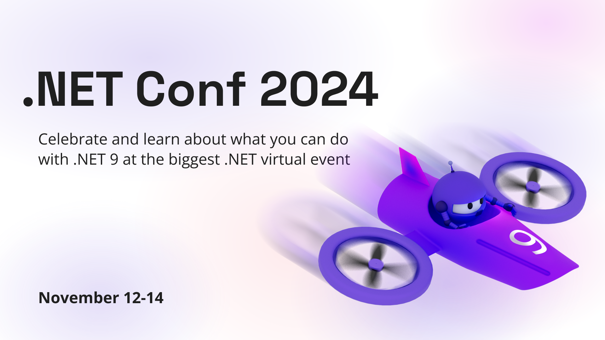
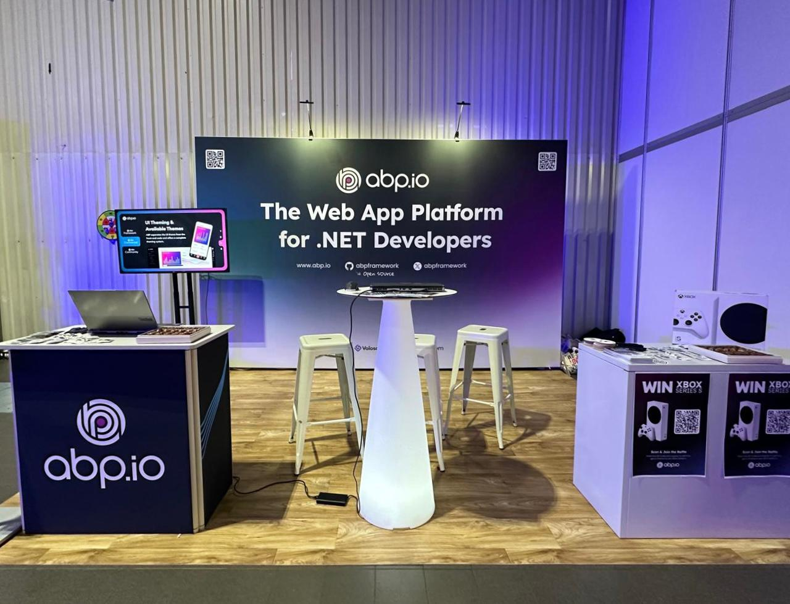
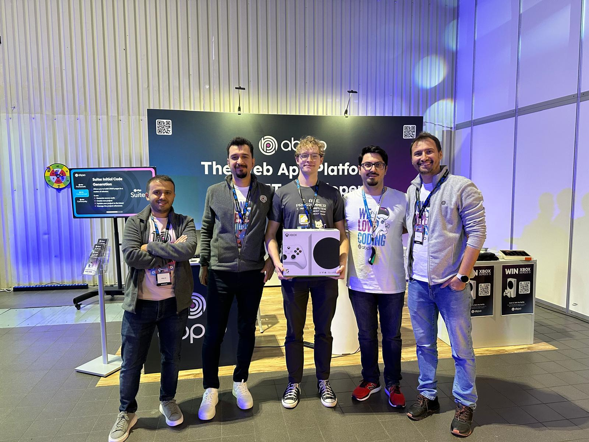

# ABP Platform 9.0 Has Been Released Based on .NET 9.0

Today, we are happy to release the [ABP](https://abp.io/) version **9.0 RC** (Release Candidate). This blog post introduces the new features and important changes in this new version.

Try this version and provide feedback for a more stable version of ABP v9.0! Thanks to all of you.

## Get Started with the 9.0 RC

You can check the [Get Started page](https://abp.io/get-started) to see how to get started with ABP. You can either download [ABP Studio](https://abp.io/get-started#abp-studio-tab) (**recommended**, if you prefer a user-friendly GUI application - desktop application) or use the [ABP CLI](https://abp.io/docs/latest/cli).

By default, ABP Studio uses stable versions to create solutions. Therefore, if you want to create a solution with a preview version, first you need to create a solution and then switch your solution to the preview version from the ABP Studio UI:

## Migration Guide

There are a few breaking changes in this version that may affect your application. Please read the migration guide carefully, if you are upgrading from v8.x: [ABP Version 9.0 Migration Guide](https://abp.io/docs/9.0/release-info/migration-guides/abp-9-0)

## What's New with ABP v9.0?

In this section, I will introduce some major features released in this version.
Here is a brief list of titles explained in the next sections:

* Upgraded to .NET 9.0
* Introducing the **Extension Property Policy**
* Allow wildcards for Redirect Allowed URLs
* Docs Module: Show larger images on the same page
* Google Cloud Storage BLOB Provider
* Removed React Native mobile option from free templates
* Suite: Better naming for multiple navigation properties to same entity
* CMS Kit Pro: Feedback feature improvements

### Upgraded to .NET 9.0

We've upgraded ABP to .NET 9.0, so you need to move your solutions to .NET 9.0 if you want to use ABP 9.0. You can check [Microsoft’s Migrate from ASP.NET Core 8.0 to 9.0 documentation](https://learn.microsoft.com/en-us/aspnet/core/migration/80-90), to see how to update an existing ASP.NET Core 8.0 project to ASP.NET Core 9.0.

> **Note:** Since the stable version of .NET 9 hasn't released yet, we upgraded ABP to .NET v9.0-rc.2. We will update the entire ABP Platform to .NET 9 stable, after Microsoft releases it on November 13-14 with the stable ABP 9.0 release.

### Introducing the Extension Property Policy

//TODO:...

### Allow Wildcards For RedirectAllowedURLs

//TODO:...

### Docs Module: Show Larger Images

//TODO:...

### Google Cloud Storage BLOB Provider

//TODO:...

### Removed React Native Mobile Option From Free Templates

//TODO:...

### Suite: Better Naming For Multiple Navigation Properties

//TODO:...

### CMS Kit Pro: Feedback Feature Improvements

//TODO:...

## Community News

### Join ABP at the .NET Conf 2024!

ABP is excited to sponsor the [14th annual .NET Conf](https://www.dotnetconf.net/)! We've proudly supported the .NET community for years and recognize the importance of this premier virtual event. Mark your calendars for November 12-14, 2024, and join us for 3 incredible days of learning, networking, and fun. 

Also, don't miss out on the co-founder of [Volosoft](https://volosoft.com/) and Lead Developer of [ABP](https://abp.io/), [Halil Ibrahim Kalkan](https://x.com/hibrahimkalkan)'s talk about "Building Modular Monolith Applications with ASP.NET Core and ABP Studio" at 10:00 - 10:30 AM GMT+3 on Thursday, November 14.

### ABP Team Attended the .NETDeveloperDays 2024

We are thrilled to announce that we sponsored the [.NETDevelopersDays 2024](https://developerdays.eu/warsaw/) event. It's one of the premier conferences for .NET developers with **Over 1.000 attendees**, **50+ expert speakers** and **40+ sessions and workshops**.

Core team members of the ABP Framework, [Halil Ibrahim Kalkan](https://twitter.com/hibrahimkalkan), [İsmail Çağdaş](https://x.com/ismcagdas), [Enis Necipoğlu](https://x.com/EnisNecipoglu), and [Tarık Özdemir](https://x.com/mtozdemir) attended [.NETDevelopersDays 2024](https://developerdays.eu/warsaw/) on October 22-23, 2024 at Warsaw, Poland.

These 2 days with the team were all about chatting and having fun with amazing attendees and speakers. We met with talented and passionate software developers and introduced the [ABP](https://github.com/abpframework/abp) - web application framework built on ASP.NET Core - to them.

Also, we made a raffle and gifted a Xbox Series S to the lucky winner at the event: 

Thanks to everyone who joined the fun!

### New ABP Community Articles

There are exciting articles contributed by the ABP community as always. I will highlight some of them here:

* [Alper Ebiçoğlu](https://twitter.com/alperebicoglu) has created **five** new community articles:
    * [When to Use Cookies, When to Use Local Storage?](https://abp.io/community/articles/when-to-use-cookies-when-to-use-local-storage-uexsjunf)
    * [.NET 9 Performance Improvements Summary](https://abp.io/community/articles/.net-9-performance-improvements-summary-gmww3gl8)
    * [ASP.NET Core SignalR New Features — Summary](https://abp.io/community/articles/asp.net-core-signalr-new-features-summary-kcydtdgq)
    * [Difference Between "Promise" and "Observable" in Angular](https://abp.io/community/articles/difference-between-promise-and-observable-in-angular-bxv97pkc)
    * [ASP.NET Core Blazor 9.0 New Features Summary 🆕](https://abp.io/community/articles/asp.net-core-blazor-9.0-new-features-summary--x0fovych)
* [Mohammad AlMohammad AlMahmoud](https://abp.io/community/members/Mohammad97Dev) has created **two** new community articles:
    * [Implementing Multi-Language Functionality With ABP Framework](https://abp.io/community/articles/implementing-multilanguage-functionality-with-abp-framework-loq7kfx4)
    * [Configure Quartz.Net in Abp FrameWork](https://abp.io/community/articles/configure-quartz.net-in-abp-framework-3bveq4y1)
* [.NET Aspire vs ABP Studio: Side by Side](https://abp.io/community/articles/.net-aspire-vs-abp-studio-side-by-side-t1c73d1l) by [Halil İbrahim Kalkan](https://twitter.com/hibrahimkalkan)
* [PoC of using GrapesJS for ABPs CMS Kit](https://abp.io/community/articles/poc-of-using-grapesjs-for-abps-cms-kit-1rmv4q41) by [Jack Fistelmann](https://abp.io/community/members/jfistelmann)
* [ABP-Powered Web App with Inertia.js, React, and Vite](https://abp.io/community/articles/abppowered-web-app-with-inertia.js-react-and-vite-j7cccvad) by [Anto Subash](https://antosubash.com/)
* [Multi-Tenancy Support in Angular Apps with ABP.IO](https://abp.io/community/articles/multitenancy-support-in-angular-apps-with-abp.io-lw9l36c5) by [HeadChannel Team](https://headchannel.co.uk/)

Thanks to the ABP Community for all the content they have published. You can also [post your ABP-related (text or video) content](https://abp.io/community/posts/submit) to the ABP Community.

## Conclusion

This version comes with some new features and a lot of enhancements to the existing features. You can see the [Road Map](https://abp.io/docs/9.0/release-info/road-map) documentation to learn about the release schedule and planned features for the next releases. Please try ABP v9.0 RC and provide feedback to help us release a more stable version.

Thanks for being a part of this community!