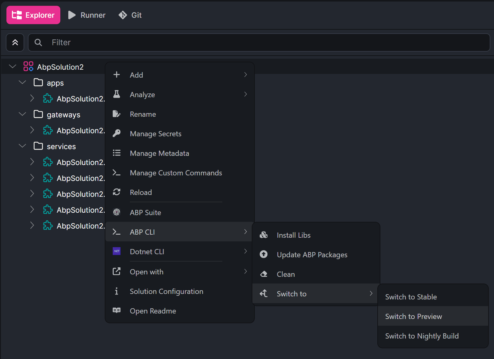
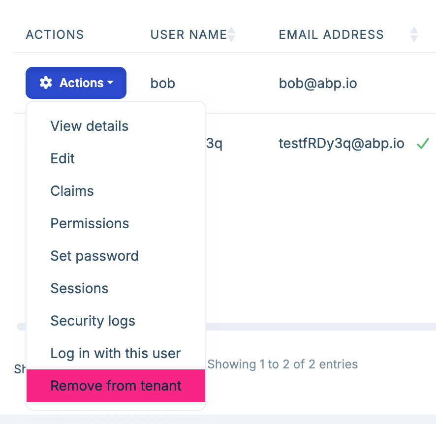

# ABP Platform 10.5 RC Has Been Released

We are happy to release [ABP](https://abp.io) version **10.5 RC** (Release Candidate). This blog post introduces the new features and important changes in this new version.

Try this version and provide feedback for a more stable version of ABP v10.5! Thanks to you in advance.

## Get Started with the 10.5 RC

You can check the [Get Started page](https://abp.io/get-started) to see how to get started with ABP. You can either download [ABP Studio](https://abp.io/get-started#abp-studio-tab) (**recommended**, if you prefer a user-friendly GUI application - desktop application) or use the [ABP CLI](https://abp.io/docs/latest/cli).

By default, ABP Studio uses stable versions to create solutions. Therefore, if you want to create a solution with a preview version, first you need to create a solution and then switch your solution to the preview version from the ABP Studio UI:



## Migration Guide

There are no explicitly marked breaking changes in this version. However, there are still some important migration notes for specific scenarios. Please check the migration guide if you are upgrading from v10.4 or earlier: [ABP Version 10.5 Migration Guide](https://abp.io/docs/10.5/release-info/migration-guides/abp-10-5).

## What's New with ABP v10.5?

In this section, I will introduce some major features released in this version.
Here is a brief list of titles explained in the next sections:

- S3-Compatible Blob Storage Support
- OpenIddict: Default Scope Fallback Options
- Dynamic Background Worker Capability Markers
- Account: Single-Active Token Provider Improvements
- CMS Kit: CodeMirror 6 Update
- Shared User Accounts: Remove Users from Tenants
- Dependency Updates

### S3-Compatible Blob Storage Support

ABP v10.5 improves the AWS Blob Storing provider so it can work with S3-compatible storage services such as Cloudflare R2, MinIO, Backblaze B2, Wasabi, and DigitalOcean Spaces.

Two new AWS blob provider configuration options are available:

- `ServiceURL`: Sets the custom S3-compatible service endpoint.
- `DisablePayloadSigning`: Sends `UNSIGNED-PAYLOAD` instead of streaming chunked signing when the target provider does not support AWS SDK v4's default payload signing behavior.

Example configuration:

```csharp
Configure<AbpBlobStoringOptions>(options =>
{
    options.Containers.ConfigureDefault(container =>
    {
        container.UseAws(aws =>
        {
            aws.AccessKeyId = "your-access-key";
            aws.SecretAccessKey = "your-secret-key";
            aws.ServiceURL = "https://<account-id>.r2.cloudflarestorage.com";
            aws.ContainerName = "my-container";
            aws.DisablePayloadSigning = true;
        });
    });
});
```

This is especially useful if you want to keep ABP's blob storing abstraction while using an S3-compatible provider instead of AWS S3 itself.

> See [#22962](https://github.com/abpframework/abp/pull/22962) for details.

### OpenIddict: Default Scope Fallback Options

ABP v10.5 adds opt-in default scope fallback options for OpenIddict token grants.

For `client_credentials`, `password`, and token-exchange grants, you can now configure ABP to use the scopes registered on the client application when the token request does not include a `scope` parameter.

The new options are disabled by default:

```csharp
Configure<AbpOpenIddictAspNetCoreOptions>(options =>
{
    options.UseDefaultScopesForClientCredentials = true;
    options.UseDefaultScopesForPassword = true;
    options.UseDefaultScopesForTokenExchange = true;
});
```

This gives applications more flexibility for machine-to-machine and integration scenarios while keeping the existing behavior unchanged unless you explicitly enable it.

> See [#25356](https://github.com/abpframework/abp/pull/25356) for details.

### Dynamic Background Worker Capability Markers

ABP v10.5 improves the dynamic background worker infrastructure with provider capability markers.

Consumers can now detect whether the active `IDynamicBackgroundWorkerManager` supports runtime registration and cron scheduling by checking marker interfaces:

- `ISupportsRuntimeRegistration`
- `ISupportsCronScheduling`

Hangfire and Quartz dynamic worker managers support both runtime registration and cron scheduling. The default in-memory manager supports runtime registration only, and now rejects cron expressions with a clearer error message. TickerQ's dynamic worker manager does not expose runtime dynamic scheduling support.

This is useful for modules and tools that need to adapt their UI or behavior based on the active background worker provider.

> See [#25397](https://github.com/abpframework/abp/pull/25397) for details.

### Account: Single-Active Token Provider Improvements

ABP continues improving token security in the [Account PRO module](https://abp.io/modules/account-pro).

In v10.5, the link-user token provider now uses ABP's single-active token infrastructure. Only the latest generated link-user token remains valid, and applications can configure the token lifetime through dedicated options.


The default ASP.NET Core Identity token provider used by ABP has also been replaced with an ABP single-active variant. Password-flow challenge tokens, such as two-factor and password-change challenge flows, are now single-active per user and purpose with a short default lifetime.

These changes help reduce the risk of old tokens remaining usable after a newer token has been issued.

> See [#25450](https://github.com/abpframework/abp/pull/25450) and [#25525](https://github.com/abpframework/abp/pull/25525) for details.

### CMS Kit: CodeMirror 6 Update

ABP v10.5 updates the `@abp/codemirror` package to CodeMirror 6.

The package keeps compatibility with existing ABP and CMS Kit integrations through a `window.CodeMirror.fromTextArea(...)` adapter while serving the updated bundled CodeMirror assets from the ABP package.

This modernizes the editor infrastructure used by CMS Kit and related UI features without requiring typical applications to change their CMS Kit usage.

> See [#25358](https://github.com/abpframework/abp/pull/25358) for details.

### Shared User Accounts: Remove Users from Tenants

ABP Commercial v10.5 RC improves shared user account administration with a new tenant-side removal action.

Administrators can now remove a shared user from the current tenant directly from the user management UI. This provides an admin-managed counterpart to the self-service leave flow and keeps shared-account administration easier to handle in multi-tenant systems.



### Dependency Updates

ABP v10.5 RC includes several dependency and package updates:

- Blazorise packages upgraded to **2.1.3**
- MongoDB.Driver upgraded to **3.9.0**
- CodeMirror updated to **6.0.2** through `@abp/codemirror`

> Check the [Package Version Changes](https://abp.io/docs/10.5/package-version-changes) document for all updates.

### Other Improvements and Enhancements

- **Permission Management + MySQL**: Fixed the `ResourcePermissionGrant` index length problem that could cause MySQL initial migration failures ([#25495](https://github.com/abpframework/abp/pull/25495)).
- **Distributed locking**: Removed a redundant cancellation-token fallback call in `MedallionAbpDistributedLock` ([#25497](https://github.com/abpframework/abp/pull/25497)).
- **Documentation and tooling**: Added a docs syntax check workflow for `docs/en` Markdown files ([#25415](https://github.com/abpframework/abp/pull/25415)).

## Community News

### New ABP Community Articles

As always, exciting articles have been contributed by the ABP community. I will highlight some of them here:

- [Fahri Gedik](https://abp.io/community/members/fahrigedik) has published 2 new articles:
    - [New Look for ABP React Native: NativeWind, Modernization & Two Sample Apps](https://abp.io/community/articles/new-abp-modern-react-native-template-rxjiyrpb)
    - [The Antidote to Vibe Architecting: ABP Studio AI Agent](https://abp.io/community/articles/the-antidote-to-vibe-architecting-abp-studio-ai-agent-mpdeh3gr)
- [Template In, Product Out: Building Hanova with the ABP AI Agent](https://abp.io/community/articles/template-in-product-out-building-hanova-with-the-abp-ai-hcntpk3j) by [Sumeyye Kurtulus](https://abp.io/community/members/sumeyye.kurtulus)
- [Empowering AI Agents with ABP Framework: A Comprehensive Skill Collection](https://abp.io/community/articles/abp-framework-ai-agent-skills-qccn87tu) by [Burak Demir](https://abp.io/community/members/burakdemir)
- [Google Pomelli: How to Market Your App Without Being a Designer](https://abp.io/community/articles/google-pomelli-how-to-market-your-app-1hu48pda) by [Engincan Veske](https://abp.io/community/members/EngincanV)
- [DevDays 2026 Conf From a Speaker's View](https://abp.io/community/articles/devdays-2026-conference-from-a-speakers-view-39d007hs) by [Alper Ebiçoğlu](https://abp.io/community/members/alper)

Thanks to the ABP Community for all the content they have published. You can also [post your ABP related (text or video) content](https://abp.io/community/posts/create) to the ABP Community.

## Conclusion

This version comes with some new features and a lot of enhancements to the existing features. You can see the [Road Map](https://abp.io/docs/10.5/release-info/road-map) documentation to learn about the release schedule and planned features for the next releases. Please try ABP v10.5 RC and provide feedback to help us release a more stable version.

Thanks for being a part of this community!
