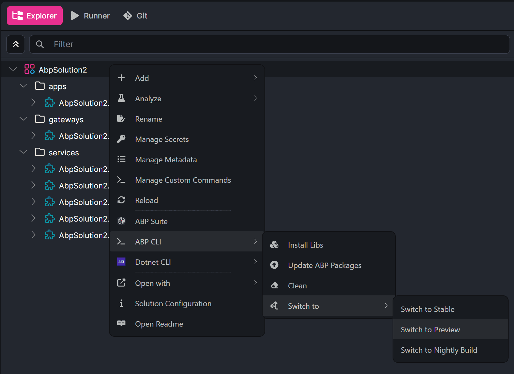

# ABP Platform 10.6 RC Has Been Released

We are happy to release [ABP](https://abp.io) version **10.6 RC** (Release Candidate). This blog post introduces the new features and important changes in this new version.

Try this version and provide feedback for a more stable version of ABP v10.6! Thanks to you in advance.

## Get Started with the 10.6 RC

You can check the [Get Started page](https://abp.io/get-started) to see how to get started with ABP. You can either download [ABP Studio](https://abp.io/get-started#abp-studio-tab) (**recommended**, if you prefer a user-friendly GUI application - desktop application) or use the [ABP CLI](https://abp.io/docs/latest/cli).

By default, ABP Studio uses stable versions to create solutions. Therefore, if you want to create a solution with a preview version, first you need to create a solution and then switch your solution to the preview version from the ABP Studio UI:



## Migration Guide

You can check the migration guide if you are upgrading from v10.5 or earlier: [ABP Version 10.6 Migration Guide](https://abp.io/docs/10.6/release-info/migration-guides/abp-10-6).

## What's New with ABP v10.6?

In this section, I will introduce some major features released in this version.
Here is a brief list of titles explained in the next sections:

- Background Jobs: Dedicated Workers, Parallel Execution, and Successful Job Retention
- API Definition and Proxy Improvements for Content Types and Multipart Uploads
- Angular UI: Upgrade to Angular 22
- Antiforgery and OpenIddict Security Improvements
- OpenIddict: Generate Access Token from the UI
- Dependency Updates

### Background Jobs: Dedicated Workers, Parallel Execution, and Successful Job Retention

ABP v10.6 adds three opt-in enhancements to the default background job worker. All of them are disabled by default, so existing applications keep the current behavior unless you enable them explicitly.

**Storing successful jobs**

By default, a job is deleted as soon as it runs successfully. You can now set `StoreSuccessfulJobs = true` to keep completed jobs in the store. A new `CompletionTime` column marks completed jobs, and a cleanup worker prunes them after `SuccessfulJobRetentionTime` (default: 7 days).

**Dedicated workers per job type**

`AddDedicatedWorker(...)` registers a worker that processes only the configured job argument types, each with its own distributed lock. The default worker continues handling all remaining job types.

**Parallel job execution**

Set `MaxParallelJobExecutionCount` greater than 1 to execute multiple jobs in the same poll cycle. In this mode, each job is claimed with its own distributed lock so different application instances can process different jobs concurrently without running the same job twice.

Example configuration:

```csharp
Configure<AbpBackgroundJobWorkerOptions>(options =>
{
    options.StoreSuccessfulJobs = true;
    options.SuccessfulJobRetentionTime = TimeSpan.FromDays(30);

    options.AddDedicatedWorker<EmailJobArgs, SmsJobArgs>("NotificationWorkerLock");
    options.AddDedicatedWorker<ReportJobArgs>("ReportWorkerLock");

    options.MaxParallelJobExecutionCount = 4;
});
```

These options are useful when you need better isolation between job types, higher throughput in clustered deployments, or an audit trail of successfully completed jobs.

> See the [Background Jobs](https://abp.io/docs/10.6/framework/infrastructure/background-jobs) documentation and [#25742](https://github.com/abpframework/abp/pull/25742) for details.

### API Definition and Proxy Improvements for Content Types and Multipart Uploads

ABP v10.6 improves API definition generation and client proxies for file upload scenarios and non-JSON response types.

The API definition now exposes response `ContentTypes` and an `IsRemoteStream` flag. C#, jQuery, and Angular proxies can use the declared media type instead of collapsing everything to `application/json` and `text/plain`.

For upload DTOs containing `IRemoteStreamContent`, generated Angular and jQuery proxies now forward `FormData` as multipart requests instead of silently dropping the file payload or trying to serialize the stream as JSON.

Server-side setup still follows the existing ABP pattern:

```csharp
Configure<AbpAspNetCoreMvcOptions>(options =>
{
    options.ConventionalControllers.FormBodyBindingIgnoredTypes.Add(typeof(UploadFileDto));
});
```

Angular client example after proxy regeneration:

```typescript
const fd = new FormData();
fd.append('Name', 'logo');
fd.append('File', fileInput.files[0], 'logo.png');
this.fileService.uploadFile(fd).subscribe(result => ...);
```

This closes long-standing gaps in generated proxies for stream-based uploads and improves support for text, blob, and custom response types.

> See [#25639](https://github.com/abpframework/abp/pull/25639) for details.

### Angular UI: Upgrade to Angular 22

ABP v10.6 upgrades the Angular UI stack to **Angular 22.0.x**.

This release also improves the locale loading mechanism with a fallback path, so culture resources load more reliably when optional locale files are missing or partially available.

If you maintain a custom Angular UI on top of ABP, plan for the Angular 22 upgrade together with your ABP package update and regenerate proxies after upgrading.

> See [#25690](https://github.com/abpframework/abp/pull/25690) and [#25734](https://github.com/abpframework/abp/pull/25734) for details.

### Antiforgery and OpenIddict Security Improvements

ABP v10.6 includes several security-focused fixes for mixed authentication scenarios.

**Antiforgery claim issuer normalization**

When an application serves a token-authenticated SPA and cookie-authenticated MVC pages on the same origin, antiforgery validation could fail because the user id claim issuer differed between JWT and cookie authentication schemes. ABP now normalizes the user id claim issuer while generating and validating antiforgery tokens.

This behavior is enabled by default through `AbpAntiForgeryOptions.NormalizeUserIdClaimIssuer`. Razor Pages antiforgery validation was also aligned with the same normalization logic, which fixes failures in modules such as Setting Management.

**Prevent OpenIddict `client_id` from leaking into the interactive auth cookie**

ABP fixed a case where an OpenIddict authorization request could stamp the requested `client_id` into the interactive authentication cookie during security-stamp refresh. That could corrupt audit logs and make later cookie-authenticated requests appear to belong to the OAuth client.

The fix strips `client_id` when the interactive cookie is refreshed. Tokens are unaffected, and cookies that were already corrupted self-heal on the next refresh.

**Forward the current access token for authenticated client requests**

`HttpContextAbpAccessTokenProvider` now forwards the incoming access token whenever the request is authenticated, including `client_credentials` requests. This prevents unnecessary fallback to configured identity clients in machine-to-machine scenarios.

> See [#25655](https://github.com/abpframework/abp/pull/25655), [#25669](https://github.com/abpframework/abp/pull/25669), [#25711](https://github.com/abpframework/abp/pull/25711), and [#25740](https://github.com/abpframework/abp/pull/25740) for details.

### OpenIddict: Generate Access Token from the UI

ABP Commercial v10.6 RC adds a **Generate Access Token** action to OpenIddict application management pages across MVC, Blazor, MudBlazor, and Angular UIs.

Administrators can request a token for an OpenIddict application directly from the UI. The backend forwards a `client_credentials` request to `/connect/token` and returns the generated access token to the caller.

This is especially useful for testing integrations, validating scopes, and troubleshooting machine-to-machine authentication without leaving the admin UI.

### Dependency Updates

ABP v10.6 RC includes several dependency and package updates:

- Angular packages upgraded to **22.0.x**
- `Microsoft.*` and `System.*` packages upgraded to **10.0.9**
- `Microsoft.Data.SqlClient` upgraded to **7.0.2**
- `Swashbuckle.AspNetCore` upgraded to **10.2.3**

> Check the [Package Version Changes](https://abp.io/docs/10.6/package-version-changes) document for all updates.

### Other Improvements and Enhancements

- **Permission management**: Skip dynamic permission initialization during migration runs to avoid noisy logs when the database is unavailable ([#25743](https://github.com/abpframework/abp/pull/25743)).
- **Security / principal access**: `ThreadCurrentPrincipalAccessor` now returns an anonymous principal instead of `null` in non-web contexts ([#25752](https://github.com/abpframework/abp/pull/25752)).
- **Angular proxy generation**: Array parameters are now generated as `readonly` in Angular proxies ([#25687](https://github.com/abpframework/abp/pull/25687)).
- **Date/time normalization**: Removed misleading warnings when normalizing `Unspecified` `DateTime` values near range boundaries ([#25703](https://github.com/abpframework/abp/pull/25703)).
- **AI Management**: Indexing is more resilient under memory pressure in the commercial module.

## Community News

### New ABP Community Articles

As always, exciting articles have been contributed by the ABP community. I will highlight some of them here:

- [ABP 10.5.0 Expands Blazor UI Options with MudBlazor Support](https://abp.io/community/articles/abp-10.5.0-expands-blazor-ui-options-with-mudblazor-support-03rzmlpm) by [Liming Ma](https://abp.io/community/members/maliming)
- [Angular 22 State Management: Signals, SignalStore, or NgRx?](https://abp.io/community/articles/angular-22-state-management-signals-signalstore-or-ngrx-yq8zg0nw) by [Sumeyye Kurtulus](https://abp.io/community/members/sumeyye.kurtulus)
- [Working with Dapr Workflows in the ABP Framework](https://abp.io/community/articles/working-with-dapr-workflows-in-the-abp-framework-6476or18) by [Engincan Veske](https://abp.io/community/members/EngincanV)
- [My Speaker's View of CONVEX Summit 2026](https://abp.io/community/articles/my-speakers-view-of-convex-summit-2026-ai-net-conference-3uk6ln1l) by [Alper Ebiçoğlu](https://abp.io/community/members/alper)

Thanks to the ABP Community for all the content they have published. You can also [post your ABP related (text or video) content](https://abp.io/community/posts/create) to the ABP Community.

### ABP Summer Campaign: Get Up To 20% Off + $300 in AI Credits


Summer is a great time to start building with ABP. From **July 6 to July 20**, we're offering exclusive summer savings on **ABP licenses and renewals**: **20% off new licenses**, **10% off renewals**, and **up to $300 in AI credits** for the **ABP AI Agent** in **ABP Studio**. Whether you're starting a new project or upgrading your development workflow, this limited-time offer helps you save on your license while accelerating development with AI.

> You can read the announcement here: [ABP Summer Campaign: Get Up To 20% Off + $300 in AI Credits](https://abp.io/community/announcements/abp-summer-campaign-get-up-to-20-off-300-in-ai-credits-r5lqtpg9).

## Conclusion

This version comes with some new features and a lot of enhancements to the existing features. You can see the [Road Map](https://abp.io/docs/10.6/release-info/road-map) documentation to learn about the release schedule and planned features for the next releases. Please try ABP v10.6 RC and provide feedback to help us release a more stable version.

Thanks for being a part of this community!