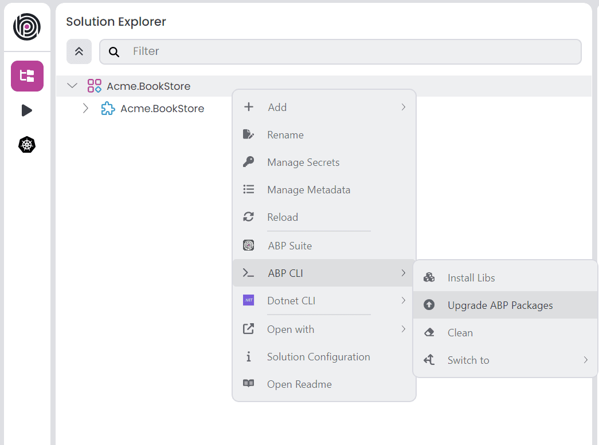

# ABP.IO Platform 10.6 Final Has Been Released!

We are glad to announce that [ABP](https://abp.io/) 10.6 stable version has been released.

## What's New With Version 10.6?

All the new features were explained in detail in the [10.6 RC Announcement Post](https://abp.io/community/announcements/abp-platform-10.6-rc-has-been-released-reoq6kzw), so there is no need to review them all again. You can check it out for more details.

Here are some of the highlights of this version:

- Background jobs now support dedicated workers, parallel execution, and successful job retention.
- API definition and generated proxies have better support for response content types, remote streams, and multipart uploads.
- Angular UI packages and templates have been upgraded to Angular 22.
- Antiforgery and OpenIddict flows include important security and reliability improvements.
- ABP Commercial adds OpenIddict access-token generation from the UI and React CRUD page generation support in ABP Suite.
- AI Management indexing is more resilient for large or memory-constrained workloads.
- The final release also includes dependency updates and stability fixes collected during the RC period.

## Getting Started with 10.6

### How to Upgrade an Existing Solution

You can upgrade your existing solutions with either ABP Studio or ABP CLI. In the following sections, both approaches are explained:

### Upgrading via ABP Studio

If you are already using the ABP Studio, you can upgrade it to the latest version. ABP Studio periodically checks for updates in the background, and when a new version of ABP Studio is available, you will be notified through a modal. Then, you can update it by confirming the opened modal. See [the documentation](https://abp.io/docs/latest/studio/installation#upgrading) for more info.

After upgrading the ABP Studio, then you can open your solution in the application, and simply click the **Upgrade ABP Packages** action button to instantly upgrade your solution:



### Upgrading via ABP CLI

Alternatively, you can upgrade your existing solution via ABP CLI. First, you need to install the ABP CLI or upgrade it to the latest version.

If you haven't installed it yet, you can run the following command:

```bash
dotnet tool install -g Volo.Abp.Studio.Cli
```

Or to update the existing CLI, you can run the following command:

```bash
dotnet tool update -g Volo.Abp.Studio.Cli
```

After installing/updating the ABP CLI, you can use the [`update` command](https://abp.io/docs/latest/CLI#update) to update all the ABP related NuGet and NPM packages in your solution as follows:

```bash
abp update
```

You can run this command in the root folder of your solution to update all ABP related packages.

## Migration Guides

This version includes explicitly marked migration-impacting changes for specific customization scenarios, especially custom background job stores/workers and custom AI Management document chunk repositories. The new background job runtime features are opt-in and existing applications keep the current behavior unless they enable them explicitly.

Please read the migration guide carefully, if you are upgrading from v10.5 or earlier versions: [ABP Version 10.6 Migration Guide](https://abp.io/docs/10.6/release-info/migration-guides/abp-10-6)

If you use the Angular UI, also check the dedicated [Angular 22 and ABP 10.6 Upgrade Guide](https://abp.io/docs/10.6/release-info/migration-guides/abp-10-6-angular-22).

## Community News

### New ABP Community Articles

As always, exciting articles have been contributed by the ABP community. I will highlight some of them here:

- [Angular 22 State Management: Signals, SignalStore, or NgRx?](https://abp.io/community/articles/angular-22-state-management-signals-signalstore-or-ngrx-yq8zg0nw) by [Sumeyye Kurtulus](https://abp.io/community/members/sumeyye.kurtulus)
- [Working with Dapr Workflows in the ABP Framework](https://abp.io/community/articles/working-with-dapr-workflows-in-the-abp-framework-6476or18) by [Engincan Veske](https://abp.io/community/members/EngincanV)
- [Customizing the ABP Framework: A Developer's Guide to LeptonX Theme Overrides in Angular and the Transition to React UI](https://abp.io/community/articles/customizing-the-abp-framework-a-developers-guide-to-nklweri3) by [Sumeyye Kurtulus](https://abp.io/community/members/sumeyye.kurtulus)
- [Deep Dive on ABP AI Agent: The Complete Series](https://abp.io/community/articles/deep-dive-on-abp-ai-agent-the-complete-series-f7jute7n) by [Berkan Sasmaz](https://abp.io/community/members/berkansasmaz)
- [ABP 10.5.0 Expands Blazor UI Options with MudBlazor Support](https://abp.io/community/articles/abp-10.5.0-expands-blazor-ui-options-with-mudblazor-support-03rzmlpm) by [Liming Ma](https://abp.io/community/members/maliming)

Thanks to the ABP Community for all the content they have published. You can also [post your ABP related (text or video) content](https://abp.io/community/posts/create) to the ABP Community.

## About the Next Version

The next feature version will be 10.7. You can follow the [release planning here](https://github.com/abpframework/abp/milestones). Please [submit an issue](https://github.com/abpframework/abp/issues/new) if you have any problems with this version.
