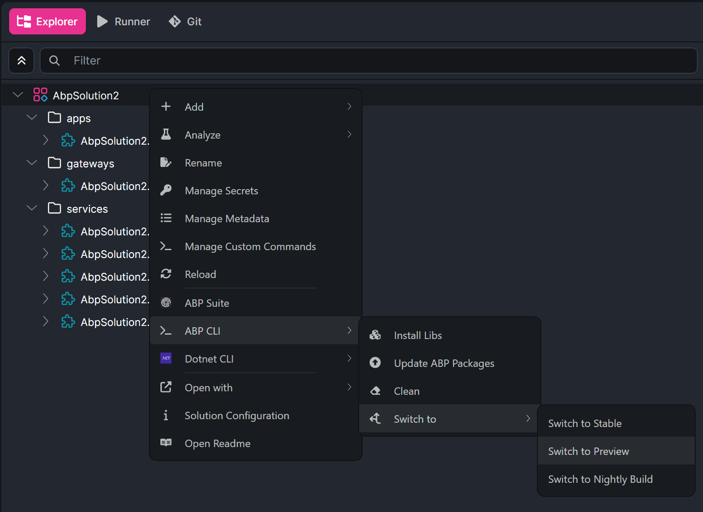

# ABP Platform 10.7 RC Has Been Released

We are happy to release [ABP](https://abp.io) version **10.7 RC** (Release Candidate). This blog post introduces the new features and important changes in this version.

Try this version and provide feedback to help us deliver a more stable ABP v10.7 release. Thanks in advance!

## Get Started with the 10.7 RC

You can check the [Get Started page](https://abp.io/get-started) to see how to get started with ABP. You can either download [ABP Studio](https://abp.io/get-started#abp-studio-tab) or use the [ABP CLI](https://abp.io/docs/latest/cli).

By default, ABP Studio uses stable versions to create solutions. To use a preview version, create your solution and then switch it to the preview version from the ABP Studio UI.



## Migration Guide

There are no explicitly marked breaking changes in ABP v10.7 RC. You can check the [ABP Version 10.7 Migration Guide](https://abp.io/docs/10.7/release-info/migration-guides/abp-10-7) if you are upgrading from v10.6 or earlier.

## What's New with ABP v10.7?

In this section, I will introduce some major features released in this version.
Here is a brief list of the topics explained in the next sections:

- BLOB Encryption at Rest and Content Pipeline
- HTTP QUERY Method Support
- Angular Resource API Helpers
- ABP Suite React CRUD Page Generation
- ABP Studio MCP Configuration
- Reliability and Dependency Updates

### BLOB Encryption at Rest and Content Pipeline

ABP v10.7 adds opt-in, transparent encryption at rest for the BLOB Storing system. Encryption uses AES-256-GCM and works on top of the configured storage provider, so application code can continue using `IBlobContainer` as before.

You can enable encryption per container and configure the passphrase from your application's secure configuration:

```csharp
Configure<AbpBlobStoringOptions>(options =>
{
    options.Containers.Configure<ProfilePictureContainer>(container =>
    {
        container.UseEncryption();
    });
});

Configure<AbpBlobStoringEncryptionOptions>(options =>
{
    options.DefaultPassPhrase = context.Configuration["MyApp:BlobPassPhrase"];
});
```

The new BLOB content pipeline lets you transparently transform content when it is saved and read. You can create contributors for compression, validation, watermarking, or other stream transformations without changing the storage provider or the code that uses the container.

Both features are disabled by default. When enabling encryption for a container that already contains plaintext BLOBs, first allow legacy plaintext reads, re-save the existing content, and then remove the legacy option so the container reads encrypted data only.

> See the [BLOB Encryption](https://abp.io/docs/10.7/framework/infrastructure/blob-storing/encryption) and [BLOB Content Pipeline](https://abp.io/docs/10.7/framework/infrastructure/blob-storing/pipeline) documents, and [#25836](https://github.com/abpframework/abp/pull/25836), for details.

### HTTP QUERY Method Support

ABP now supports the HTTP `QUERY` method for endpoints that need to send request data without using a query string. A `QUERY` endpoint is treated as a safe method: it is excluded from audit logging and starts a non-transactional unit of work by default, like `GET`.

To expose an action as a `QUERY` endpoint, use the ASP.NET Core `[AcceptVerbs("QUERY")]` attribute. Because the method carries a request body, it still requires an anti-forgery token.

> See the [Auto API Controllers](https://abp.io/docs/10.7/framework/api-development/auto-controllers#http-method) documentation and [#25797](https://github.com/abpframework/abp/pull/25797) for details.

### Angular Resource API Helpers

The Angular proxy generator can now generate optional Resource API helpers for `GET` endpoints. Use the `--resource-api` option with the proxy generator to add `rxResource` helpers while keeping the existing Observable-based services.

This option requires Angular 22 or later and is disabled by default, so existing generated proxies continue to work without changes.

> See the [Angular Service Proxies](https://abp.io/docs/10.7/framework/ui/angular/service-proxies) documentation and [#25761](https://github.com/abpframework/abp/pull/25761) for details.

### ABP Suite React CRUD Page Generation

ABP Suite now supports generating CRUD pages for React applications, bringing the same productive code-generation experience available for other ABP UI options to React projects.

Generated React pages include list, search, sorting, paging, filtering, export, create, edit, single and bulk delete operations. They also support validation, permissions, localization, file upload, navigation properties, many-to-many relationships, and master-detail pages with child create, edit, delete, and paging operations.

The generator respects the entity and field configuration you define in ABP Suite, including `ShowOn*`, `IsFilterable`, and `ReadonlyOnEdit` options. Navigation lookups use server-side search, and navigation and many-to-many filters are generated for EF Core solutions.


### ABP Studio MCP Configuration

ABP Studio provides a simpler experience for configuring Model Context Protocol (MCP) integrations. You can add common integrations through focused configuration forms or manage the complete MCP server list as JSON, with support for secret placeholders and secure platform storage.

> See the [ABP Studio AI Agent configuration](https://abp.io/docs/10.7/studio/ai-agent-configuration) documentation and [#25870](https://github.com/abpframework/abp/pull/25870) for details.

### Reliability and Dependency Updates

This release also includes important reliability improvements:

- BLOB storage providers have improved support for transformed and non-seekable streams.
- Identity session cleanup now uses the sign-in time when a session has not yet recorded a last-accessed time, preventing valid token sessions from being removed too early.
- ABP templates place `UseAntiforgery()` after `UseAuthorization()`, as required by ASP.NET Core.
- MudBlazor packages have been upgraded to **9.7.0**.

> Check the [Package Version Changes](https://abp.io/docs/10.7/package-version-changes) document for all dependency updates.

## Conclusion

ABP v10.7 RC introduces BLOB encryption and a content pipeline, HTTP QUERY support, Angular Resource API helpers, and new ABP Suite and ABP Studio capabilities. Please try the release and provide feedback to help us finalize ABP v10.7.

For the complete list of changes, see the [ABP 10.7.0-rc.1 release notes](https://github.com/abpframework/abp/releases/tag/10.7.0-rc.1).
