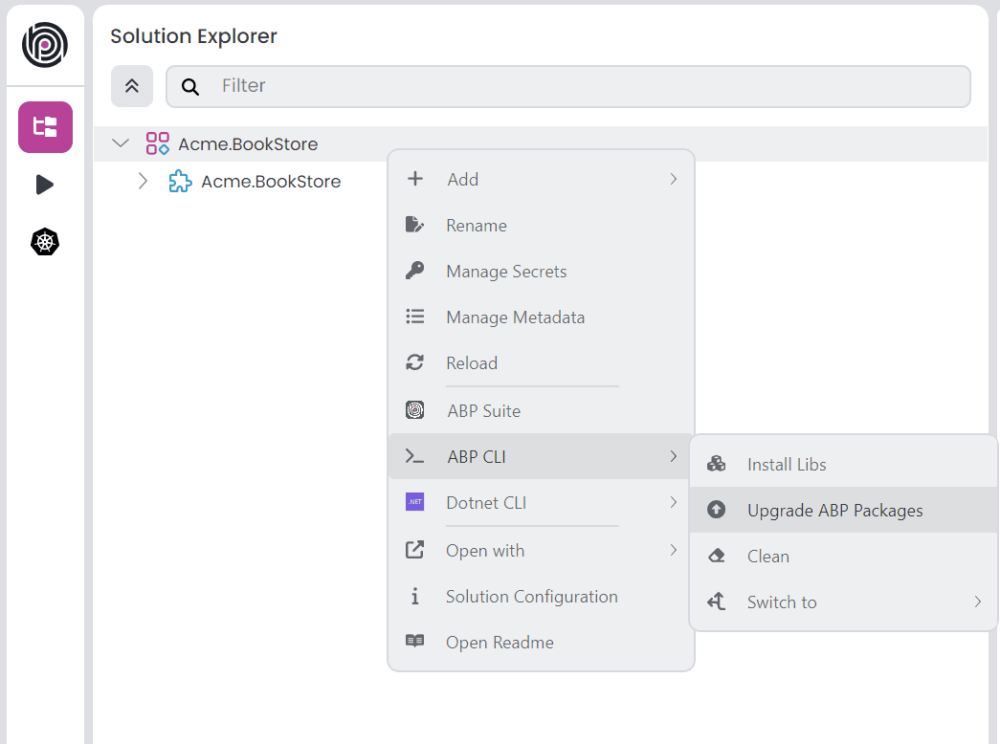

# ABP.IO Platform 10.7 Final Has Been Released!

We are glad to announce that [ABP](https://abp.io/) 10.7 stable version has been released.

## What's New With Version 10.7?

All the new features were explained in detail in the [10.7 RC Announcement Post](https://abp.io/community/announcements/abp-platform-10.7-rc-has-been-released-2u85sb02), so there is no need to review them all again. You can check it out for more details.

Here are some of the highlights of this version:

- BLOB storing adds opt-in encryption at rest (AES-256-GCM) and a content pipeline for transparent stream transformations.
- HTTP `QUERY` method support for safe endpoints that send a request body without a query string.
- Angular proxy generation can optionally target the Resource API (`--resource-api`) for `rxResource`-based `GET` members.
- ABP Suite generates CRUD pages for React applications in modern solutions, including master-detail and many-to-many scenarios.
- ABP Suite supports decimal precision and scale for entity properties.
- ABP Studio simplifies MCP (Model Context Protocol) configuration for AI agent integrations.
- AI Management workspaces can index web page URLs as data sources and suggest provider model names.
- Identity token providers moved to the domain layer so token generation and validation stay consistent across hosts.
- The final release also includes dependency updates (including OpenIddict 7.7.0, MudBlazor 9.7.0, and Blazorise 2.3.0) and stability fixes collected during the RC period.

## Getting Started with 10.7

### How to Upgrade an Existing Solution

You can upgrade your existing solutions with either ABP Studio or ABP CLI. In the following sections, both approaches are explained:

### Upgrading via ABP Studio

If you are already using the ABP Studio, you can upgrade it to the latest version. ABP Studio periodically checks for updates in the background, and when a new version of ABP Studio is available, you will be notified through a modal. Then, you can update it by confirming the opened modal. See [the documentation](https://abp.io/docs/latest/studio/installation#upgrading) for more info.

After upgrading the ABP Studio, then you can open your solution in the application, and simply click the **Upgrade ABP Packages** action button to instantly upgrade your solution:



### Upgrading via ABP CLI

Alternatively, you can upgrade your existing solution via ABP CLI. First, you need to install the ABP CLI or upgrade it to the latest version.

If you haven't installed it yet, you can run the following command:

```bash
dotnet tool install -g Volo.Abp.Studio.Cli
```

Or to update the existing CLI, you can run the following command:

```bash
dotnet tool update -g Volo.Abp.Studio.Cli
```

After installing/updating the ABP CLI, you can use the [`update` command](https://abp.io/docs/latest/CLI#update) to update all the ABP related NuGet and NPM packages in your solution as follows:

```bash
abp update
```

You can run this command in the root folder of your solution to update all ABP related packages.

## Migration Guides

This version includes explicitly marked migration-impacting changes for specific customization scenarios, especially derived Identity / session services, Blazor antiforgery middleware order, Identity token providers moved to the domain layer, dynamic background job and event tenancy, and the AI Management schema change that requires a new EF Core migration. Opt-in features such as BLOB encryption and Angular `--resource-api` proxies do not change existing applications unless you enable them.

Please read the migration guide carefully, if you are upgrading from v10.6 or earlier versions: [ABP Version 10.7 Migration Guide](https://abp.io/docs/10.7/release-info/migration-guides/abp-10-7)

## Community News

### New ABP Community Articles

As always, exciting articles have been contributed by the ABP community. I will highlight some of them here:

- [Tips for Developers New to ABP Framework](https://abp.io/community/articles/tips-for-developers-new-to-abp-framework-vku6bzh2) by [Alper Ebicoglu](https://abp.io/community/members/alper)
- [We Built the Workspace Our AI Agents Actually Needed, Then Ran Our Own Company On It](https://abp.io/community/articles/volobox-the-workspace-our-ai-agents-actually-needed-xzaononm) by [Engincan Veske](https://abp.io/community/members/EngincanV)
- [BYOK: Use Your Own AI Models in ABP Studio AI Agent](https://abp.io/community/articles/bring-your-own-key-use-your-own-ai-models-in-abp-studio-ai-04g19x7f) by [Alper Ebicoglu](https://abp.io/community/members/alper)

Thanks to the ABP Community for all the content they have published. You can also [post your ABP related (text or video) content](https://abp.io/community/posts/create) to the ABP Community.

## About the Next Version

The next feature version will be 10.8. You can follow the [release planning here](https://github.com/abpframework/abp/milestones). Please [submit an issue](https://github.com/abpframework/abp/issues/new) if you have any problems with this version.
