# A New Look for ABP React Native: NativeWind, Modernization & Two Sample Apps

## Introduction

Mobile is increasingly the first surface users meet a product on, and the bar for what a mobile UI is supposed to look and feel like has moved a lot in the last few years. ABP has had a solid React Native template for a long time, but "solid" and "modern" are not the same thing — and the gap was starting to show.

If you've been following ABP's mobile story, you know the React Native template has been useful but a bit stuck in time: a wall of `StyleSheet.create()` blocks per screen, inline color literals, a mixed `.js` / `.tsx` codebase, and a navigator tree that carried features most teams never used. This post is about what changed, why we changed it, and what's next.

We approached the refresh in two passes: first a thorough cleanup of legacy screens, dead components, and unused locales, and then a full styling-layer rewrite around NativeWind v4 with a shadcn-style design token system. Along the way we also built two sample apps on top of the new template, so the changes aren't just theoretical — they've been exercised against real screens and real flows.

The changes ship to both the **`react-native`** template and the **`microservice/apps/mobile/react-native`** template, so layered, single-layer (no-layers), and microservice solutions all get the same modernized mobile experience.

## Why we modernized

The previous template used React Native Paper plus hand-written `StyleSheet.create()` objects under every component. That works, but it has a real cost over time:

- **No design tokens.** Spacing, radii, and colors lived as raw numbers and hex strings scattered across screens. Changing one accent color meant touching dozens of files.
- **Dark mode was a manual switch.** Every screen had to read theme colors and pass them down through `style` props — easy to forget, easy to drift.
- **Dead code accumulated.** Older tenant management, dashboard widgets, and SVG illustrations had built up — useful in 2021, but mostly noise in 2026.
- **Mixed JS/TS.** Some screens were still plain `.js`, which got in the way of type safety and consistent tooling.

We wanted the same outcome a modern web template gives you: open a screen, see structured layout, see semantic class names, change one token in a config file and watch it ripple everywhere. NativeWind v4 lets us bring that exact feel to React Native — Tailwind CSS class names compile at build time, so the runtime stays small and predictable.

## Part 1 — Template cleanup

Before the styling rewrite, the template needed a serious trim.

**Removed (legacy / unused):**

- `Dashboard/` (HostDashboard, TenantDashboard, EditionUsageWidget, ErrorRateWidget) — these widgets were demo-only and rarely fit real apps.
- `CreateUpdateTenant/`, `CreateUpdateUser/`, `TenantsNavigator`, `UsersNavigator` — full administrative CRUD belongs in the admin UI, not on mobile.
- Long tail of one-off components: `DataList`, `DateRangePicker`, `Select`, `ListMenu`, `LoadingButton`, `TenantBox`, `AddIcon`, `CancelButton`, `NoRecordSvg`, `AnalysisSvg`.
- Hooks: `UsePermission`, `UseAuthAndTokenExchange`, `UseLocalizedTitle`, `PermissionHOC`.
- 18 of 20 locale files. Only **`en`** and **`tr`** ship by default — the rest are easy to add back per project, but bundling 20 locales no one ships was waste.

**Added / upgraded:**

- New **`LoginScreen.tsx`** (replacing the legacy `LoginScreen.js`), plus brand-new `RegisterScreen`, `ForgotPasswordScreen`, and `ResetPasswordScreen` — the full account flow is now first-class.
- **`AppContainer.tsx` / `AppContent.tsx`** split, so app-level providers and bootstrapping are cleanly separated from navigation.
- **`app.config.js`** replacing the static `app.json`, enabling environment-driven Expo config.
- **`scripts/tunnel.js`** — automates the Cloudflare tunnel flow we covered in [Automate Localhost Access for Expo](https://abp.io/community/articles/automate-localhost-access-for-expo-a-guide-to-dynamic-7cblqtj3).
- New docs: `docs/UPGRADE.md` and `docs/permission-guide.md`.

The result: a smaller, sharper template that fits how teams actually use ABP on mobile today.

## Part 2 — NativeWind v4 and a new visual system

With the template trimmed, the styling layer got a full modernization.

**The stack:**

- **NativeWind v4** — Tailwind CSS for React Native. Class names compile at build time, so the runtime cost is minimal.
- **Tailwind CSS 3.4** — single source of truth for design tokens via `tailwind.config.js`.
- **shadcn-style neutral palette** — zinc-based color system with semantic tokens (`background`, `foreground`, `card`, `muted`, `accent`, `border`, `destructive`). Same vocabulary you already know from the web template.
- **React Native Paper** is still in the box, but **only for `TextInput`** (outlined mode, error states, icons). Everything else moved to NativeWind.
- **Ionicons** (`@expo/vector-icons`) replaces Paper icons across the UI.

**What this looks like in practice:**

```tsx
// Before — separate styles object, inline colors
<View style={styles.card}>
  <Text style={styles.title}>{title}</Text>
</View>

const styles = StyleSheet.create({
  card: { padding: 16, backgroundColor: '#fff', borderRadius: 12, /* ... */ },
  title: { fontSize: 18, fontWeight: '600', color: '#18181b' },
});

// After — class names, dark mode included
<View className="p-4 bg-card rounded-xl border border-border">
  <Text className="text-lg font-semibold text-foreground">{title}</Text>
</View>
```

That `dark:` variant is the big quality-of-life win. Dark mode is no longer something each screen has to handle by hand — it's a config-level concern, applied through semantic tokens, and consistent across every surface. Here's the new `LoginScreen` in both modes — same code, same components, just the theme switch flipped:

<table>
  <tr>
    <td align="center" width="50%">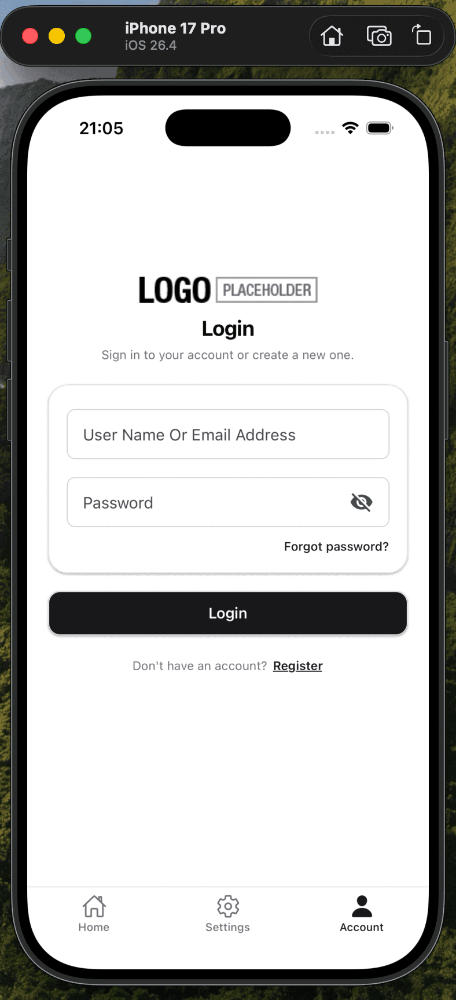<br/><sub><b>Light</b></sub></td>
    <td align="center" width="50%">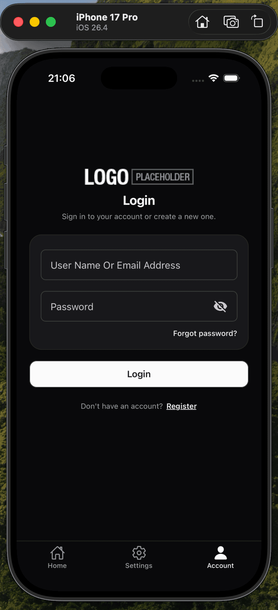<br/><sub><b>Dark</b></sub></td>
  </tr>
</table>

**Visual touches that come along for the ride:**

- **Hero `HomeScreen`** with the app logo and feature cards.
- **iOS-style grouped settings cards** in `SettingsScreen`.
- **Centered card containers + logo headers** on login / register / password screens.
- `src/theme/spacing.ts` and `src/theme/shape.ts` are gone — those tokens now live in `tailwind.config.js` where they belong.

### Navigation, rethought

Navigation is where the template change is felt the most. The old template gave you a single drawer menu and that was it — everything lived behind a hamburger. The new template keeps the drawer but adds a proper **`BottomTabNavigator`** alongside it, plus an **`AccountNavigator`** for the user/account area. That brings the navigation in line with what users actually expect from a modern mobile app: primary destinations one tap away on the bottom tab bar, secondary destinations and global actions tucked into the drawer.

<table>
  <tr>
    <td align="center" width="33%">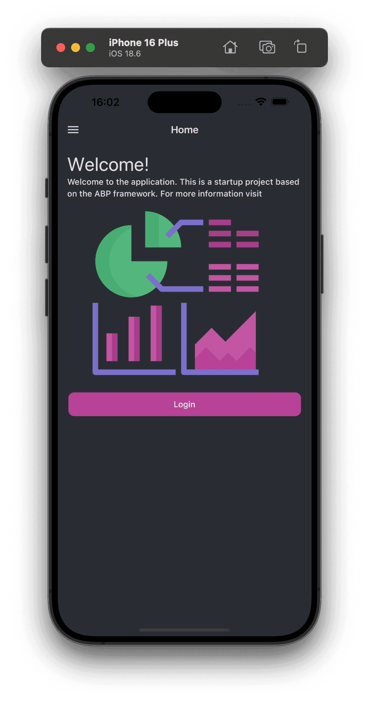<br/><sub><b>Before</b> — single drawer menu</sub></td>
    <td align="center" width="33%">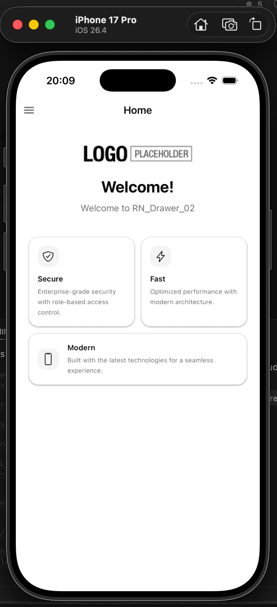<br/><sub><b>After</b> — revamped drawer</sub></td>
    <td align="center" width="33%">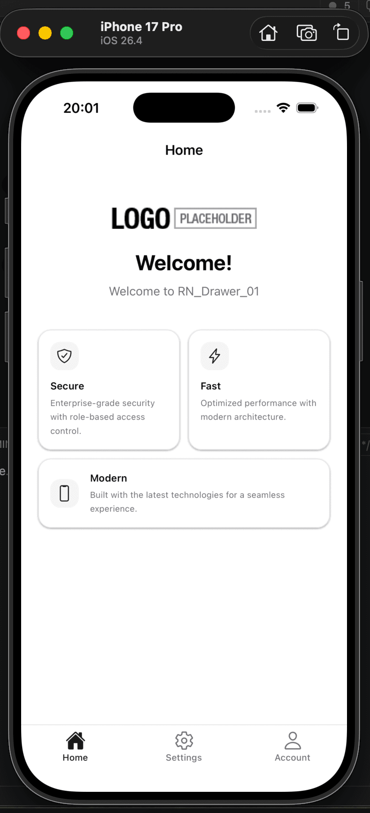<br/><sub><b>After</b> — new bottom tab bar</sub></td>
  </tr>
</table>

## Two sample apps we built

To stress-test the new template and to give the community something concrete to learn from, we built **two sample apps** on top of it:

### Habit Tracker — a minimal demo

I built **Habit Tracker** — a single-feature demo where you keep a list of daily habits and tick them off as you go through your day. Build a habit, mark it done, watch the streak grow. That's the whole loop.

The point here wasn't to ship a feature-rich productivity tool, it was to show the smallest meaningful surface you can build on top of the new template without losing the auth flow, theming, or navigation defaults. Everything around your one feature — login/register, drawer + bottom tab navigation, light/dark mode, localized strings — comes from the template. You add the feature, and the template carries everything else.

<table>
  <tr>
    <td align="center" width="33%">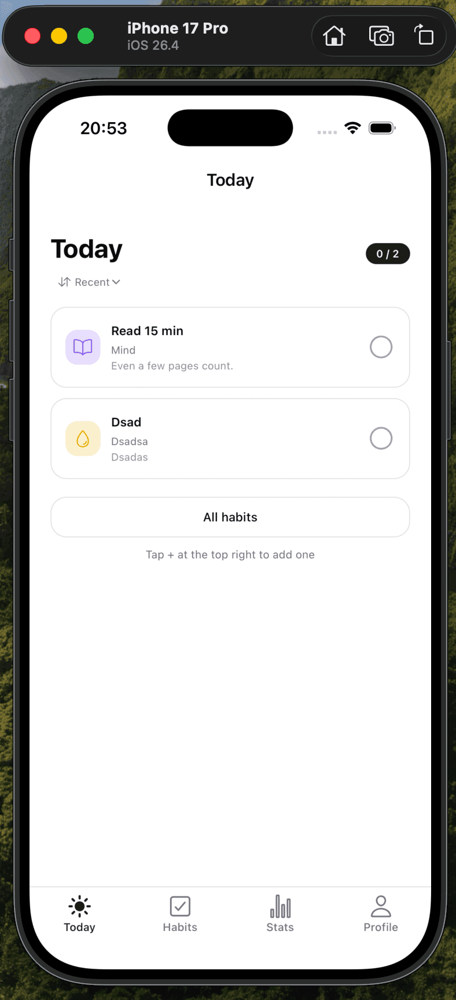</td>
    <td align="center" width="33%">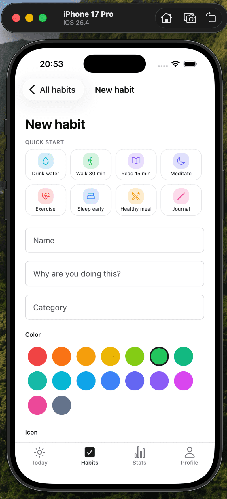</td>
    <td align="center" width="33%">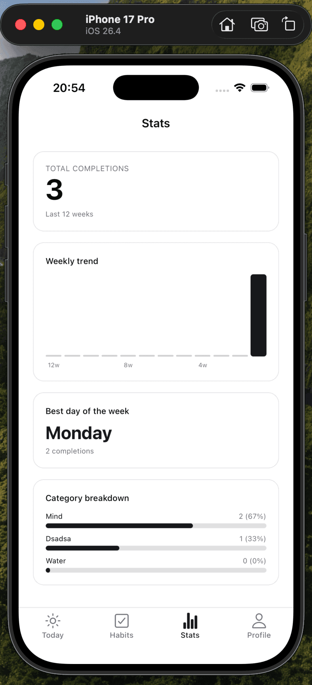</td>
  </tr>
</table>

### Hanova — a home-services demo

We have also built **Hanova** that is a two-sided home-services sample where customers find local providers, request a job, negotiate the price, and chat through to confirmation. Pick a role, log in, browse open work or open requests, accept a booking, message the other party. That's basically the loop.

The point here wasn't about shipping a full Uber-for-plumbers product, but it was to show a **realistic but focused** domain you can grow on top of the ABP single-layer template without rebuilding authentication, navigation, or theming from scratch. Everything around the marketplace — login/register, role selection, bottom-tab navigation, light/dark mode, localized strings, OAuth, and API wiring — comes from the template. You add the booking flow (discovery, job feed, negotiation, messaging), and the template carries everything else. Two pre-seeded personas (`ayse.kaya` / `mehmet.yilmaz`, password `Demo@1234`) populate every screen on first launch so you can explore both sides immediately.

<table>
  <tr>
    <td align="center" width="33%">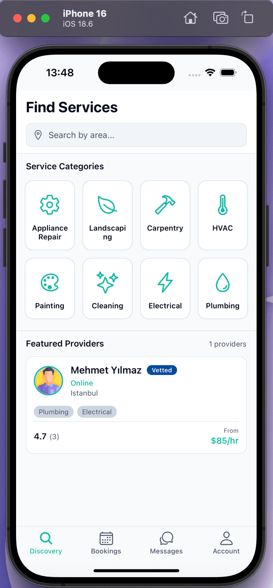</td>
    <td align="center" width="33%">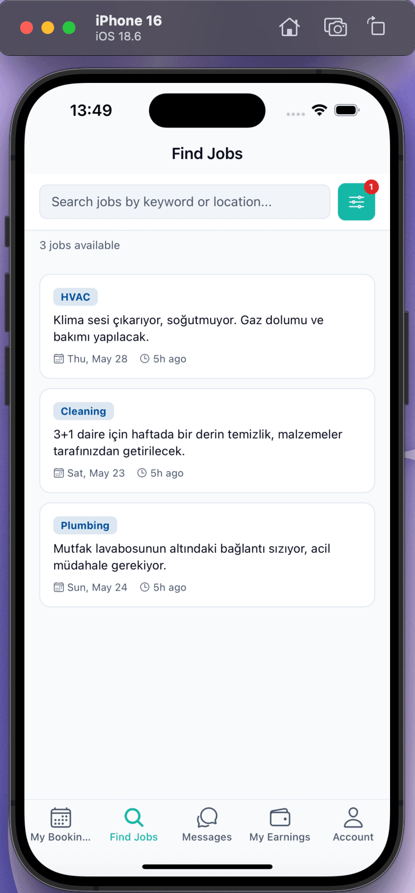</td>
    <td align="center" width="33%">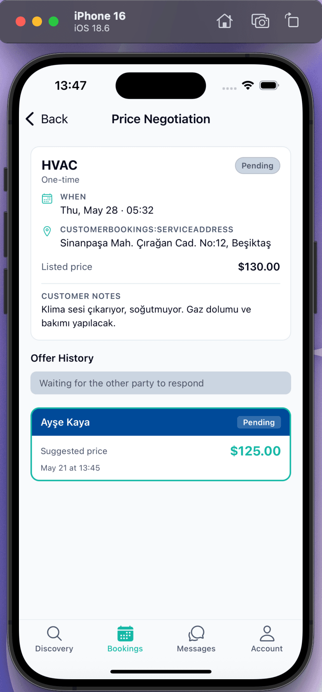</td>
  </tr>
</table>

Both apps will be available shortly — they're useful as reference implementations, and they're also useful as a kind of regression check on the template itself.

## Try it yourself

If you're starting fresh, you'll pick up the new template automatically. The easiest way is through **ABP Studio** — just enable the mobile platform and pick **React Native** from the wizard:

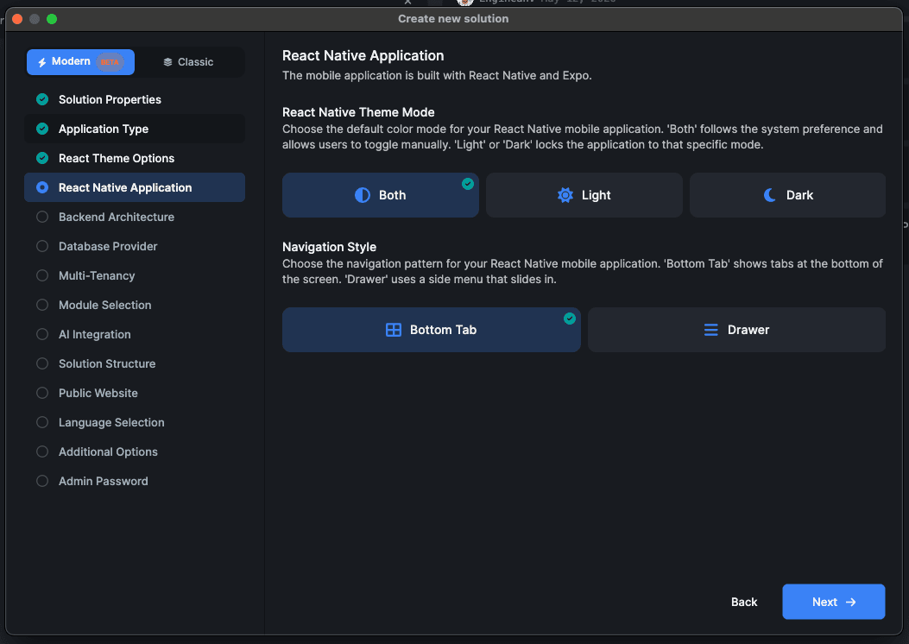

Or via CLI:

```bash
abp new Acme.BookStore --template app-pro --mobile react-native
```

For the microservice solution template:

```bash
abp new Acme.BookStore --template microservice-pro --mobile react-native
```

Open the generated `react-native/` (or `apps/mobile/react-native/`) folder, run `npm install`, then `npx expo start`, and you'll be looking at the new UI within seconds.

If you're **upgrading an existing project**, check the new `docs/UPGRADE.md` in the template — it walks through the moving pieces (Babel/Metro config, the new `global.css` import, the `nativewind-env.d.ts` ambient types, and the locale trim).

## Summary

The ABP React Native template is in a much better place than it was a few months ago. The legacy screens and a long tail of dead components are gone, the styling layer is now a proper token-based system powered by **NativeWind v4** and a shadcn-style neutral palette, and **dark mode** is no longer something each screen has to think about — it's just there. Navigation got a real refresh too: the old single-drawer pattern is now a revamped drawer plus a `BottomTabNavigator` and `AccountNavigator`, which is the structure most modern mobile apps actually use.

We also built **two sample apps** on top of the new template — **Habit Tracker**, a focused single-feature one, and **Hanova**, a more substantial demo — so the changes are exercised against real screens and real flows, not just template snapshots. If you create a new ABP solution with a React Native mobile app, all of this is what you get out of the box; if you're upgrading, the new `docs/UPGRADE.md` walks you through it. Try the template, build something on top of it, and share what you make — the whole point of moving to a token-based system is that it should be easy for everyone to extend, not just us.
