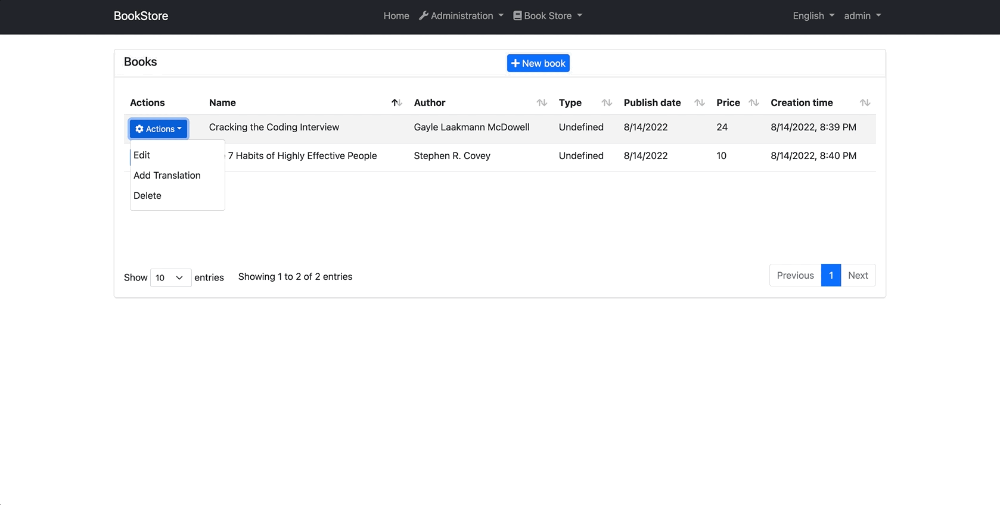
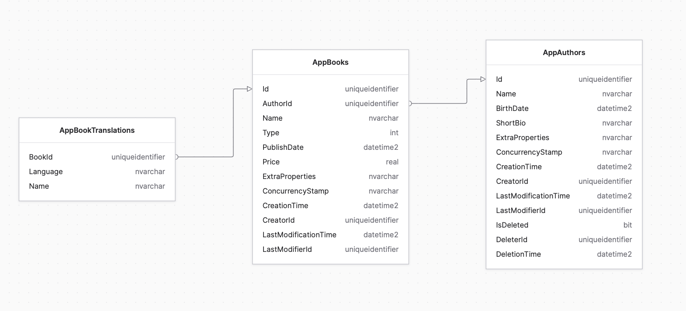

# How to Design Multi-Lingual Entity

## Introduction

If you want to open up to the global market these days, end-to-end localization is a must. ABP provides an already established infrastructure for static texts. However, this may not be sufficient for many applications. You may need to fully customize your app for a particular language and region.

Let's take a look at a few quotes from Christian Arno's article "[How Foreign-Language Internet Strategies Boost Sales](https://www.mediapost.com/publications/article/155250/how-foreign-language-internet-strategies-boost-sal.html)" to better understand the impact of this:

- 82% of European consumers are less likely to buy online if the site is not in their native tongue ([Eurobarometer survey](http://europa.eu/rapid/pressReleasesAction.do?reference=IP/11/556)).
- 72.4% of global consumers are more likely to buy a product if the information is available in their own language ([Common Sense Advisory](http://www.commonsenseadvisory.com/)).
- The English language currently only accounts for 31% of all online use, and more than half of all searches are in languages other than English.
- Today, 42% of all Internet users are in Asia, while almost one-quarter are in Europe and just over 10% are in Latin America.

- Foreign languages have experienced exponential growth in online usage in the past decade -- with Chinese now officially the [second-most-prominent-language](http://english.peopledaily.com.cn/90001/90776/90882/7438489.html) on the Web. [Arabic](http://www.internetworldstats.com/stats7.htm) has increased by a whopping 2500%, while English has only risen by 204%

If you are looking for ways to expand your market share by fully customizing your application for a particular language and region, in this article I will explain how you can do it with ABP framework.

### Source Code

You can find the source code of the application at [abpframework/abp-samples](https://github.com/abpframework/abp-samples/tree/master/AcmeBookStoreMultiLingual).

### Demo of the Final Application

At the end of this article, we will have created an application same as in the gif below.



## Development

In order to keep the article short and get rid of unrelated information in the article (like defining entities etc.), we'll be using the [BookStore](https://github.com/abpframework/abp-samples/tree/master/BookStore-Mvc-EfCore) example, which is used in the "[Web Application Development Tutorial](https://docs.abp.io/en/abp/latest/Tutorials/Part-1?UI=MVC&DB=EF)" documentation of ABP Framework and we will make the Book entity as multi-lingual. If you do not want to finish this tutorial, you can find the application [here](https://github.com/abpframework/abp-samples/tree/master/BookStore-Mvc-EfCore).

### Determining the data model

We need a robust, maintainable, and efficient data model to store content in multiple languages.

>  I read many articles to determine the data model correctly, and as a result, I decided to use one of the many approaches that suit us.
>  However, as in everything, there is a trade-off here. If you are wondering about the advantages and disadvantages of the model we will implement compared to other models, I recommend you to read [this article](https://vertabelo.com/blog/data-modeling-for-multiple-languages-how-to-design-a-localization-ready-system/).



As a result of the tutorial, we already have the `Book` and `Author` entities, as an extra, we will just add the `BookTranslation`.

> In the article, we will make the Name property of the Book entity multi-lingual, but the article is independent of the Book entity, you can make the entity you want multi-lingual with similar codes according to your requirements.

#### Acme.BookStore.Domain.Shared

Create a folder named `MultiLingualObjects` and create the following interfaces in its contents. 

We will use the `IObjectTranslation` interface to mark the translation of a multi-lingual entity:

```csharp
public interface IObjectTranslation
{
    string Language { get; set; }
}
```

We will use the `IMultiLingualObject<TTranslation>` interface to mark multi-lingual entities:

```csharp
public interface IMultiLingualObject<TTranslation>
    where TTranslation : class, IObjectTranslation
{
    ICollection<TTranslation> Translations { get; set; }
}
```

#### Acme.BookStore.Domain

In the `Books` folder, create the `BookTranslation` class as follows:

```csharp
public class BookTranslation : Entity, IObjectTranslation
{
    public Guid BookId { get; set; }

    public string Name { get; set; }

    public string Language { get; set; }

    public override object[] GetKeys()
    {
        return new object[] {BookId, Language};
    }
}
```

`BookTranslation` contains the `Language` property, which contains a language code for translation and a reference to the multi-lingual entity. We also have the `BookId` foreign key to help us know which book is translated.

Implement `IMultiLingualObject` in the `Book` class as follows:

```csharp
public class Book : AuditedAggregateRoot<Guid>, IMultiLingualObject<BookTranslation>
{
    public Guid AuthorId { get; set; }

    public string Name { get; set; }

    public BookType Type { get; set; }

    public DateTime PublishDate { get; set; }

    public float Price { get; set; }
    
    public ICollection<BookTranslation> Translations { get; set; }
}
```

Create a folder named `MultiLingualObjects` and add the following class inside of this folder:

```csharp
public class MultiLingualObjectManager : ITransientDependency
{
    protected const int MaxCultureFallbackDepth = 5;

    public async Task<TTranslation> FindTranslationAsync<TMultiLingual, TTranslation>(
        TMultiLingual multiLingual,
        string culture = null,
        bool fallbackToParentCultures = true)
        where TMultiLingual : IMultiLingualObject<TTranslation>
        where TTranslation : class, IObjectTranslation
    {
        culture ??= CultureInfo.CurrentUICulture.Name;

        if (multiLingual.Translations.IsNullOrEmpty())
        {
            return null;
        }

        var translation = multiLingual.Translations.FirstOrDefault(pt => pt.Language == culture);
        if (translation != null)
        {
            return translation;
        }

        if (fallbackToParentCultures)
        {
            translation = GetTranslationBasedOnCulturalRecursive(
                CultureInfo.CurrentUICulture.Parent,
                multiLingual.Translations,
                0
            );

            if (translation != null)
            {
                return translation;
            }
        }
        
        return null;
    }

    protected TTranslation GetTranslationBasedOnCulturalRecursive<TTranslation>(
        CultureInfo culture, ICollection<TTranslation> translations, int currentDepth)
        where TTranslation : class, IObjectTranslation
    {
        if (culture == null ||
            culture.Name.IsNullOrWhiteSpace() ||
            translations.IsNullOrEmpty() ||
            currentDepth > MaxCultureFallbackDepth)
        {
            return null;
        }

        var translation = translations.FirstOrDefault(pt => pt.Language.Equals(culture.Name, StringComparison.OrdinalIgnoreCase));
        return translation ?? GetTranslationBasedOnCulturalRecursive(culture.Parent, translations, currentDepth + 1);
    }
}
```

With `MultiLingualObjectManager`'s `FindTranslationAsync` method, we get the translated version of the book according to `CurrentUICulture`. If no translation of culture is found, we return null.

>  Every thread in .NET has `CurrentCulture` and `CurrentUICulture` objects.

#### Acme.BookStore.EntityFrameworkCore

In the `OnModelCreating` method of the `BookStoreDbContext` class, configure the `BookTranslation` as follows:

```csharp
builder.Entity<BookTranslation>(b =>
{
    b.ToTable(BookStoreConsts.DbTablePrefix + "BookTranslations",
        BookStoreConsts.DbSchema);

    b.ConfigureByConvention();

    b.HasKey(x => new {x.BookId, x.Language});
});
```

> I haven't explicitly set up a one-to-many relationship between `Book` and `BookTranslation` here, but the entity framework will do it for us.

After that, you can just run the following command in a command-line terminal to add a new database migration (in the directory of the `EntityFrameworkCore` project):

```bash
dotnet ef migrations add Added_BookTranslation
```

This will add a new migration class to your project. You can then run the following command (or run the `.DbMigrator` application) to apply changes to the database:

```bash
dotnet ef database update
```

Add the following code to the `ConfigureServices` method of the `BookStoreEntityFrameworkCoreModule`:

```csharp
 Configure<AbpEntityOptions>(options =>
 {
     options.Entity<Book>(bookOptions =>
     {
         bookOptions.DefaultWithDetailsFunc = query => query.Include(o => o.Translations);
     });
});
```

Now we can use `WithDetailsAsync` without any parameters on `BookAppService` knowing that `Translations` will be included.

#### Acme.BookStore.Application.Contracts

Implement `IObjectTranslation` in the `BookDto` class as follows:

```csharp
public class BookDto : AuditedEntityDto<Guid>, IObjectTranslation
{
    public Guid AuthorId { get; set; }

    public string AuthorName { get; set; }

    public string Name { get; set; }

    public BookType Type { get; set; }

    public DateTime PublishDate { get; set; }

    public float Price { get; set; }
    
    public string Language { get; set; }
}
```

`Language` property is required to understand which language the translated book name belongs to in the UI.

Create the `AddBookTranslationDto` class in the `Books` folder as follows:

```csharp
public class AddBookTranslationDto : IObjectTranslation
{
    [Required]
    public string Language { get; set; }
    
    [Required]
    public string Name { get; set; }
}
```

Add the `AddTranslationsAsync` method to the `IBookAppService` as follows:

```csharp
public interface IBookAppService :
    ICrudAppService<
        BookDto,
        Guid,
        PagedAndSortedResultRequestDto,
        CreateUpdateBookDto>
{
    Task<ListResultDto<AuthorLookupDto>> GetAuthorLookupAsync();
    
    Task AddTranslationsAsync(Guid id, AddBookTranslationDto input); // added this line
}
```

#### Acme.BookStore.Application

Now, we need to implement the `AddTranslationsAsync` method in `BookAppService` and include `Translations` in the `Book` entity, for this you can change the `BookAppService` as follows:

```csharp
[Authorize(BookStorePermissions.Books.Default)]
public class BookAppService :
    CrudAppService<
        Book, //The Book entity
        BookDto, //Used to show books
        Guid, //Primary key of the book entity
        PagedAndSortedResultRequestDto, //Used for paging/sorting
        CreateUpdateBookDto>, //Used to create/update a book
    IBookAppService //implement the IBookAppService
{
    private readonly IAuthorRepository _authorRepository;

    public BookAppService(
        IRepository<Book, Guid> repository,
        IAuthorRepository authorRepository)
        : base(repository)
    {
        _authorRepository = authorRepository;
        GetPolicyName = BookStorePermissions.Books.Default;
        GetListPolicyName = BookStorePermissions.Books.Default;
        CreatePolicyName = BookStorePermissions.Books.Create;
        UpdatePolicyName = BookStorePermissions.Books.Edit;
        DeletePolicyName = BookStorePermissions.Books.Create;
    }

    public override async Task<BookDto> GetAsync(Guid id)
    {
        //Get the IQueryable<Book> from the repository
        var queryable = await Repository.WithDetailsAsync(); // this line changed

        //Prepare a query to join books and authors
        var query = from book in queryable
            join author in await _authorRepository.GetQueryableAsync() on book.AuthorId equals author.Id
            where book.Id == id
            select new { book, author };

        //Execute the query and get the book with author
        var queryResult = await AsyncExecuter.FirstOrDefaultAsync(query);
        if (queryResult == null)
        {
            throw new EntityNotFoundException(typeof(Book), id);
        }

        var bookDto = ObjectMapper.Map<Book, BookDto>(queryResult.book);
        bookDto.AuthorName = queryResult.author.Name;
        return bookDto;
    }

    public override async Task<PagedResultDto<BookDto>> GetListAsync(PagedAndSortedResultRequestDto input)
    {
        //Get the IQueryable<Book> from the repository
        var queryable = await Repository.WithDetailsAsync(); // this line changed

        //Prepare a query to join books and authors
        var query = from book in queryable
            join author in await _authorRepository.GetQueryableAsync() on book.AuthorId equals author.Id
            select new {book, author};

        //Paging
        query = query
            .OrderBy(NormalizeSorting(input.Sorting))
            .Skip(input.SkipCount)
            .Take(input.MaxResultCount);

        //Execute the query and get a list
        var queryResult = await AsyncExecuter.ToListAsync(query);

        //Convert the query result to a list of BookDto objects
        var bookDtos = queryResult.Select(x =>
        {
            var bookDto = ObjectMapper.Map<Book, BookDto>(x.book);
            bookDto.AuthorName = x.author.Name;
            return bookDto;
        }).ToList();

        //Get the total count with another query
        var totalCount = await Repository.GetCountAsync();

        return new PagedResultDto<BookDto>(
            totalCount,
            bookDtos
        );
    }

    public async Task<ListResultDto<AuthorLookupDto>> GetAuthorLookupAsync()
    {
        var authors = await _authorRepository.GetListAsync();

        return new ListResultDto<AuthorLookupDto>(
            ObjectMapper.Map<List<Author>, List<AuthorLookupDto>>(authors)
        );
    }

    public async Task AddTranslationsAsync(Guid id, AddBookTranslationDto input)
    {
        var queryable = await Repository.WithDetailsAsync();
        
        var book = await AsyncExecuter.FirstOrDefaultAsync(queryable, x => x.Id == id);

        if (book.Translations.Any(x => x.Language == input.Language))
        {
            throw new UserFriendlyException($"Translation already available for {input.Language}");
        }

        book.Translations.Add(new BookTranslation
        {
            BookId = book.Id,
            Name = input.Name,
            Language = input.Language
        });
        
        await Repository.UpdateAsync(book);
    }

    private static string NormalizeSorting(string sorting)
    {
        if (sorting.IsNullOrEmpty())
        {
            return $"book.{nameof(Book.Name)}";
        }

        if (sorting.Contains("authorName", StringComparison.OrdinalIgnoreCase))
        {
            return sorting.Replace(
                "authorName",
                "author.Name",
                StringComparison.OrdinalIgnoreCase
            );
        }

        return $"book.{sorting}";
    }
}
```

Create the `MultiLingualBookObjectMapper` class as follows:

```csharp
public class MultiLingualBookObjectMapper : IObjectMapper<Book, BookDto>, ITransientDependency
{
    private readonly MultiLingualObjectManager _multiLingualObjectManager;

    private readonly ISettingProvider _settingProvider;

    public MultiLingualBookObjectMapper(
        MultiLingualObjectManager multiLingualObjectManager,
        ISettingProvider settingProvider)
    {
        _multiLingualObjectManager = multiLingualObjectManager;
        _settingProvider = settingProvider;
    }

    public BookDto Map(Book source)
    {
        var translation = AsyncHelper.RunSync(() =>
            _multiLingualObjectManager.FindTranslationAsync<Book, BookTranslation>(source));

        return new BookDto
        {
            Id = source.Id,
            AuthorId = source.AuthorId,
            Type = source.Type,
            Name = translation?.Name ?? source.Name,
            PublishDate = source.PublishDate,
            Price = source.Price,
            Language = translation?.Language ?? AsyncHelper.RunSync(() => _settingProvider.GetOrNullAsync(LocalizationSettingNames.DefaultLanguage)),
            CreationTime = source.CreationTime,
            CreatorId = source.CreatorId,
            LastModificationTime = source.LastModificationTime,
            LastModifierId = source.LastModifierId
        };
    }

    public BookDto Map(Book source, BookDto destination)
    {
        return default;
    }
}
```

To map the multi-lingual `Book` entity to `BookDto`, we implement custom mapping using the `IObjectMapper<TSource, TDestination>` interface. If no translation is found, default values are returned.

So far we have created the entire infrastructure. We don't need to change anything in the UI, if there is a translation according to the language chosen by the user, the list view will change. However, I want to create a simple modal where we can add new translations to an existing book in order to see what we have done.

#### Acme.BookStore.Web

Create a new razor page named `AddTranslationModal` in the `Books` folder as below.

**View**

```html
@page
@using Microsoft.AspNetCore.Mvc.TagHelpers
@using Volo.Abp.AspNetCore.Mvc.UI.Bootstrap.TagHelpers.Modal
@model Acme.BookStore.Web.Pages.Books.AddTranslationModal

@{
    Layout = null;
}

<form asp-page="/Books/AddTranslationModal">
    <abp-modal>
        <abp-modal-header>Translations</abp-modal-header>
        <abp-modal-body>
            <abp-input asp-for="Id"></abp-input>
            <abp-select asp-for="@Model.TranslationViewModel.Language" asp-items="Model.Languages" class="form-select">
                <option selected value="">Pick a language</option>
            </abp-select>
            <abp-input asp-for="TranslationViewModel.Name"></abp-input>
        </abp-modal-body>
        <abp-modal-footer buttons="@(AbpModalButtons.Cancel | AbpModalButtons.Save)"></abp-modal-footer>
    </abp-modal>
</form>
```

**Model**

```csharp
public class AddTranslationModal : BookStorePageModel
{
    [HiddenInput]
    [BindProperty(SupportsGet = true)]
    public Guid Id { get; set; }
    
    public List<SelectListItem> Languages { get; set; }

    [BindProperty]
    public BookTranslationViewModel TranslationViewModel { get; set; }
    
    private readonly IBookAppService _bookAppService;
    private readonly ILanguageProvider _languageProvider;

    public AddTranslationModal(
        IBookAppService bookAppService,
        ILanguageProvider languageProvider)
    {
        _bookAppService = bookAppService;
        _languageProvider = languageProvider;
    }

    public async Task OnGetAsync()
    {
        Languages = await GetLanguagesSelectItem();

        TranslationViewModel = new BookTranslationViewModel();
    }
    
    public async Task<IActionResult> OnPostAsync()
    {
        await _bookAppService.AddTranslationsAsync(Id, ObjectMapper.Map<BookTranslationViewModel, AddBookTranslationDto>(TranslationViewModel));
        
        return NoContent();
    }
    
    private async Task<List<SelectListItem>> GetLanguagesSelectItem()
    {
        var result = await _languageProvider.GetLanguagesAsync();
            
        return result.Select(
            languageInfo => new SelectListItem
            {
                Value = languageInfo.CultureName,
                Text = languageInfo.DisplayName + " (" + languageInfo.CultureName + ")"
            }
        ).ToList();
    }

    public class BookTranslationViewModel
    {
        [Required]
        [SelectItems(nameof(Languages))]
        public string Language { get; set; }
        
        [Required]
        public string Name { get; set; }

    }
}
```

Then, we can open the `BookStoreWebAutoMapperProfile` class and define the required mapping as follows:

```csharp
CreateMap<AddTranslationModal.BookTranslationViewModel, AddBookTranslationDto>();
```

Finally, change the content of `index.js` in the `Books` folder as follows:

```javascript
$(function () {
    var l = abp.localization.getResource('BookStore');
    var createModal = new abp.ModalManager(abp.appPath + 'Books/CreateModal');
    var editModal = new abp.ModalManager(abp.appPath + 'Books/EditModal');
    var addTranslationModal = new abp.ModalManager(abp.appPath + 'Books/AddTranslationModal'); // added this line
    
    var dataTable = $('#BooksTable').DataTable(
        abp.libs.datatables.normalizeConfiguration({
            serverSide: true,
            paging: true,
            order: [[1, "asc"]],
            searching: false,
            scrollX: true,
            ajax: abp.libs.datatables.createAjax(acme.bookStore.books.book.getList),
            columnDefs: [
                {
                    title: l('Actions'),
                    rowAction: {
                        items:
                            [
                                {
                                    text: l('Edit'),
                                    visible: abp.auth.isGranted('BookStore.Books.Edit'),
                                    action: function (data) {
                                        editModal.open({ id: data.record.id });
                                    }
                                },
                                {
                                    text: l('Add Translation'), // added this action
                                    visible: abp.auth.isGranted('BookStore.Books.Edit'),
                                    action: function (data) {
                                        addTranslationModal.open({ id: data.record.id });
                                    }
                                },
                                {
                                    text: l('Delete'),
                                    visible: abp.auth.isGranted('BookStore.Books.Delete'),
                                    confirmMessage: function (data) {
                                        return l(
                                            'BookDeletionConfirmationMessage',
                                            data.record.name
                                        );
                                    },
                                    action: function (data) {
                                        acme.bookStore.books.book
                                            .delete(data.record.id)
                                            .then(function() {
                                                abp.notify.info(
                                                    l('SuccessfullyDeleted')
                                                );
                                                dataTable.ajax.reload();
                                            });
                                    }
                                }
                            ]
                    }
                },
                {
                    title: l('Name'),
                    data: "name"
                },
                {
                    title: l('Author'),
                    data: "authorName"
                },
                {
                    title: l('Type'),
                    data: "type",
                    render: function (data) {
                        return l('Enum:BookType:' + data);
                    }
                },
                {
                    title: l('PublishDate'),
                    data: "publishDate",
                    render: function (data) {
                        return luxon
                            .DateTime
                            .fromISO(data, {
                                locale: abp.localization.currentCulture.name
                            }).toLocaleString();
                    }
                },
                {
                    title: l('Price'),
                    data: "price"
                },
                {
                    title: l('CreationTime'),
                    data: "creationTime",
                    render: function (data) {
                        return luxon
                            .DateTime
                            .fromISO(data, {
                                locale: abp.localization.currentCulture.name
                            }).toLocaleString(luxon.DateTime.DATETIME_SHORT);
                    }
                }
            ]
        })
    );

    createModal.onResult(function () {
        dataTable.ajax.reload();
    });

    editModal.onResult(function () {
        dataTable.ajax.reload();
    });

    $('#NewBookButton').click(function (e) {
        e.preventDefault();
        createModal.open();
    });
});
```

## Conclusion

With a multi-lingual application, you can expand your market share, but if not designed well, may your application will be unusable. So, I've tried to explain how to design a sustainable multi-lingual entity in this article.

### Source Code

You can find source code of the example solution used in this article [here](https://github.com/abpframework/abp-samples/tree/master/AcmeBookStoreMultiLingual).
