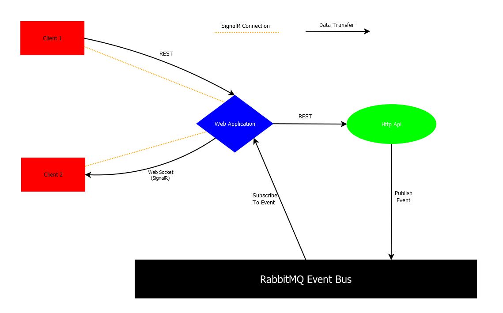
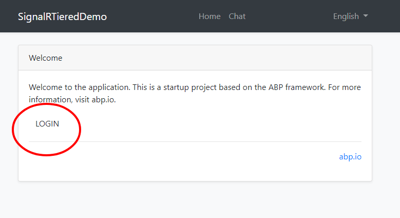
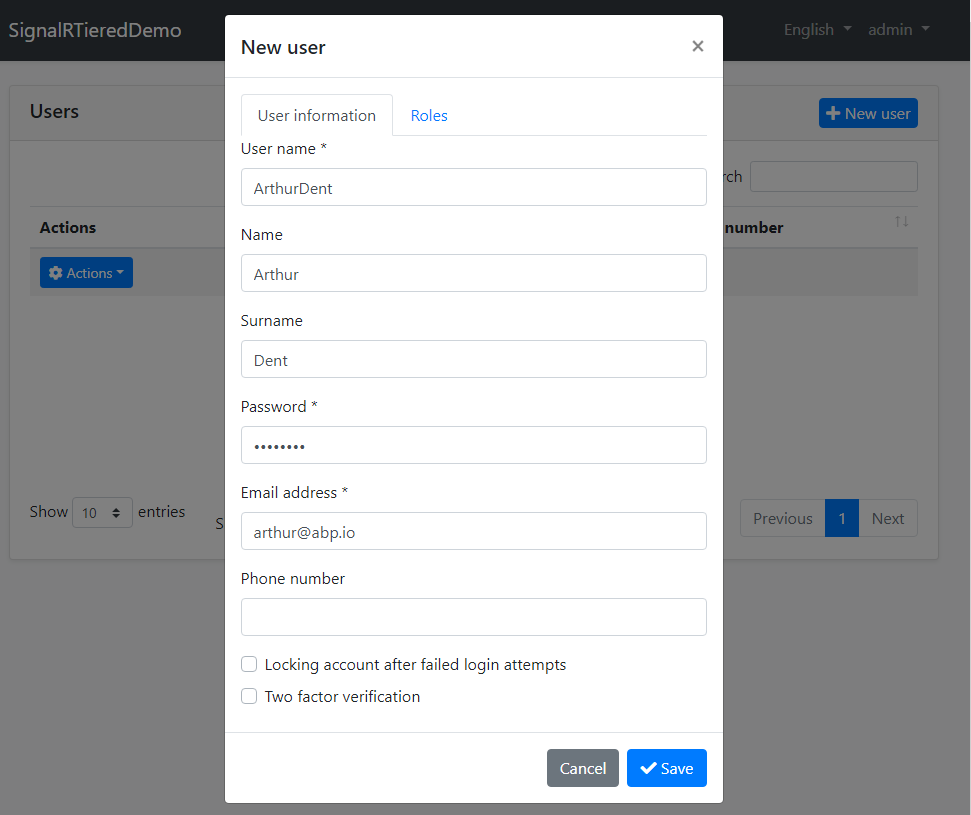
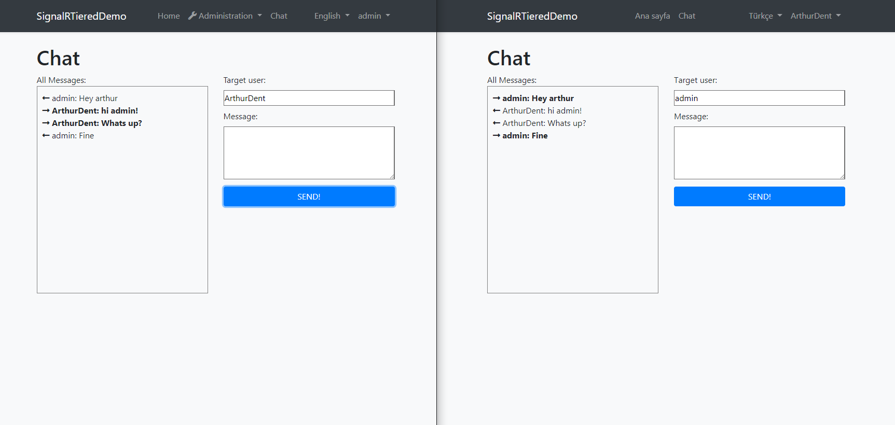

# Real Time Messaging In A Distributed Architecture Using Abp Framework, SingalR & RabbitMQ

In this article, we will build a basic real time messaging application in a distributed architecture. We will use [Abp Framework](https://abp.io) for infrastructure and tiered startup template, [SignalR](https://dotnet.microsoft.com/apps/aspnet/signalr) for real time server-client communication and [RabbitMQ](https://www.rabbitmq.com/) as the distributed event bus.

When Web & API tiers are separated, it is impossible to directly send a server-to-client message from the HTTP API. This is also true for a microservice architected application. We suggest to use the distributed event bus to deliver the message from API application to the web application, then to the client.




Above, you can see the data-flow that we will implement in this article. This diagram represents how data will flow in our application when **Client 1** sends a message to **Client 2**. It is explained in 5 steps:

1. **Client 1** sends a message data to **Web Application** via REST call.
2. **Web Application** redirects the message data to **Http Api**.
3. The message data is processed in **Http Api** and **Http Api** publishes an event that holds the data that will be sent to **Client 2**.
4. **Web application**, that is subscribed to that event, receives it.
5. **Web Application** sends the message to **Client 2**.

For this example flow, we could send message from **Client 1** to **Client 2** directly on the **SignalR Hub**. However, what we are trying here to demonstrate is sending a real-time message from the **Http Api** to a specific user who is connected to the web application.

## Implementation

### Startup template and initial run

[Abp Framework](https://www.abp.io) offers startup templates to get into the business faster. We can download a new tiered startup template using [Abp CLI](https://docs.abp.io/en/abp/latest/CLI):

`abp new SignalRTieredDemo --tiered`

After download is finished, we run ***.DbMigrator** project to create the database and seed initial data (admin user, role etc). Then we run ***.IdentityServer**, ***.HttpApi.Host** and ***.Web** to see our application working.

### Creating Application Layer

We create an [application service](https://docs.abp.io/en/abp/latest/Application-Services) that publishes the message as event.

In ***.Application.Contracts** project:

````csharp
using System.Threading.Tasks;
using Volo.Abp.Application.Services;

namespace SignalRTieredDemo
{
    public interface IChatAppService : IApplicationService
    {
        Task SendMessageAsync(SendMessageInput input);
    }
}
````
Input DTO for SendMessageAsync method:

````csharp
namespace SignalRTieredDemo
{
    public class SendMessageInput
    {
        public string TargetUserName { get; set; }

        public string Message { get; set; }
    }
}
````
Event transfer object (ETO) for communication on event bus:

````csharp
using System;

namespace SignalRTieredDemo
{
    public class ReceivedMessageEto
    {
        public string ReceivedText { get; set; }

        public Guid TargetUserId { get; set; }

        public string SenderUserName { get; set; }

        public ReceivedMessageEto(
        Guid targetUserId, string senderUserName, string receivedText)
        {
            ReceivedText = receivedText;
            TargetUserId = targetUserId;
            SenderUserName = senderUserName;
        }
    }
}

````

In ***.Application** project:

````csharp
using System.Threading.Tasks;
using Microsoft.AspNetCore.Identity;
using Volo.Abp.EventBus.Distributed;
using Volo.Abp.Identity;

namespace SignalRTieredDemo
{
    public class ChatAppService: SignalRTieredDemoAppService, IChatAppService
    {
        private readonly IIdentityUserRepository _identityUserRepository;
        private readonly ILookupNormalizer _lookupNormalizer;
        private readonly IDistributedEventBus _distributedEventBus;

        public ChatAppService(IIdentityUserRepository identityUserRepository, ILookupNormalizer lookupNormalizer, IDistributedEventBus distributedEventBus)
        {
            _identityUserRepository = identityUserRepository;
            _lookupNormalizer = lookupNormalizer;
            _distributedEventBus = distributedEventBus;
        }

        public async Task SendMessageAsync(SendMessageInput input)
        {
            var targetId = (await _identityUserRepository.FindByNormalizedUserNameAsync(_lookupNormalizer.NormalizeName(input.TargetUserName))).Id;

            await _distributedEventBus.PublishAsync(new ReceivedMessageEto(targetId, CurrentUser.UserName, input.Message));
        }
    }
}
````

### Creating API Layer

We create an endpoint for sending message that redirects the process to application layer:

In **controllers** folder of ***.HttpApi** project:

````csharp
using System.Threading.Tasks;
using Microsoft.AspNetCore.Mvc;
using Volo.Abp.AspNetCore.Mvc;

namespace SignalRTieredDemo.Controllers
{
    [Route("api/app/chat")]
    public class ChatController : AbpController, IChatAppService
    {
        private readonly IChatAppService _chatAppService;

        public ChatController(IChatAppService chatAppService)
        {
            _chatAppService = chatAppService;
        }

        [HttpPost]
        [Route("send-message")]
        public async Task SendMessageAsync(SendMessageInput input)
        {
            await _chatAppService.SendMessageAsync(input);
        }
    }
}
````
### Adding SignalR

To add SignalR to our solution, we add `Volo.Abp.AspNetCore.SignalR` nuget package to ***.Web** project.

And then add `AbpAspNetCoreSignalRModule` dependency:

````csharp

namespace SignalRTieredDemo.Web
{
    [DependsOn(
        ...
        typeof(AbpAspNetCoreSignalRModule) // <---
        )]
    public class SignalRTieredDemoWebModule : AbpModule
    {
````

Also, we need to add [@abp/signalr](https://www.npmjs.com/package/@abp/signalr) npm package to package.json in ***.Web** project, then run **yarn** and **gulp** commands.

`````json
{
  .
  .
  "dependencies": {
    .
    .
    "@abp/signalr": "^2.9.0"
  }
}
`````

*Remember to add the latest package version.*

You can find more information for Abp SignalR Integration on [the related document](https://docs.abp.io/en/abp/latest/SignalR-Integration).

### Creating A Hub

We need a hub for SignalR connection. We can inherit it from `AbpHup` base class.

In ***.Web** project:

````csharp
using Microsoft.AspNetCore.Authorization;
using Volo.Abp.AspNetCore.SignalR;

namespace SignalRTieredDemo.Web
{
    [Authorize]
    public class ChatHub : AbpHub
    {
    }
}

````

While you could inherit from the standard `Hub` class, `AbpHub` has some common services pre-injected as base properties, which is useful on your development.

### Adding & Configuring RabbitMQ 

To add RabbitMQ to our solution, we add `Volo.Abp.EventBus.RabbitMQ` nuget package to ***.HttpApi.Host** and ***.Web** projects.

Launch a **command line**, navigate to directory where ***.HttpApi.Host.csproj** file exist, and run the command below using [Abp CLI](https://docs.abp.io/en/abp/latest/CLI):

````bash
 abp add-package Volo.Abp.EventBus.RabbitMQ
````

Then do the same for ***.Web** project.

After we add the package, we configure RabbitMQ by adding configuration in **appsettings.json** files of those projects.

For ***.HttpApi.Host** project:

````json
{
  ...
  "RabbitMQ": {
    "Connections": {
      "Default": {
        "HostName": "localhost"
      }
    },
    "EventBus": {
      "ClientName": "SignalRTieredDemo_HttpApi",
      "ExchangeName": "SignalRTieredDemoTest"
    }
  },
  ...
}
````
For ***.Web** project:
````json
{
  ...
  "RabbitMQ": {
    "Connections": {
      "Default": {
        "HostName": "localhost"
      }
    },
    "EventBus": {
      "ClientName": "SignalRTieredDemo_Web",
      "ExchangeName": "SignalRTieredDemoTest"
    }
  },
  ...
}

````

### Handling New Message Event

Once we publish a new message event from `Http Api`, we must to handle it in `Web Application`. Therefore we need an event handler in ***.Web** Project:

````csharp
using System.Threading.Tasks;
using Microsoft.AspNetCore.SignalR;
using Volo.Abp.DependencyInjection;
using Volo.Abp.EventBus.Distributed;

namespace SignalRTieredDemo.Web
{
    public class ReceivedMessageEventHandler :    
        IDistributedEventHandler<ReceivedMessageEto>, 
        ITransientDependency
    {
        private readonly IHubContext<ChatHub> _hubContext;

        public ReceivedMessageEventHandler(IHubContext<ChatHub> hubContext)
        {
            _hubContext = hubContext;
        }

        public async Task HandleEventAsync(ReceivedMessageEto eto)
        {
            var message = $"{eto.SenderUserName}: {eto.ReceivedText}";

            await _hubContext.Clients
                .User(eto.TargetUserId.ToString())
                .SendAsync("ReceiveMessage", message);
        }
    }
}
````

### Creating Chat Page

We create the files below in **Pages** folder of ***.Web** Project.

 **Chat.cshtml**:

````html
@page
@using Volo.Abp.AspNetCore.Mvc.UI.Packages.SignalR
@model SignalRTieredDemo.Web.Pages.ChatModel
@section styles {
    <abp-style src="/Pages/Chat.css" />
}
@section scripts {
    <abp-script type="typeof(SignalRBrowserScriptContributor)" />
    <abp-script src="/Pages/Chat.js" />
}
<h1>Chat</h1>

<div>
    <abp-row>
        <abp-column size-md="_6">
            <div>All Messages:</div>
            <ul id="MessageList" style="">
            </ul>
        </abp-column>
        <abp-column size-md="_6">
            <form>
                <abp-row>
                    <abp-column>
                        <label for="TargetUser">Target user:</label>
                        <input type="text" id="TargetUser" />
                    </abp-column>
                </abp-row>
                <abp-row class="mt-2">
                    <abp-column>
                        <label for="Message">Message:</label>
                        <textarea id="Message" rows="4"></textarea>
                    </abp-column>
                </abp-row>
                <abp-row class="mt-2">
                    <abp-column>
                        <abp-button type="submit" id="SendMessageButton" button-type="Primary" size="Block" text="SEND!" />
                    </abp-column>
                </abp-row>
            </form>
        </abp-column>
    </abp-row>
</div>
````

 **Chat.cshtml.cs**: 

````csharp
using Microsoft.AspNetCore.Mvc.RazorPages;

namespace SignalRTieredDemo.Web.Pages
{
    public class ChatModel : PageModel
    {
        public void OnGet()
        {
        }
    }
}
````

**Chat.css**: 

````css
#MessageList {
    border: 1px solid gray;
    height: 400px;
    overflow: auto;
    list-style: none;
    padding-left: 0;
    padding: 10px;
}

#TargetUser {
    width: 100%;
}

#Message {
    width: 100%;
}
````

**Chat.js**:

````javascript
$(function () {
    var connection = new signalR.HubConnectionBuilder().withUrl("/signalr-hubs/chat").build();

    connection.on("ReceiveMessage", function (message) {
        console.log(message);
        $('#MessageList').append('<li><strong><i class="fas fa-long-arrow-alt-right"></i> ' + message + '</strong></li>');
    });

    connection.start().then(function () {

    }).catch(function (err) {
        return console.error(err.toString());
    });

    $('#SendMessageButton').click(function (e) {
        e.preventDefault();

        var targetUserName = $('#TargetUser').val();
        var message = $('#Message').val();
        $('#Message').val('');


        signalRTieredDemo.controllers.chat.sendMessage({
            targetUserName: targetUserName,
            message: message
        }).then(function() {
            $('#MessageList')
                .append('<li><i class="fas fa-long-arrow-alt-left"></i> ' + abp.currentUser.userName + ': ' + message + '</li>');
        });
      
    });
});
````

Then we can add this new page to menu on ***MenuContributor.cs** in **Menus** folder:

````csharp
    ...
    public class SignalRTieredDemoMenuContributor : IMenuContributor
    {
        ...
        private Task ConfigureMainMenuAsync(MenuConfigurationContext context)
        {
        ...
            context.Menu.Items.Add(new ApplicationMenuItem("SignalRDemo.Chat", "Chat", "/Chat")); // <-- We add this line

            return Task.CompletedTask;
        }
      ...
    }
````

## Running & Testing 

We run ***.IdentityServer**, ***.HttpApi.Host** and ***.Web** in order. After ***.Web** project is ran, firstly login with `admin` username and `1q2w3E*` password.




After we login, go to `/Identity/Users` page and create a new user. So that we can chat with them.



Then we open the application in another browser and login with the user we created above. Now we can go to chat page and start messaging:



We can test with more user. All sent and incoming messages are displayed in the left box.

### Source code

Source code of the final application can be found on the [GitHub repository](https://github.com/abpframework/abp-samples/tree/master/SignalRTieredDemo).
