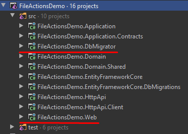
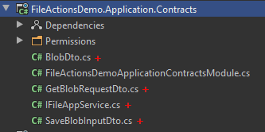
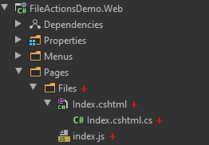
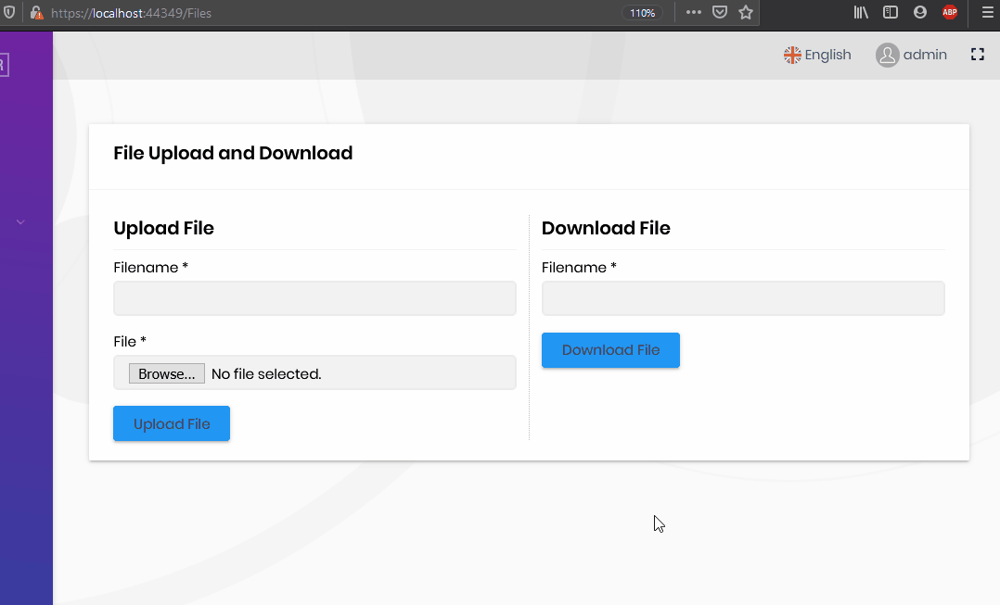

# File Upload/Download with BLOB Storage System in ASP.NET Core & ABP Framework

## Introduction

This step-by-step article describes how to upload a file to a Web server and also download by client with using ASP.NET Core & ABP Framework. By following this article, you will create a web project and its related code to upload and download files.

Before the creating application, we need to know some fundamentals.

## BLOB Storing

It is typical to **store file contents** in an application and read these file contents on need. Not only files, but you may also need to save various types of **large binary objects**, a.k.a. [BLOB](https://en.wikipedia.org/wiki/Binary_large_object)s, into a **storage**. For example, you may want to save user profile pictures.

A BLOB is a typically **byte array**. There are various places to store a BLOB item; storing in the local file system, in a shared database or on the [Azure BLOB storage](https://azure.microsoft.com/en-us/services/storage/blobs/) can be options.

The ABP Framework provides an abstraction to work with BLOBs and provides some pre-built storage providers that you can easily integrate to. Having such an abstraction has some benefits;

- You can **easily integrate** to your favorite BLOB storage provides with a few lines of configuration.
- You can then **easily change** your BLOB storage without changing your application code.
- If you want to create **reusable application modules**, you don't need to make assumption about how the BLOBs are stored.

ABP BLOB Storage system is also compatible to other ABP Framework features like [multi-tenancy](https://docs.abp.io/en/abp/latest/Multi-Tenancy).

To get more information about ABP BLOB Storing system, please check this [documentation](https://docs.abp.io/en/abp/latest/Blob-Storing).

## Preparing the Project

### Startup template and the initial run

Abp Framework offers startup templates to get into the business faster. We can download a new startup template using Abp CLI:

`abp new FileActionsDemo -m none`

After the download is finished, we run `FileActionsDemo.DbMigrator` project to create the database and seed initial data (admin user, role, etc). Then we run `FileActionsDemo.Web` to see our application working.

> _Default admin username is **admin** and password is **1q2w3E\***_



### Adding Blob Storing Module

For this article, we use [Blob Storing Database Provider](https://docs.abp.io/en/abp/latest/Blob-Storing-Database).

You can use [Azure](https://docs.abp.io/en/abp/latest/Blob-Storing-Azure) or [File System](https://docs.abp.io/en/abp/latest/Blob-Storing-File-System) providers also.

Open a command prompt (terminal) in the folder containing your solution (.sln) file and run the following command:

`abp add-module Volo.Abp.BlobStoring.Database`

This action will add the module depencies and also module migration. After this action, run `FileActionsDemo.DbMigrator` to update the database.

### Setting up Blob Storaging

BLOB Strorage system works with `Containers`. Before the using blob storage, we need to create our blob container.

Create a class that name `MyFileContainer` at the `FileActionsDemo.Domain` project.

```csharp
using Volo.Abp.BlobStoring;

namespace FileActionsDemo
{
    [BlobContainerName("my-file-container")]
    public class MyFileContainer
    {

    }
}
```

That's all, we can start to use BLOB storing in our application.

## Creating Application Layer

Before the creating Application Service, we need to create some [DTO](https://docs.abp.io/en/abp/latest/Data-Transfer-Objects)s that used by Application Service.

Create following DTOs in `FileActionsDemo.Application.Contracts` project.

- `BlobDto.cs`

  ```csharp
  namespace FileActionsDemo
  {
      public class BlobDto
      {
          public byte[] Content { get; set; }

          public string Name { get; set; }
      }
  }
  ```

- `GetBlobRequestDto.cs`

  ```csharp
  using System.ComponentModel.DataAnnotations;

  namespace FileActionsDemo
  {
      public class GetBlobRequestDto
      {
          [Required]
          public string Name { get; set; }
      }
  }
  ```

- `SaveBlobInputDto.cs`

  ```csharp
  using System.ComponentModel.DataAnnotations;

  namespace FileActionsDemo
  {
      public class SaveBlobInputDto
      {
          public byte[] Content { get; set; }

          [Required]
          public string Name { get; set; }
      }
  }
  ```

Create `IFileAppService.cs` interface at the same place with DTOs.

- `IFileAppService`

  ```csharp
  using System.Threading.Tasks;
  using Volo.Abp.Application.Services;

  namespace FileActionsDemo
  {
      public interface IFileAppService : IApplicationService
      {
          Task SaveBlobAsync(SaveBlobInputDto input);

          Task<BlobDto> GetBlobAsync(GetBlobRequestDto input);
      }
  }
  ```

After creating DTOs and interface, `FileActionsDemo.Application.Contracts` project should be like as following image.



Then we can create our Application Service.

Create `FileAppService.cs` in `FileActionsDemo.Application` project.

```csharp
using System.Threading.Tasks;
using Volo.Abp.Application.Services;
using Volo.Abp.BlobStoring;

namespace FileActionsDemo
{
    public class FileAppService : ApplicationService, IFileAppService
    {
        private readonly IBlobContainer<MyFileContainer> _fileContainer;

        public FileAppService(IBlobContainer<MyFileContainer> fileContainer)
        {
            _fileContainer = fileContainer;
        }

        public async Task SaveBlobAsync(SaveBlobInputDto input)
        {
            await _fileContainer.SaveAsync(input.Name, input.Content, true);
        }

        public async Task<BlobDto> GetBlobAsync(GetBlobRequestDto input)
        {
            var blob = await _fileContainer.GetAllBytesAsync(input.Name);

            return new BlobDto
            {
                Name = input.Name,
                Content = blob
            };
        }
    }
}
```

As you see in previous code block, we inject `IBlobContainer<MyFileContainer>` to our app service. It will handle all blob actions for us.

- `SaveBlobAsync` method uses `SaveAsync` of `IBlobContainer<MyFileContainer>` to save the given blob to storage, this is a simple example so we don't check is there any file exist with same name. We sent blob name, blob content and `true` for `overrideExisting` parameter.

- `GetBlobAsync` method is uses `GetAllBytesAsync` of `IBlobContainer<MyFileContainer>` to get blob content by name.

We finished the application layer for this project. After that we will create a `Controller` for API and `Razor Page` for UI.

## Creating Controller

Create `FileController.cs` in your `FileActionsDemo.HttpApi` project.

```csharp
using System.Threading.Tasks;
using Microsoft.AspNetCore.Mvc;
using Volo.Abp.AspNetCore.Mvc;

namespace FileActionsDemo
{
    public class FileController : AbpController
    {
        private readonly IFileAppService _fileAppService;

        public FileController(IFileAppService fileAppService)
        {
            _fileAppService = fileAppService;
        }

        [HttpGet]
        [Route("download/{fileName}")]
        public async Task<IActionResult> DownloadAsync(string fileName)
        {
            var fileDto = await _fileAppService.GetBlobAsync(new GetBlobRequestDto{ Name = fileName });

            return File(fileDto.Content, "application/octet-stream", fileDto.Name);
        }
    }
}
```

As you see, `FileController` injects `IFileAppService` that we defined before. This controller has only one endpoint.

`DownloadAsync` is using to send file from server to client.

This endpoint is requires only a `string` parameter, then we use that parameter to get stored blob. If blob is exist, we return a `File` result so download process can start.

## Creating User Interface

We will create only one page to prove download and upload actions are working.

Create folder that name `Files` in your `Pages` folder at `FileActionsDemo.Web` project.

Create a Razor page that name `Index` with its model.

- `Index.cshtml.cs`

```csharp
using System.ComponentModel.DataAnnotations;
using System.IO;
using System.Threading.Tasks;
using Microsoft.AspNetCore.Http;
using Microsoft.AspNetCore.Mvc;
using Volo.Abp.AspNetCore.Mvc.UI.RazorPages;

namespace FileActionsDemo.Web.Pages.Files
{
    public class Index : AbpPageModel
    {
        [BindProperty]
        public UploadFileDto UploadFileDto { get; set; }

        private readonly IFileAppService _fileAppService;

        public bool Uploaded { get; set; } = false;

        public Index(IFileAppService fileAppService)
        {
            _fileAppService = fileAppService;
        }

        public void OnGet()
        {

        }

        public async Task<IActionResult> OnPostAsync()
        {
            using (var memoryStream = new MemoryStream())
            {
                await UploadFileDto.File.CopyToAsync(memoryStream);

                await _fileAppService.SaveBlobAsync(
                    new SaveBlobInputDto
                    {
                        Name = UploadFileDto.Name,
                        Content = memoryStream.ToArray()
                    }
                );
            }

            return Page();
        }
    }

    public class UploadFileDto
    {
        [Required]
        [Display(Name = "File")]
        public IFormFile File { get; set; }

        [Required]
        [Display(Name = "Filename")]
        public string Name { get; set; }
    }
}
```

As you see, we use `UploadFileDto` as a `BindProperty` and we inject `IFileAppService` to upload files.

The `UploadFileDto` is requires a `string` parameter for using as a blob name and a `IFormFile` that sent by user.

At the post action (`OnPostAsync`), if everything is well, we use `MemoryStream` to get all bytes from file content.

Then we save file with `SaveBlobAsync` method of `IFileAppService`.

- `Index.cshtml`

```csharp
@page
@model FileActionsDemo.Web.Pages.Files.Index

@section scripts{
    <abp-script src="/Pages/Files/index.js" />
}

<abp-card>
    <abp-card-header>
        <h3>File Upload and Download</h3>
    </abp-card-header>
    <abp-card-body>
        <abp-row>
            <abp-column>
                <h3>Upload File</h3>
                <hr />
                <form method="post" enctype="multipart/form-data">
                    <abp-input asp-for="UploadFileDto.Name"></abp-input>

                    <abp-input asp-for="UploadFileDto.File"></abp-input>

                    <input type="submit" class="btn btn-info" />
                </form>
            </abp-column>

            <abp-column style="border-left: 1px dotted gray">
                <h3>Download File</h3>
                <hr />
                <form id="DownloadFile">
                    <div class="form-group">
                        <label for="fileName">Filename</label><span> * </span>
                        <input type="text" id="fileName" name="fileName" class="form-control ">
                    </div>

                    <input type="submit" class="btn btn-info"/>
                </form>
            </abp-column>
        </abp-row>
    </abp-card-body>
</abp-card>
```

We divided the page vertically, left side will be using for upload and right side will be using for download. We use [ABP Tag Helpers](https://docs.abp.io/en/abp/latest/UI/AspNetCore/Tag-Helpers/Index) to create page.

- `index.js`

```javascript
$(function () {
  var DOWNLOAD_ENDPOINT = "/download";

  var downloadForm = $("form#DownloadFile");

  downloadForm.submit(function (event) {
    event.preventDefault();

    var fileName = $("#fileName").val().trim();

    var downloadWindow = window.open(
      DOWNLOAD_ENDPOINT + "/" + fileName,
      "_blank"
    );
    downloadWindow.focus();
  });

  $("#UploadFileDto_File").change(function () {
    var fileName = $(this)[0].files[0].name;

    $("#UploadFileDto_Name").val(fileName);
  });
});
```

This jQuery codes are using for download. Also we wrote a simple code to autofill `Filename` input when user selects a file.

After creating razor page and js file, `FileActionsDemo.Web` project should be like as following image.



## Result

After completing code tutorial, run `FileActionsDemo.Web` project and go `/Files`. You can upload any file with any name and also download those uploaded files.


