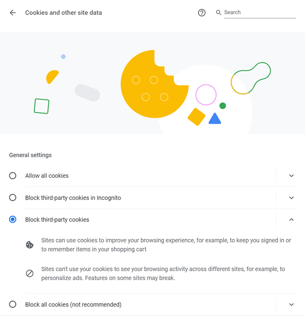

# How to fix the Chrome login issue for the  IdentityServer4 

## Introduction

When you use HTTP on your Identity Server 4 enabled website, users may not login because of the changes made by Chrome in the version 8x. This occurs when you use HTTP schema in your website. The issue is explained here https://docs.microsoft.com/en-gb/dotnet/core/compatibility/3.0-3.1#http-browser-samesite-changes-impact-authentication

## How to solve it?

### Step-1

Create the below extension in your  ***.Web** project.

```csharp
using Microsoft.AspNetCore.Builder;
using Microsoft.AspNetCore.Http;
using Microsoft.Extensions.DependencyInjection;

namespace Microsoft.Extensions.DependencyInjection
{
    public static class SameSiteCookiesServiceCollectionExtensions
    {
        public static IServiceCollection AddSameSiteCookiePolicy(this IServiceCollection services)
        {
            services.Configure<CookiePolicyOptions>(options =>
            {
                options.MinimumSameSitePolicy = SameSiteMode.Unspecified;
                options.OnAppendCookie = cookieContext => 
                    CheckSameSite(cookieContext.Context, cookieContext.CookieOptions);
                options.OnDeleteCookie = cookieContext => 
                    CheckSameSite(cookieContext.Context, cookieContext.CookieOptions);
            });

            return services;
        }
        
        private static void CheckSameSite(HttpContext httpContext, CookieOptions options)
        {
            if (options.SameSite == SameSiteMode.None)
            {
                var userAgent = httpContext.Request.Headers["User-Agent"].ToString();
                if (!httpContext.Request.IsHttps || DisallowsSameSiteNone(userAgent))
                {
                    // For .NET Core < 3.1 set SameSite = (SameSiteMode)(-1)
                    options.SameSite = SameSiteMode.Unspecified;
                }
            }
        }

        private static bool DisallowsSameSiteNone(string userAgent)
        {
            // Cover all iOS based browsers here. This includes:
            // - Safari on iOS 12 for iPhone, iPod Touch, iPad
            // - WkWebview on iOS 12 for iPhone, iPod Touch, iPad
            // - Chrome on iOS 12 for iPhone, iPod Touch, iPad
            // All of which are broken by SameSite=None, because they use the iOS networking stack
            if (userAgent.Contains("CPU iPhone OS 12") || userAgent.Contains("iPad; CPU OS 12"))
            {
                return true;
            }

            // Cover Mac OS X based browsers that use the Mac OS networking stack. This includes:
            // - Safari on Mac OS X.
            // This does not include:
            // - Chrome on Mac OS X
            // Because they do not use the Mac OS networking stack.
            if (userAgent.Contains("Macintosh; Intel Mac OS X 10_14") && 
                userAgent.Contains("Version/") && userAgent.Contains("Safari"))
            {
                return true;
            }

            // Cover Chrome 50-69, because some versions are broken by SameSite=None, 
            // and none in this range require it.
            // Note: this covers some pre-Chromium Edge versions, 
            // but pre-Chromium Edge does not require SameSite=None.
            if (userAgent.Contains("Chrome/5") || userAgent.Contains("Chrome/6"))
            {
                return true;
            }

            return false;
        }
    }
}
```

### Step-2

Assume that your project name is *Acme.BookStore*. Then open `AcmeBookStoreWebModule.cs` class.

Add the following line to `ConfigureServices()` method.

```csharp
 context.Services.AddSameSiteCookiePolicy(); // cookie policy to deal with temporary browser incompatibilities
```
### Step-3

Go to`OnApplicationInitialization()` method in `AcmeBookStoreWebModule.cs` add `app.UseCookiePolicy();`  

```csharp
public override void OnApplicationInitialization(ApplicationInitializationContext context)
{
        var app = context.GetApplicationBuilder();
        var env = context.GetEnvironment();

        if (env.IsDevelopment())
        {
                app.UseDeveloperExceptionPage();
        }
        else
        {
                app.UseErrorPage();
                app.UseHsts();
        }

        app.UseCookiePolicy(); // added this, Before UseAuthentication or anything else that writes cookies.
	
	//....
}
```

It's all! You are ready to go!

> Attention: This problem can't be solved if the user/browser/operating system blocked third-party cookies.



---

Referenced from https://devblogs.microsoft.com/aspnet/upcoming-samesite-cookie-changes-in-asp-net-and-asp-net-core/
