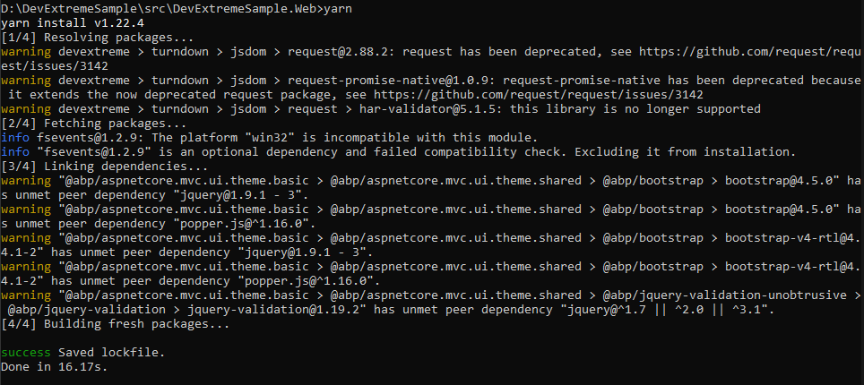
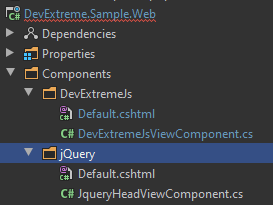

## Integrate DevExtreme Packages to ABP Framework Based Applications

Hi, in this step-by-step article, I will show you how to integrate DevExtreme components into ABP Framework based applications.

## Install DevExtreme

You can follow [this documentation](https://js.devexpress.com/Documentation/17_1/Guide/ASP.NET_MVC_Controls/Prerequisites_and_Installation/) to install devexpress packages.

## Preparing the Project

### Startup template and the initial run

Abp Framework offers startup templates to get into the business faster. We can download a new startup template using Abp CLI:

`abp new DevExtremeSample -m none`

After the download is finished, we run `DevExtremeSample.DbMigrator` project to create the database and seed initial data (admin user, role, etc). Then we run `DevExtremeSample.Web` to see our application working.

> _Default admin username is **admin** and password is **1q2w3E\***_


### Adding DevExtreme Nuget Packages

Add following `PackageReference` to your `DevExtremeSample.Application.Contracts` project.

`<PackageReference Include="DevExtreme.AspNet.Core" Version="20.1.6" />`

Add following `PackageReference` to your `DevExtremeSample.Application.Web` project.

`<PackageReference Include="DevExtreme.AspNet.Data" Version="2.6.2" />`

> Please remember that, you must add _"DevExpress NuGet Feed"_ to your **Nuget Package Sources**. Check [this documentation](https://js.devexpress.com/Documentation/17_1/Guide/ASP.NET_MVC_Controls/Prerequisites_and_Installation/) to more information.

After adding new packages, do `dotnet restore` for your projects.

### Adding DevExtreme NPM Packages

Open `package.json` file in your `DevExtremeSample.Application.Web` project and add following package depency to `depencies` section.

`"devextreme": "^20.1.5"`

Then just open `DevExtremeSample.Application.Web` project folder via CLI and run `yarn` command.

This will add the DevExtreme npm packages to our node_modules folder as seen below.



We should add some mappings to move required files to under `wwwroot/libs` folder.

Open `abp.resourcemapping.js` file in your `DevExtremeSample.Application.Web` project and replace the content of file with following.

```javascript
module.exports = {
  aliases: {},
  mappings: {
    "@node_modules/devextreme/dist/**/*": "@libs/devextreme/",
  },
};
```

Open `DevExtremeSample.Application.Web` project folder via CLI and run `gulp` command. This action will do mappings as we described before.


You can see `devextreme` folder in your `wwwroot/libs` folder.


### Adding DevExtreme Css Files To Global Bundles

Open your `DevExtremeSampleWebModule.cs` file in your `DevExtremeSample.Application.Web` project and add following code to `ConfigureServices` method.

```csharp
Configure<AbpBundlingOptions>(options =>
{
    options
        .StyleBundles
        .Get(StandardBundles.Styles.Global)
        .AddFiles("/libs/devextreme/css/dx.common.css")
        .AddFiles("/libs/devextreme/css/dx.light.css");
});
```

### Adding DevExtreme Js Files

We cannot add DevExtreme js packages to `Global Script Bundles`, because DevExtreme js packages requires to located in the `<head>` section.

But we can create `ViewComponent` and render it at `<head>` section with `AbpLayoutHookOptions`.

Create `Components` folder in your `DevExtremeSample.Application.Web` project. Then create `DevExtremeJs` folder under `Components` folder.

Create `Default.cshtml` file in your `DevExtremeJs` folder and paste following codes to your file.

```csharp
@addTagHelper *, Volo.Abp.AspNetCore.Mvc.UI.Bundling

<!-- Devextreme -->
<abp-script src="/libs/devextreme/js/dx.all.js" />
<abp-script src="/libs/devextreme/js/dx.aspnet.mvc.js" />
<abp-script src="/libs/devextreme/js/dx.aspnet.data.js" />
```

Create `DevExtremeJsViewComponent.cs` file in your `DevExtremeJs` folder and paste following codes to your file.

```csharp
namespace DevExtremeSample.Web.Components.DevExtremeJs
{
    public class DevExtremeJsViewComponent : AbpViewComponent
    {
        public IViewComponentResult Invoke()
        {
            return View("/Components/DevExtremeJs/Default.cshtml");
        }
    }
}
```

After that, your `*.Web` project should be like as following.


Then we can add this view component to `<head>` section by using **hooks**.

Open your `DevExtremeSampleWebModule.cs` file in your `DevExtremeSample.Application.Web` project and add following code to `ConfigureServices` method.

```csharp
Configure<AbpLayoutHookOptions>(options =>
{
    options.Add(
        LayoutHooks.Head.Last, //The hook name
        typeof(DevExtremeJsViewComponent) //The component to add
    );
});
```

### Manipulate `JQueryScriptContributor`

In ABP Framework, all javascript files are located at the end of file by default. But DevExtreme is using `inline` javascript codes and those are requires the `jQuery` package located at `<head>` section.

ABP Framework has a one contributor that named `JQueryScriptContributor` for `jQuery` packages. It has `jQuery` and some abp packages. We need to manipulate that.

So create `jQuery` folder in `Components` folder at your `*.Web` project.

Create `Default.cshtml` file in your `jQuery` folder and paste following codes to your file.

```csharp
@addTagHelper *, Volo.Abp.AspNetCore.Mvc.UI.Bundling

<script src="/libs/jquery/jquery.js"></script>
```

Create `JqueryHeadViewComponent.cs` file in your `jQuery` folder and paste following codes to your file.

```csharp
using Microsoft.AspNetCore.Mvc;
using Volo.Abp.AspNetCore.Mvc;

namespace DevExtremeSample.Web.Components.jQuery
{
    public class JqueryHeadViewComponent : AbpViewComponent
    {
        public IViewComponentResult Invoke()
        {
            return View("/Components/jQuery/Default.cshtml");
        }
    }
}
```

After that, your `*.Web` project should be like as following.



Then replace your `AbpLayoutHookOptions` with following code block to add `JqueryHeadViewComponent` to `<head>` section.

```csharp
Configure<AbpLayoutHookOptions>(options =>
{
    options.Add(
        LayoutHooks.Head.Last, //The hook name
        typeof(JqueryHeadViewComponent) //The component to add
        ).Add(
        LayoutHooks.Head.Last, //The hook name
        typeof(DevExtremeJsViewComponent) //The component to add
    );
});
```

Now create `MyScriptContributor.cs` file at your `*.Web` project and paste following codes to your file.

```csharp
using System.Collections.Generic;
using Volo.Abp.AspNetCore.Mvc.UI.Bundling;
using Volo.Abp.AspNetCore.Mvc.UI.Packages.Core;
using Volo.Abp.Modularity;

namespace DevExtremeSample.Web
{
    [DependsOn(typeof(CoreScriptContributor))]
    public class MyScriptContributor : BundleContributor
    {
        public override void ConfigureBundle(BundleConfigurationContext context)
        {
            context.Files.AddIfNotContains("/libs/abp/jquery/abp.jquery.js");
        }
    }
}
```

Finally, we replace the `JQueryScriptContributor` with `MyScriptContributor`.

Replace the `AbpBundlingOptions` at the `DevExtremeSampleWebModule.cs` file with the following code block.

```csharp
Configure<AbpBundlingOptions>(options =>
{
    options
        .StyleBundles
        .Get(StandardBundles.Styles.Global)
        .AddFiles("/libs/devextreme/css/dx.common.css")
        .AddFiles("/libs/devextreme/css/dx.light.css");

    options.ScriptBundles
        .Get(StandardBundles.Scripts.Global)
        .Contributors
        .Replace<JQueryScriptContributor, MyScriptContributor>();
});
```

### Result

After following this step-by-step article you can use all DevExtreme features in your project.


> The result example is created by following [this documentation](https://js.devexpress.com/Demos/WidgetsGallery/Demo/ProgressBar/Overview/NetCore/Light/).
