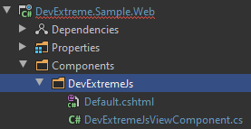
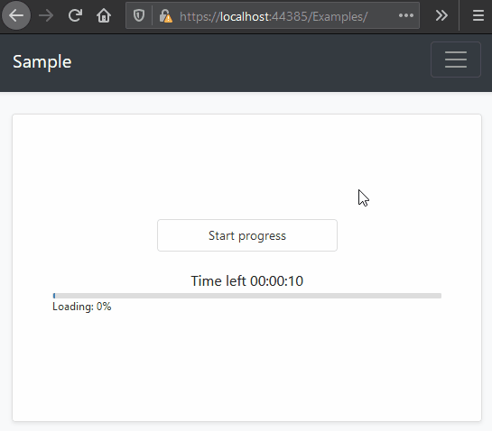

## Using DevExtreme in ABP Based Application

Hi, in this step-by-step article, I will show you how to integrate DevExtreme components into ABP Framework based applications.

## Install DevExtreme

You can follow [this documentation](https://js.devexpress.com/Documentation/17_1/Guide/ASP.NET_MVC_Controls/Prerequisites_and_Installation/) to install devexpress packages.

## Preparing the Project

### Startup template and the initial run

Abp Framework offers startup templates to get into the business faster. We can download a new startup template using Abp CLI:

`abp new DevExtremeSample -m none`

After the download is finished, we run `DevExtremeSample.DbMigrator` project to create the database and seed initial data (admin user, role, etc). Then we run `DevExtremeSample.Web` to see our application working.

> _Default admin username is **admin** and password is **1q2w3E\***_


### Adding DevExtreme Nuget Packages

Add the `DevExtreme.AspNet.Core` package to your `DevExtremeSample.Application.Contracts` project.

```
dotnet add package DevExtreme.AspNet.Core
```

Add the `DevExtreme.AspNet.Data` package to your `DevExtremeSample.Web` project.

```
dotnet add package DevExtreme.AspNet.Data
```

> Please remember that, you must add _"DevExpress NuGet Feed"_ to your **Nuget Package Sources**. Check [this documentation](https://js.devexpress.com/Documentation/17_1/Guide/ASP.NET_MVC_Controls/Prerequisites_and_Installation/) to more information.

### Adding DevExtreme NPM Depencies

Open your `DevExtremeSample.Web` project folder with console and add `devextreme` package depency via `npm` or `yarn`.

`npm install devextreme` or `yarn add devextreme`

This will add the DevExtreme npm packages to our node_modules folder and `package.json` file as seen below.

### Adding Resource Mappings

The `devextreme` npm package is saved under `node_modules` folder. We need to move them in our `wwwroot/libs` folder to use them in our web project. To add packages in our application, we need to create some mappings by using **Abp Resource Mapping**.

Open `abp.resourcemapping.js` file in your `DevExtremeSample.Web` project and add following definition to inside `mappings` object.

`"@node_modules/devextreme/dist/**/*": "@libs/devextreme/"`

After that, the `abp.resourcemapping.js` file should looks like as following.

```
module.exports = {
  aliases: {},
  mappings: {
    "@node_modules/devextreme/dist/**/*": "@libs/devextreme/",
  },
};
```

Open your `DevExtremeSample.Web` project folder with console and run `gulp` command. This action will do mappings as we described before.


You can see `devextreme` folder in your `wwwroot/libs` folder.


### Adding DevExtremeStyleContributor

We will add DevExtreme css files as a `BundleContributor`. To get more information, please see this [documentation](https://docs.abp.io/en/abp/latest/UI/AspNetCore/Bundling-Minification).

Create `Bundling` folder in your `DevExtremeSample.Web` project. Then create `DevExtremeStyleContributor.cs` file and copy following code block to inside it.

```csharp
using System.Collections.Generic;
using Volo.Abp.AspNetCore.Mvc.UI.Bundling;

namespace DevExtremeSample.Web.Bundling
{
    public class DevExtremeStyleContributor : BundleContributor
    {
        public override void ConfigureBundle(BundleConfigurationContext context)
        {
            context.Files.AddIfNotContains("/libs/devextreme/css/dx.common.css");
            context.Files.AddIfNotContains("/libs/devextreme/css/dx.light.css");
        }
    }
}
```

Open your `DevExtremeSampleWebModule.cs` file in your `DevExtremeSample.Web` project and add following code to `ConfigureServices` method.

```csharp
Configure<AbpBundlingOptions>(options =>
{
    options
        .StyleBundles
        .Get(StandardBundles.Styles.Global)
        .AddContributors(typeof(DevExtremeStyleContributor));
});
```

### Adding DevExtremeScriptContributor

We cannot add DevExtreme js packages to `Global Script Bundles`, because DevExtreme is using some inline javascript codes and js packages requires to located in the `<head>` section.

But we can create `ViewComponent` and render it at `<head>` section with `AbpLayoutHookOptions`.

First, create `DevExtremeScriptContributor.cs` file at your `Bundling` folder and copy following code block to inside it.

```csharp
using System.Collections.Generic;
using Volo.Abp.AspNetCore.Mvc.UI.Bundling;
using Volo.Abp.AspNetCore.Mvc.UI.Packages.JQuery;
using Volo.Abp.Modularity;

namespace DevExtremeSample.Web.Bundling
{
    [DependsOn(
        typeof(JQueryScriptContributor)
        )]
    public class DevExtremeScriptContributor : BundleContributor
    {
        public override void ConfigureBundle(BundleConfigurationContext context)
        {
            context.Files.AddIfNotContains("/libs/devextreme/js/dx.all.js");
            context.Files.AddIfNotContains("/libs/devextreme/js/dx.aspnet.mvc.js");
            context.Files.AddIfNotContains("/libs/devextreme/js/dx.aspnet.data.js");
        }
    }
}
```

As you see, the `DevExtremeScriptContributor` is depends on `JQueryScriptContributor`. All packages are `JQueryScriptContributor` will added before the `DevExtremeScriptContributor` packages.

#### Create DevExtremeJsViewComponent

Create `Components` folder in your `DevExtremeSample.Web` project. Then create `DevExtremeJs` folder under `Components` folder.

Create `Default.cshtml` file in your `DevExtremeJs` folder and paste following codes to your file.

```csharp
@using DevExtremeSample.Web.Bundling
@addTagHelper *, Volo.Abp.AspNetCore.Mvc.UI.Bundling

<!-- Devextreme -->
<abp-script type="typeof(DevExtremeScriptContributor)" />

```

Create `DevExtremeJsViewComponent.cs` file in your `DevExtremeJs` folder and paste following codes to your file.

```csharp
namespace DevExtremeSample.Web.Components.DevExtremeJs
{
    public class DevExtremeJsViewComponent : AbpViewComponent
    {
        public IViewComponentResult Invoke()
        {
            return View("/Components/DevExtremeJs/Default.cshtml");
        }
    }
}
```

After that, your `*.Web` project should be like as following.



Then we can add this view component to `<head>` section by using **hooks**.

Open your `DevExtremeSampleWebModule.cs` file in your `DevExtremeSample.Web` project and add following code to `ConfigureServices` method.

```csharp
Configure<AbpLayoutHookOptions>(options =>
{
    options.Add(
        LayoutHooks.Head.Last, //The hook name
        typeof(DevExtremeJsViewComponent) //The component to add
    );
});
```

#### Known Issue: Uncaught TypeError: MutationObserver.observe: Argument 1 is not an object.

> If you are using ABP 3.1 version or more, you can skip this section.

When you run your `*.Web` project, you will see an exception (`Uncaught TypeError: MutationObserver.observe: Argument 1 is not an object.`) at your console.

This article is written in ABP Version 3.1 development cycle. We have fixed this issue [(ref)](https://github.com/abpframework/abp/issues/4566) in this development cycle.

To fix that issue, download this file [abp.jquery.js](https://github.com/abpframework/abp/blob/dev/npm/packs/jquery/src/abp.jquery.js) and replace with `wwwroot / libs / abp / jquery / abp.jquery.js` file of your `*.Web` project.

### Result

After following this step-by-step article you can use all DevExtreme features in your project.



> The result example is created by following [this documentation](https://js.devexpress.com/Demos/WidgetsGallery/Demo/ProgressBar/Overview/NetCore/Light/).

---

### Sample Application

We have created a sample application with [Tree List](https://demos.devexpress.com/ASPNetCore/Demo/TreeList/Overview/) and [Data Grid](https://demos.devexpress.com/ASPNetCore/Demo/DataGrid/Overview/) examples.

You can download the source code from [here](https://github.com/abpframework/abp-samples/tree/master/DevExtreme-Mvc).

We have some notes about this sample and general usages of DevExtreme at ABP based application.

### Data Storage

We will use an in-memory list for using data storage for this sample.

There is a `SampleDataService.cs` file in `Data` folder at `*.Application.Contracts` project. We store all sample data here.

We did not create `Entities` etc. Because we want to show "How to use DevExtreme?", because of that, in this sample we focused to application and UI layer.

### JSON Serialization

You can see some `[JsonProperty(Name = "OrderId")]` attributes at DTO's. In this sample, we use that attribute on DTO's properties because DevExtreme official resource is suggesting to _disable the conversion in the JSON serializer_ [(ref)](https://js.devexpress.com/Documentation/19_1/Guide/Angular_Components/Visual_Studio_Integration/Add_DevExtreme_to_an_ASP.NET_Core_Angular_Application/#Troubleshooting). **DO NOT DO THAT!**

If you change **the conversion in the JSON serializer**, some pre-build abp modules may occur a problem.

### MVC

You can use some DevExtreme functions to create UI. The following code blocks show you how you can use it with ABP Applicaion Services.

```csharp
Html.DevExtreme().DataGrid<Order>()
            .DataSource(d => d.Mvc()
                .Controller("Order") // Application Service Name 'without **AppService**'
                .LoadAction("GetOrders") // Method Name 'without **Async**'
                .InsertAction("InsertOrder")
                .UpdateAction("UpdateOrder")
                .DeleteAction("DeleteOrder")
                .Key("OrderID")
            )
```

```csharp
public class OrderAppService : DevExtremeSampleAppService, IOrderAppService
{
    public async Task<LoadResult> GetOrdersAsync(DataSourceLoadOptions loadOptions)
    {
        ...
    }

    public async Task<Order> InsertOrder(string values)
    {
        ...
    }
    ...
}
```
