## Using DevExtreme Components With the ABP Framework

Hi, in this step by step article, I will show you how to integrate [DevExtreme](https://js.devexpress.com/) components into ABP Framework-based applications.

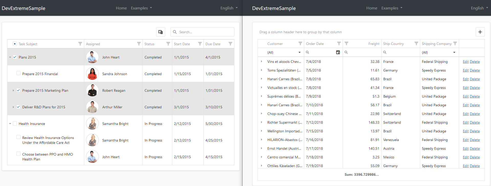

*(A screenshot from the example application developed in this article)*

## Create the Project

ABP Framework offers startup templates to get into the business faster. We can download a new startup template using [ABP CLI](https://docs.abp.io/en/abp/latest/CLI):

````bash
abp new DevExtremeSample
````

After the download is finished, open the solution in the Visual Studio (or your favorite IDE):

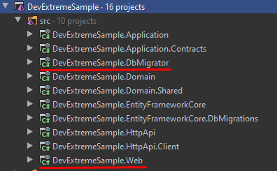

Run the `DevExtremeSample.DbMigrator` application to create the database and seed initial data (which creates the admin user, admin role, related permissions, etc). Then we can run the `DevExtremeSample.Web` project to see our application working.

> _Default admin username is **admin** and password is **1q2w3E\***_

## Install DevExtreme

You can follow [this documentation](https://js.devexpress.com/Documentation/17_1/Guide/ASP.NET_MVC_Controls/Prerequisites_and_Installation/) to install DevExpress packages into your computer.

> Don't forget to add _"DevExpress NuGet Feed"_ to your **Nuget Package Sources**.

### Adding DevExtreme NuGet Packages

Add the `DevExtreme.AspNet.Core` NuGet package to the `DevExtremeSample.Application.Contracts` project.

```
Install-Package DevExtreme.AspNet.Core
```

Add the `DevExtreme.AspNet.Data` package to your `DevExtremeSample.Web` project.

```
Install-Package DevExtreme.AspNet.Data
```

### Adding DevExtreme NPM Dependencies

Open your `DevExtremeSample.Web` project folder with a command line and add `devextreme` and `devextreme-aspnet-data` NPM packages:

````bash
npm install devextreme
````

````bash
npm install devextreme-aspnet-data
````

### Adding Resource Mappings

The `devextreme` and `devextreme-aspnet-data` NPM packages are saved under `node_modules` folder. We need to move the needed files in our `wwwroot/libs` folder to use them in our web project. We can do it using the ABP [client side resource mapping](https://docs.abp.io/en/abp/latest/UI/AspNetCore/Client-Side-Package-Management) system.

Open the `abp.resourcemapping.js` file in your `DevExtremeSample.Web` project and add the following definitions to inside `mappings` object.

````json
"@node_modules/devextreme/dist/**/*": "@libs/devextreme/",
"@node_modules/devextreme-aspnet-data/js/dx.aspnet.data.js": "@libs/devextreme/js/"
````

The final `abp.resourcemapping.js` file should look like below:

```
module.exports = {
  aliases: {},
  mappings: {
    "@node_modules/devextreme/dist/**/*": "@libs/devextreme/",
    "@node_modules/devextreme-aspnet-data/js/dx.aspnet.data.js": "@libs/devextreme/"
  },
};
```

Open your `DevExtremeSample.Web` project folder with a command line and run the `abp install-libs` command. This command will copy the needed library files into the `/wwwroot/libs/devextreme/` folder.

````bash
abp install-libs
````

You can see `devextreme` folder inside the `wwwroot/libs`:

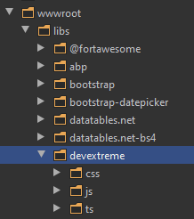

### Adding DevExtremeStyleContributor

We will add DevExtreme CSS files to the global bundle by creating a [bundle contributor](https://docs.abp.io/en/abp/latest/UI/AspNetCore/Bundling-Minification). 

Create a `Bundling` folder in the `DevExtremeSample.Web` project and a `DevExtremeStyleContributor.cs` file with the following content:

```csharp
using System.Collections.Generic;
using Volo.Abp.AspNetCore.Mvc.UI.Bundling;

namespace DevExtremeSample.Web.Bundling
{
    public class DevExtremeStyleContributor : BundleContributor
    {
        public override void ConfigureBundle(BundleConfigurationContext context)
        {
            context.Files.AddIfNotContains("/libs/devextreme/css/dx.common.css");
            context.Files.AddIfNotContains("/libs/devextreme/css/dx.light.css");
        }
    }
}
```

> You can choose another theme than the light theme. Check the `/libs/devextreme/css/` folder and the DevExtreme documentation for other themes.

Open your `DevExtremeSampleWebModule.cs` file in your `DevExtremeSample.Web` project and add following code into the `ConfigureServices` method:

```csharp
Configure<AbpBundlingOptions>(options =>
{
    options
        .StyleBundles
        .Get(StandardBundles.Styles.Global)
        .AddContributors(typeof(DevExtremeStyleContributor));
});
```

### Adding DevExtremeScriptContributor

We can not add DevExtreme js packages to Global Script Bundles, just like done for the CSS files. Because DevExtreme requires to add its JavaScript files into the `<head>` section of the HTML document, while ABP Framework adds all JavaScript files to the end of the `<body>` (as a best practice).

Fortunately, ABP Framework has a [layout hook system](https://docs.abp.io/en/abp/latest/UI/AspNetCore/Customization-User-Interface#layout-hooks) that allows you to add any code into some specific positions in the HTML document. All you need to do is to create a `ViewComponent` and configure the layout hooks.

Let's begin by creating a `DevExtremeScriptContributor.cs` file in the `Bundling` folder by copying the following code inside it:

```csharp
using System.Collections.Generic;
using Volo.Abp.AspNetCore.Mvc.UI.Bundling;
using Volo.Abp.AspNetCore.Mvc.UI.Packages.JQuery;
using Volo.Abp.Modularity;

namespace DevExtremeSample.Web.Bundling
{
    [DependsOn(
        typeof(JQueryScriptContributor)
        )]
    public class DevExtremeScriptContributor : BundleContributor
    {
        public override void ConfigureBundle(BundleConfigurationContext context)
        {
            context.Files.AddIfNotContains("/libs/devextreme/js/dx.all.js");
            context.Files.AddIfNotContains("/libs/devextreme/js/dx.aspnet.mvc.js");
            context.Files.AddIfNotContains("/libs/devextreme/js/dx.aspnet.data.js");
        }
    }
}
```

As you see, the `DevExtremeScriptContributor` depends on `JQueryScriptContributor` which adds JQuery related files before the DevExpress packages (see the [bundling system](https://docs.abp.io/en/abp/latest/UI/AspNetCore/Bundling-Minification) for details).

#### Create DevExtremeJsViewComponent

Create a new view component, named `DevExtremeJsViewComponent` inside the `/Components/DevExtremeJs` folder of the Web project, by following the steps below:

1) Create a `DevExtremeJsViewComponent` class inside the `/Components/DevExtremeJs` (create the folders first):

```csharp
using Microsoft.AspNetCore.Mvc;
using Volo.Abp.AspNetCore.Mvc;

namespace DevExtremeSample.Web.Components.DevExtremeJs
{
    public class DevExtremeJsViewComponent : AbpViewComponent
    {
        public IViewComponentResult Invoke()
        {
            return View("/Components/DevExtremeJs/Default.cshtml");
        }
    }
}
```

2) Create `Default.cshtml` file in the same folder with the following content:

```csharp
@using DevExtremeSample.Web.Bundling
@addTagHelper *, Volo.Abp.AspNetCore.Mvc.UI.Bundling

<abp-script type="typeof(DevExtremeScriptContributor)" />
```

Your final Web project should be like the following:

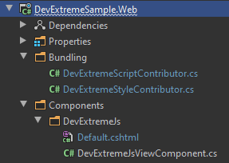

3) Now, we can add this view component to `<head>` section by using the layout hooks.

Open your `DevExtremeSampleWebModule.cs` file in your `DevExtremeSample.Web` project and add following code into the `ConfigureServices` method:

```csharp
Configure<AbpLayoutHookOptions>(options =>
{
    options.Add(
        LayoutHooks.Head.Last, //The hook name
        typeof(DevExtremeJsViewComponent) //The component to add
    );
});
```

#### Known Issue: Uncaught TypeError: MutationObserver.observe: Argument 1 is not an object.

> This issue does exist in the ABP Framework v3.0 and earlier versions. If you are using ABP Framework v3.1 or a later version, you can skip this section.

When you run your `*.Web` project, you will see an exception (`Uncaught TypeError: MutationObserver.observe: Argument 1 is not an object.`) at your console.

To fix that issue, download this file [abp.jquery.js](https://github.com/abpframework/abp/blob/dev/npm/packs/jquery/src/abp.jquery.js) and replace with the `wwwroot/libs/abp/jquery/abp.jquery.js` file of your Web project.

### Result

The installation step was done. You can use any DevExtreme component in your application.

Example: A button and a progress bar component:

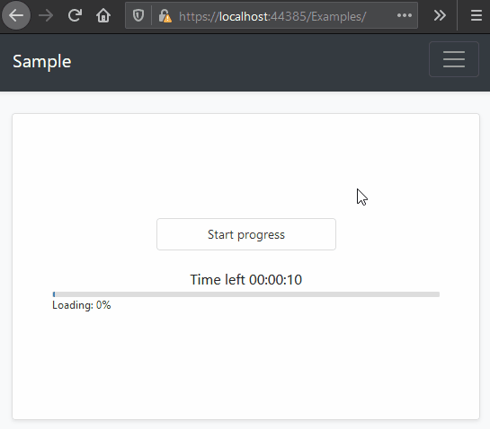

This example has been created by following [this documentation](https://js.devexpress.com/Demos/WidgetsGallery/Demo/ProgressBar/Overview/NetCore/Light/).

## The Sample Application

We have created a sample application with [Tree List](https://demos.devexpress.com/ASPNetCore/Demo/TreeList/Overview/) and [Data Grid](https://demos.devexpress.com/ASPNetCore/Demo/DataGrid/Overview/) examples.

### The Source Code

You can download the source code from [here](https://github.com/abpframework/abp-samples/tree/master/DevExtreme-Mvc).

### Data Grid

You can see the full working example of [Data Grid](https://demos.devexpress.com/ASPNetCore/Demo/DataGrid/Overview/).

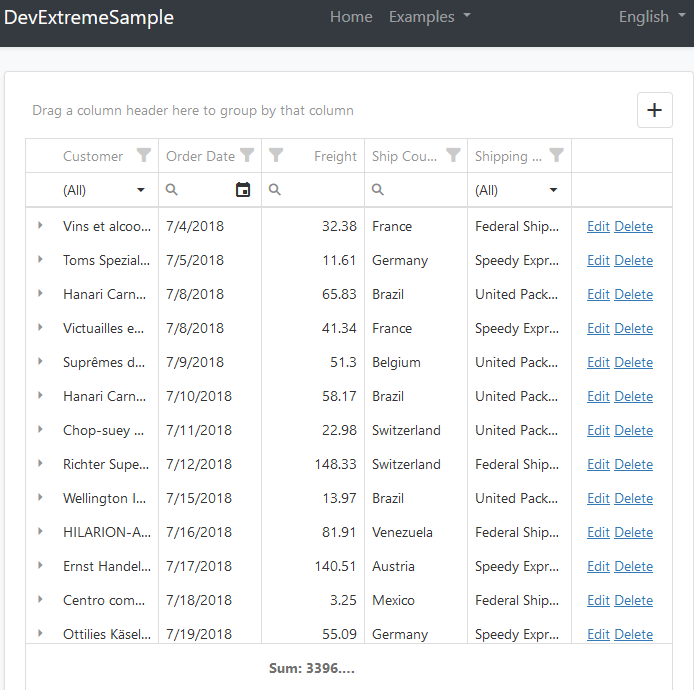

The related files for this example are highlighted at the following screenshots.

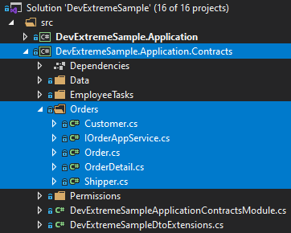

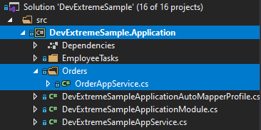


### Tree List


You can see the full working example of [Tree List](https://demos.devexpress.com/ASPNetCore/Demo/TreeList/Overview/).

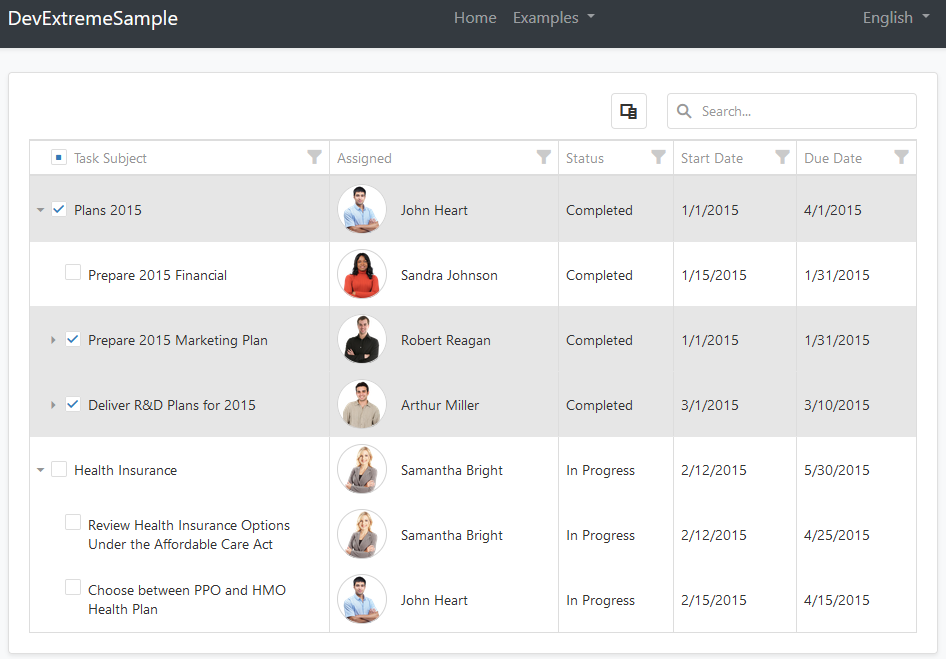

The related files for this example are highlighted at the following screenshots.

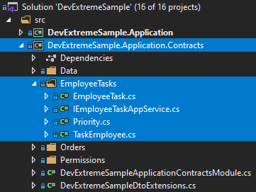

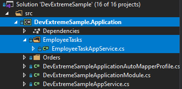

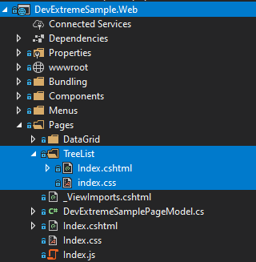

### Additional Notes

#### Data Storage

I've used an in-memory list to store data for this example, instead of a real database. Because it is not related to DevExpress usage. There is a `SampleDataService.cs` file in `Data` folder at `.Application.Contracts` project. All the data is stored here.

#### JSON Serialization

You can see some `JsonProperty` attributes on the DTO properties. I use these attributes because DevExtreme example expects `PascalCase` property names in the serialized JSON that is sent to the client. But ABP Framework & ASP.NET Core conventionally uses `camelCase` property names on JSON serialization. Adding these `JsonProperty` attributes ensures that the related properties are serialized as `PascalCase`.

#### DevExtreme Components vs Application Service Methods

ABP Framework conventionally converts application services to API Controllers. For example, see the application service below:

````csharp
public class OrderAppService : DevExtremeSampleAppService, IOrderAppService
{
    public async Task<LoadResult> GetOrdersAsync(DataSourceLoadOptions loadOptions)
    {
        ...
    }

    public async Task<Order> InsertOrder(string values)
    {
        ...
    }
    ...
}
````

You can use these service methods for your DevExtreme components as shown below:

```csharp
Html.DevExtreme().DataGrid<Order>()
            .DataSource(d => d.Mvc()
                .Controller("Order") // Application Service Name without 'AppService'
                .LoadAction("GetOrders") // Method Name without 'Async'
                .InsertAction("InsertOrder")
                .UpdateAction("UpdateOrder")
                .DeleteAction("DeleteOrder")
                .Key("OrderID")
            )
```

## Conclusion

In this article, I've explained how to use [DevExtreme](https://js.devexpress.com/) components in your application. ABP Framework is designed so that it can work with any UI library/framework.
