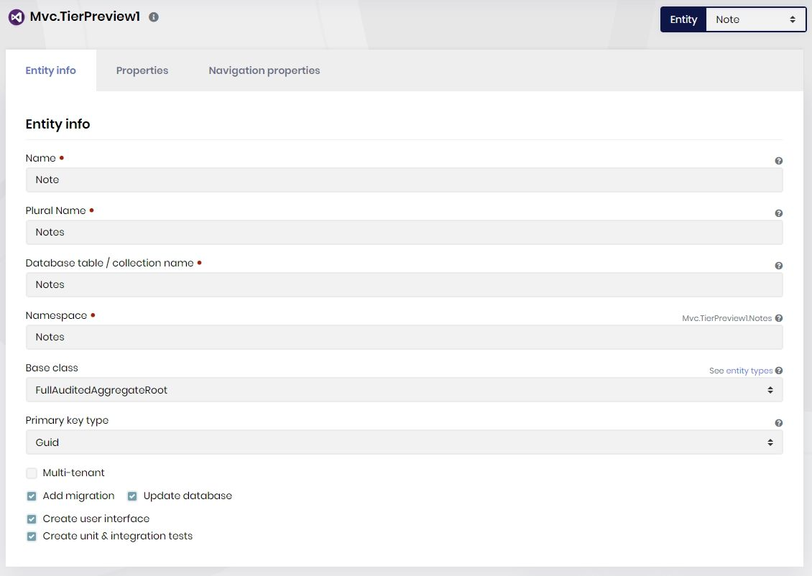
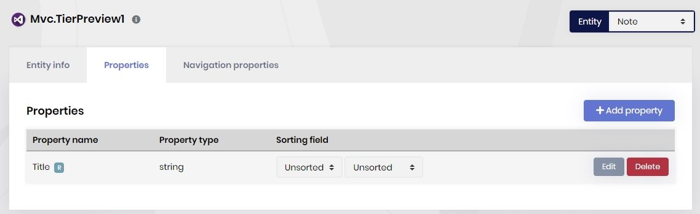
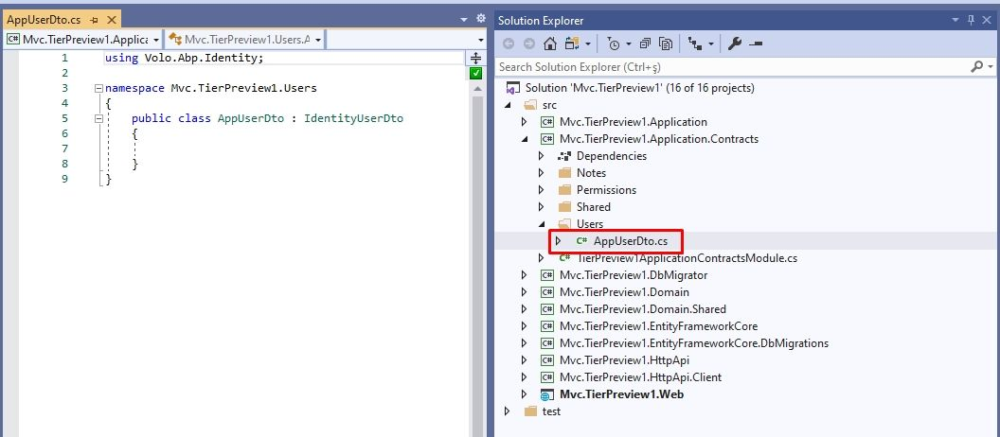
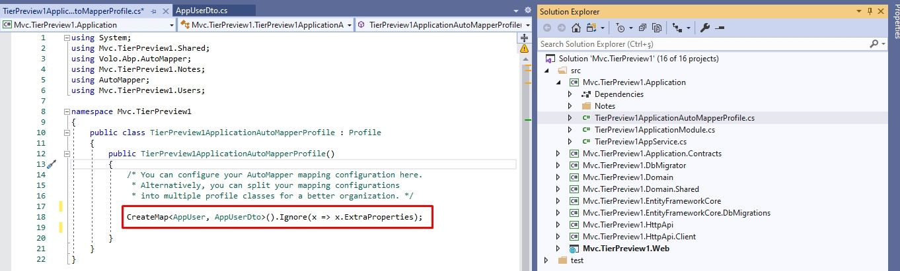
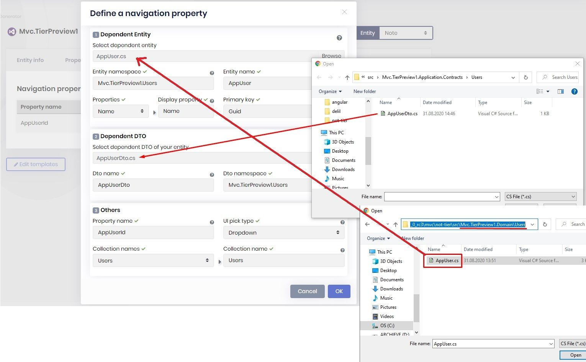
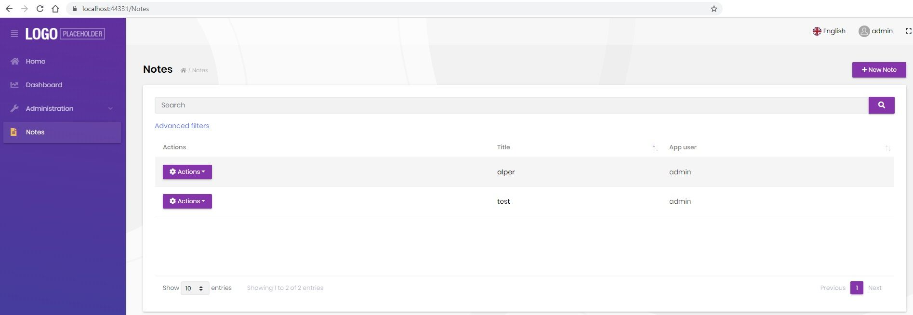

# ABP Suite: How to Add the User Entity as a Navigation Property of Another Entity

## Introduction

[ABP Suite](https://commercial.abp.io/tools/suite), a part of the [ABP Commercial](https://commercial.abp.io/), is a productivity tool developed by the team behind the ABP Framework. The main functionality of the ABP Suite is to generate code for you.

In this post, I'll show you how to add the user entity as a navigation property in your new entity, by the help of the ABP Suite.

> This article uses the MVC UI, but the same steps are applicable to the Angular UI.

## Code Generation

### Create a New Entity

Open the ABP Suite ([see how](https://docs.abp.io/en/commercial/latest/abp-suite/index)). Create a new entity called `Note`, as an example entity.



Then add a string property called `Title`, as an example property.



### Create AppUserDto

ABP Suite needs a DTO for the target entity (user, in this case) in order to define a navigation property.

To do this, create a new folder called "Users" in `*.Application.Contracts`  then add a new class called  `AppUserDto` inherited from `IdentityUserDto`.



We should define the [object mapping](https://docs.abp.io/en/abp/latest/Object-To-Object-Mapping) to be able to convert the `AppUser` objects to `AppUserDto` objects. To do this, open `YourProjectApplicationAutoMapperProfile.cs` and add the below line:

```csharp
CreateMap<AppUser, AppUserDto>().Ignore(x => x.ExtraProperties);
```



> Creating such a DTO class may not be needed for another entity than the `AppUser`, since it will probably be already available, especially if you had created the other entity using the ABP Suite.

### Define the Navigation Property

Get back to ABP Suite, open the **Navigation Properties** tab of the ABP Suite, click the **Add Navigation Property** button. Browse  `AppUser.cs` in `*.Domain\Users` folder. Then choose the `Name` item as display property. Browse `AppUserDto.cs` in `*.Contracts\Users` folder. Choose `Users` from Collection Names dropdown.



### Generate the Code!

That's it! Click **Save and generate** button to create your page. You'll see the following page if there's everything goes well. 



## About the ABP Commercial RC

This example has been implemented with **ABP Commercial 3.1.0-rc.3**. This is a RC version. If you want to install the CLI and Suite RC version follow the next steps:

1- Uninstall the current version of the CLI and install the specific RC version:

```bash
dotnet tool uninstall --global Volo.Abp.Cli && dotnet tool install --global Volo.Abp.Cli --version 3.1.0-rc.3
```

2- Uninstall the current version of the Suite and install the specific RC version:

```bash
dotnet tool uninstall --global Volo.Abp.Suite && dotnet tool install -g Volo.Abp.Suite --version 3.1.0-rc.3 --add-source https://nuget.abp.io/<YOUR-API-KEY>/v3/index.json
```

Don't forget to replace the `<YOUR-API-KEY>` with your own key!

## Conclusion