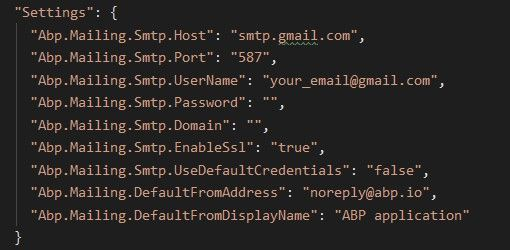

# Replacing Email Templates and Sending Emails

## Introduction

Hi, in this step by step article, we will send an email by using standard email template and then we will replace the standard email template with our new created template, thanks to [Text Templating System](https://docs.abp.io/en/abp/latest/Text-Templating#replacing-the-existing-templates) and [Virtual File System](https://docs.abp.io/en/abp/latest/Virtual-File-System).

* ABP framework provides a strong and flexible [Text Templating System](https://docs.abp.io/en/abp/latest/Text-Templating). So, we can use the text templating system to create dynamic email contents on a template and a model.

* In this article, we will use `StandardEmailTemplates.Message` as standard email template. Then we will create a new template and replace the standard email template with our new template by using [Virtual File System](https://docs.abp.io/en/abp/latest/Virtual-File-System).

* The `Virtual File System` makes it possible to manage files that do not physically exist on the file system. That means we can override `StandardEmailTemplates.Message` template by changing it's path with our new template's path.

## Creating the Solution

> ABP Framework offers startup templates to get into the business faster. 

In this article, I will create a new startup template and perform the operations on this template. But if you have already a project you don't need to create a new startup template, you can implement the following steps to your existing project. (These steps can be applied to any project. (MVC, Angular etc.))

> If you have already a project you can skip this section.

Before starting to development, we will create a solution named `TemplateReplace` (or whatever you want). We can create a new startup template by using [ABP CLI](https://docs.abp.io/en/abp/latest/CLI) :

````bash
abp new TemplateReplace
````

Our project boilerplate will be ready after the download is finished. Then, open the solution in the Visual Studio (or your favorite IDE).

Run the `TemplateReplace.DbMigrator` application as below to create the database and seed initial data (which creates the admin user, admin role, permissions etc.).


* Right click to `TemplateReplace.DbMigrator` and choose the `Debug`.


* After that, click the `Start new instance` option to start the database migrations.


Then we can run the `TemplateReplace.Web` project to see our application working.

> _Default login credentials for admin: username is **admin** and password is **1q2w3E\***_

## Starting the Development

First thing we need to do is, creating a email service to sending emails. ABP Framework provides `IEmailSender` service that is used to send emails. 

### Step - 1

Create an `Emailing` folder in the `TemplateReplace.Domain` project and add a class named `EmailService` inside of it.

```csharp
using System.Threading.Tasks;
using Volo.Abp.DependencyInjection;
using Volo.Abp.Emailing;
using Volo.Abp.Emailing.Templates;
using Volo.Abp.TextTemplating;

namespace TemplateReplace.Emailing
{
    public class EmailService : ITransientDependency
    {
        private readonly IEmailSender _emailSender;
        private readonly ITemplateRenderer _templateRenderer;

        public EmailService(IEmailSender emailSender, ITemplateRenderer templateRenderer)
        {
            _emailSender = emailSender;
            _templateRenderer = templateRenderer;
        }

        public async Task SendAsync(string targetEmail)
        {
            var emailBody = await _templateRenderer.RenderAsync(
                StandardEmailTemplates.Message,
                new
                {
                    message = "ABP Framework provides IEmailSender service that is used to send emails."
                }
            );

            await _emailSender.SendAsync(
                targetEmail,
                "Subject",
                emailBody
            );
        }
    }
}
```

* To create an email content, we need to inject `ITemplateRenderer` and use the `RenderAsync` method to render a template.

* We've used `StandardEmailTemplates.Message` as standart email template. This provides us a standard and simple message template to send mails.

* The resulting email body should be like shown below:

```html
<!DOCTYPE html>
<html lang="en" xmlns="http://www.w3.org/1999/xhtml">
<head>
    <meta charset="utf-8" />
</head>
<body>
    ABP Framework provides IEmailSender service that is used to send emails.
</body>
</html>
```

### Step - 2 (Configuring Email Settings)

* Now, we need to configure some email settings by following [settings documentation](https://docs.abp.io/en/abp/latest/Settings). For achieve this, create a class named `EmailSettingProvider` in `Emailing` folder and set the content as below.

```csharp
using Volo.Abp.Emailing;
using Volo.Abp.Settings;

namespace TemplateReplace.Emailing
{
    public class EmailSettingProvider : SettingDefinitionProvider
    {
        public override void Define(ISettingDefinitionContext context)
        {
            //Google's SMTP settings:
            context.Add(
                new SettingDefinition(EmailSettingNames.Smtp.Host, "smtp.gmail.com"),
                new SettingDefinition(EmailSettingNames.Smtp.Port, "587"),
                new SettingDefinition(EmailSettingNames.Smtp.UserName, "your_email@gmail.com"), //smtp username: your email address
                new SettingDefinition(EmailSettingNames.Smtp.Password, "your_password", isEncrypted: false), //smtp password: your email password to auth
                new SettingDefinition(EmailSettingNames.Smtp.EnableSsl, "true"),
                new SettingDefinition(EmailSettingNames.Smtp.UseDefaultCredentials, "false") //set as false to auth
            );
        }
    }
}
```

* ABP was designed to be modular, so different modules can have different settings. A module must create a class derived from the `SettingDefinitionProvider` in order to define its settings. Therefore in here we created a class named `EmailSettingProvider` and inherit from `SettingDefinitionProvider` to define email settings.

* Here, I used Google's SMTP settings to send emails via Gmail. You can change these setting values by your need. It's a good idea to define a const string for a setting name instead of using a magic string. The ABP framework has a class named `EmailSettingNames`, we can just change the values of these settings by using these pre-defined class properties as key.

> **Note:** If you want to use Google's SMTP server settings and send emails via Gmail, you should confirm [this](https://myaccount.google.com/u/0/lesssecureapps).

* After that we need to open `TemplateReplaceDomainModule.cs` file and change its contents as below to sending real-time emails.

```csharp
using Microsoft.Extensions.DependencyInjection;
using Microsoft.Extensions.DependencyInjection.Extensions;
using TemplateReplace.MultiTenancy;
using Volo.Abp.AuditLogging;
using Volo.Abp.BackgroundJobs;
using Volo.Abp.Emailing;
using Volo.Abp.FeatureManagement;
using Volo.Abp.Identity;
using Volo.Abp.IdentityServer;
using Volo.Abp.Modularity;
using Volo.Abp.MultiTenancy;
using Volo.Abp.PermissionManagement.Identity;
using Volo.Abp.PermissionManagement.IdentityServer;
using Volo.Abp.SettingManagement;
using Volo.Abp.TenantManagement;

namespace TemplateReplace
{
    [DependsOn(
        typeof(TemplateReplaceDomainSharedModule),
        typeof(AbpAuditLoggingDomainModule),
        typeof(AbpBackgroundJobsDomainModule),
        typeof(AbpFeatureManagementDomainModule),
        typeof(AbpIdentityDomainModule),
        typeof(AbpPermissionManagementDomainIdentityModule),
        typeof(AbpIdentityServerDomainModule),
        typeof(AbpPermissionManagementDomainIdentityServerModule),
        typeof(AbpSettingManagementDomainModule),
        typeof(AbpTenantManagementDomainModule),
        typeof(AbpEmailingModule)
    )]
    public class TemplateReplaceDomainModule : AbpModule
    {
        public override void ConfigureServices(ServiceConfigurationContext context)
        {
            Configure<AbpMultiTenancyOptions>(options =>
            {
                options.IsEnabled = MultiTenancyConsts.IsEnabled;
            });

            // #if DEBUG
            //  context.Services.Replace(ServiceDescriptor.Singleton<IEmailSender, NullEmailSender>());
            // #endif
        }
    }
}

```

* `NullEmailSender` is a built-in class that implements the `IEmailSender`, but writes email contents to the standard log system, rather than actually sending the emails. This class can be useful especially in development time where you generally don't want to send real emails. Therefore ABP framework defined this by default. But we want to send real emails, so we must remove these lines or we should take it to the comment line.

* The last thing we need to do is delete the default email settings from `appsettings.json` file in `TemplateReplace.Web`.



> **Note:** In this article, we defined email settings in `EmailSettingProvider` class, but these settings could be defined in `appsettings.json` file. For more details about this, please check the [document](https://docs.abp.io/en/abp/latest/Settings#setting-values-in-the-application-configuration).

* After all of these steps, when we send an email we should see the following template.


### Step - 3

* So far we've sent mail by using standard email template of ABP. But we may want to replace the email template with the new one. We can achieve this by following the `Text Templating` [documentation](https://docs.abp.io/en/abp/latest/Text-Templating#replacing-the-existing-templates).

* In this article, I will create a email template by using free template generator named `Bee`. You can reach the free templates from [here](https://beefree.io/templates/free/).

* After choosing our free template, we can create a new **email template**. So, create a folder named `Templates` under `Emailing` folder in `TemplateReplace.Domain` and add `EmailTemplate.tpl` file inside of it. And copy-paste the below content or your free template's content.

```tpl
<!DOCTYPE html>
<html lang="en">
<head>
    <meta charset="UTF-8">
    <meta name="viewport" content="width=device-width, initial-scale=1.0">
    <style>
        a {
          text-decoration: none !important;
        }
        td img {
            color: #0f3462;
        }
        
        table {
            max-width: 650px;
        }
    </style>
</head>
<body>
<div class="container">
    <table border="0" align="center" cellspacing="0" cellpadding="0" bgcolor="white" class="email-template">
        <tr>
            <td>
                <table border="0" cellspacing="0" cellpadding="0" style="color:#0f3462; font-family: sans-serif;">
                    <tr>
                        <td>
                            <h2 style="text-align:center; margin: 0px; padding-bottom: 25px; margin-top: 25px;">
                                <span style="color:lightcoral"></span>
                            </h2>
                        </td>
                    </tr>
                    <tr>
                        <td style="text-align: center;">
                            <h1 style="margin: 0px;padding-bottom: 25px; color: #E90052">ABP Community</h1>
                            <h2 style="margin: 0px;padding-bottom: 25px;font-size:22px;">Share your experiences with the ABP Framework!</h2>
                            <p style=" margin: 0px 40px;padding-bottom: 25px;line-height: 2; font-size: 15px;">
                                ABP is an <a href="https://github.com/abpframework">open source</a> and community driven project. This guide is aims to help anyone wants to contribute to the project.
                            </p>
                            <p style=" margin: 0px 32px;padding-bottom: 25px;line-height: 2; font-size: 15px;">
                                If you want to write articles or "how to" guides related to the ABP Framework and ASP.NET Core, please submit your article to the <a href="https://community.abp.io/">community.abp.io</a> web site.
                            </p>
                        </td>
                    </tr>
                    <tr>
                        <td>
                            <button type="button" style="background-color:#E90052; color:white; padding:15px 97px; outline: none; display: block; margin: auto; border-radius: 31px;
                                    font-weight: bold; margin-top: 25px; margin-bottom: 25px; border: none; text-transform:uppercase; ">
                                <a style="text-decoration: none; color:white" href="https://community.abp.io/articles/submit">Contribute</a>
                            </button>
                        </td>
                    </tr>
                </table>
            </td>
        </tr>
    </table>
</div>
</body>
</html>
```

* Then we need to make the template file as "Embedded Resource". We can do this as below.

* First right click to **EmailTemplate.tpl** and choose `Properties`.

 

* Then be sure about build action is **Embedded resource**.


### Step - 4 (Replacing the Email Template)

* To replace the current email template with our new email template, we need to override it. To achieve this, create a class named `EmailTemplateDefinitionProvider` under `Emailing` folder in `TemplateReplace.Domain` and fill it with the below content.

```csharp
using Volo.Abp.DependencyInjection;
using Volo.Abp.Emailing.Templates;
using Volo.Abp.TextTemplating;

namespace TemplateReplace.Emailing
{
    public class EmailTemplateDefinitionProvider : TemplateDefinitionProvider, ITransientDependency
    {
        public override void Define(ITemplateDefinitionContext context)
        {
            var emailLayoutTemplate = context.GetOrNull(StandardEmailTemplates.Message);

            emailLayoutTemplate
                .WithVirtualFilePath(
                    "/Emailing/Templates/EmailTemplate.tpl",
                    isInlineLocalized: true
                );
        }
    }
}
```

* In here we've created a template definition provider class that gets the email layout template and change the virtual file path for the template.

* This approach allows us to locate templates in any folder instead of the folder defined by the depended module. For more detail, check the [Virtual File System](https://docs.abp.io/en/abp/latest/Virtual-File-System).

### Step - 5

* Lastly, we need to configure the [Virtual File System](https://docs.abp.io/en/abp/latest/Virtual-File-System). To do this open your `TemplateReplaceDomainModule.cs` in `TemplateReplace.Domain` and update the content as below.

```csharp
using TemplateReplace.MultiTenancy;
using Volo.Abp.AuditLogging;
using Volo.Abp.BackgroundJobs;
using Volo.Abp.Emailing;
using Volo.Abp.FeatureManagement;
using Volo.Abp.Identity;
using Volo.Abp.IdentityServer;
using Volo.Abp.Modularity;
using Volo.Abp.MultiTenancy;
using Volo.Abp.PermissionManagement.Identity;
using Volo.Abp.PermissionManagement.IdentityServer;
using Volo.Abp.SettingManagement;
using Volo.Abp.TenantManagement;
using Volo.Abp.VirtualFileSystem;

namespace TemplateReplace
{
    [DependsOn(
        typeof(TemplateReplaceDomainSharedModule),
        typeof(AbpAuditLoggingDomainModule),
        typeof(AbpBackgroundJobsDomainModule),
        typeof(AbpFeatureManagementDomainModule),
        typeof(AbpIdentityDomainModule),
        typeof(AbpPermissionManagementDomainIdentityModule),
        typeof(AbpIdentityServerDomainModule),
        typeof(AbpPermissionManagementDomainIdentityServerModule),
        typeof(AbpSettingManagementDomainModule),
        typeof(AbpTenantManagementDomainModule),
        typeof(AbpEmailingModule)
    )]
    public class TemplateReplaceDomainModule : AbpModule
    {
        public override void ConfigureServices(ServiceConfigurationContext context)
        {
            Configure<AbpMultiTenancyOptions>(options =>
            {
                options.IsEnabled = MultiTenancyConsts.IsEnabled;
            });
            
            //Add this configuration
            Configure<AbpVirtualFileSystemOptions>(options =>
            {
                options.FileSets.AddEmbedded<TemplateReplaceDomainModule>();
            });
        }
    }
}

```

* And now when we want to send a new email, we should see the our new defined template as the message like below.


## Text Template Management  


* ABP Commercial's [Text Template Management](https://commercial.abp.io/modules/Volo.TextTemplateManagement) module is really fascinating. It makes it super easy to stores and edits template contents. We can list all templates on a page, editing them, localizing them, and so on.


* ABP Commercial's text template management module, allows us to modify a template through the UI.

* I highly recommend you to [check it out](https://commercial.abp.io/modules/Volo.TextTemplateManagement).

## References

* [Text Templating](https://docs.abp.io/en/abp/latest/Text-Templating)
* [Emailing](https://docs.abp.io/en/abp/latest/Emailing)
* [Virtual File System](https://docs.abp.io/en/abp/latest/Virtual-File-System)