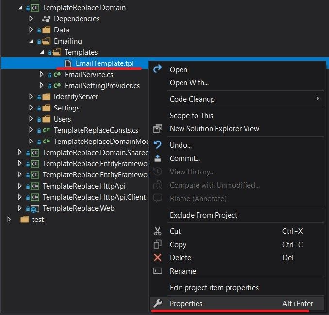

# Replacing Email Template and Sending Emails

## Introduction

Hi, in this step by step article, I will show you how you can replace the existing templates and how you can send emails by using the replaced templates.

## Creating the Solution

Before starting to development, we need to create a solution named `TemplateReplace` (or whatever you want). We can download a new startup template by using [ABP CLI](https://docs.abp.io/en/abp/latest/CLI) :

````bash
abp new TemplateReplace
````

Our project boilerplate will be ready after the download is finished. Then, open the solution in the Visual Studio (or your favorite IDE).

Run the `TemplateReplace.DbMigrator` application as below to create the database and seed initial data (which creates the admin user, admin role, permissions etc.).


* Left click to `TemplateReplace.DbMigrator` and choose the `Debug`.


* After that, click the `Start new instance` option to start the database migrations.


Then we can run the `TemplateReplace.Web` project to see our application working.

> _Default login credentials for admin: username is **admin** and password is **1q2w3E\***_

## Starting the Development

First thing we need to do is, creating a email service to sending emails. ABP Framework provides `IEmailSender` service that is used to send emails. 

### Step - 1

Create an `Email` folder in the `TemplateReplace.Application.Contracts` project and add a interface named `IEmailService` inside of it :

```csharp
using System.Threading.Tasks;

namespace TemplateReplace.Email
{
    public interface IEmailService
    {
        Task<string> SendAsync();
    }
} 
```

### Step - 2

Create an `Email` folder in the `TemplateReplace.Application` project and add a class named `EmailService` inside of it to implement the `IEmailService` interface.

```csharp
using System.Threading.Tasks;
using Volo.Abp.DependencyInjection;
using Volo.Abp.Emailing;
using Volo.Abp.Emailing.Templates;
using Volo.Abp.TextTemplating;

namespace TemplateReplace.Email
{
    public class EmailService : IEmailService, ITransientDependency
    {
        private readonly IEmailSender _emailSender;
        private readonly ITemplateRenderer _templateRenderer;

        public EmailService(IEmailSender emailSender, ITemplateRenderer templateRenderer)
        {
            _emailSender = emailSender;
            _templateRenderer = templateRenderer;
        }

        public async Task<string> SendAsync()
        {
            var emailBody = await _templateRenderer.RenderAsync(
                StandardEmailTemplates.Message,
                new
                {
                   message = "This is email body..."
                }
            );

            await _emailSender.SendAsync(
                "from_email@abp.io",
                "target_email@abp.io",
                "Subject",
                emailBody
            );

            return emailBody;
        }
    }
} 
```

* ABP framework provides a strong and flexible [text templating system](https://docs.abp.io/en/abp/latest/Text-Templating). So, we can use the text templating system to create dynamic email contents.

* To create an email content, we need to inject `ITemplateRenderer` and use the `RenderAsync` method to render a template.

* We've used `StandardEmailTemplates.Message` as standart email template. This provides us a standard and simple message template to send mails.

* The resulting email body should be like shown below:
```html
<!DOCTYPE html>
<html lang="en" xmlns="http://www.w3.org/1999/xhtml">
<head>
    <meta charset="utf-8" />
</head>
<body>
    This is email body...
</body>
</html>
```

### Step - 3

* Now we need to create a user interface to be able to see the standard email template. To do this quickly, open your existing `Index.cshtml.cs` in your `TemplateReplace.Web` project. It's under the **Pages** folder. And copy-paste the below content.

```csharp
using TemplateReplace.Email;

namespace TemplateReplace.Web.Pages
{
    public class IndexModel : TemplateReplacePageModel
    {
        private readonly IEmailService _emailService;
        public string EmailBody { get; set; }

        public IndexModel(IEmailService emailService)
        {
            _emailService = emailService;
        }
        
        public async void OnGet()
        {
            if(CurrentUser.IsAuthenticated)
            {
                EmailBody = await _emailService.SendAsync();
            }
        }
    }
}
```

* Then, open your `Index.cshtml` file and set the content as below.

```html
@page
@using Microsoft.AspNetCore.Mvc.Localization
@using TemplateReplace.Localization
@using Volo.Abp.Users
@model TemplateReplace.Web.Pages.IndexModel
@inject IHtmlLocalizer<TemplateReplaceResource> L
@inject ICurrentUser CurrentUser
@section styles {
    <abp-style-bundle>
        <abp-style src="/Pages/Index.css" />
    </abp-style-bundle>
}
@section scripts {
    <abp-script-bundle>
        <abp-script src="/Pages/Index.js" />
    </abp-script-bundle>
}
<div class="jumbotron text-center">
    <h1>@L["Welcome"]</h1>
    <div class="row">
        <div class="col-md-6 mx-auto">
            <p>@L["LongWelcomeMessage"]</p>
            <hr class="my-4" />
        </div>
    </div>
    <a href="https://abp.io?ref=tmpl" target="_blank" class="btn btn-primary px-4">abp.io</a>
    @if (!CurrentUser.IsAuthenticated)
    {
        <a abp-button="Primary" href="~/Account/Login" class="px-4"><i class="fa fa-sign-in"></i> @L["Login"]</a>
    }
</div>

<div class="email-content">
    @Html.Raw(Model.EmailBody)
</div>
```

* After all of this, we can run the `TemplateReplace.Web` application and logged in to see the standard email template. 


* As we see above, `StandardEmailTemplates.Message` template works as expected. But we need to be sure about the mail has been sent or not. To achieve this, we can examine the **logs**. So, open the `Logs` folder (It's under **TemplateReplace .Web** folder). Inside of this folder, there is a file named `logs.txt`. When we open this file and examine the lines, we can see our email details as below (target email address, subject of mail and email body).


### Step - 4

* So far we've sent mail by using standard email template of ABP. But we can want to replace the email template with the new one. We can achieve this by following [the documentation](https://docs.abp.io/en/abp/latest/Text-Templating#replacing-the-existing-templates).

* First thing we need to do is creating our new **email template**. So, create a folder named `Templates` and add `EmailLayout.cshtml` file inside of it. And copy-paste the below content.

```html
<!DOCTYPE html>
<html lang="en">
<head>
    <meta charset="UTF-8">
    <meta name="viewport" content="width=device-width, initial-scale=1.0">
    <style>
        a {
          text-decoration: none !important;
        }
        td img {
            color: #0f3462;
        }
        
        table {
            max-width: 650px;
        }
    </style>
</head>
<body>
<div class="container">
    <table border="0" align="center" cellspacing="0" cellpadding="0" bgcolor="white" class="email-template">
        <tr>
            <td>
                <table border="0" cellspacing="0" cellpadding="0" style="color:#0f3462; font-family: sans-serif;">
                    <tr>
                        <td>
                            <h2 style="text-align:center; margin: 0px; padding-bottom: 25px; margin-top: 25px;">
                                <span style="color:lightcoral"></span>
                            </h2>
                        </td>
                    </tr>
                    <tr>
                        <td>
                            
                        </td>
                    </tr>
                    <tr>
                        <td style="text-align: center;">
                            <h1 style="margin: 0px;padding-bottom: 25px; color: #E90052">ABP Community</h1>
                            <h2 style="margin: 0px;padding-bottom: 25px;font-size:22px;">Share your experiences with the ABP Framework!</h2>
                            <p style=" margin: 0px 40px;padding-bottom: 25px;line-height: 2; font-size: 15px;">
                                ABP is an <a href="https://github.com/abpframework">open source</a> and community driven project. This guide is aims to help anyone wants to contribute to the project.
                            </p>
                            <p style=" margin: 0px 32px;padding-bottom: 25px;line-height: 2; font-size: 15px;">
                                If you want to write articles or "how to" guides related to the ABP Framework and ASP.NET Core, please submit your article to the <a href="https://community.abp.io/">community.abp.io</a> web site.
                            </p>
                        </td>
                    </tr>
                    <tr>
                        <td>
                            <button type="button" style="background-color:#E90052; color:white; padding:15px 97px; outline: none; display: block; margin: auto; border-radius: 31px;
                                    font-weight: bold; margin-top: 25px; margin-bottom: 25px; border: none; text-transform:uppercase; ">
                                <a style="text-decoration: none; color:white" href="https://community.abp.io/articles/submit">Contribute</a>
                            </button>
                        </td>
                    </tr>
                    <tr style="text-align:center;">
                        <td>
                            <a href="https://github.com/abpframework/abp" style="color: black">
                                <i class="fab fa-github fa-2x" style="padding: 20px"></i>
                            </a>
                            <a href="https://stackoverflow.com/questions/tagged/abp" style="color:orange;">
                                <i style="padding: 20px" class="fab fa-stack-overflow fa-2x"></i>
                            </a>
                            <a href="https://twitter.com/abpframework">
                                <i class="fab fa-twitter fa-2x" style="padding: 20px"></i>
                            </a>
                        </td>
                    </tr>
                </table>
            </td>
        </tr>
    </table>
</div>
</body>
</html>
```

* Then we need to make the template file as "Embedded Resource". We can do this as below.

* First left click to **EmailLayout.cshtml** and choose `Properties`.

 

* Then be sure about build action is **Embedded resource**.


### Step - 5 (Replacing the Email Template)

* To replace the current email template with our new email template, we need to override it. To achieve this, create a class in `TemplateReplace.Web` and fill it with the below content.

```csharp
using Volo.Abp.DependencyInjection;
using Volo.Abp.Emailing.Templates;
using Volo.Abp.TextTemplating;

namespace TemplateReplace.Web
{
    public class EmailTemplateDefinitionProvider : TemplateDefinitionProvider, ITransientDependency
    {
        public override void Define(ITemplateDefinitionContext context)
        {
            var emailLayoutTemplate = context.GetOrNull(StandardEmailTemplates.Message);

            emailLayoutTemplate
                .WithVirtualFilePath(
                    "/Templates/EmailLayout.cshtml",
                    isInlineLocalized: true
                );
        }
    }
}
```

* In here we've created a template definition provider class that gets the email layout template and changes the virtual file path for the template.

* This approach allows us to locate templates in any folder instead of the folder defined by the depended module.

### Step - 6

* Lastly, we need to configure the [virtual file system](https://docs.abp.io/en/abp/latest/Virtual-File-System). To do this open your `TemplateReplaceWebModule` in `TemplateReplace.Web` and update the `ConfigureVirtualFileSystem` method as below.

```csharp
//...
private void ConfigureVirtualFileSystem(IWebHostEnvironment hostingEnvironment)
{
    if (hostingEnvironment.IsDevelopment())
    {
        Configure<AbpVirtualFileSystemOptions>(options =>
        {
            options.FileSets.AddEmbedded<TemplateReplaceWebModule>(); //to replace the standard email template
            
            //...
        });
    }
}
//...
```

* And now when we start the application, we need to see the new email template like as below.


## Text Template Management  


* ABP Commercial's [Text Template Management](https://commercial.abp.io/modules/Volo.TextTemplateManagement) module is really fascinating. It makes it super easy to stores and edits template contents. We can list all templates on a page, editing them, localizing them, and so on.


* ABP Commercial's text template management module, allows us to modify a template through the UI.

* I highly recommend you to [check it out](https://commercial.abp.io/modules/Volo.TextTemplateManagement).

## References

* [Text Templating](https://docs.abp.io/en/abp/latest/Text-Templating)
* [Emailing](https://docs.abp.io/en/abp/latest/Emailing)
* [Virtual File System](https://docs.abp.io/en/abp/latest/Virtual-File-System)