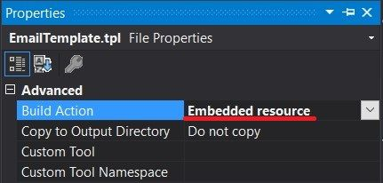
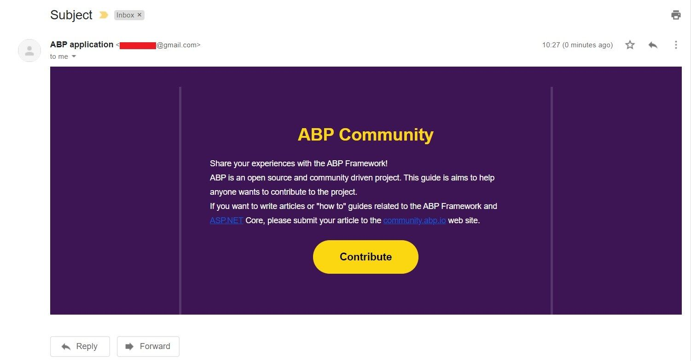

# Replacing Email Templates and Sending Emails

## Introduction

Hi, in this step by step article, we will send an email by using standard email template and then we will replace the standard email template with our new created template, thanks to [Text Templating System](https://docs.abp.io/en/abp/latest/Text-Templating#replacing-the-existing-templates) and [Virtual File System](https://docs.abp.io/en/abp/latest/Virtual-File-System). Let's start by explaining what these systems do.

* ABP framework provides a strong and flexible [Text Templating System](https://docs.abp.io/en/abp/latest/Text-Templating). So, we can use the text templating system to create dynamic email contents on a template and a model.

* In this article, we will use `StandardEmailTemplates.Message` as standard email template. Then we will create a new template and replace the standard email template with our new template by using [Virtual File System](https://docs.abp.io/en/abp/latest/Virtual-File-System).

* The `Virtual File System` makes it possible to manage files that do not physically exist on the file system. That means we can override `StandardEmailTemplates.Message` template by changing it's path with our new template's path.

## Creating the Solution

> ABP Framework offers startup templates to get into the business faster. 

In this article, I will create a new startup template and perform the operations on this template. But if you already have a project you don't need to create a new startup template, you can implement the following steps to your existing project. (These steps can be applied to any project. (MVC, Angular etc.))

> If you have already a project you can skip this section.

Before starting to development, we will create a solution named `TemplateReplace` (or whatever you want). We can create a new startup template by using [ABP CLI](https://docs.abp.io/en/abp/latest/CLI) :

````bash
abp new TemplateReplace
````

Our project boilerplate will be ready after the download is finished. Then, open the solution in the Visual Studio (or your favorite IDE).

Run the `TemplateReplace.DbMigrator` application as below to create the database and seed initial data (which creates the admin user, admin role, permissions etc.).


* Right click to `TemplateReplace.DbMigrator` and choose the `Debug`.


* After that, click the `Start new instance` option to start the database migrations.


Then we can run the `TemplateReplace.Web` project to see our application working.

> _Default login credentials for admin: username is **admin** and password is **1q2w3E\***_

## Starting the Development

First thing we need to do is, creating a email service to sending emails. ABP Framework provides `IEmailSender` service that is used to send emails. 

### Step - 1

Create an `Emailing` folder in the `TemplateReplace.Domain` project and add a class named `EmailService` inside of it.

```csharp
using System.Threading.Tasks;
using Volo.Abp.DependencyInjection;
using Volo.Abp.Emailing;
using Volo.Abp.Emailing.Templates;
using Volo.Abp.TextTemplating;

namespace TemplateReplace.Emailing
{
    public class EmailService : ITransientDependency
    {
        private readonly IEmailSender _emailSender;
        private readonly ITemplateRenderer _templateRenderer;

        public EmailService(IEmailSender emailSender, ITemplateRenderer templateRenderer)
        {
            _emailSender = emailSender;
            _templateRenderer = templateRenderer;
        }

        public async Task SendAsync(string targetEmail)
        {
            var emailBody = await _templateRenderer.RenderAsync(
                StandardEmailTemplates.Message,
                new
                {
                    message = "ABP Framework provides IEmailSender service that is used to send emails."
                }
            );

            await _emailSender.SendAsync(
                targetEmail,
                "Subject",
                emailBody
            );
        }
    }
}
```

* To create an email content, we need to inject `ITemplateRenderer` and use the `RenderAsync` method to render a template.

* We've used `StandardEmailTemplates.Message` as standart email template. This provides us a standard and simple message template to send mails.

* The resulting email body should be like shown below:

```html
<!DOCTYPE html>
<html lang="en" xmlns="http://www.w3.org/1999/xhtml">
<head>
    <meta charset="utf-8" />
</head>
<body>
    ABP Framework provides IEmailSender service that is used to send emails.
</body>
</html>
```

### Step - 2 (Configuring Email Settings)

* Now, we need to configure some email settings by following [settings documentation](https://docs.abp.io/en/abp/latest/Settings#setting-values-in-the-application-configuration). For achieve this, open the `appsettings.json` file under `TemplateReplace.Web` and configure your email settings in **settings** section like below.


* Here, I used Google's SMTP settings to send emails via Gmail. You can change these setting values by your need. 

> **Note:** If you want to use Google's SMTP server settings and send emails via Gmail, you should confirm [this](https://myaccount.google.com/u/0/lesssecureapps).

### Step - 3

* After that we need to open `TemplateReplaceDomainModule.cs` file and change its contents as below to sending real-time emails.

```csharp
using Microsoft.Extensions.DependencyInjection;
using Microsoft.Extensions.DependencyInjection.Extensions;
using TemplateReplace.MultiTenancy;
using Volo.Abp.AuditLogging;
using Volo.Abp.BackgroundJobs;
using Volo.Abp.Emailing;
using Volo.Abp.FeatureManagement;
using Volo.Abp.Identity;
using Volo.Abp.IdentityServer;
using Volo.Abp.Modularity;
using Volo.Abp.MultiTenancy;
using Volo.Abp.PermissionManagement.Identity;
using Volo.Abp.PermissionManagement.IdentityServer;
using Volo.Abp.SettingManagement;
using Volo.Abp.TenantManagement;

namespace TemplateReplace
{
    [DependsOn(
        typeof(TemplateReplaceDomainSharedModule),
        typeof(AbpAuditLoggingDomainModule),
        typeof(AbpBackgroundJobsDomainModule),
        typeof(AbpFeatureManagementDomainModule),
        typeof(AbpIdentityDomainModule),
        typeof(AbpPermissionManagementDomainIdentityModule),
        typeof(AbpIdentityServerDomainModule),
        typeof(AbpPermissionManagementDomainIdentityServerModule),
        typeof(AbpSettingManagementDomainModule),
        typeof(AbpTenantManagementDomainModule),
        typeof(AbpEmailingModule)
    )]
    public class TemplateReplaceDomainModule : AbpModule
    {
        public override void OnApplicationInitialization(ApplicationInitializationContext context)
        {
            var settingManager = context.ServiceProvider.GetService<SettingManager>();
            //encrypts the password on set and decrypts on get
            settingManager.SetGlobalAsync(EmailSettingNames.Smtp.Password, "your_password");
        }

        public override void ConfigureServices(ServiceConfigurationContext context)
        {
            Configure<AbpMultiTenancyOptions>(options =>
            {
                options.IsEnabled = MultiTenancyConsts.IsEnabled;
            });

            // #if DEBUG
            //  context.Services.Replace(ServiceDescriptor.Singleton<IEmailSender, NullEmailSender>());
            // #endif
        }
    }
}

```

* `NullEmailSender` is a built-in class that implements the `IEmailSender`, but writes email contents to the standard log system, rather than actually sending the emails. This class can be useful especially in development time where you generally don't want to send real emails. Therefore ABP framework defined this by default. But in our case we want to send real emails, so we must remove these lines or we must take it to the comment line.

* `Abp.Mailing.Smtp.Password` must be an encrypted value. Therefore we used `SettingManager` in here to set the password. It internally **encrypts** the values on set and **decrypts** on get.

* After all these steps, whenever we want to send an email, we can do it by using our `EmailService` class. We can inject this class and invoke the `SendAsync` method to sending email where its needed. 

After sending the email we should see the template like below.


### Step - 4 (Defining New Template)

* So far we've sent mail by using standard email template of ABP. But we may want to replace the email template with the new one. We can achieve this by following the `Text Templating` [documentation](https://docs.abp.io/en/abp/latest/Text-Templating#replacing-the-existing-templates).

* In this article, I will create a email template by using free template generator named **Bee**. You can reach the free templates from [here](https://beefree.io/templates/free/).

* When we find a template for our purpose, we can hover the link and click the **get started** button to edit the template. (I chose a template named "gdpr".)

* Here, you can edit your template as below. (You can delete or add sections, edit texts, and so on.)


> **Note:** After editing our template, we need to export it to reach our created template's content. You can see the **export** button top-right of the template editing page.

* After choosing and editing our free template, we can create a new **email template** in our project. For this, create a folder named `Templates` under `Emailing` folder in `TemplateReplace.Domain` and add `EmailTemplate.tpl` file inside of it. And copy-paste the below content or your template's content.

```tpl
<!DOCTYPE html PUBLIC "-//W3C//DTD XHTML 1.0 Transitional //EN" "http://www.w3.org/TR/xhtml1/DTD/xhtml1-transitional.dtd">
<html xmlns="http://www.w3.org/1999/xhtml" xmlns:o="urn:schemas-microsoft-com:office:office" xmlns:v="urn:schemas-microsoft-com:vml">
   <head>
      <meta content="text/html; charset=utf-8" http-equiv="Content-Type"/>
      <meta content="width=device-width" name="viewport"/>
      <meta content="IE=edge" http-equiv="X-UA-Compatible"/>
      <style type="text/css">
         body {
         margin: 0;
         padding: 0;
         }
         table,
         td,
         tr {
         vertical-align: top;
         border-collapse: collapse;
         }
         * {
         line-height: inherit;
         }
         a[x-apple-data-detectors=true] {
         color: inherit !important;
         text-decoration: none !important;
         }
      </style>
      <style id="media-query" type="text/css">
         @media (max-width: 670px) {
         .block-grid,
         .col {
         min-width: 320px !important;
         max-width: 100% !important;
         display: block !important;
         }
         .block-grid {
         width: 100% !important;
         }
         .col {
         width: 100% !important;
         }
         .col>div {
         margin: 0 auto;
         }
         img.fullwidth,
         img.fullwidthOnMobile {
         max-width: 100% !important;
         }
         .no-stack .col {
         min-width: 0 !important;
         display: table-cell !important;
         }
         .no-stack.two-up .col {
         width: 50% !important;
         }
         .no-stack .col.num2 {
         width: 16.6% !important;
         }
         .no-stack .col.num3 {
         width: 25% !important;
         }
         .no-stack .col.num4 {
         width: 33% !important;
         }
         .no-stack .col.num5 {
         width: 41.6% !important;
         }
         .no-stack .col.num6 {
         width: 50% !important;
         }
         .no-stack .col.num7 {
         width: 58.3% !important;
         }
         .no-stack .col.num8 {
         width: 66.6% !important;
         }
         .no-stack .col.num9 {
         width: 75% !important;
         }
         .no-stack .col.num10 {
         width: 83.3% !important;
         }
         .video-block {
         max-width: none !important;
         }
         .mobile_hide {
         min-height: 0px;
         max-height: 0px;
         max-width: 0px;
         display: none;
         overflow: hidden;
         font-size: 0px;
         }
         .desktop_hide {
         display: block !important;
         max-height: none !important;
         }
         }
      </style>
   </head>
   <body class="clean-body" style="margin: 0; padding: 0; -webkit-text-size-adjust: 100%; background-color: #3d1554;">
      <table bgcolor="#3d1554" cellpadding="0" cellspacing="0" class="nl-container" role="presentation" style="table-layout: fixed; vertical-align: top; min-width: 320px; border-spacing: 0; border-collapse: collapse; mso-table-lspace: 0pt; mso-table-rspace: 0pt; background-color: #3d1554; width: 100%;" valign="top" width="100%">
         <tbody>
            <tr style="vertical-align: top;" valign="top">
               <td style="word-break: break-word; vertical-align: top;" valign="top">
                  <div style="background-color:transparent;overflow:hidden">
                     <div class="block-grid" style="min-width: 320px; max-width: 650px; overflow-wrap: break-word; word-wrap: break-word; word-break: break-word; Margin: 0 auto; width: 100%; background-color: transparent;">
                        <div style="border-collapse: collapse;display: table;width: 100%;background-color:transparent;">
                           <div class="col num12" style="min-width: 320px; max-width: 650px; display: table-cell; vertical-align: top; width: 650px;">
                              <div style="width:100% !important;">
                                 <div style="border-top:0px solid transparent; border-left:0px solid transparent; border-bottom:0px solid transparent; border-right:0px solid transparent; padding-top:35px; padding-bottom:0px; padding-right: 0px; padding-left: 0px;">
                                    <div align="center" class="img-container center autowidth" style="padding-right: 0px;padding-left: 0px;"></div>
                                 </div>
                              </div>
                           </div>
                        </div>
                     </div>
                  </div>
                  <div style="background-color:transparent;overflow:hidden">
                     <div class="block-grid" style="min-width: 320px; max-width: 650px; overflow-wrap: break-word; word-wrap: break-word; word-break: break-word; Margin: 0 auto; width: 100%; background-color: transparent;">
                        <div style="border-collapse: collapse;display: table;width: 100%;background-color:transparent;">
                           <div class="col num12" style="min-width: 320px; max-width: 650px; display: table-cell; vertical-align: top; width: 642px;">
                              <div style="width:100% !important;">
                                 <div style="border-top:0px solid transparent; border-left:4px solid #57366E; border-bottom:0px solid transparent; border-right:4px solid #57366E; padding-top:55px; padding-bottom:60px; padding-right: 0px; padding-left: 0px;">
                                    <div style="color:#fbd711;font-family:Poppins, Arial, Helvetica, sans-serif;line-height:1.2;padding-top:10px;padding-right:10px;padding-bottom:10px;padding-left:10px;">
                                       <div style="line-height: 1.2; font-size: 12px; color: #fbd711; font-family: Poppins, Arial, Helvetica, sans-serif; mso-line-height-alt: 14px;">
                                          <p style="font-size: 14px; line-height: 1.2; word-break: break-word; text-align: center; mso-line-height-alt: 17px; margin: 0;"><strong><span style="font-size: 30px;">ABP Community </span></strong></p>
                                       </div>
                                    </div>
                                    <div style="color:#ffffff;font-family:Poppins, Arial, Helvetica, sans-serif;line-height:1.8;padding-top:10px;padding-right:50px;padding-bottom:10px;padding-left:50px;">
                                       <div style="line-height: 1.8; font-size: 12px; color: #ffffff; font-family: Poppins, Arial, Helvetica, sans-serif; mso-line-height-alt: 22px;">
                                          <p style="line-height: 1.8; word-break: break-word; font-size: 14px; mso-line-height-alt: 25px; margin: 0;"><span style="font-size: 14px;">Share your experiences with the ABP Framework!</span><br/><span style="font-size: 14px;">ABP is an open source and community driven project. This guide is aims to help anyone wants to contribute to the project.</span></p>
                                          <p style="line-height: 1.8; word-break: break-word; font-size: 14px; mso-line-height-alt: 25px; margin: 0;"><span style="font-size: 14px;">If you want to write articles or "how to" guides related to the ABP Framework and ASP.NET Core, please submit your article to the community.abp.io web site.</span></p>
                                       </div>
                                    </div>
                                    <div align="center" class="button-container" style="padding-top:12px;padding-right:10px;padding-bottom:12px;padding-left:10px;">
                                       <a href="http://www.example.com/" style="-webkit-text-size-adjust: none; text-decoration: none; display: inline-block; color: #000000; background-color: #fbd711; border-radius: 30px; -webkit-border-radius: 30px; -moz-border-radius: 30px; width: auto; width: auto; border-top: 1px solid #fbd711; border-right: 1px solid #fbd711; border-bottom: 1px solid #fbd711; border-left: 1px solid #fbd711; padding-top: 10px; padding-bottom: 10px; font-family: Poppins, Arial, Helvetica, sans-serif; text-align: center; mso-border-alt: none; word-break: keep-all;" target="_blank"><span style="padding-left:45px;padding-right:45px;font-size:18px;display:inline-block;"><span style="font-size: 16px; line-height: 2; word-break: break-word; mso-line-height-alt: 32px;"><span data-mce-style="font-size: 18px; line-height: 36px;" style="font-size: 18px; line-height: 36px;"><strong>Contribute</strong></span></span></span></a>
                                    </div>
                                 </div>
                              </div>
                           </div>
                        </div>
                     </div>
                  </div>
               </td>
            </tr>
         </tbody>
      </table>
   </body>
</html>
```

* Then we need to make the template file as "Embedded Resource". We can do this as below.

* First right click to **EmailTemplate.tpl** and choose `Properties`.

 

* Then be sure about build action is **Embedded resource**.



### Step - 4 (Replacing the Email Template)

* To replace the current email template with our new email template, we need to override it. To achieve this, create a class named `EmailTemplateDefinitionProvider` under `Emailing` folder in `TemplateReplace.Domain` and fill it with the below content.

```csharp
using Volo.Abp.DependencyInjection;
using Volo.Abp.Emailing.Templates;
using Volo.Abp.TextTemplating;

namespace TemplateReplace.Emailing
{
    public class EmailTemplateDefinitionProvider : TemplateDefinitionProvider, ITransientDependency
    {
        public override void Define(ITemplateDefinitionContext context)
        {
            var emailLayoutTemplate = context.GetOrNull(StandardEmailTemplates.Message);

            emailLayoutTemplate
                .WithVirtualFilePath(
                    "/Emailing/Templates/EmailTemplate.tpl",
                    isInlineLocalized: true
                );
        }
    }
}
```

* In here we've created a template definition provider class that gets the email layout template and change the virtual file path for the template.

* This approach allows us to locate templates in any folder instead of the folder defined by the depended module. For more detail, check the [Virtual File System](https://docs.abp.io/en/abp/latest/Virtual-File-System).

### Step - 5

* Lastly, we need to configure the [Virtual File System](https://docs.abp.io/en/abp/latest/Virtual-File-System). To do this open your `TemplateReplaceDomainModule.cs` in `TemplateReplace.Domain` and update the content as below.

```csharp
using TemplateReplace.MultiTenancy;
using Volo.Abp.AuditLogging;
using Volo.Abp.BackgroundJobs;
using Volo.Abp.Emailing;
using Volo.Abp.FeatureManagement;
using Volo.Abp.Identity;
using Volo.Abp.IdentityServer;
using Volo.Abp.Modularity;
using Volo.Abp.MultiTenancy;
using Volo.Abp.PermissionManagement.Identity;
using Volo.Abp.PermissionManagement.IdentityServer;
using Volo.Abp.SettingManagement;
using Volo.Abp.TenantManagement;
using Volo.Abp.VirtualFileSystem;

namespace TemplateReplace
{
    [DependsOn(
        typeof(TemplateReplaceDomainSharedModule),
        typeof(AbpAuditLoggingDomainModule),
        typeof(AbpBackgroundJobsDomainModule),
        typeof(AbpFeatureManagementDomainModule),
        typeof(AbpIdentityDomainModule),
        typeof(AbpPermissionManagementDomainIdentityModule),
        typeof(AbpIdentityServerDomainModule),
        typeof(AbpPermissionManagementDomainIdentityServerModule),
        typeof(AbpSettingManagementDomainModule),
        typeof(AbpTenantManagementDomainModule),
        typeof(AbpEmailingModule)
    )]
    public class TemplateReplaceDomainModule : AbpModule
    {
        public override void ConfigureServices(ServiceConfigurationContext context)
        {
            Configure<AbpMultiTenancyOptions>(options =>
            {
                options.IsEnabled = MultiTenancyConsts.IsEnabled;
            });
            
            //Add this configuration
            Configure<AbpVirtualFileSystemOptions>(options =>
            {
                options.FileSets.AddEmbedded<TemplateReplaceDomainModule>();
            });
        }
    }
}

```

* And now when we send a new email, we should see our newly defined template as the message like below.



## Text Template Management  

* Generally, more than one e-mail is required in applications. We create email templates for **"password changes"** or **"welcome"** etc in our applications. In such cases, it is necessary to create different templates for each mail. ABP Commercial allows us to perform these operations on UI in a simple way. Text Template Management provides UI to easily create and manage email templates.


* ABP Commercial's [Text Template Management](https://commercial.abp.io/modules/Volo.TextTemplateManagement) module is really fascinating. It makes it super easy to stores and edits template contents. We can list all templates on a page, editing them, localizing them, and so on.


* ABP Commercial's text template management module, allows us to modify a template through the UI.

* I highly recommend you to [check it out](https://commercial.abp.io/modules/Volo.TextTemplateManagement).

## References

* [Text Templating](https://docs.abp.io/en/abp/latest/Text-Templating)
* [Emailing](https://docs.abp.io/en/abp/latest/Emailing)
* [Virtual File System](https://docs.abp.io/en/abp/latest/Virtual-File-System)