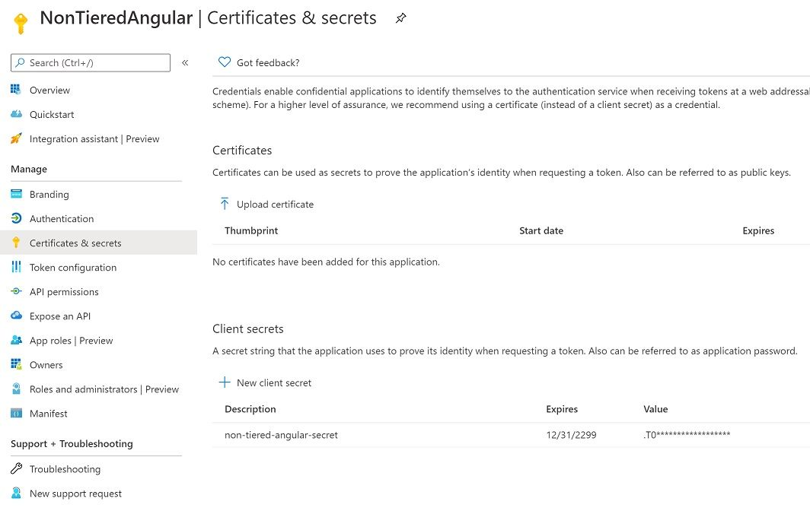

# How to Setup Azure Active Directory and Integrate ABP Angular Application

This guide demonstrates how to register an application to Azure Active Directory and integrate AzureAD to an ABP Angular application that enables users to sign in using OAuth 2.0 with credentials from **Azure Active Directory**. 

## Authentication Flow

ABP Angular application uses **Authentication Code with PKCE** (specs [here](https://tools.ietf.org/html/rfc7636)) which is the most suitable flow for SPA applications by the time this article is written since implicit flow is deprecated. 

The most common question is; 

> Where to put OpenId connection code in the Angular project?

The answer is, **you don't**. ABP Angular application is integrated with the backend (HttpApi.Host project) where it loads the configurations, **permissions** etc. For none-tiered angular applications, **HttpApi.Host** project also has IdentityServer4 embedded; also serving as **Authorization Server**. Angular application authentication flow is shown below.


> What if I want Azure AD as my authorization server and not IdentityServer?

This means your application will be using AzureAD user store for authentication. By registering both Angular app and HttpApi to AzureAD, authentication might work but **authorization won't**. Users need to be registered to ABP identity system for auditing, permissions etc. So the flow should be 3rd party registration.

## Setting up OpenId Connection

Lets start with adding OpenId connection. Open the **HttpApiHostModule.cs** and update the **ConfigureAuthentication** method as below:

```csharp
JwtSecurityTokenHandler.DefaultInboundClaimTypeMap.Clear();
JwtSecurityTokenHandler.DefaultInboundClaimTypeMap.Add("sub", ClaimTypes.NameIdentifier);

context.Services.AddAuthentication()
    .AddIdentityServerAuthentication(options =>
    {
        options.Authority = configuration["AuthServer:Authority"];
        options.RequireHttpsMetadata = false;
        options.ApiName = "NonTieredAngular";
        options.JwtBackChannelHandler = new HttpClientHandler()
        {
            ServerCertificateCustomValidationCallback = HttpClientHandler.DangerousAcceptAnyServerCertificateValidator
        };
    })
    .AddOpenIdConnect("AzureOpenId", "Azure AD OpenId", options =>
    {
        options.Authority = "https://login.microsoftonline.com/" + configuration["AzureAd:TenantId"] + "/v2.0/";
        options.ClientId = configuration["AzureAd:ClientId"];
        options.ResponseType = OpenIdConnectResponseType.CodeIdToken;
        options.CallbackPath = configuration["AzureAd:CallbackPath"];
        options.ClientSecret = configuration["AzureAd:ClientSecret"];
        options.RequireHttpsMetadata = false;
        options.SaveTokens = true;
        options.GetClaimsFromUserInfoEndpoint = true;
        options.Scope.Add("email");
    });
```

> If you are using tiered (separate identity server) application, open **IdentityServerModule.cs** and add the OpenIdConnection manually to **ConfigureServices** method as following:

```csharp
public override void ConfigureServices(ServiceConfigurationContext context)
{
    var hostingEnvironment = context.Services.GetHostingEnvironment();
    var configuration = context.Services.GetConfiguration();
   
    JwtSecurityTokenHandler.DefaultInboundClaimTypeMap.Clear();
    JwtSecurityTokenHandler.DefaultInboundClaimTypeMap.Add("sub", ClaimTypes.NameIdentifier);
    
    context.Services.AddAuthentication()
        .AddOpenIdConnect("AzureOpenId", "Azure AD OpenId", options =>
        {
            ... // Same configuration above
        });
```

Now we can add AzureAD settings. Open the **appsettings.json** located in **HttpApi.Host** project (or **IdentityServer** project if you are using tiered application). Add the following;

```csharp
"AzureAd": {
  "Instance": "https://login.microsoftonline.com/",
  "TenantId": "<azureAd-tenant-id>",
  "ClientId": "<azureAd-client-id>",
  "Domain": "domain.onmicrosoft.com",
  "CallbackPath": "/signin-azuread-oidc",
  "ClientSecret": "<azureAd-client-secret>"
},
```

Keep on mind that **App.SelfUrl** + **AzureAd.CallbackPath** will be used in AzureAD app registration. We'll update the AzureAd settings after registering the application in Azure Portal.

## Setting up Azure Active Directory

Navigate to Manage Azure Active Directory in [azure portal](https://portal.azure.com/). Go to **App registrations** on left side menu and hit New registration.


Enter a name for your application and **App.SelfUrl** + **AzureAd.CallbackPath** as redirect uri then register.


Now navigate to **Authentication** on the left menu and enable **ID tokens**.


We also need to set a client secret. Navigate to **Certificates & secrets** menu on the left and create a new client secret.



**Copy** the secret and update your appsettings.json **AzureAd.ClientSecret** field.


Also update your **AzureAd.TenantId** and **AzureAd.ClientId** fields with the information located under **Overview** menu. And that's all. 

Next time you hit login, you should be seeing login screen enabled Azure AD like below.


# FAQ

* I am getting errors when trying to login to AzureAD.
  * You can check [this article FAQ](https://community.abp.io/articles/how-to-use-the-azure-active-directory-authentication-for-mvc-razor-page-applications-4603b9cf) which covers many errors.


* But I don't want my users to see default login screen. I want my users to login **only** from AzureAD.
  * You can **mimic** this behaviour by customizing the login page and instantly trigger Azure AD provider click. For more info, you can check [this article](https://community.abp.io/articles/how-to-customize-the-login-page-for-mvc-razor-page-applications-9a40f3cd).
