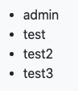

# Using DevExtreme Angular Components With the ABP Framework

In this article, I will show you how to integrate the [DevExpress Angular components](https://js.devexpress.com/Documentation/Guide/Angular_Components/DevExtreme_Angular_Components/) to a project created using the ABP Framework startup templates. Then I will use the [DataGrid](https://js.devexpress.com/Documentation/Guide/Widgets/DataGrid/Overview/) component to show a list of users on the UI.

## Create the Project

Let's create a new web application with the Angular UI using [ABP CLI](https://docs.abp.io/en/abp/latest/CLI#new):

```shell
abp new DevExtremeAngular -u angular
```

> For detail information about how to generate and start up a project, please refer to the [official docs](https://docs.abp.io/en/abp/latest/Getting-Started?UI=NG&DB=EF&Tiered=No). For the scope of this post, we will not go into details of the backend applications.

## Running the Solution

### The Server Side

Server side contains multiple projects in the solution:


Run following projects in order;

* Run `DevExtremeAngular.DbMigrator` to create the database and seed the initial data.
* Run `DevExtremeAngular.HttpApi.Host` project to make the backend API up & running.

### The Angular Application

Open a command line terminal and navigate to `angular` folder then run `yarn` or `npm install` based on which package you are using. 

After installation process is done, you can start your angular project by running `yarn start` or `npm start`. This command should serve the application and open the application in your default browser. If it doesn't open, you can navigate to http://localhost:4200 in your browser:


You can login to the application by using following credentials:

> _Default admin username is **admin** and password is **1q2w3E\***_


After successful login, you should be redirected to home page.

## Install DevExtreme

You can follow [the guide](https://js.devexpress.com/Documentation/Guide/Angular_Components/Getting_Started/Add_DevExtreme_to_an_Angular_CLI_Application/) provided by **DevExtreme** team or apply the following steps.

* `npm install devextreme devextreme-angular` or `yarn add devextreme devextreme-angular`
* Import given two following styles in `angular.json` file:

```javascript
  // ...
  "styles": [
    // ...
    "src/styles.scss",

    "node_modules/devextreme/dist/css/dx.common.css",
    "node_modules/devextreme/dist/css/dx.light.css"
  ]
```

* Add `dx-viewport` to classes of `body` in `index.html`

```html
<body class="bg-light dx-viewport">
  <app-root>
    <div class="donut centered"></div>
  </app-root>
</body>
```

After completing these steps, you need to restart the angular application.

## Create a lazy Angular Module for DevExtreme Demo

Let's create a module which will be loaded lazily.

Open up a terminal and navigate to `angular` to run following command.

```shell
ng g m dev-extreme --route dev-extreme --module app
```

...or with `npx`, if you do not have `angular-cli` installed...

```shell
npx ng g m dev-extreme --route dev-extreme --module app
```

Your terminal should log the following output:

```shell
CREATE src/app/dev-extreme/dev-extreme-routing.module.ts (361 bytes)
CREATE src/app/dev-extreme/dev-extreme.module.ts (379 bytes)
CREATE src/app/dev-extreme/dev-extreme.component.scss (0 bytes)
CREATE src/app/dev-extreme/dev-extreme.component.html (26 bytes)
CREATE src/app/dev-extreme/dev-extreme.component.spec.ts (655 bytes)
CREATE src/app/dev-extreme/dev-extreme.component.ts (295 bytes)
UPDATE src/app/app-routing.module.ts (362 bytes)
```

The Angular CLI has created a module and configured it to lazy-load at `/dev-extreme` path.

The last step to be able to see our newly created module in the browser, open `route.provider.ts` and edit the array being added into the routes.

```typescript
    // ...
    routes.add([
      {
        path: '/',
        name: '::Menu:Home',
        iconClass: 'fas fa-home',
        order: 1,
        layout: eLayoutType.application,
      },
      {
        path: '/dev-extreme',
        name: 'Dev Extreme',
        order: 2,
        layout: eLayoutType.application,
      },
    ]);
    // ...
```

After completing the steps above, you should be able to see `Dev Extreme` on the header and when you click on it, you should be redirected to `/dev-extreme` page and see the following message on the screen.


## Display users on the dev-extreme page

For this demo, we will list users on the screen. We already have `admin` as our first user. 

Let's add couple of more to the list in `Administration -> Identity Management -> Users` page.


Now we are ready to fetch our users and display them on `/dev-extreme` page.

Firstly, let's create a service for our component.

Navigate to the `dev-extreme` folder and run following command. If you run this command at the root, the service will be generated next to `app.module.ts`

```shell
ng g s dev-extreme
```

Following files should be created

```shell
CREATE src/app/dev-extreme/dev-extreme.service.spec.ts (378 bytes)
CREATE src/app/dev-extreme/dev-extreme.service.ts (139 bytes)
```

Let's import and inject `IdentityService` as dependency in `dev-extreme.service.ts`. After then, let's create a stream called `users$` to retrieve the users. 

`identityService.getUsers` returns `ABP.PagedResponse` which contains two fields, `items` and `totalCount`. We are only interested in `items` for now.

When we apply the steps described above, the final version of `dev-extreme.service` should be as follows

```typescript
import { Injectable } from '@angular/core';
import { map } from 'rxjs/operators';
import { IdentityService } from '@abp/ng.identity';

@Injectable({
  providedIn: 'root',
})
export class DevExtremeService {
  users$ = this.service.getUsers().pipe(map((result) => result.items));

  constructor(private service: IdentityService) {}
}
```

Now we can simply inject `DevExtremeService` as public and utilize `users$` stream in `dev-extreme.component.ts` as follows:

```typescript
import { Component } from '@angular/core';
import { DevExtremeService } from './dev-extreme.service';

@Component({
  selector: 'app-dev-extreme',
  templateUrl: './dev-extreme.component.html',
  styleUrls: ['./dev-extreme.component.scss'],
})
export class DevExtremeComponent {
  constructor(public service: DevExtremeService) {}
}
```

And use it within `dev-extreme.component.html`

```html
<ng-container *ngIf="service.users$ | async as users">
  <ul>
    <li *ngFor="let user of users">
      {{ user.name }}
    </li>
  </ul>
</ng-container>
```

This should list names of the users on the screen



## Use DxDataGrid to list the users

You can take a look at [demo](https://js.devexpress.com/Demos/WidgetsGallery/Demo/DataGrid/ColumnCustomization/Angular/Light/) provided by **DevExtreme** team or apply the following steps.

Now, our application is ready to use `dx-data-grid` in `dev-extreme.component.ts`

Firstly, we need to import `DxDataGridModule` in our module as follows.

```typescript
// ...

import { DxDataGridModule } from 'devextreme-angular';

@NgModule({
  // ...
  imports: [ 
    // ...
    DxDataGridModule
  ],
})
export class DevExtremeModule {}
```

At this point `dx-data-grid` is avaliable within our module and we can use it in our template.

Change `dev-extreme.component.html` to the following

```html
<ng-container *ngIf="service.users$ | async as users">
  <dx-data-grid [dataSource]="users"></dx-data-grid>
</ng-container>
```

It should display a table on the screen


Since, we did not specify any columns, `dx-data-grid` displayed every column avaliable. Let's pick some columns to make it more readable.

Change `dev-extreme.component.html` to the following:

```html
<ng-container *ngIf="service.users$ | async as users">
  <dx-data-grid [dataSource]="users">
    <dxi-column dataField="userName"></dxi-column>
    <dxi-column dataField="name"></dxi-column>
    <dxi-column dataField="surname"></dxi-column>
    <dxi-column dataField="email"></dxi-column>
    <dxi-column dataField="phoneNumber"></dxi-column>
  </dx-data-grid>
</ng-container>
```

which will display following table on the screen


We can also utilize `abpLocalization` pipe to translate the headers of the table. To use `abpLocalization` pipe in our templates, we need to import `CoreModule` from `@abp/ng.core` into our module.

```typescript
import { CoreModule } from '@abp/ng.core';

@NgModule({
  // ...
  imports: [ 
    // ...
    CoreModule
  ],
})
export class DevExtremeModule {}
```

And change the template to the following:

```html
<ng-container *ngIf="service.users$ | async as users">
  <dx-data-grid [dataSource]="users">
    <dxi-column
      dataField="userName"
      [caption]="'AbpIdentity::DisplayName:UserName' | abpLocalization"
    ></dxi-column>
    <dxi-column
      dataField="name"
      [caption]="'AbpIdentity::DisplayName:Name' | abpLocalization"
    ></dxi-column>
    <dxi-column
      dataField="surname"
      [caption]="'AbpIdentity::DisplayName:Surname' | abpLocalization"
    ></dxi-column>
    <dxi-column
      dataField="email"
      [caption]="'AbpIdentity::DisplayName:Email' | abpLocalization"
    ></dxi-column>
    <dxi-column
      dataField="phoneNumber"
      [caption]="'AbpIdentity::DisplayName:PhoneNumber' | abpLocalization"
    ></dxi-column>
  </dx-data-grid>
</ng-container>
```

The headers should change when a new language is selected;


## Conclusion

In this article, we have seen how to integrate `DevExtreme` angular components into a project generated by `ABP CLI`.

You can download source code of [the demo here](https://github.com/abpframework/abp-samples/tree/master/DevExtreme-Angular).
