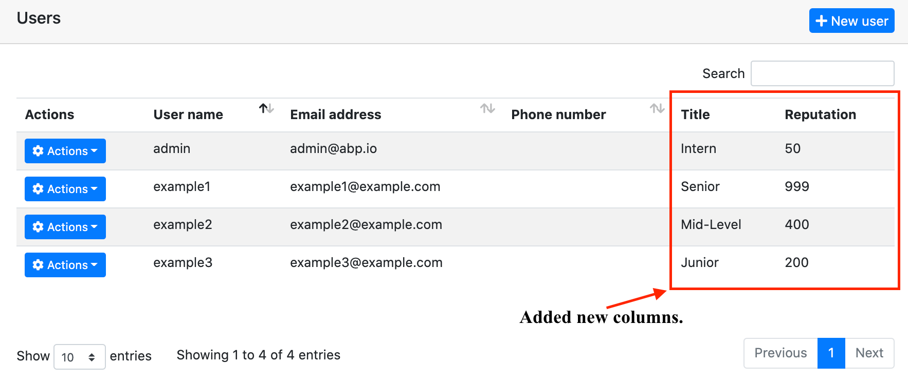

# How to add custom property to the user entity


## Introduction

In this step-by-step article, I will explain how you can customize the user entity class, which is available in every web application you create using the ABP framework, according to your needs. When you read this article, you will learn how to override the services of built-in modules, extend the entities, extend data transfer objects and customize the user interface in the applications you develop using the ABP framework. In short, we will ask ourselves some questions throughout this article and we will find the answers together;

- How to add
- How to map to a table field via EF Core
- How to write custom business logic for the new property
- How to add standard and custom validation logics
- How to relate it with the `AppUser` entity in the startup template
- ...


You can see the screenshots below which we will reach at the end of the article.




## Preparing the Project

### Startup template and the initial run

Abp Framework offers startup templates to get into the work faster. We can create a new startup template using Abp CLI:

`abp new CustomizeUserDemo -m none`

After the download is finished, we can run **CustomizeUserDemo.DbMigrator** project to create the database migrations and seed the initial data (admin user, role, etc). Then we can run `CustomizeUserDemo.Web` to see that our application is working.

> Default admin username is **admin** and password is **1q2w3E\***

<div>
    
</div>


In this article, we will go through a scenario together and find the solutions to our questions through this scenario. However, since the scenario is not a real-life scenario, it may be strange, please don't get too about this issue :)

## Step-1

Add two new properties to the `AppUser` in the Users folder of the **CustomizeUserDemo.Domain** project as follows:

```csharp
public string Title { get; protected set; }

public int Reputation { get; protected set; }
```

## Step-2 

Create the Users folder in the **CustomizeUserDemo.DomainShared** project, create the class `UserConsts` inside the folder and update the class you created as below:

```csharp
public class UserConst
{
    public const string TitlePropertyName = "Title";

    public const string ReputationPropertyName = "Reputation";

    public const int MaxTitleLength = 64;

    public const double MaxReputationValue = 1_000;

    public const double MinReputationValue = 1;
}
```

## Step-3

Update the `CustomizeUserDemoEfCoreEntityExtensionMappings` class in the **CustomizeUserDemo.EntityFramework** project in the EntityFrameworkCore folder as below:

```csharp
public static class CustomizeUserDemoEfCoreEntityExtensionMappings
{
    private static readonly OneTimeRunner OneTimeRunner = new OneTimeRunner();

    public static void Configure()
    {
        CustomizeUserDemoGlobalFeatureConfigurator.Configure();
        CustomizeUserDemoModuleExtensionConfigurator.Configure();

        OneTimeRunner.Run(() =>
        {
            ObjectExtensionManager.Instance
                .MapEfCoreProperty<IdentityUser, string>(
                    nameof(AppUser.Title),
                    (entityBuilder, propertyBuilder) =>
                    {
                        propertyBuilder.IsRequired();
                        propertyBuilder.HasMaxLength(UserConst.MaxTitleLength);
                    }
                ).MapEfCoreProperty<IdentityUser, int>(
                    nameof(AppUser.Reputation),
                    (entityBuilder, propertyBuilder) =>
                    {
                        propertyBuilder.HasDefaultValue(UserConst.MinReputationValue);
                    }
                );
        });
    }
}
```

This class can be used to map these extra properties to table fields in the database. Please read [this](https://docs.abp.io/en/abp/latest/Customizing-Application-Modules-Extending-Entities) article to improve your understanding of what we are doing.

So far, we have added our extra features to the `User` entity and matched these features with the `ef core`.

Now we need to [add](https://docs.abp.io/en/abp/latest/Tutorials/Part-1?UI=MVC&DB=EF#add-database-migration) migration to see what has changed in our database and then run the **CustomizeUserDemo.DbMigrator** project as we did in [this](#startup-template-and-the-initial-run) step.

When we updated the database, you can see that the `Title` and `Reputation` columns are added to the user table. 


## Step-4
Open the `CustomizeUserDemoModuleExtensionConfigurator` in the **CustomizeUserDemo.Domain.Shared** project, and change the contents of the `ConfigureExtraProperties` method as shown below:
```csharp
private static void ConfigureExtraProperties()
{
    ObjectExtensionManager.Instance.Modules().ConfigureIdentity(identity =>
    {
        identity.ConfigureUser(user =>
        {
            user.AddOrUpdateProperty<string>(
                UserConst.TitlePropertyName,
                options =>
                {
                    options.Attributes.Add(new RequiredAttribute());
                    options.Attributes.Add(
                        new StringLengthAttribute(UserConst.MaxTitleLength)
                    );
                    options.Validators.Add(context =>
                    {
                        var title = context.Value as string;

                        if (title == null || title.ToLower().Contains("title"))
                        {
                            context.ValidationErrors.Add(
                                new ValidationResult(
                                    "The word 'title' cannot be contain in the Title input.",
                                    new[] {"Title"}
                                )
                            );
                        }
                    });
                }
            );
            user.AddOrUpdateProperty<int>(
                UserConst.ReputationPropertyName,
                options =>
                {
                    options.DefaultValue = UserConst.MinReputationValue;
                    options.Attributes.Add(
                        new RangeAttribute(UserConst.MinReputationValue, UserConst.MaxReputationValue)
                    );
                }
            );
        });
    });
}
```

That's it. Now let's run the application and look at the Identity user page. You can also try to edit and recreate a record if you want, it will work even though we haven't done anything extra. Here is the magic code behind ABP framework.

If there is a situation you want to add, you can click the contribute button or make a comment. Also, if you like the article, don't forget to share it :)

Stay with the code :) 
