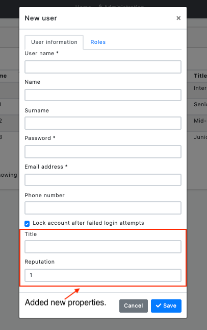
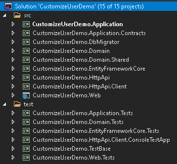
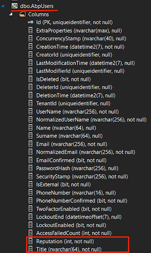

# How to Add Custom Properties to the User Entity

## Introduction

In this step-by-step article, I will explain how you can customize the user entity class, which is available in every web application you create using the ABP framework, according to your needs. When you read this article, you will learn how to override the services of built-in modules, extend the entities, extend data transfer objects and customize the user interface in the applications you develop using the ABP framework. 

You can see the screenshots below which we will reach at the end of the article.




## Preparing the Project

### Startup template and the initial run

Abp Framework offers startup templates to get into the work faster. We can create a new startup template using Abp CLI:

`abp new CustomizeUserDemo`

> In this article, I will go through the MVC application, but it will work also in the [Angular](https://docs.abp.io/en/abp/latest/Getting-Started?UI=NG&DB=EF&Tiered=No), [Blazor Server](https://docs.abp.io/en/abp/latest/Getting-Started?UI=BlazorServer&DB=EF&Tiered=No), and [Blazor WebAssembly](https://docs.abp.io/en/abp/latest/Getting-Started?UI=Blazor&DB=EF&Tiered=No) application.

After the download is finished, we can run **CustomizeUserDemo.DbMigrator** project to create the database migrations and seed the initial data (admin user, role, etc). Then we can run `CustomizeUserDemo.Web` to see that our application is working.

> Default admin username is **admin** and password is **1q2w3E\***



In this article, we will go through a scenario together and find the solutions to our questions through this scenario. However, since the scenario is not a real-life scenario, it may be strange, please don't get too about this issue :)

## Step-1

Add two new properties to the `AppUser` in the Users folder of the **CustomizeUserDemo.Domain** project as follows:

```csharp
public string Title { get; protected set; }

public int Reputation { get; protected set; }
```

## Step-2 

Create the Users folder in the **CustomizeUserDemo.Domain.Shared** project, create the class `UserConsts` inside the folder and update the class you created as below:

```csharp
public static class UserConsts
{
    public const string TitlePropertyName = "Title";

    public const string ReputationPropertyName = "Reputation";

    public const int MaxTitleLength = 64;

    public const double MaxReputationValue = 1_000;

    public const double MinReputationValue = 1;
}
```

## Step-3

Update the `CustomizeUserDemoEfCoreEntityExtensionMappings` class in the **CustomizeUserDemo.EntityFramework** project in the EntityFrameworkCore folder as below:

```csharp
public static class CustomizeUserDemoEfCoreEntityExtensionMappings
{
    private static readonly OneTimeRunner OneTimeRunner = new OneTimeRunner();

    public static void Configure()
    {
        CustomizeUserDemoGlobalFeatureConfigurator.Configure();
        CustomizeUserDemoModuleExtensionConfigurator.Configure();

        OneTimeRunner.Run(() =>
        {
            ObjectExtensionManager.Instance
                .MapEfCoreProperty<IdentityUser, string>(
                    nameof(AppUser.Title),
                    (entityBuilder, propertyBuilder) =>
                    {
                        propertyBuilder.HasDefaultValue("");
                        propertyBuilder.HasMaxLength(UserConsts.MaxTitleLength);
                    }
                ).MapEfCoreProperty<IdentityUser, int>(
                    nameof(AppUser.Reputation),
                    (entityBuilder, propertyBuilder) =>
                    {
                        propertyBuilder.HasDefaultValue(UserConsts.MinReputationValue);
                    }
                );
        });
    }
}
```

This class can be used to map these extra properties to table fields in the database. Please read [this](https://docs.abp.io/en/abp/latest/Customizing-Application-Modules-Extending-Entities) article to improve your understanding of what we are doing.

So far, we have added our extra features to the `User` entity and matched these features with the `ef core`.

Now we need to add migration to see what has changed in our database. This for, open the Package Manager Console (PMC) under the menu Tools > NuGet Package Manager.


Select the **CustomizeUserDemo.EntityFramework** as the **default project** and execute the following command:

```bash
Add-Migration "Updated-User-Entity"
```


This will create a new migration class inside the `Migrations` folder of the **CustomizeUserDemo.EntityFrameworkCore** project.

> If you are using another IDE than the Visual Studio, you can use `dotnet-ef` tool as [documented here](https://docs.microsoft.com/en-us/ef/core/managing-schemas/migrations/?tabs=dotnet-core-cli#create-a-migration).

Finally, run the **CustomizeUserDemo.DbMigrator** project to update the database.

When we updated the database, you can see that the `Title` and `Reputation` columns are added to the `Users` table. 



## Step-4
Open the `CustomizeUserDemoModuleExtensionConfigurator` in the **CustomizeUserDemo.Domain.Shared** project, and change the contents of the `ConfigureExtraProperties` method as shown below:
```csharp
private static void ConfigureExtraProperties()
{
    ObjectExtensionManager.Instance.Modules().ConfigureIdentity(identity =>
    {
        identity.ConfigureUser(user =>
        {
            user.AddOrUpdateProperty<string>(
                UserConsts.TitlePropertyName,
                options =>
                {
                    options.Attributes.Add(new RequiredAttribute());
                    options.Attributes.Add(
                        new StringLengthAttribute(UserConsts.MaxTitleLength)
                    );
                }
            );
            user.AddOrUpdateProperty<int>(
                UserConsts.ReputationPropertyName,
                options =>
                {
                    options.DefaultValue = UserConsts.MinReputationValue;
                    options.Attributes.Add(
                        new RangeAttribute(UserConsts.MinReputationValue, UserConsts.MaxReputationValue)
                    );
                }
            );
        });
    });
}
```

That's it. Now let's run the application and look at the Identity user page. You can also try to edit and recreate a record if you want, it will work even though we haven't done anything extra. Here is the magic code behind ABP framework.

If there is a situation you want to add, you can click the contribute button or make a comment. Also, if you like the article, don't forget to share it :)

Happy coding :) 
