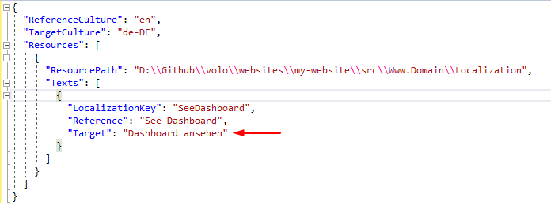
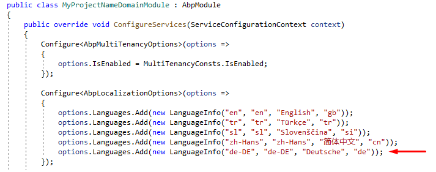
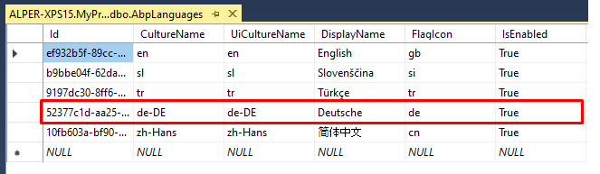
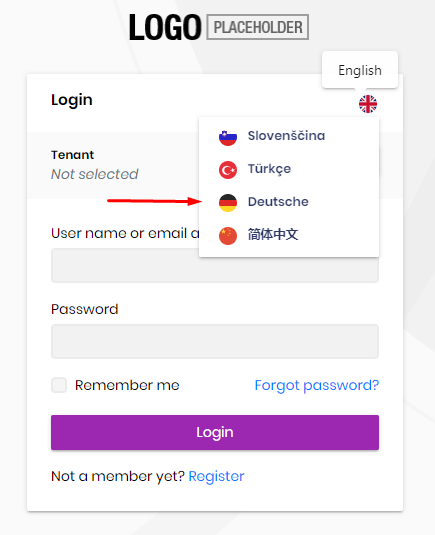

# How to add a new language to your ABP project?

Adding a new language to your ABP project is pretty simple.  Let's add the German language to our ABP project:


1. Go to your solution's root folder and write the following CLI command. This command will generate an empty translation file from English.
    ```bash
    abp translate -c de-DE
    ```
    
    Check out for [the complete supported culture codes](https://docs.microsoft.com/en-us/bingmaps/rest-services/common-parameters-and-types/supported-culture-codes).
    (For internal development `D:\Github\abp` and `D:\Github\volo\abp`)
    
2. Fill the `target` fields in your target language.

    

3. Copy `abp-translation.json` your solution's root folder (Do not change the filename!)

4. Run the following command. This command will create the necessary `json` files.
     ```bash
     abp translate --apply
     ```

5. Open your solution and add the new language to the language list. To do this;

    * open `MyProjectNameDomainModule.cs` and in `ConfigureServices` you'll find `Configure<AbpLocalizationOptions>`. If you have `HttpApi.Host` project then you need to add this in `MyProjectNameHttpApiHostModule.cs`

    ```
    options.Languages.Add(new LanguageInfo("de-DE", "de-DE", "Deutsch", "de"));
    ```

    

    The last parameter is the flag icon. You can find the list of flag icons on https://flagicons.lipis.dev/

  6. The last step is running the DbMigrator project. It will seed the database for the new language. 
        


Close the IIS Express / Kestrel to invalidate the language cache and run the project. You will see the new language on your website.



