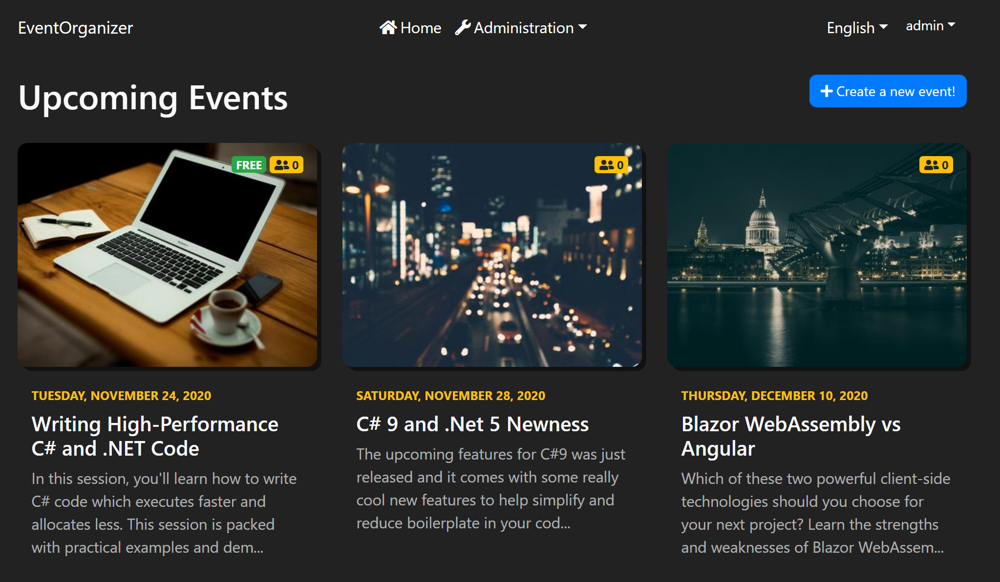
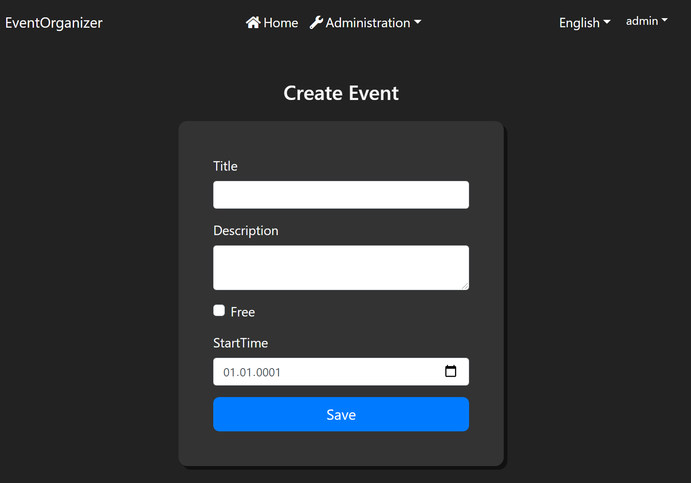
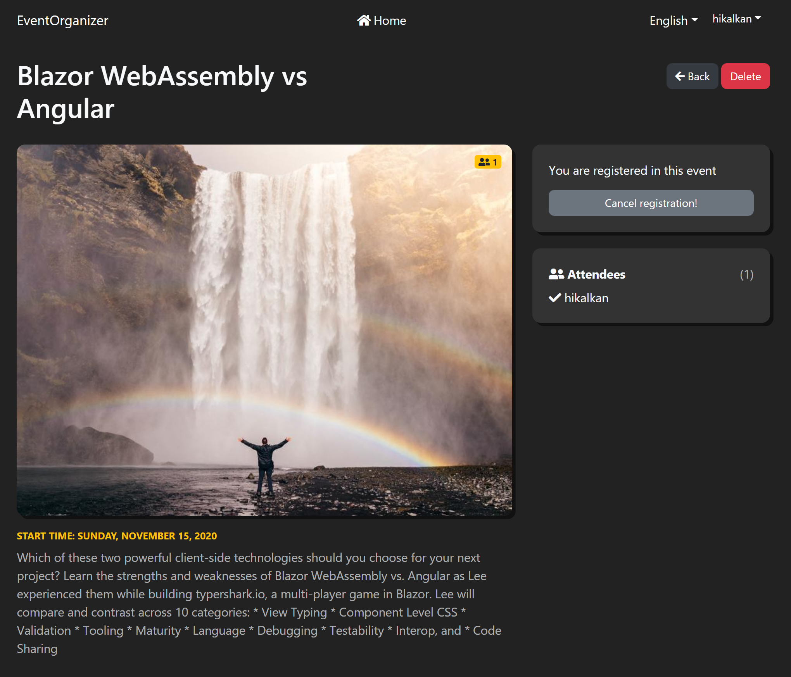
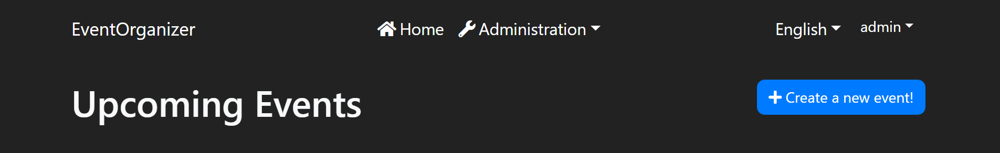
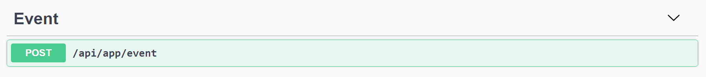
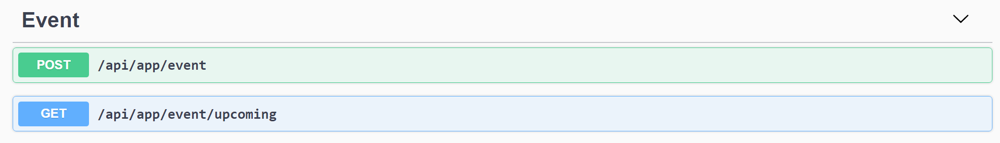
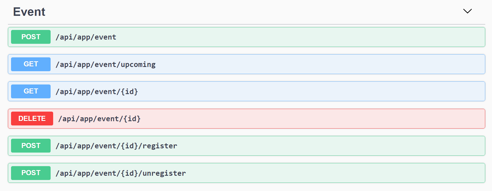

# Creating an Event Organizer Application with the ABP Framework & Blazor UI.

## Introduction

In this article, we will create an example application that is a simple **meeting/event organizer**: People create events and other people registers to the event.

The application has been developed with **Blazor** as the UI framework and **MongoDB** as the database provider.

> This tutorial is based on my notes that I'd created to implement this application in a workshop. It shows the necessary steps to build the application rather than detailed explanations.

### Source Code

Source code of the completed application is [available on GitHub](https://github.com/abpframework/abp-samples/tree/master/EventOrganizer).

### Screenshots

Here, the pages of the final application.

**Home Page - Event List**



**Creating a new Event**



**Event Detail Page**



## Requirements

The following tools are needed to be able to run the solution.

* .NET 5.0 SDK
* Visual Studio 2019 16.8.0+ or another compatible IDE
* MongoDB Server (with MongoDB Compass)

## Development

### Creating a new Application

* Use the following ABP CLI command:

````bash
abp new EventOrganizer -u blazor -d mongodb
````

### Open & Run the Application

* Open the solution in Visual Studio (or your favorite IDE).
* Run the `EventOrganizer.DbMigrator` application to seed the initial data.
* Run the `EventOrganizer.HttpApi.Host` application that starts the server side.
* Run the `EventOrganizer.Blazor` application to start the UI.

### Apply the Custom Styles

* Add styles to `wwwroot/main.css`:

````css
body.abp-application-layout {
    background-color: #222 !important;
    font-size: 18px;
}
nav#main-navbar.bg-dark {
    background-color: #222 !important;
    box-shadow: none !important;
}
.event-pic {
    width: 100%;
    border-radius: 12px;
    box-shadow: 5px 5px 0px 0px rgba(0,0,0,.5);
    margin-bottom: 10px;
}
.event-link:hover, .event-link:hover *{
    text-decoration: none;
}
.event-link:hover .event-pic {
    box-shadow: 5px 5px 0px 0px #ffd800;
}
.event-form {
    background-color: #333 !important;
    box-shadow: 5px 5px 0px 0px rgba(0,0,0,.5);
    border-radius: 12px;
}
.table {
    background: #fff;
    border-radius: 12px;
    box-shadow: 5px 5px 0px 0px rgba(0,0,0,.5);
}
.table th{
    border: 0 !important;
}
.modal {
    color: #333;
}
.page-item:first-child .page-link {
    margin-left: 0;
    border-top-left-radius: 12px;
    border-bottom-left-radius: 12px;
}
.page-item:last-child .page-link {
    border-top-right-radius: 12px;
    border-bottom-right-radius: 12px;
}
.btn {
    border-radius: 8px;
}
.att-list {
    list-style: none;
    padding: 0;
}
.att-list li {
    padding: 4px 0 0 0;
}
````

* `wwwroot/index.html`: Remove `bg-light` class from the `body` tag and add `bg-dark text-light`.

### Domain Layer

* Add the following `Event` aggregate (with `EventAttendee`) to the solution:

**Event**

````csharp
using System;
using System.Collections.Generic;
using Volo.Abp.Domain.Entities.Auditing;

namespace EventOrganizer.Events
{
    public class Event : FullAuditedAggregateRoot<Guid>
    {
        public string Title { get; set; }

        public string Description { get; set; }

        public bool IsFree { get; set; }

        public DateTime StartTime { get; set; }

        public ICollection<EventAttendee> Attendees { get; set; }

        public Event()
        {
            Attendees = new List<EventAttendee>();
        }
    }
}
````

**EventAttendee**

```csharp
using System;
using Volo.Abp.Auditing;

namespace EventOrganizer.Events
{
    public class EventAttendee : IHasCreationTime
    {
        public Guid UserId { get; set; }

        public DateTime CreationTime { get; set; }
    }
}
```

### MongoDB Mapping

* Add the following property to the `EventOrganizerMongoDbContext`:

````csharp
public IMongoCollection<Event> Events => Collection<Event>();
````

### Clean Index.razor & Add the Header & "Create Event" button

* Clean the `Index.razor` file.
* Replace the content with the following code:

````html
@page "/"
@inherits EventOrganizerComponentBase
<Row Class="mb-4">
    <Column Class="text-left">
        <h1>Upcoming Events</h1>
    </Column>
    <Column Class="text-right">
        @if (CurrentUser.IsAuthenticated)
        {
            <a class="btn btn-primary" href="/create-event">
                <i class="fa fa-plus"></i> @L["CreateEvent"]
            </a>
        }
    </Column>
</Row>
````

* Open `Localization/EventOrganizer/en.json` in the `EventOrganizer.Domain.Shared` project and add the following entry:

````json
"CreateEvent": "Create a new event!"
````

The Result (run the `EventOrganizer.Blazor` application to see):



### Event Creation

* Create the Initial `IEventAppService` with the `CreateAsync` method:

````csharp
using System;
using System.Threading.Tasks;
using Volo.Abp.Application.Services;

namespace EventOrganizer.Events
{
    public interface IEventAppService : IApplicationService
    {
        Task<Guid> CreateAsync(EventCreationDto input);
    }
}
````

* Add `EventCreationDto` class:

````csharp
using System;
using System.ComponentModel.DataAnnotations;

namespace EventOrganizer.Events
{
    public class EventCreationDto
    {
        [Required]
        [StringLength(100)]
        public string Title { get; set; }

        [Required]
        [StringLength(2000)]
        public string Description { get; set; }

        public bool IsFree { get; set; }

        public DateTime StartTime { get; set; }
    }
}
````

* Implement the `EventAppService`:

````csharp
using System;
using System.Threading.Tasks;
using Microsoft.AspNetCore.Authorization;
using Volo.Abp.Domain.Repositories;

namespace EventOrganizer.Events
{
    public class EventAppService : EventOrganizerAppService, IEventAppService
    {
        private readonly IRepository<Event, Guid> _eventRepository;

        public EventAppService(IRepository<Event, Guid> eventRepository)
        {
            _eventRepository = eventRepository;
        }

        [Authorize]
        public async Task<Guid> CreateAsync(EventCreationDto input)
        {
            var eventEntity = ObjectMapper.Map<EventCreationDto, Event>(input);
            await _eventRepository.InsertAsync(eventEntity);
            return eventEntity.Id;
        }
    }
}
````

* Add AutoMapper mapping to the `EventOrganizerApplicationAutoMapperProfile` class:

````csharp
using AutoMapper;
using EventOrganizer.Events;

namespace EventOrganizer
{
    public class EventOrganizerApplicationAutoMapperProfile : Profile
    {
        public EventOrganizerApplicationAutoMapperProfile()
        {
            CreateMap<EventCreationDto, Event>();
        }
    }
}
````

This will automatically create the HTTP (REST) API for the application service (run the `EventOrganizer.HttpApi.Host` application to see it on the Swagger UI):



* Create the `CreateEvent.razor` file:

````csharp
@page "/create-event"
@inherits EventOrganizerComponentBase
<Heading Size="HeadingSize.Is3" Margin="Margin.Is5.FromTop.Is4.FromBottom" Class="text-center">Create Event</Heading>
<Row>
    <Column ColumnSize="ColumnSize.Is6.Is3.WithOffset">
        <div class="p-lg-5 p-md-3 event-form">
            <EditForm Model="@Event" OnValidSubmit="Create">
                <Field>
                    <FieldLabel>@L["Title"]</FieldLabel>
                    <TextEdit @bind-Text="@Event.Title" />
                </Field>
                <Field>
                    <FieldLabel>@L["Description"]</FieldLabel>
                    <MemoEdit @bind-Text="@Event.Description" />
                </Field>
                <Field>
                    <Check TValue="bool" @bind-Checked="@Event.IsFree">@L["Free"]</Check>
                </Field>
                <Field>
                    <FieldLabel>@L["StartTime"]</FieldLabel>
                    <DateEdit TValue="DateTime" @bind-Date="@Event.StartTime" />
                </Field>
                <Button Type="@ButtonType.Submit" Block="true" Color="@Color.Primary" Size="Size.Large">@L["Save"]</Button>
            </EditForm>
        </div>
    </Column>
</Row>
````

* Create a partial `CreateEvent` class in the same folder, with the `CreateEvent.razor.cs` as the file name:

````csharp
using System.Threading.Tasks;
using EventOrganizer.Events;
using Microsoft.AspNetCore.Components;

namespace EventOrganizer.Blazor.Pages
{
    public partial class CreateEvent
    {
        private EventCreationDto Event { get; set; } = new EventCreationDto();

        private readonly IEventAppService _eventAppService;
        private readonly NavigationManager _navigationManager;

        public CreateEvent(
            IEventAppService eventAppService,
            NavigationManager navigationManager)
        {
            _eventAppService = eventAppService;
            _navigationManager = navigationManager;
        }

        private async Task Create()
        {
            var eventId = await _eventAppService.CreateAsync(Event);
            _navigationManager.NavigateTo("/events/" + eventId);
        }
    }
}
````

The final UI is (run the `EventOrganizer.Blazor` application and click to the "Create Event" button):


### Upcoming Events (Home Page)

* Open the `IEventAppService` and add a `GetUpcomingAsync` method to get the list of upcoming events:

````csharp
using System;
using System.Collections.Generic;
using System.Threading.Tasks;
using Volo.Abp.Application.Services;

namespace EventOrganizer.Events
{
    public interface IEventAppService : IApplicationService
    {
        Task<Guid> CreateAsync(EventCreationDto input);

        Task<List<EventDto>> GetUpcomingAsync();
    }
}
````

* Add a `EventDto` class:

````csharp
using System;
using Volo.Abp.Application.Dtos;

namespace EventOrganizer.Events
{
    public class EventDto : EntityDto<Guid>
    {
        public string Title { get; set; }

        public string Description { get; set; }

        public bool IsFree { get; set; }

        public DateTime StartTime { get; set; }

        public int AttendeesCount { get; set; }
    }
}
````

* Implement the `GetUpcomingAsync` in the `EventAppService` class:

````csharp
using System;
using System.Collections.Generic;
using System.Linq;
using System.Threading.Tasks;
using Microsoft.AspNetCore.Authorization;
using Volo.Abp.Domain.Repositories;

namespace EventOrganizer.Events
{
    public class EventAppService : EventOrganizerAppService, IEventAppService
    {
        private readonly IRepository<Event, Guid> _eventRepository;

        public EventAppService(IRepository<Event, Guid> eventRepository)
        {
            _eventRepository = eventRepository;
        }

        [Authorize]
        public async Task<Guid> CreateAsync(EventCreationDto input)
        {
            var eventEntity = ObjectMapper.Map<EventCreationDto, Event>(input);
            await _eventRepository.InsertAsync(eventEntity);
            return eventEntity.Id;
        }

        public async Task<List<EventDto>> GetUpcomingAsync()
        {
            var queryable = await _eventRepository.GetQueryableAsync();
            var query = queryable
                .Where(x => x.StartTime > Clock.Now)
                .OrderBy(x => x.StartTime);

            var events = await AsyncExecuter.ToListAsync(query);

            return ObjectMapper.Map<List<Event>, List<EventDto>>(events);
        }
    }
}
````

* Add the following line into the `EventOrganizerApplicationAutoMapperProfile` constructor:

````csharp
CreateMap<Event, EventDto>();
````

Run the `EventOrganizer.HttpApi.Host` application to see the new `upcoming` endpoint on the Swagger UI:



* Change the `Pages/Index.razor.cs` content in the `EventOrganizer.Blazor` project as shown below:

```csharp
using System.Collections.Generic;
using System.Threading.Tasks;
using EventOrganizer.Events;

namespace EventOrganizer.Blazor.Pages
{
    public partial class Index
    {
        private List<EventDto> UpcomingEvents { get; set; } = new List<EventDto>();

        private readonly IEventAppService _eventAppService;

        public Index(IEventAppService eventAppService)
        {
            _eventAppService = eventAppService;
        }

        protected override async Task OnInitializedAsync()
        {
            UpcomingEvents = await _eventAppService.GetUpcomingAsync();
        }
    }
}
```

* Change the `Pages/Index.razor` content in the `EventOrganizer.Blazor` project as shown below:

````html
@page "/"
@inherits EventOrganizerComponentBase
<Row Class="mb-4">
    <Column Class="text-left">
        <h1>Upcoming Events</h1>
    </Column>
    <Column Class="text-right">
        @if (CurrentUser.IsAuthenticated)
        {
            <a class="btn btn-primary" href="/create-event">
                <i class="fa fa-plus"></i> @L["CreateEvent"]
            </a>
        }
    </Column>
</Row>
<Row>
    @foreach (var upcomingEvent in UpcomingEvents)
    {
        <Column Class="col-12 col-lg-4 col-md-6">
            <a class="mb-5 position-relative d-block event-link" href="/events/@upcomingEvent.Id">
                <div class="position-absolute text-right w-100 px-3 py-2" style="left: 0; top: 2px;">
                    @if (upcomingEvent.IsFree)
                    {
                        <Badge Color="Color.Success" Class="mr-1">FREE</Badge>
                    }
                    <span class="badge badge-warning font-weight-normal">
                        <i class="fas fa-user-friends"></i>
                        <span class="font-weight-bold">@upcomingEvent.AttendeesCount</span>
                    </span>
                </div>
                
                <div class="px-3 py-1">
                    <small class="font-weight-bold text-warning my-2 d-block text-uppercase">@upcomingEvent.StartTime.ToLongDateString()</small>
                    <p class="h4 text-light d-block mb-2">@upcomingEvent.Title</p>
                    <p class="text-light" style="opacity: .65;">@upcomingEvent.Description.TruncateWithPostfix(150)</p>
                </div>
            </a>
        </Column>
    }
</Row>
````

The new home page is shown below:


### Event Detail Page

* Add `GetAsync`, `RegisterAsync`, `UnregisterAsync` and `DeleteAsync` methods to the `IEventAppService`:

````csharp
using System;
using System.Collections.Generic;
using System.Threading.Tasks;
using Volo.Abp.Application.Services;

namespace EventOrganizer.Events
{
    public interface IEventAppService : IApplicationService
    {
        Task<Guid> CreateAsync(EventCreationDto input);

        Task<List<EventDto>> GetUpcomingAsync();

        Task<EventDetailDto> GetAsync(Guid id);

        Task RegisterAsync(Guid id);

        Task UnregisterAsync(Guid id);

        Task DeleteAsync(Guid id);
    }
}
````

* Add `EventDetailDto` class:

````csharp
using System;
using System.Collections.Generic;
using Volo.Abp.Application.Dtos;

namespace EventOrganizer.Events
{
    public class EventDetailDto : CreationAuditedEntityDto<Guid>
    {
        public string Title { get; set; }

        public string Description { get; set; }

        public bool IsFree { get; set; }

        public DateTime StartTime { get; set; }

        public List<EventAttendeeDto> Attendees { get; set; }
    }
}
````

* Add `EventAttendeeDto` class:

````csharp
using System;

namespace EventOrganizer.Events
{
    public class EventAttendeeDto
    {
        public Guid UserId { get; set; }

        public string UserName { get; set; }

        public DateTime CreationTime { get; set; }
    }
}
````

* Implement the new methods in the `EventAppService`:

````csharp
using System;
using System.Collections.Generic;
using System.Linq;
using System.Threading.Tasks;
using EventOrganizer.Users;
using Microsoft.AspNetCore.Authorization;
using Volo.Abp;
using Volo.Abp.Domain.Repositories;
using Volo.Abp.Users;

namespace EventOrganizer.Events
{
    public class EventAppService : EventOrganizerAppService, IEventAppService
    {
        private readonly IRepository<Event, Guid> _eventRepository;
        private readonly IRepository<AppUser, Guid> _userRepository;

        public EventAppService(IRepository<Event, Guid> eventRepository, IRepository<AppUser, Guid> userRepository)
        {
            _eventRepository = eventRepository;
            _userRepository = userRepository;
        }

        [Authorize]
        public async Task<Guid> CreateAsync(EventCreationDto input)
        {
            var eventEntity = ObjectMapper.Map<EventCreationDto, Event>(input);
            await _eventRepository.InsertAsync(eventEntity);
            return eventEntity.Id;
        }

        public async Task<List<EventDto>> GetUpcomingAsync()
        {
            var queryable = await _eventRepository.GetQueryableAsync();
            var query = queryable
                .Where(x => x.StartTime > Clock.Now)
                .OrderBy(x => x.StartTime);

            var events = await AsyncExecuter.ToListAsync(query);

            return ObjectMapper.Map<List<Event>, List<EventDto>>(events);
        }

        public async Task<EventDetailDto> GetAsync(Guid id)
        {
            var @event = await _eventRepository.GetAsync(id);
            var attendeeIds = @event.Attendees.Select(a => a.UserId).ToList();

            var queryable = await _userRepository.GetQueryableAsync();
            var query = queryable
                .Where(u => attendeeIds.Contains(u.Id));

            var attendees = (await AsyncExecuter.ToListAsync(query))
                .ToDictionary(x => x.Id);

            var result = ObjectMapper.Map<Event, EventDetailDto>(@event);

            foreach (var attendeeDto in result.Attendees)
            {
                attendeeDto.UserName = attendees[attendeeDto.UserId].UserName;
            }

            return result;
        }

        [Authorize]
        public async Task RegisterAsync(Guid id)
        {
            var @event = await _eventRepository.GetAsync(id);
            if (@event.Attendees.Any(a => a.UserId == CurrentUser.Id))
            {
                return;
            }

            @event.Attendees.Add(new EventAttendee {UserId = CurrentUser.GetId(), CreationTime = Clock.Now});
            await _eventRepository.UpdateAsync(@event);
        }

        [Authorize]
        public async Task UnregisterAsync(Guid id)
        {
            var @event = await _eventRepository.GetAsync(id);
            var removedItems = @event.Attendees.RemoveAll(x => x.UserId == CurrentUser.Id);
            if (removedItems.Any())
            {
                await _eventRepository.UpdateAsync(@event);
            }
        }

        [Authorize]
        public async Task DeleteAsync(Guid id)
        {
            var @event = await _eventRepository.GetAsync(id);

            if (CurrentUser.Id != @event.CreatorId)
            {
                throw new UserFriendlyException("You don't have the necessary permission to delete this event!");
            }

            await _eventRepository.DeleteAsync(id);
        }
    }
}
````

* Add the following mappings into the `EventOrganizerApplicationAutoMapperProfile`:

````csharp
CreateMap<Event, EventDetailDto>();
CreateMap<EventAttendee, EventAttendeeDto>();
````

Run the `EventOrganizer.HttpApi.Host` application to see the complete Event HTTP API in the Swagger UI:



* Create `EventDetail.razor` component with the following content:

````html
@page "/events/{id}"
@inherits EventOrganizerComponentBase
@if (Event != null)
{
    <Row Class="mb-4">
        <Column Class="text-left">
            <h1>@Event.Title</h1>
        </Column>
        <Column Class="text-right pt-2">
            <a href="/" Class="btn btn-dark"><i class="fa fa-arrow-left"></i> Back</a>
            @if (CurrentUser.IsAuthenticated && CurrentUser.Id == Event.CreatorId)
            {
                <Button Color="Color.Danger" Clicked="Delete" Class="ml-1">Delete</Button>
            }
        </Column>
    </Row>
    <Row>
        <Column Class="col-12 col-md-8">
            <div class="position-relative">
                <div class="position-absolute text-right w-100 px-3 py-2" style="left: 0; top: 2px;">
                    @if (Event.IsFree)
                    {
                        <Badge Color="Color.Success" Class="mr-1">FREE</Badge>
                    }
                    <span class="badge badge-warning font-weight-normal">
                        <i class="fas fa-user-friends"></i>
                        <span class="font-weight-bold">@Event.Attendees.Count</span>
                    </span>
                </div>
                
                <small class="font-weight-bold text-warning my-2 d-block text-uppercase">Start time: @Event.StartTime.ToLongDateString()</small>
                <p style="opacity: .65;">@Event.Description</p>
            </div>
        </Column>
        <Column Class="col-12 col-md-4">
            <div class="p-4 event-form">
                @if (CurrentUser.IsAuthenticated)
                {
                    <div>
                        @if (!IsRegistered)
                        {
                            <Button Color="Color.Primary" Clicked="Register" Class="btn-block btn-lg">Register now!</Button>
                        }
                        else
                        {
                            <p>You are registered in this event</p>
                            <Button Color="Color.Secondary" Clicked="UnRegister" Class="btn-block">Cancel registration!</Button>
                        }
                    </div>
                }
                else
                {
                    <a class="btn btn-primary" href="/authentication/login">
                        <i class="fa fa-sign-in-alt"></i> Login to attend!
                    </a>
                }
            </div>
            <div class="mt-4 event-form p-4">
                <span class="font-weight-bold"><i class="fas fa-user-friends"></i> Attendees <span class="float-right font-weight-normal" style="opacity:.65;">(@Event.Attendees.Count)</span></span>
                <ul class="mt-1 mb-0 att-list">
                    @foreach (var attendee in Event.Attendees)
                    {
                        <li><i class="fa fa-check"></i> @attendee.UserName</li>
                    }
                </ul>
            </div>
        </Column>
    </Row>
}
````

* Create `EventDetail.razor.cs` file with the following content:

````csharp
using System;
using System.Linq;
using System.Threading.Tasks;
using EventOrganizer.Events;
using Microsoft.AspNetCore.Components;

namespace EventOrganizer.Blazor.Pages
{
    public partial class EventDetail
    {
        [Parameter]
        public string Id { get; set; }

        private EventDetailDto Event { get; set; }
        private bool IsRegistered { get; set; }

        private readonly IEventAppService _eventAppService;
        private readonly NavigationManager _navigationManager;

        public EventDetail(
            IEventAppService eventAppService,
            NavigationManager navigationManager)
        {
            _eventAppService = eventAppService;
            _navigationManager = navigationManager;
        }

        protected override async Task OnInitializedAsync()
        {
            await GetEventAsync();
        }

        private async Task GetEventAsync()
        {
            Event = await _eventAppService.GetAsync(Guid.Parse(Id));
            if (CurrentUser.IsAuthenticated)
            {
                IsRegistered = Event.Attendees.Any(a => a.UserId == CurrentUser.Id);
            }
        }

        private async Task Register()
        {
            await _eventAppService.RegisterAsync(Guid.Parse(Id));
            await GetEventAsync();
        }

        private async Task UnRegister()
        {
            await _eventAppService.UnregisterAsync(Guid.Parse(Id));
            await GetEventAsync();
        }

        private async Task Delete()
        {
            if (!await Message.Confirm("This event will be deleted: " + Event.Title))
            {
                return;
            }

            await _eventAppService.DeleteAsync(Guid.Parse(Id));
            _navigationManager.NavigateTo("/");
        }
    }
}
````

The resulting page is shown below:


### Integration Tests

Create an `EventAppService_Tests` class in the `EventOrganizer.Application.Tests` project:

````csharp
using System;
using System.Threading.Tasks;
using Shouldly;
using Xunit;

namespace EventOrganizer.Events
{
    [Collection(EventOrganizerTestConsts.CollectionDefinitionName)]
    public class EventAppService_Tests : EventOrganizerApplicationTestBase
    {
        private readonly IEventAppService _eventAppService;

        public EventAppService_Tests()
        {
            _eventAppService = GetRequiredService<IEventAppService>();
        }

        [Fact]
        public async Task Should_Create_A_Valid_Event()
        {
            // Create an event

            var eventId = await _eventAppService.CreateAsync(
                new EventCreationDto
                {
                    Title = "My test event 1",
                    Description = "My test event description 1",
                    IsFree = true,
                    StartTime = DateTime.Now.AddDays(2)
                }
            );

            eventId.ShouldNotBe(Guid.Empty);

            // Get the event

            var @event = await _eventAppService.GetAsync(eventId);
            @event.Title.ShouldBe("My test event 1");

            // Get upcoming events

            var events = await _eventAppService.GetUpcomingAsync();
            events.ShouldContain(x => x.Title == "My test event 1");
        }
    }
}
````

## Source Code

Source code of the completed application is [available on GitHub](https://github.com/abpframework/abp-samples/tree/master/EventOrganizer).