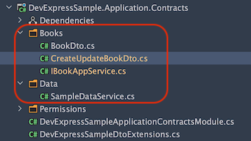
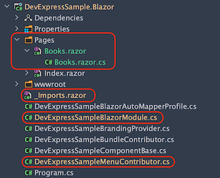

## Using DevExpress Blazor UI Components With the ABP Framework

Hi, in this step by step article, I will show you how to integrate [DevExpress](https://demos.devexpress.com/blazor/) blazor UI components into ABP Framework-based applications.


*(A screenshot from the example application developed in this article)*

## Create the Project

> ABP Framework offers startup templates to get into business faster.

In this article, I will create a new startup template with EF Core as a database provider and Blazor for UI framework. But if you already have a project with Blazor UI, you don't need to create a new startup template, you can directly implement the following steps to your existing project.

> If you already have a project with the Blazor UI, you can skip this section.

* Before starting to development, we will create a solution named `DevExpressSample` (or whatever you want). We will create a new startup template with EF Core as a database provider and Blazor for UI framework by using [ABP CLI](https://docs.abp.io/en/abp/latest/CLI):

````bash
abp new DevExpressSample -u blazor
````


* Our project boilerplate will be ready after the download is finished. Then, we can open the solution in the Visual Studio (or any other IDE) and run the `DevExpressSample.DbMigrator` to create the database and seed initial data (which creates the admin user, admin role, permissions etc.)

* After database and initial data created,
* Run the `DevExpressSample.HttpApi.Host` to see our server side working and 
* Run the `DevExpressSample.Blazor` to see our UI working properly.

> _Default login credentials for admin: username is **admin** and password is **1q2w3E\***_

## Install DevExpress

You can follow [this documentation](https://docs.devexpress.com/Blazor/401986/getting-started/install-components-and-create-an-application/without-devexpress-installer/microsoft-templates) to install DevExpress packages into your computer.

> Don't forget to add _"DevExpress NuGet Feed"_ to your **Nuget Package Sources**.

### Adding DevExpress NuGet Packages

Add the `DevExpress.Blazor` NuGet package to the `DevExpressSample.Blazor` project.

```
Install-Package DevExpress.Blazor
```

### Register DevExpress Resources

1. Add the following line to the HEAD section of the `wwwroot/index.html` file within the `DevExpressSample.Blazor` project:

   ```Razor
   <head>
       <!--...-->
       <link href="_content/DevExpress.Blazor/dx-blazor.css" rel="stylesheet" />
   </head>
   ```

2. In the `DevExpressSampleBlazorModule` class, call the `AddDevExpressBlazor()` method from your project's `ConfigureServices()` method:

   ```csharp
   public override void ConfigureServices(ServiceConfigurationContext context)
   {
       var environment = context.Services.GetSingletonInstance<IWebAssemblyHostEnvironment>();
       var builder = context.Services.GetSingletonInstance<WebAssemblyHostBuilder>();
   	  // ...
       builder.Services.AddDevExpressBlazor();
   }
   ```

3. Register the **DevExpressSample.Blazor** namespace in the `_Imports.razor` file:

   ```Razor
   @using DevExpress.Blazor
   ```

### Result

The installation step was done. You can use any DevExpress Blazor UI component in your application:

Example:  A Scheduler: 


This example has been created by following [this documentation](https://demos.devexpress.com/blazor/SchedulerViewTypes).

## The Sample Application

We have created a sample application with [Data Grid](https://docs.devexpress.com/Blazor/DevExpress.Blazor.DxDataGrid-1) example.

### The Source Code

You can download the source code from [here](https://github.com/abpframework/abp-samples/tree/master/DevExpress-Blazor).

The related files for this example are marked in the following screenshots.






### Additional Notes

#### Data Storage

I've used an in-memory list to store data for this example, instead of a real database. Because it is not related to DevExpress usage. There is a `SampleDataService.cs` file in `Data` folder at `DevExpressSample.Application.Contracts` project. All the data is stored here.

## Conclusion

In this article, I've explained how to use [DevExpress](https://www.devexpress.com/blazor/) components in your application. ABP Framework is designed so that it can work with any UI library/framework.
