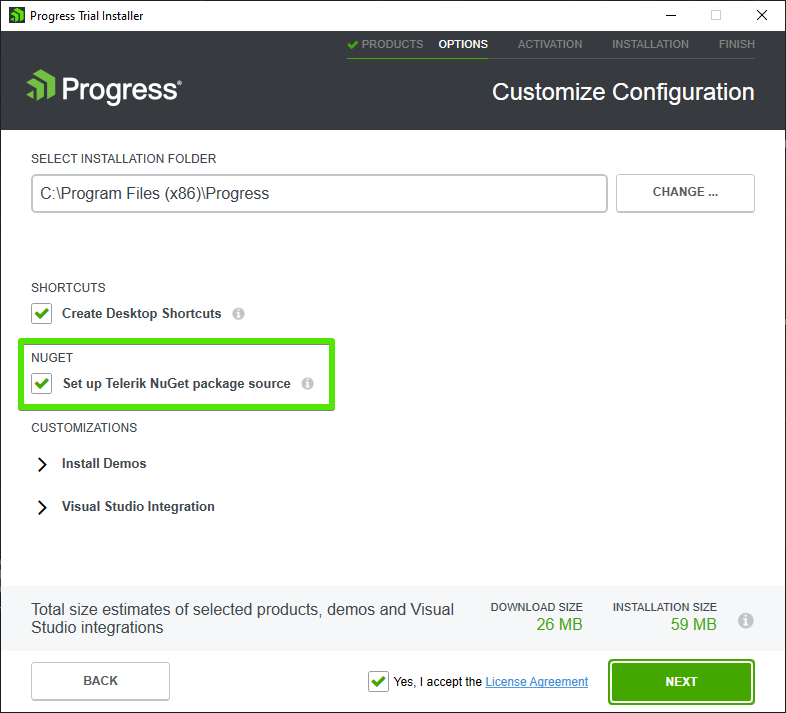
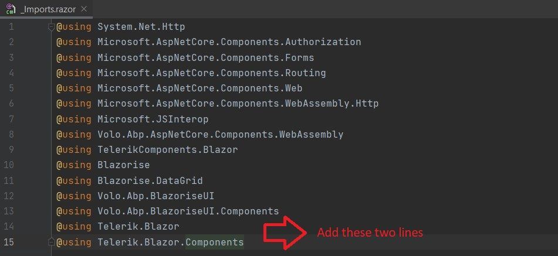
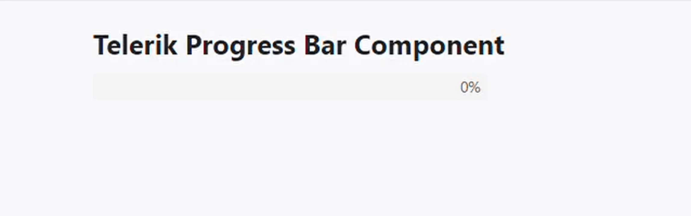
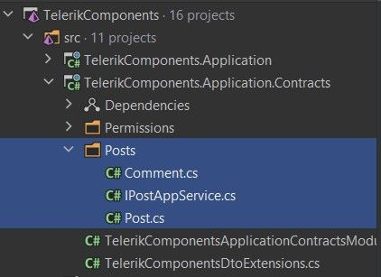
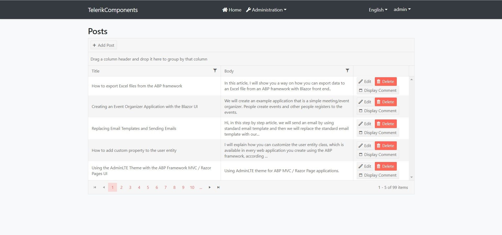

# How to Integrate the Telerik Blazor Components to the ABP Blazor UI?

## Introduction

Hi, in this step by step article, we will see how we can integrate the Telerik Blazor Components to our Blazor UI.

## Creating the Solution

> ABP Framework offers startup templates to get into business faster.

In this article, I will create a new startup template with EF Core as a database provider and Blazor for UI framework. But if you already have a project with Blazor UI, you don't need to create a new startup template, you can directly implement the following steps to your existing project.

> If you already have a project with the Blazor UI, you can skip this section.

* Before starting to development, we will create a solution named `TelerikComponents` (or whatever you want). We will create a new startup template with EF Core as a database provider and Blazor for UI framework by using [ABP CLI](https://docs.abp.io/en/abp/latest/CLI):

```bash
abp new TelerikComponents --ui blazor --database-provider ef
```

* Our project boilerplate will be ready after the download is finished. Then, we can open the solution in the Visual Studio (or any other IDE) and run the `TelerikComponents.DbMigrator` to create the database and seed initial data (which creates the admin user, admin role, permissions, etc.)

* After the database and initial data created,
* Run the `TelerikComponents.HttpApi.Host` to see our server-side working and 
* Run the `TelerikComponents.Blazor` to see our UI working.

> _Default login credentials for admin: username is **admin** and password is **1q2w3E\***_

## Starting the Development

### Pre-requisite

* First thing we need to do is downloading the [Progress Control Panel](https://www.telerik.com/download-trial-file/v2/control-panel?_ga=2.212029332.1667119438.1607582144-1944255175.1605161949) to get Telerik Blazor Components on our development machine.

* If you will use the Telerik Blazor Components for the first time or you don't have an active license you can click [here](https://www.telerik.com/login/v2/download-b?ReturnUrl=https%3a%2f%2fwww.telerik.com%2fdownload-trial-file%2fv2-b%2fui-for-blazor%3f_ga%3d2.212029332.1667119438.1607582144-1944255175.1605161949#register) to download free trial.

> You can find the more installation details from [here](https://docs.telerik.com/blazor-ui/getting-started/client-blazor?_ga=2.55603115.1667119438.1607582144-1944255175.1605161949&_gac=1.261851647.1607669357.CjwKCAiAq8f-BRBtEiwAGr3DgUDhBT25rs7hU0EQ8K-AfeUVxs3hSoIuIAuBOZ17CNPI4ZEArORPExoCyd4QAvD_BwE#step-0---download-the-components).

>**Notes:** To download Telerik Blazor packages via NuGet, we need to setup Telerik NuGet package source. We can state it in the installer as below. In this way, we can download the required Telerik Blazor packages via NuGet.



### Step 1 (Configurations)

* We need to install the `Telerik.UI.for.Blazor` Nuget package to our Blazor project (`*.Blazor`). We need to choose package source to **telerik.com** for Visual Studio to see this package.

* If you use trial version of Telerik, you can download **Telerik.UI.for.Blazor.Trial** package via NuGet.

* After the installation finished, we need to open **index.html** (it's under *wwwroot* folder) to add css and js files in our application.

* Add the following lines just before the closing head tag (**/head**).

```html
    ...
        <link rel="stylesheet" href="_content/Telerik.UI.for.Blazor/css/kendo-theme-default/all.css" />
    <!-- For Trial licenses use
        <link rel="stylesheet" href="_content/Telerik.UI.for.Blazor.Trial/css/kendo-theme-default/all.css" />
    -->        
        <script src="_content/Telerik.UI.for.Blazor/js/telerik-blazor.js" defer></script>
    <!-- For Trial licenses use
        <script src="_content/Telerik.UI.for.Blazor.Trial/js/telerik-blazor.js" defer></script>
    -->
    </head>
```

* After that, we need to add the Telerik Blazor Components to our application's service collection. So just open the `TelerikComponentsBlazorModule` and update the `ConfigureServices` method with the following content.

```csharp
public override void ConfigureServices(ServiceConfigurationContext context)
{
    var environment = context.Services.GetSingletonInstance<IWebAssemblyHostEnvironment>();
    var builder = context.Services.GetSingletonInstance<WebAssemblyHostBuilder>();

    ConfigureAuthentication(builder);
    ConfigureHttpClient(context, environment);
    ConfigureBlazorise(context);
    ConfigureRouter(context);
    ConfigureUI(builder);
    ConfigureMenu(context);
    ConfigureAutoMapper(context);
            
    //add this line to be able to use the components
    builder.Services.AddTelerikBlazor();
}
```

* After the service added we will continue by opening **_Imports.razor** file and add the global using statements as below. This will bring our Telerik components into scope throughout the application.



* After all of these steps, the Telerik UI Components are ready to be used anywhere in our application. We can use the Telerik Blazor Components by wrapping our components or pages between `<TelerikRootComponent>` and `</TelerikRootComponent>` tags.

### Step 2 - Checking Configurations

* We should check, have we done the right configurations or not. For that, we can open the **Index.razor** file and we can update the component with the following content.

```razor
@page "/"
@using Volo.Abp.MultiTenancy
@inherits TelerikComponentsComponentBase
@inject ICurrentTenant CurrentTenant
@inject AuthenticationStateProvider AuthenticationStateProvider
@using System.Timers

@implements IDisposable

<TelerikRootComponent>
    <div class="progress-bar-wrapper">
        <h5 class="progress-info-title">Telerik Progress Bar Component</h5>
        <TelerikProgressBar Value="@ProgressValue" Max="100"></TelerikProgressBar>
    </div>
</TelerikRootComponent>

@code {
    private const int TimerInterval = 1000;
    private const int TotalTime = 10 * TimerInterval;
    private double ProgressValue = 0;
    private int ProgressStep = 100 / (TotalTime / TimerInterval);
    private Timer Timer { get; set; } = new Timer();

    private void Dispose()
    {
        StopProgress();
        Timer?.Close();
    }

    protected override void OnAfterRender(bool firstRender)
    {
        if (Timer.Enabled == false)
        {
            Timer.Interval = TimerInterval;
            Timer.Elapsed -= OnTimerElapsed;
            Timer.Elapsed += OnTimerElapsed;
            Timer.AutoReset = true;
            Timer.Start();
        }
    }

    private void OnTimerElapsed(Object source, ElapsedEventArgs e)
    {
        if (ProgressValue < 100)
        {
            UpdateProgress();
        }
        else
        {
            StopProgress();
        }
    }

    private void UpdateProgress()
    {
        ProgressValue += ProgressStep;

        InvokeAsync(StateHasChanged);
    }

    private void StopProgress()
    {
        Timer?.Stop();
    }
}

<style>
    .progress-info-title {
        font-weight: bold;
        font-size: 1.4em;
    }
</style>
```

* In here, we've just added the `TelerikProgressBar` component to check the integration configured properly.

* When we run `*.HttpApi.Host` and `*.Blazor` projects, we should see that the `TelerikProgressBar` component works and has similar view as the below gif.



* If you haven't seen this component like above, you should check the above configurations and be assure every step done as stated.

### Step 3 - Using The Telerik Blazor Components (Sample Application)

* Let's create a sample application for use other Telerik Blazor Components (like DataGrid).

* We will use [jsonplaceholder](https://jsonplaceholder.typicode.com/) as **mock data** to the listing, adding, updating and deleting posts. 

* Firstly, we can create a folder named `Posts` and inside this folder, we can create the classes which are highlighted in the following screenshot.



* After classes created we can fill the classes with the following contents.

**Post.cs**
```csharp
using System;

namespace TelerikComponents.Posts
{
    [Serializable]
    public class Post
    {
        public int Id { get; set; }

        public string Title { get; set; }

        public string Body { get; set; }

        public int UserId { get; set; }
    }
}
```

**Comment.cs**
```csharp
using System;

namespace TelerikComponents.Posts
{
    [Serializable]
    public class Comment
    {
        public int PostId { get; set; }

        public int Id { get; set; }
        
        public string Name { get; set; }

        public string Email { get; set; }

        public string Body { get; set; }
    }
}
```

**IPostAppService.cs**
```csharp
using System.Collections.Generic;
using System.Threading.Tasks;
using Volo.Abp.Application.Services;

namespace TelerikComponents.Posts
{
    public interface IPostAppService : IApplicationService
    {
        Task<List<Post>> GetPostsAsync();

        Task<Post> AddPostAsync(Post post);

        Task<Post> UpdatePostAsync(int postId, Post post);

        Task DeletePostAsync(int postId);

        Task<Comment> GetFirstCommentByPostIdAsync(int postId);
    }
}
```
* In here, we basically created two class (which are **Post** and **Comment**). These classes are used to hold data returned as JSON.

* After that, we need to implement `IPostAppService`. For achieve this, we can create a folder named `Posts` in **\*.Application** layer and inside this folder we can create a class named `PostAppService` with the following content.

**PostAppService.cs**
```csharp
using System.Collections.Generic;
using System.Net.Http;
using System.Text;
using System.Text.Json;
using System.Threading.Tasks;
using Volo.Abp.Application.Services;

namespace TelerikComponents.Posts
{
    public class PostAppService : ApplicationService, IPostAppService
    {
        private JsonSerializerOptions _options = new JsonSerializerOptions
        {
            IncludeFields = true,
            PropertyNameCaseInsensitive = true
        };
        
        public async Task<List<Post>> GetPostsAsync()
        {
            var url = "https://jsonplaceholder.typicode.com/posts";
            List<Post> _posts = new List<Post>();

            using (var client = new HttpClient())
            {
                var result = await client.GetAsync(url);

                if (result.IsSuccessStatusCode)
                {
                    var content = await result.Content.ReadAsStringAsync();
                    var deserializedPosts = JsonSerializer.Deserialize<List<Post>>(content, _options);

                    _posts = deserializedPosts;
                }
            }

            return _posts;
        }

        public async Task<Post> AddPostAsync(Post post)
        {
            var url = "https://jsonplaceholder.typicode.com/posts";
            Post addedPost = null;

            using (var client = new HttpClient())
            {
                var serializePost = JsonSerializer.Serialize(post);
                var content = new StringContent(serializePost, Encoding.UTF8, "application/json");
                var result = await client.PostAsync(url, content);

                if (result.IsSuccessStatusCode)
                {
                    var response = await result.Content.ReadAsStringAsync();
                    addedPost = JsonSerializer.Deserialize<Post>(response);
                }
            }

            return addedPost;
        }

        public async Task<Post> UpdatePostAsync(int postId, Post post)
        {
            var url = $"https://jsonplaceholder.typicode.com/posts/{postId}";
            Post updatedPost = null;

            using (var client = new HttpClient())
            {
                var serializePost = JsonSerializer.Serialize(post);
                var content = new StringContent(serializePost, Encoding.UTF8, "application/json");
                var result = await client.PutAsync(url, content);

                if (result.IsSuccessStatusCode)
                {
                    var response = await result.Content.ReadAsStringAsync();
                    updatedPost = JsonSerializer.Deserialize<Post>(response);
                }
            }

            return updatedPost;
        }

        public async Task DeletePostAsync(int postId)
        {
            var url = $"https://jsonplaceholder.typicode.com/posts/{postId}";

            using (var client = new HttpClient())
            {
                await client.DeleteAsync(url);
            }
        }

        public async Task<Comment> GetFirstCommentByPostIdAsync(int postId)
        {
            var url = $"https://jsonplaceholder.typicode.com/posts/{postId}/comments";
            
            List<Comment> _comments = new List<Comment>();

            using (var client = new HttpClient())
            {
                var result = await client.GetAsync(url);

                if (result.IsSuccessStatusCode)
                {
                    var content = await result.Content.ReadAsStringAsync();
                    var deserializedPosts = JsonSerializer.Deserialize<List<Comment>>(content, _options);

                    _comments = deserializedPosts;
                }
            }

            return _comments[0];
        }
    }
}
```

* In here, we've implemented `IPostAppService` methods by using [jsonplaceholder](https://jsonplaceholder.typicode.co) API. These endpoints provide us basic crud functionallity.

* After the implemenation, we can start to create the user interface.

#### Blazor UI

* We can create **/Posts** page for listing, updating, deleting and creating our posts. So, create a razor page named `Posts.razor` under **Pages** folder in `*.Blazor` project.

**Posts.razor**
```razor
@page "/Posts"
@using TelerikComponents.Posts
@using IconName = Telerik.Blazor.IconName
@inject IPostAppService PostAppService

<h3>Posts</h3>

<TelerikRootComponent>
    <TelerikGrid Data="@GridData"
                 OnUpdate="@UpdateHandler"
                 OnDelete="@DeleteHandler"
                 OnCreate="@CreateHandler"
                 @ref="@Grid"
                 Pageable="true"
                 Groupable="true"
                 Sortable="true"
                 FilterMode="GridFilterMode.FilterMenu"
                 Resizable="true"
                 Reorderable="true"
                 EditMode="GridEditMode.Popup"
                 SelectionMode="GridSelectionMode.Single"
                 PageSize="5"
                 Navigable="true">
        <GridColumns>
            <GridColumn Field="@nameof(Post.Title)"/>
            <GridColumn Field="@nameof(Post.Body)"/>
            <GridCommandColumn Width="190px">
                <GridCommandButton Command="Save" Icon="save" ShowInEdit="true">Update</GridCommandButton>
                <GridCommandButton Command="Edit" Icon="edit">Edit</GridCommandButton>
                <GridCommandButton Command="Delete" Icon="delete" Primary="true">Delete</GridCommandButton>
                <GridCommandButton Icon="@IconName.Window" OnClick="(e) => PostDetailAsync(e)">Display Comment</GridCommandButton>
                <GridCommandButton Command="Cancel" Icon="cancel" ShowInEdit="true">Cancel</GridCommandButton>
            </GridCommandColumn>
        </GridColumns>
        <GridToolBar>
            <GridCommandButton Command="Add" Icon="add">Add Post</GridCommandButton>
        </GridToolBar>
    </TelerikGrid>
    
    @* Modal *@
    <TelerikWindow Class="demo-window" Width="500px" Height="250px" Centered="true" @bind-Visible=@ModalVisible Modal="true">
        <WindowTitle>
            <strong>Comment</strong>
        </WindowTitle>
        <WindowActions>
            <WindowAction Name="Close" />
        </WindowActions>
        <WindowContent>
            <p><b>Email:</b> @Comment.Email</p>
            <p>
                <b>Message:</b> @Comment.Body
            </p>
        </WindowContent>
    </TelerikWindow>
</TelerikRootComponent>
```

**Post.razor.cs**
```csharp
using System.Collections.Generic;
using System.Linq;
using System.Threading.Tasks;
using Telerik.Blazor.Components;
using TelerikComponents.Posts;

namespace TelerikComponents.Blazor.Pages
{
    public partial class Posts
    {
        private List<Post> GridData { get; set; }
        private TelerikGrid<Post> Grid { get; set; }
        private bool ModalVisible { get; set; } = false;
        private Comment Comment { get; set; }

        public Posts()
        {
            Comment = new Comment();
        }

        protected override async Task OnInitializedAsync()
        {
            await LoadDataAsync();
        }

        private async Task LoadDataAsync()
        {
            GridData = await PostAppService.GetPostsAsync();
        }

        private async Task UpdateHandler(GridCommandEventArgs args)
        {
            var post = (Post) args.Item;
            
            await PostAppService.UpdatePostAsync(post.Id, post);
            
            var matchingPost = GridData.FirstOrDefault(x => x.Id == post.Id);

            if (matchingPost != null)
            {
                matchingPost.Body = post.Body;
                matchingPost.Title = post.Title;
            }
        }
        
        private async Task DeleteHandler(GridCommandEventArgs args)
        {
            var post = (Post) args.Item;

            GridData.Remove(post);
        }

        private async Task CreateHandler(GridCommandEventArgs args)
        {
            var post = (Post) args.Item;

            var addedPost = await PostAppService.AddPostAsync(post);
            
            GridData.Insert(0, addedPost);
        }

        private async Task PostDetailAsync(GridCommandEventArgs args)
        {
            var post = (Post) args.Item;

            Comment = await PostAppService.GetFirstCommentByPostIdAsync(post.Id);

            ModalVisible = true;
        }
    }
}
```

* In here, we've used `TelerikGrid` component.

* The `Telerik Grid` is a powerful component, which allows you to visualize and edit data via its table representation. It provides a variety of options about how to present and perform operations over the underlying data, such as paging, sorting, filtering and editing.

* The Blazor UI Grid allows flexible customization of its items exposing rows, columns and edit templates for this purpose.

### Final Result

* After all of these steps, we can finally run our application.
    * Run `*.HttpApi.Host` project for use the required endpoints,
    * Run `*.Blazor` project for see the Blazor UI.

* When we navigate to `Posts` route, we should see the following screenshot in this page.



## Conclusion

In this article, I've tried to explain how we can integrate [Telerik Blazor Component](https://www.telerik.com/blazor-ui) to our Blazor UI. ABP Framework designed as modular, so that it can work with any UI library/framework.