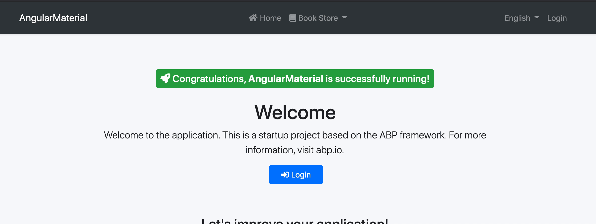
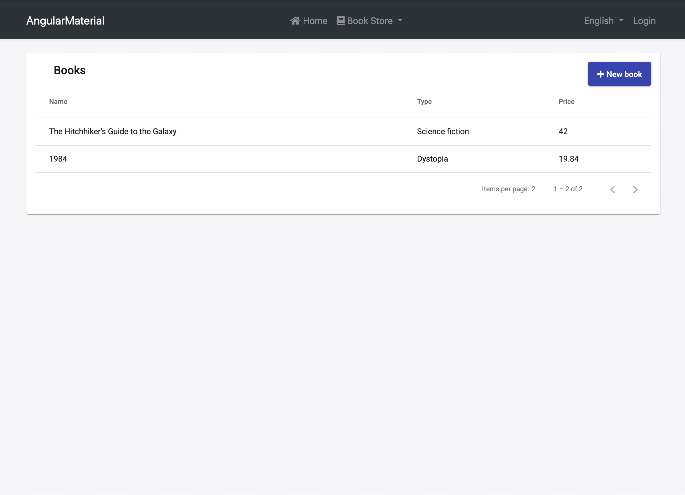
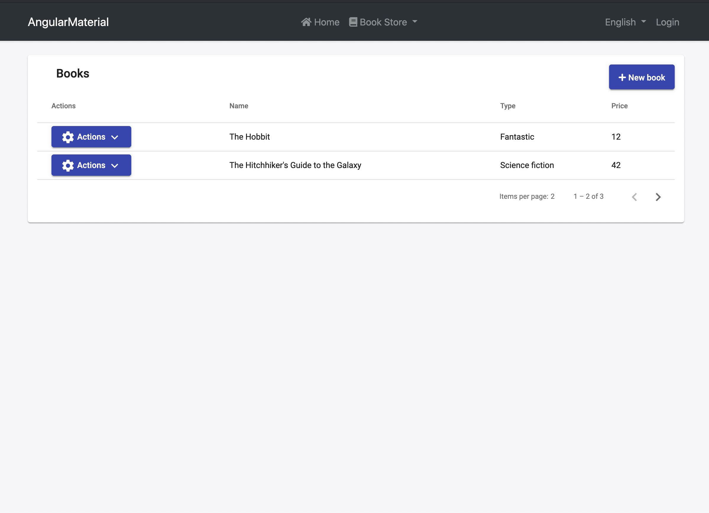
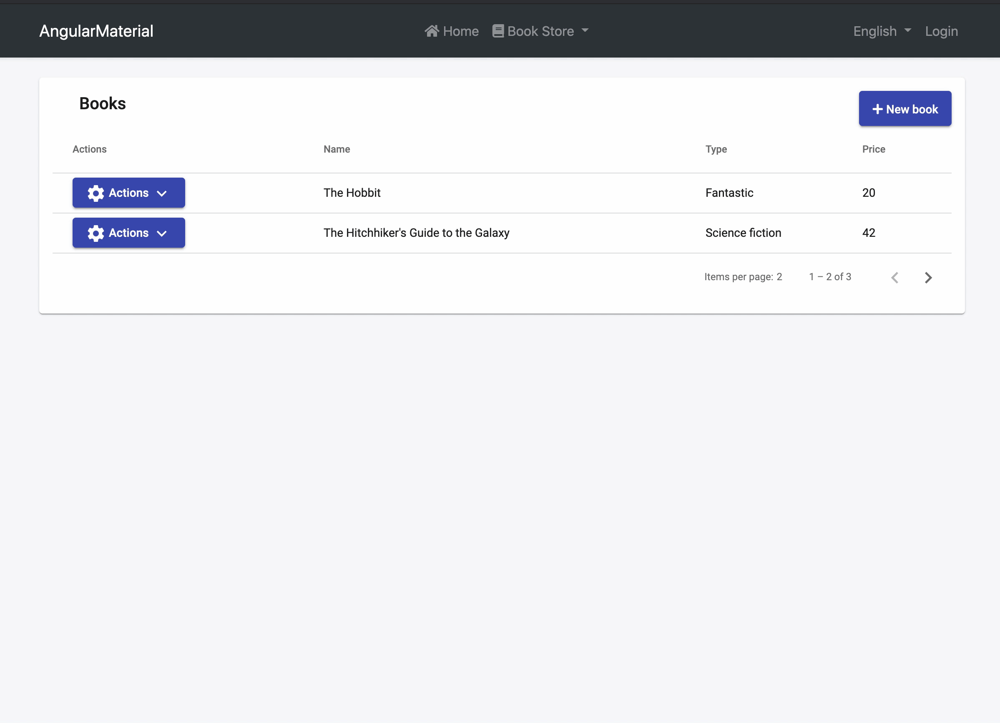

# Using Angular Material Components With the ABP Framework

## Introduction

Angular Material library is a popular and well-known library in the community. We will implement Angular Material components with the ABP framework in this article. We will follow the Book Store tutorial which documented in [ABP Documentation](https://docs.abp.io/en/abp/latest/Tutorials/Part-1)

> This article doesn't include server-side parts except the **Author With Books Form**
> section. Please follow the tutorial for server-side parts.

## Installation

Create a project with ABP CLI. Run following command in terminal:

```bash
    abp new Acme.BookStore.AngularMaterial -u angular -o AcmeBookStoreAngularMaterial
```

Add Angular Material package to the created project. Run this command in the terminal at the `angular` directory:

```
    ng add @angular/material
```

## Book CRUD Actions

> Please complete the following steps before starting this section:
>
> - Follow the server-side steps at [Web Application Development Tutorial - Part 1: Creating the Server Side](https://docs.abp.io/en/abp/latest/Tutorials/Part-1) with remembering our application name is **Acme.BookStore.AngularMaterial**
> - Follow the localization part of [Web Application Development Tutorial - Part 2: The Book List Page](https://docs.abp.io/en/abp/latest/Tutorials/Part-2?UI=NG&DB=EF#localization)
> - Run following command in terminal at `angular` directory 
>   `abp generate-proxy`

In this section, we will create the book list page, book create and update dialog using the Angular Material Modules.

Add material modules to `SharedModule`'s imports and exports arrays which placed in `angular/src/app/shared/shared.module.ts`:

```typescript
import { MatCardModule } from "@angular/material/card";
import { MatTableModule } from "@angular/material/table";
import { MatPaginatorModule } from "@angular/material/paginator";
import { MatSortModule } from "@angular/material/sort";
import { MatButtonModule } from "@angular/material/button";

@NgModule({
  imports: [
    CoreModule,
    ThemeSharedModule,
    ThemeBasicModule,
    NgbDropdownModule,
    NgxValidateCoreModule,

    MatCardModule, // added this line
    MatTableModule, // added this line
    MatPaginatorModule, // added this line
    MatSortModule, // added this line
    MatButtonModule, // added this line
  ],
  exports: [
    CoreModule,
    ThemeSharedModule,
    ThemeBasicModule,
    NgbDropdownModule,
    NgxValidateCoreModule,

    MatCardModule, // added this line
    MatTableModule, // added this line
    MatPaginatorModule, // added this line
    MatSortModule, // added this line
    MatButtonModule, // added this line
  ],
})
export class SharedModule {}
```

Run the following command in the terminal at the `angular` directory to create the book module:

```
yarn ng generate module book --module app --routing --route books
```

Remove `CommonModule` form and import `SharedModule` from imports array at `book.module.ts`:

```typescript
import { NgModule } from "@angular/core";
import { BookRoutingModule } from "./book-routing.module";
import { BookComponent } from "./book.component";
import { SharedModule } from "../shared/shared.module";

@NgModule({
  declarations: [BookComponent],
  imports: [
    BookRoutingModule,
    SharedModule, // this line added
  ],
})
export class BookModule {}
```

> We deleted the `CommonModule` because `CommonModule` in `CoreModule`'s exports array and `CoreModule` in `SharedModule`'s exports array.

We will add routes by adding items to the return array of the `routesProvider` created when creating a project for adding navigation elements for books route. For more information, see the [`RoutesService` document](https://docs.abp.io/en/abp/latest/UI/Angular/Modifying-the-Menu#via-routesservice).

Open the `src/app/route.provider.ts` file replace the `configureRoutes` function declaration as shown below:

```typescript
import { eLayoutType, RoutesService } from "@abp/ng.core";

function configureRoutes(routes: RoutesService) {
  return () => {
    routes.add([
      {
        path: "/",
        name: "::Menu:Home",
        iconClass: "fas fa-home",
        order: 1,
        layout: eLayoutType.application,
      },
      {
        path: "/book-store",
        name: "::Menu:BookStore",
        iconClass: "fas fa-book",
        order: 2,
        layout: eLayoutType.application,
      },
      {
        path: "/books",
        name: "::Menu:Books",
        parentName: "::Menu:BookStore",
        layout: eLayoutType.application,
      },
    ]);
  };
}
```

### Book List

Replace `BookComponent` with the following code placed at `angular/src/book/book.component.ts` :

```typescript
import { Component, OnInit } from "@angular/core";
import { ListService, PagedResultDto } from "@abp/ng.core";
import { BookDto, BookService } from "@proxy/books";
import { PageEvent } from "@angular/material/paginator";
import { Sort } from "@angular/material/sort";

@Component({
  selector: "app-book",
  templateUrl: "./book.component.html",
  styleUrls: ["./book.component.scss"],
  providers: [ListService],
})
export class BookComponent implements OnInit {
  book = { items: [], totalCount: 0 } as PagedResultDto<BookDto>;
  columns: string[] = ["name", "type", "price"];

  constructor(
    public readonly list: ListService,
    private bookService: BookService
  ) {
    this.list.maxResultCount = 2;
  }

  ngOnInit() {
    const bookStreamCreator = (query) => this.bookService.getList(query);

    this.list.hookToQuery(bookStreamCreator).subscribe((response) => {
      this.book = response;
    });
  }

  changePage(pageEvent: PageEvent) {
    this.list.page = pageEvent.pageIndex;
  }

  changeSort(sort: Sort) {
    this.list.sortKey = sort.active;
    this.list.sortOrder = sort.direction;
  }
}
```

- We imported and injected the generated `BookService`.
- We used the [ListService](https://docs.abp.io/en/abp/latest/UI/Angular/List-Service), a utility service of the ABP Framework which provides easy pagination, sorting and searching.
- We set `this.list.maxResultCount` to 2 in the constructor, it can be changed programmatically for example changing value with the dropdown in the template

Replace the `book.component.html` in the `angular/src/book/` with following code:

```html
<mat-card>
  <mat-card-header class="w-100">
    <mat-card-title-group class="w-100">
      <mat-card-title class="abp-card-title"
        >{{ '::Menu:Books' | abpLocalization }}</mat-card-title
      >
    </mat-card-title-group>
  </mat-card-header>
  <mat-card-content>
    <table
      mat-table
      [dataSource]="book.items"
      class="w-100"
      matSort
      (matSortChange)="changeSort($event)"
    >
      <tr mat-header-row *matHeaderRowDef="columns"></tr>
      <tr mat-row *matRowDef="let myRowData; columns: columns"></tr>
      <ng-container matColumnDef="name">
        <th mat-header-cell *matHeaderCellDef mat-sort-header>
          {{'::Name' | abpLocalization}}
        </th>
        <td mat-cell *matCellDef="let element">{{element.name}}</td>
      </ng-container>
      <ng-container matColumnDef="type">
        <th mat-header-cell *matHeaderCellDef mat-sort-header>
          {{'::Type' | abpLocalization}}
        </th>
        <td mat-cell *matCellDef="let element">
          {{ '::Enum:BookType:' + element.type | abpLocalization }}
        </td>
      </ng-container>
      <mat-text-column
        [headerText]="'::Price' | abpLocalization"
        name="price"
      ></mat-text-column>
    </table>
    <mat-paginator
      [length]="book.totalCount"
      [pageSize]="list.maxResultCount"
      (page)="changePage($event)"
    ></mat-paginator>
  </mat-card-content>
</mat-card>
```

- We used the [Material Card](https://material.angular.io/components/card/overview) component as a container
- We used [Material Table](https://material.angular.io/components/table/overview) and we made `name` and `type` columns sortable. `changeSort` method executes when sorting change.
- We used the [Material Pagination](https://material.angular.io/components/paginator/overview). `changePage` method executes when the page changed



### Book Create

In this section, we will create `BookDialogComponent` and we will display this component via [`Material Dialog`](https://material.angular.io/components/dialog/overview). We will use also [Material Input](https://material.angular.io/components/input/overview), [Material Select](https://material.angular.io/components/select/overview), [Material DatePicker](https://material.angular.io/components/datepicker/overview) modules in this component for book form.

Create a new component named `BookDialogComponent` in the `angular/src/book/components` folder with the following command:

```
yarn ng generate component book/components/BookDialog --module book
```

> We used --module option for declaring in the component to a specific module.

Add Material modules to `SharedModule`'s imports and exports arrays:

```typescript
import { MatDialogModule } from "@angular/material/dialog";
import { MatDatepickerModule } from "@angular/material/datepicker";
import { MatFormFieldModule } from "@angular/material/form-field";
import { MatInputModule } from "@angular/material/input";
import { MatSelectModule } from "@angular/material/select";
import { MatIconModule } from "@angular/material/icon";
import { MatNativeDateModule } from "@angular/material/core";

@NgModule({
  imports: [
    // other imports
    MatDialogModule,
    MatDatepickerModule,
    MatNativeDateModule,
    MatFormFieldModule,
    MatInputModule,
    MatSelectModule,
    MatIconModule,
  ],
  exports: [
    // other exports
    MatDialogModule,
    MatDatepickerModule,
    MatFormFieldModule,
    MatInputModule,
    MatSelectModule,
    MatIconModule,
  ],
})
export class SharedModule {}
```

Replace `book-dialog.component.ts` in `angular/src/book/` with following code:

```typescript
import { Component, Inject, OnInit } from "@angular/core";
import {
  MAT_DIALOG_DATA,
  MAT_DIALOG_DEFAULT_OPTIONS,
} from "@angular/material/dialog";
import { FormBuilder, FormGroup, Validators } from "@angular/forms";
import { bookTypeOptions } from "@proxy/books";

@Component({
  selector: "app-book-dialog",
  templateUrl: "./book-dialog.component.html",
  styleUrls: ["./book-dialog.component.scss"],
  providers: [
    {
      provide: MAT_DIALOG_DEFAULT_OPTIONS,
      useValue: { hasBackdrop: true, width: "50vw" },
    },
  ],
})
export class BookDialogComponent implements OnInit {
  form: FormGroup;

  bookTypes = bookTypeOptions;

  constructor(private fb: FormBuilder) {}

  ngOnInit(): void {
    this.buildForm();
  }

  buildForm() {
    this.form = this.fb.group({
      name: [null, Validators.required],
      type: [null, Validators.required],
      publishDate: [null, Validators.required],
      price: [null, Validators.required],
    });
  }

  getFormValue() {
    const { publishDate } = this.form.value;
    return {
      ...this.form.value,
      publishDate: `${publishDate?.getFullYear()}-${
        publishDate?.getMonth() + 1
      }-${publishDate?.getDate()}`,
    };
  }
}
```

- We made a form which form controls' names are the same as BookDto
- We provided the `MAT_DIALOG_DEFAULT_OPTIONS` token to change Material Dialog options for this component. Provided options are only available for this component.

Replace the `book-dialog.component.html` with following code:

```html
<h2 mat-dialog-title>{{ '::NewBook' | abpLocalization }}</h2>
<mat-dialog-content>
  <form [formGroup]="form" class="form-container">
    <mat-form-field class="w-100">
      <mat-label>{{'::Name' | abpLocalization}} <span> * </span></mat-label>
      <input type="text" id="book-name" matInput formControlName="name" />
    </mat-form-field>

    <mat-form-field class="w-100">
      <mat-label>{{'::Price' | abpLocalization}} <span> * </span></mat-label>
      <input type="number" id="book-price" matInput formControlName="price" />
    </mat-form-field>

    <mat-form-field class="w-100">
      <mat-label>{{'::Type' | abpLocalization}}<span> * </span></mat-label>
      <mat-select id="book-type" formControlName="type">
        <mat-option [value]="type.value" *ngFor="let type of bookTypes"
          >{{ '::Enum:BookType:' + type.value | abpLocalization }}</mat-option
        >
      </mat-select>
    </mat-form-field>

    <mat-form-field class="w-100">
      <mat-label
        >{{'::PublishDate' | abpLocalization}} <span> * </span></mat-label
      >
      <input matInput [matDatepicker]="picker" formControlName="publishDate" />
      <mat-datepicker-toggle matSuffix [for]="picker"></mat-datepicker-toggle>
      <mat-datepicker #picker></mat-datepicker>
    </mat-form-field>
  </form>
</mat-dialog-content>
<mat-dialog-actions>
  <button mat-button mat-dialog-close>{{ '::Close' | abpLocalization }}</button>
  <button mat-raised-button color="primary" [mat-dialog-close]="getFormValue()">
    {{'::Save' | abpLocalization}}
  </button>
</mat-dialog-actions>
```

- We created a form with material form field components.
- We added 2 buttons for closing dialog and saving form in the `mat-dialog-actions` element.

Create the `createBook` method and inject `MatDialog` in `book.component.ts`. Then use the material dialog's `open` method inside the `createBook` method:

```typescript
import { BookDialogComponent } from "./components/book-dialog";

export class BookComponent {
  constructor(
    // ...
    // inject dialog
    public dialog: MatDialog
  ) {
    //...
  }
  //... other methods
  createBook() {
    const dialogRef = this.dialog.open(BookDialogComponent);
    dialogRef.afterClosed().subscribe((result) => {
      if (result) {
        this.bookService.create(result).subscribe(() => {
          this.list.get();
        });
      }
    });
  }
}
```

- We displayed BookDialogComponent via Material Dialog. If the result has data after the dialog closes we made 2 HTTP requests for creating a book and refreshing the book list.

Add create book button near the `mat-card-title` element in `book.component.html`:

```html
<mat-card-title class="abp-card-title"
  >{{ '::Menu:Books' | abpLocalization }}</mat-card-title
>
<button
  id="create"
  mat-raised-button
  color="primary"
  type="button"
  (click)="createBook()"
>
  <i class="fa fa-plus mr-1"></i>
  <span>{{ "::NewBook" | abpLocalization }}</span>
</button>
```

The final UI looks like below:



### Edit Book

We will use the same dialog component for editing the book. And we will add the `actions` column to the book list table. The actions column is a simple dropdown. We will use [Material Menu](https://material.angular.io/components/menu/overview) for creating dropdown

Add `MatMenuModule` to `SharedModule` metadata's imports and exports array like this:

```typescript
import { MatMenuModule } from "@angular/material/menu";

@NgModule({
  imports: [
    // other imports
    MatMenuModule,
  ],
  exports: [
    // other exports
    MatMenuModule,
  ],
})
export class SharedModule {}
```

Edit `columns` array and add `editBook` method in `book.component.ts` as shown below:

```typescript
columns: string[] = ['actions', /* ... other columns*/];

editBook(id: string) {
    this.bookService.get(id).subscribe((book) => {
        const dialogRef = this.dialog.open(BookDialogComponent, {
            data: book
        });
        dialogRef.afterClosed().subscribe(result => {
            if (result) {
                this.bookService.update(id, result).subscribe(() => {
                    this.list.get();
                });
            }
        });
    });
}
```

- We passed the data to `BookDialogComponent` with passing the data property `open` method of the material dialog.
- We checked data after closing the dialog for sending HTTP requests as in the `Create Book` section.

Add actions column before name column and add `mat-menu` end of file in the `book.component.html` as shown below:

```html
<mat-card>
    <!-- ... Material Table -->
    <ng-container matColumnDef="actions">
        <th mat-header-cell *matHeaderCellDef> {{'::Actions' | abpLocalization}} </th>
        <td mat-cell *matCellDef="let element">
          <button mat-raised-button color="primary" [matMenuTriggerFor]="menu" [matMenuTriggerData]="{id: element.id}">
            <mat-icon>settings</mat-icon>
            {{'::Actions' | abpLocalization}}
            <mat-icon>expand_more</mat-icon>
          </button>
        </td>
    </ng-container>
    <ng-container matColumnDef="name">
    <!-- OTHER COLUMNS -->
</mat-card>
<!-- MATERIAL MENU START -->
<mat-menu #menu="matMenu">
  <ng-template matMenuContent let-id="id">
    <button mat-menu-item (click)="editBook(id)">
      {{ '::Edit' | abpLocalization }}
    </button>
  </ng-template>
</mat-menu>
<!-- MATERIAL MENU END -->
```

Get passed data which passed with material dialog's `open` method and use this data to create a form with initial values in `book-dialog.component.ts` as shown below:

```typescript
  constructor(
    //inject data
    @Inject(MAT_DIALOG_DATA) public data: BookDto,
  ) {
  }

  buildForm() {
    this.form = this.fb.group({
      name: [this.data?.name /*modified*/, Validators.required],
      type: [this.data?.type /*modified*/, Validators.required],
      publishDate: [this.data?.publishDate ? new Date(this.data.publishDate) : null, /*modified*/, Validators.required],
      price: [this.data?.price /*modified*/, Validators.required],
    });
  }
```

Edit the dialog title if component has data, display **Edit Book** text otherwise **New Book** in `book-dialog.component.html`:

```html
<h2 mat-dialog-title>
  {{ (data ? '::EditBook' : '::NewBook' )| abpLocalization }}
</h2>
```



### Delete Book

In the ABP Framework, a confirmation popup displays when the delete button is clicked. We will create a Confirmation Dialog and display this dialog with Material Dialog.

Create `ConfirmationDialogComponent` in `angular/src/shared/components` directory with following command:

```
yarn ng generate component shared/components/ConfirmationDialog --module shared
```

Replace `ConfirmationDialogComponent` with following code:

```typescript
import { Component, Inject } from "@angular/core";
import {
  MAT_DIALOG_DATA,
  MAT_DIALOG_DEFAULT_OPTIONS,
} from "@angular/material/dialog";

export interface ConfirmationDialogData {
  title: string;
  description: string;
}
@Component({
  selector: "app-confirmation-dialog",
  templateUrl: "./confirmation-dialog.component.html",
  styleUrls: ["./confirmation-dialog.component.scss"],
  providers: [
    {
      provide: MAT_DIALOG_DEFAULT_OPTIONS,
      useValue: { hasBackdrop: true, width: "450px" },
    },
  ],
})
export class ConfirmationDialogComponent {
  constructor(@Inject(MAT_DIALOG_DATA) public data: ConfirmationDialogData) {}
}
```

Replace `confirmation-dialog.component.html` with the following code:

```html
<mat-dialog-content>
  <div class="dialog-container">
    <mat-icon class="warn-icon" color="warn">warning</mat-icon>
    <h2 mat-dialog-title>{{ data.title | abpLocalization }}</h2>
    <p mat-dialog-title>{{ data.description | abpLocalization }}</p>
  </div>
</mat-dialog-content>
<mat-dialog-actions>
  <button mat-button mat-dialog-close [mat-dialog-close]="false">
    {{ '::Cancel' | abpLocalization }}
  </button>
  <button mat-raised-button color="primary" [mat-dialog-close]="true">
    {{ '::Yes' | abpLocalization }}
  </button>
</mat-dialog-actions>
```

Replace `confirmation-dialog.component.scss` with following code:

```scss
:host {
  .dialog-container {
    display: flex;
    flex-direction: column;
    align-items: center;
    justify-content: center;
  }
  mat-icon.warn-icon {
    font-size: 100px;
    height: 100px;
    width: 100px;
    line-height: 100px;
  }
  p {
    color: #777;
    font-size: 16px;
  }
}
```

Add `deleteBook` method to `BookComponent`:

```typescript
import { BookDialogComponent } from './components/book-dialog/book-dialog.component';
import { ConfirmationDialogComponent } from '../shared/components/confirmation-dialog/confirmation-dialog.component';

deleteBook(id: string) {
    const confirmationDialogRef = this.dialog.open(ConfirmationDialogComponent, {
      data: {
        title: '::AreYouSure',
        description: '::AreYouSureToDelete'
      }
    });
    confirmationDialogRef.afterClosed().subscribe(confirmationResult => {
      if (confirmationResult) {
        this.bookService.delete(id).subscribe(() => this.list.get());
      }
    });
}
```

Add delete button to actions' button menu template in `book.component.html`:

```html
<mat-menu #menu="matMenu">
  <ng-template matMenuContent let-id="id">
    <button mat-menu-item (click)="editBook(id)">
      {{ '::Edit' | abpLocalization }}
    </button>
    <!-- Delete Button Start -->
    <button mat-menu-item (click)="deleteBook(id)">
      {{ '::Delete' | abpLocalization }}
    </button>
    <!-- Delete Button End -->
  </ng-template>
</mat-menu>
```



## Authorization

You can follow steps for authorization at the [Web Application Development Tutorial - Part 5: Authorization](https://docs.abp.io/en/abp/latest/Tutorials/Part-5?UI=NG&DB=EF)

## Author CRUD Actions

> Please complete the following steps before starting this section
>
> - [Web Application Development Tutorial - Part 6: Authors: Domain Layer](https://docs.abp.io/en/abp/latest/Tutorials/Part-6)
> - [Web Application Development Tutorial - Part 7: Authors: Database Integration](https://docs.abp.io/en/abp/latest/Tutorials/Part-7)
> - [Web Application Development Tutorial - Part 8: Authors: Application Layer](https://docs.abp.io/en/abp/latest/Tutorials/Part-8)
> - Run following command in terminal at `angular` directory:
>   `abp generate-proxy`

In this section, we will create an author list page and author create/update dialog by following the same steps in the `Book CRUD Actions` section

Run the following command in the terminal for creating author module and components:

```
yarn ng generate module author --module app --routing --route authors
```

Create `AuthorDialogComponent` in `angular/src/app/author/components` directory with following command:

```
yarn ng generate component author/components/AuthorDialog -m author
```

Add `SharedModule` to `AuthorModule`'s imports array:

```typescript
import { NgModule } from "@angular/core";
import { AuthorWithBooksRoutingModule } from "./author-with-books-routing.module";
import { AuthorWithBooksComponent } from "./author-with-books.component";
import { SharedModule } from "../shared/shared.module";

@NgModule({
  declarations: [AuthorComponent, AuthorDialogComponent],
  imports: [SharedModule, AuthorRoutingModule],
})
export class AuthorModule {}
```

Open the `src/app/route.provider.ts` file replace the `configureRoutes` function declaration as shown below:

```typescript
function configureRoutes(routes: RoutesService) {
  return () => {
    routes.add([
      // other routes
      {
        path: "/authors",
        name: "::Menu:Authors",
        parentName: "::Menu:BookStore",
        layout: eLayoutType.application,
      },
    ]);
  };
}
```

Replace `AuthorDialogComponent` with following code below:

```typescript
import { Component, Inject, OnInit } from "@angular/core";
import {
  MAT_DIALOG_DATA,
  MAT_DIALOG_DEFAULT_OPTIONS,
} from "@angular/material/dialog";
import { AuthorDto } from "@proxy/authors";
import { FormBuilder, FormGroup, Validators } from "@angular/forms";

@Component({
  selector: "app-author-dialog",
  templateUrl: "./author-dialog.component.html",
  styleUrls: ["./author-dialog.component.scss"],
  providers: [
    {
      provide: MAT_DIALOG_DEFAULT_OPTIONS,
      useValue: { hasBackdrop: true, width: "50vw" },
    },
  ],
})
export class AuthorDialogComponent implements OnInit {
  form: FormGroup;

  constructor(
    @Inject(MAT_DIALOG_DATA) public data: AuthorDto,
    private fb: FormBuilder
  ) {}
  ngOnInit(): void {
    this.buildForm();
  }

  buildForm() {
    this.form = this.fb.group({
      name: [this.data?.name, Validators.required],
      birthDate: [
        this.data?.birthDate ? new Date(this.data.birthDate) : null,
        Validators.required,
      ],
    });
  }

  getFormValue() {
    const { birthDate } = this.form.value;
    return {
      ...this.form.value,
      publishDate: `${birthDate?.getFullYear()}-${
        birthDate?.getMonth() + 1
      }-${birthDate?.getDate()}`,
    };
  }
}
```

Replace `author-dialog.component.html` with the following code below:

```html
<h2 mat-dialog-title>
  {{ (data ? '::EditAuthor' : '::NewAuthor' )| abpLocalization }}
</h2>
<mat-dialog-content>
  <form [formGroup]="form" class="form-container">
    <mat-form-field class="w-100">
      <mat-label>{{'::Name' | abpLocalization}} <span> * </span></mat-label>
      <input matInput id="author-name" formControlName="name" autofocus />
    </mat-form-field>

    <mat-form-field class="w-100">
      <mat-label>{{'::BirthDate' | abpLocalization}}<span> * </span></mat-label>
      <input matInput [matDatepicker]="picker" formControlName="birthDate" />
      <mat-datepicker-toggle matSuffix [for]="picker"></mat-datepicker-toggle>
      <mat-datepicker #picker></mat-datepicker>
    </mat-form-field>
  </form>
</mat-dialog-content>
<mat-dialog-actions>
  <button mat-button mat-dialog-close>{{ '::Close' | abpLocalization }}</button>
  <button mat-raised-button color="primary" [mat-dialog-close]="getFormValue()">
    {{'::Save' |abpLocalization}}
  </button>
</mat-dialog-actions>
```

Replace `author.component.ts` with following code below:

```typescript
import { Component, OnInit } from "@angular/core";
import { ListService, PagedResultDto } from "@abp/ng.core";
import { AuthorDto, AuthorService } from "@proxy/authors";
import { FormGroup } from "@angular/forms";
import { PageEvent } from "@angular/material/paginator";
import { Sort } from "@angular/material/sort";
import { MatDialog } from "@angular/material/dialog";
import { AuthorDialogComponent } from "./components/author-dialog/author-dialog.component";
import { ConfirmationDialogComponent } from "../shared/components/confirmation-dialog/confirmation-dialog.component";

@Component({
  selector: "app-author",
  templateUrl: "./author.component.html",
  styleUrls: ["./author.component.scss"],
  providers: [ListService],
})
export class AuthorComponent implements OnInit {
  author = { items: [], totalCount: 0 } as PagedResultDto<AuthorDto>;

  form: FormGroup;

  columns = ["actions", "name", "birthDate"];

  constructor(
    public readonly list: ListService,
    private authorService: AuthorService,
    public dialog: MatDialog
  ) {}

  ngOnInit(): void {
    const authorStreamCreator = (query) => this.authorService.getList(query);

    this.list.hookToQuery(authorStreamCreator).subscribe((response) => {
      this.author = response;
    });
  }

  changePage(pageEvent: PageEvent) {
    this.list.page = pageEvent.pageIndex;
  }

  changeSort(sort: Sort) {
    this.list.sortKey = sort.active;
    this.list.sortOrder = sort.direction;
  }

  createAuthor() {
    const dialogRef = this.dialog.open(AuthorDialogComponent);
    dialogRef.afterClosed().subscribe((result) => {
      if (result) {
        this.authorService.create(result).subscribe(() => {
          this.list.get();
        });
      }
    });
  }

  editAuthor(id: any) {
    this.authorService.get(id).subscribe((author) => {
      const dialogRef = this.dialog.open(AuthorDialogComponent, {
        data: author,
      });
      dialogRef.afterClosed().subscribe((result) => {
        if (result) {
          this.authorService.update(id, result).subscribe(() => {
            this.list.get();
          });
        }
      });
    });
  }

  deleteAuthor(id: string) {
    const confirmationDialogRef = this.dialog.open(
      ConfirmationDialogComponent,
      {
        data: {
          title: "::AreYouSure",
          description: "::AreYouSureToDelete",
        },
      }
    );
    confirmationDialogRef.afterClosed().subscribe((confirmationResult) => {
      if (confirmationResult) {
        this.authorService.delete(id).subscribe(() => this.list.get());
      }
    });
  }
}
```

Replace `author.component.html` with the following code:

```html
<mat-card>
  <mat-card-header class="w-100">
    <mat-card-title-group class="w-100">
      <mat-card-title class="abp-card-title"
        >{{ '::Menu:Authors' | abpLocalization }}</mat-card-title
      >
      <div class="button-container">
        <button
          id="create"
          mat-raised-button
          color="primary"
          type="button"
          (click)="createAuthor()"
        >
          <i class="fa fa-plus mr-1"></i>
          <span>{{ '::NewAuthor' | abpLocalization }}</span>
        </button>
      </div>
    </mat-card-title-group>
  </mat-card-header>
  <mat-card-content>
    <table
      mat-table
      [dataSource]="author.items"
      class="w-100"
      matSort
      (matSortChange)="changeSort($event)"
    >
      <tr mat-header-row *matHeaderRowDef="columns"></tr>
      <tr mat-row *matRowDef="let myRowData; columns: columns"></tr>
      <ng-container matColumnDef="actions">
        <th mat-header-cell *matHeaderCellDef>
          {{'::Actions' | abpLocalization}}
        </th>
        <td mat-cell *matCellDef="let element">
          <button
            mat-raised-button
            color="primary"
            [matMenuTriggerFor]="menu"
            [matMenuTriggerData]="{id: element.id}"
          >
            <mat-icon>settings</mat-icon>
            {{'::Actions' | abpLocalization}}
            <mat-icon>expand_more</mat-icon>
          </button>
        </td> </ng-container
      ><ng-container matColumnDef="name">
        <th mat-header-cell *matHeaderCellDef mat-sort-header>
          {{'::Name' | abpLocalization}}
        </th>
        <td mat-cell *matCellDef="let element">{{element.name}}</td>
      </ng-container>
      <ng-container matColumnDef="birthDate">
        <th mat-header-cell *matHeaderCellDef mat-sort-header>
          {{'::BirthDate' | abpLocalization}}
        </th>
        <td mat-cell *matCellDef="let element">
          {{ element.birthDate | date }}
        </td>
      </ng-container>
    </table>
    <mat-paginator
      [length]="author.totalCount"
      [pageSize]="list.maxResultCount"
      (page)="changePage($event)"
    ></mat-paginator>
  </mat-card-content>
</mat-card>
<mat-menu #menu="matMenu">
  <ng-template matMenuContent let-id="id">
    <button mat-menu-item (click)="editAuthor(id)">
      {{ '::Edit' | abpLocalization }}
    </button>
    <button mat-menu-item (click)="deleteAuthor(id)">
      {{ '::Delete' | abpLocalization }}
    </button>
  </ng-template>
</mat-menu>
```

Open the `en.json` file under the `Localization/BookStore` folder of the `Acme.BookStore.AngularMaterial.Domain.Shared project` and add the following entries:

```json
    "Menu:Authors": "Authors",
    "Authors": "Authors",
    "AuthorDeletionConfirmationMessage": "Are you sure to delete the author '{0}'?",
    "BirthDate": "Birth date",
    "NewAuthor": "New author",
    "EditAuthor": "Edit Author"
```


## Author And Book Relation

> Please complete the following steps before starting this section
>
> - Complete server-side parts [Web Application Development Tutorial - Part 10: Book to Author Relation](https://docs.abp.io/en/abp/latest/Tutorials/Part-10) until [The User Interface](https://docs.abp.io/en/abp/latest/Tutorials/Part-10?UI=NG&DB=EF#the-user-interface) section
> - Run following command in terminal at `angular` directory:
>   `abp generate-proxy`

In this section, we will add author selection to the book creation form, create one form for adding an author with books using Material Stepper and display the author's name in the book list page.

### Author Selection

We will add the author select box using Material Select and we will get authors from the server in `BookDialogComponent`.

Replace `book-dialog.component.ts` in `app/src/book/components/book-dialog` with following code:

```typescript
import { Component, Inject, OnInit } from "@angular/core";
import {
  MAT_DIALOG_DATA,
  MAT_DIALOG_DEFAULT_OPTIONS,
} from "@angular/material/dialog";
import { FormBuilder, FormGroup, Validators } from "@angular/forms";
import {
  AuthorLookupDto,
  BookDto,
  BookService,
  bookTypeOptions,
} from "@proxy/books";
import { Observable } from "rxjs";
import { map } from "rxjs/operators";

@Component({
  selector: "app-book-dialog",
  templateUrl: "./book-dialog.component.html",
  styleUrls: ["./book-dialog.component.scss"],
  providers: [
    {
      provide: MAT_DIALOG_DEFAULT_OPTIONS,
      useValue: { hasBackdrop: true, width: "50vw" },
    },
  ],
})
export class BookDialogComponent implements OnInit {
  form: FormGroup;

  bookTypes = bookTypeOptions;

  authors$: Observable<AuthorLookupDto[]>; // this line added

  constructor(
    private fb: FormBuilder,
    @Inject(MAT_DIALOG_DATA) public data: BookDto,
    bookService: BookService // inject bookService
  ) {
    this.authors$ = bookService.getAuthorLookup().pipe(map((r) => r.items)); // this line added
  }

  ngOnInit(): void {
    this.buildForm();
  }

  buildForm() {
    this.form = this.fb.group({
      name: [this.data?.name, Validators.required],
      type: [this.data?.type, Validators.required],
      publishDate: [this.data?.publishDate, Validators.required],
      price: [this.data?.price, Validators.required],
      authorId: [this.data?.authorId, Validators.required], // this line added
    });
  }
}
```

Add author select box before name field in `book-dialog.component.html` as shown below:

```html
<!-- Author select start-->
<mat-form-field class="w-100">
  <mat-label>{{'::Author' | abpLocalization}}<span> * </span></mat-label>
  <mat-select id="author-id" formControlName="authorId" autofocus>
    <mat-option [value]="author.id" *ngFor="let author of authors$ | async"
      >{{ author.name }}</mat-option
    >
  </mat-select>
</mat-form-field>
<!-- Author select end-->
<mat-form-field class="w-100">
  <mat-label>{{'::Name' | abpLocalization}} <span> * </span></mat-label>
  <input type="text" id="book-name" matInput formControlName="name" />
</mat-form-field>
```

### Author Name Column

Add the `authorName` item to columns array in `BookComponent`:

```typescript
columns: string[] = [/* ...other columns*/, 'authorName'];
```

Add the `authorName` column after price column in `book.component.html`:

```html
<mat-text-column
  [headerText]="'::Price' | abpLocalization"
  name="price"
></mat-text-column>
<!-- Author Column Start-->
<mat-text-column
  [headerText]="'::Author' | abpLocalization"
  name="authorName"
></mat-text-column>
<!-- Author Column End -->
```

### Author With Books Form

In this section, we will create an endpoint that takes author information and book list in the request body for creating an author and books by one request.

Create a class named `CreateBookDto` in `Application.Contracts/Books` folder:

```csharp
using System;
using System.ComponentModel.DataAnnotations;
using Acme.BookStore.Books;
using Volo.Abp.Application.Dtos;

namespace Acme.BookStore.AngularMaterial.Books
{
    public class CreateBookDto: AuditedEntityDto<Guid>
    {
        [Required]
        [StringLength(128)]
        public string Name { get; set; }

        [Required]
        public BookType Type { get; set; } = BookType.Undefined;

        [Required]
        [DataType(DataType.Date)]
        public DateTime PublishDate { get; set; } = DateTime.Now;

        [Required]
        public float Price { get; set; }
    }
}
```

Create a class named `CreateAuthorWithBookDto` in `Application.Contracts/Books` folder:

```csharp
using System.Collections.Generic;
using Acme.BookStore.AngularMaterial.Authors;

namespace Acme.BookStore.AngularMaterial.Books
{
    public class CreateAuthorWithBookDto: CreateAuthorDto
    {
        public List<CreateBookDto> Books { get; set; }

        public CreateAuthorWithBookDto()
        {
            Books = new List<CreateBookDto>();
        }
    }
}
```

Create a class named `AuthorWithDetailsDto` in `Application.Contracts/Books` folder:

```csharp
using System.Collections.Generic;
using System.ComponentModel.DataAnnotations;
using Acme.BookStore.AngularMaterial.Authors;

namespace Acme.BookStore.AngularMaterial.Books
{
    public class AuthorWithDetailsDto: AuthorDto
    {
        [Required]
        public List<BookDto> Books { get; set; }

        public AuthorWithDetailsDto()
        {
            Books = new List<BookDto>();
        }
    }
}
```

Add following line to `IBookAppService` interface which placed in `Application.Contracts/Books`:

```csharp
Task<AuthorWithDetailsDto> CreateAuthorWithBooksAsync(CreateAuthorWithBookDto input);
```

Add mappings for the above DTO's lines to `AngularMaterialApplicationAutoMapperProfile.cs`

```csharp
CreateMap<CreateAuthorWithBookDto, Author>();
CreateMap<CreateBookDto, Book>();
CreateMap<Author, AuthorWithDetailsDto>();
```

Inject `AuthorManager` and add `CreateAuthorWithBooksAsync` method to `BookAppService.cs`:

```csharp
namespace Acme.BookStore.AngularMaterial.Books
{
    [Authorize(AngularMaterialPermissions.Books.Default)]
    public class BookAppService:
        CrudAppService<
            Book,
            BookDto,
            Guid,
            PagedAndSortedResultRequestDto,
            CreateUpdateBookDto>,
        IBookAppService
    {
        private readonly IAuthorRepository _authorRepository;
        private readonly AuthorManager _authorManager; // this line added
        public BookAppService(
            IRepository<Book, Guid> repository,
            IAuthorRepository authorRepository,
            // inject AuthorManager
            AuthorManager authorManager)
            : base(repository)
        {
            _authorRepository = authorRepository;
            _authorManager = authorManager;// this line added
            GetPolicyName = AngularMaterialPermissions.Books.Default;
            GetListPolicyName = AngularMaterialPermissions.Books.Default;
            CreatePolicyName = AngularMaterialPermissions.Books.Create;
            UpdatePolicyName = AngularMaterialPermissions.Books.Edit;
            DeletePolicyName = AngularMaterialPermissions.Books.Delete;
        }

        // Other class methods

        // This method added
        public async Task<AuthorWithDetailsDto> CreateAuthorWithBooksAsync(CreateAuthorWithBookDto input)
        {
            var author =  await _authorManager.CreateAsync(
                input.Name,
                input.BirthDate,
                input.ShortBio
            );

            var createdAuthor = await _authorRepository.InsertAsync(author);
            var authorWithBooks = ObjectMapper.Map<Author, AuthorWithDetailsDto>(createdAuthor);
            foreach (var book in input.Books)
            {
                var bookEntity = ObjectMapper.Map<CreateBookDto, Book>(book);
                bookEntity.AuthorId = author.Id;
                var createdBook = await Repository.InsertAsync(bookEntity);
                var bookDto = ObjectMapper.Map<Book, BookDto>(createdBook);
                bookDto.AuthorName = author.Name;
                authorWithBooks.Books.Add(bookDto);
            }

            return authorWithBooks;
        }
    }
}
```

Open the `en.json` file under the `Localization/BookStore` folder of the `Acme.BookStore.AngularMaterial.Domain.Shared project` and add the following entries:

```json
    "AuthorInfo": "Author Info",
    "BookInfo": "Book Info",
    "AddBook": "Add Book",
    "NewAuthorWithBook": "New Author With Book",
    "AuthorWithBook:Success": "{0} added with books successfully"
```

Run generate-proxy command in the terminal at `angular` directory:

```
abp generate-proxy
```

We will create `AuthorWithBooksModule` with components and we will use Material Stepper inside the component.

Run the following command for creating `AuthorWithBooksModule`:

```
yarn ng generate module author-with-books --module app --routing --route author-with-books
```

Add `SharedModule` to `AuthorWithBooksModule`'s imports array as shown below:

```typescript
import { SharedModule } from "../shared/shared.module";

@NgModule({
  declarations: [AuthorWithBooksComponent],
  imports: [
    SharedModule, // this line added
    AuthorWithBooksRoutingModule,
  ],
})
export class AuthorWithBooksModule {}
```

Add `MatStepperModule` to `SharedModule`'s imports array as shown below:

```typescript
import { MatStepperModule } from "@angular/material/stepper";

@NgModule({
  imports: [
    // other imports
    MatStepperModule,
  ],
  exports: [
    // other exports
    MatStepperModule,
  ],
})
export class SharedModule {}
```

We will create one form which includes author form group and book form array. We will use these form elements at the [Material Stepper](https://material.angular.io/components/stepper/overview) integration.

Replace `author-with-books.component.ts` with the following code:

```typescript
import { Component, OnInit } from "@angular/core";
import { bookTypeOptions } from "@proxy/books";
import { FormArray, FormBuilder, FormGroup, Validators } from "@angular/forms";
import { STEPPER_GLOBAL_OPTIONS } from "@angular/cdk/stepper";

@Component({
  selector: "app-author-with-book",
  templateUrl: "./author-with-book.component.html",
  styleUrls: ["./author-with-book.component.scss"],
  providers: [
    {
      provide: STEPPER_GLOBAL_OPTIONS,
      useValue: { displayDefaultIndicatorType: false },
    },
  ],
})
export class AuthorWithBooksComponent implements OnInit {
  form: FormGroup;

  bookTypes = bookTypeOptions;

  get bookFormArray(): FormArray {
    return this.form.get("books") as FormArray;
  }

  constructor(
    private fb: FormBuilder,
    private bookService: BookService,
    private toasterService: ToasterService
  ) {}

  ngOnInit(): void {
    this.form = this.fb.group({
      author: this.fb.group({
        name: [null, Validators.required],
        birthDate: [null, Validators.required],
      }),
      books: this.fb.array([this.getBookForm()]),
    });
  }

  getBookForm() {
    return this.fb.group({
      name: [null, Validators.required],
      type: [null, Validators.required],
      publishDate: [null, Validators.required],
      price: [null, Validators.required],
    });
  }

  addBook() {
    this.bookFormArray.push(this.getBookForm());
  }

  deleteBook(i: number) {
    this.bookFormArray.removeAt(i);
  }

  save() {
    if (this.form.invalid) {
      return;
    }
    const authorWithBook: CreateAuthorWithBookDto = {
      ...this.form.value.author,
      books: this.form.value.books,
    };
    this.bookService.createAuthorWithBooks(authorWithBook).subscribe((res) => {
      this.toasterService.success("::AuthorWithBook:Success", "", {
        messageLocalizationParams: [res.name],
      });
    });
  }
}
```

- We created form until component initialization in the `ngOnInit` method
- In the `getBookForm` method, returned
- In the `addBook` method, we pushed a form group instance created in the `getBookForm` method to the book form array. We will execute this method when clicked on the **Add Book** button
- We deleted a form group instance by index from the book form array in the `deleteBook` method
- In the `save` method, we send an HTTP request for creating author and books if creation will be successful toaster message will be display

Replace the `author-with-books.component.html` content with following code:

```html
<mat-vertical-stepper linear>
  <mat-step
    [label]="'::AuthorInfo' | abpLocalization"
    [stepControl]="form.get('author')"
    state="author"
  >
    <form [formGroup]="form.get('author')" class="form-container">
      <mat-form-field class="w-100">
        <mat-label>{{'::Name' | abpLocalization}} <span> * </span></mat-label>
        <input matInput id="author-name" formControlName="name" autofocus />
      </mat-form-field>

      <mat-form-field class="w-100">
        <mat-label
          >{{'::BirthDate' | abpLocalization}}<span> * </span></mat-label
        >
        <input matInput [matDatepicker]="picker" formControlName="birthDate" />
        <mat-datepicker-toggle matSuffix [for]="picker"></mat-datepicker-toggle>
        <mat-datepicker #picker></mat-datepicker>
      </mat-form-field>
    </form>
  </mat-step>
  <mat-step
    [label]="'::BookInfo' | abpLocalization"
    [stepControl]="form.get('books')"
    state="book"
  >
    <ng-container *ngFor="let book of bookFormArray.controls; index as i">
      <form [formGroup]="bookFormArray.at(i)" class="form-container book-form">
        <mat-form-field class="w-100">
          <mat-label>{{'::Name' | abpLocalization}} <span> * </span></mat-label>
          <input
            type="text"
            id="book-name"
            matInput
            formControlName="name"
            autofocus
          />
        </mat-form-field>

        <mat-form-field class="w-100">
          <mat-label
            >{{'::Price' | abpLocalization}} <span> * </span></mat-label
          >
          <input
            type="number"
            id="book-price"
            matInput
            formControlName="price"
          />
        </mat-form-field>

        <mat-form-field class="w-100">
          <mat-label>{{'::Type' | abpLocalization}}<span> * </span></mat-label>
          <mat-select id="book-type" formControlName="type">
            <mat-option [value]="null"
              >{{'::SelectBookType' | abpLocalization}}</mat-option
            >
            <mat-option [value]="type.value" *ngFor="let type of bookTypes"
              >{{ '::Enum:BookType:' + type.value | abpLocalization
              }}</mat-option
            >
          </mat-select>
        </mat-form-field>

        <mat-form-field class="w-100">
          <mat-label
            >{{'::PublishDate' | abpLocalization}} <span> * </span></mat-label
          >
          <input
            matInput
            [matDatepicker]="picker"
            formControlName="publishDate"
          />
          <mat-datepicker-toggle
            matSuffix
            [for]="picker"
          ></mat-datepicker-toggle>
          <mat-datepicker #picker></mat-datepicker>
        </mat-form-field>
      </form>
      <button
        type="button"
        mat-raised-button
        color="warn"
        (click)="deleteBook(i)"
      >
        {{'::Delete' | abpLocalization}}
      </button>
    </ng-container>
    <div class="button-container">
      <button mat-raised-button color="primary" (click)="addBook()">
        {{'::AddBook' | abpLocalization}}
      </button>
      <button
        *ngIf="bookFormArray.controls.length"
        mat-raised-button
        color="primary"
        [disabled]="form.invalid"
        (click)="save()"
      >
        {{'::Submit' | abpLocalization}}
      </button>
    </div>
  </mat-step>
  <ng-template matStepperIcon="author">
    <mat-icon>person</mat-icon>
  </ng-template>
  <ng-template matStepperIcon="book">
    <mat-icon>book</mat-icon>
  </ng-template>
</mat-vertical-stepper>
```

- We created the same author form where we created in `AuthorDialogComponent` and we gave the author form group to mat-step's stepConrol input
- We created the same book form which we created at `BookDialogComponent` except the author selection

Replace `author-with-books.component.scss` content with following code:

```scss
.book-form {
  margin-top: 20px;
}
.button-container {
  display: flex;
  width: 100%;
  justify-content: space-between;
  margin-top: 25px;
}
```

Finally add Create Author With Books button near the Create Author button in `author.component.html`:

```html
<div class="button-container">
  <button
    id="create"
    mat-raised-button
    color="primary"
    type="button"
    (click)="createAuthor()"
  >
    <i class="fa fa-plus mr-1"></i>
    <span>{{ '::NewAuthor' | abpLocalization }}</span>
  </button>
  <button
    id="create-with-book"
    mat-raised-button
    color="primary"
    type="button"
    routerLink="/author-with-books"
  >
    <i class="fa fa-plus mr-1"></i>
    <span>{{'::NewAuthorWithBook' | abpLocalization }}</span>
  </button>
</div>
```

Final UI looks as shown below:


## The Source Code

You can download the source code from [here](https://github.com/abpframework/abp-samples/tree/master/AcmeBookStoreAngularMaterial).

## Conclusion

We implemented Angular Material Components to our angular application which was created with ABP Framework. There is no blocker case of using angular libraries with the ABP framework.
